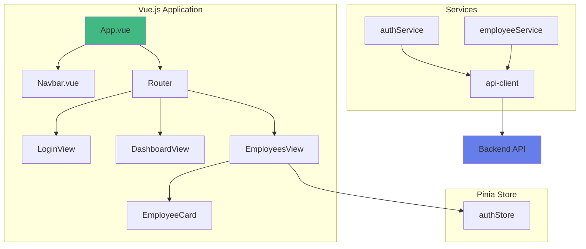

# Vue.js - Frontend pour API ASP.NET Core

## Introduction

**Vue.js** est un framework JavaScript progressif pour construire des interfaces utilisateur. Il est souvent considéré comme le plus facile à apprendre parmi les grands frameworks modernes.

### Caractéristiques principales

- **Progressif** : Peut être adopté progressivement
- **Réactif** : Données réactives automatiques
- **Composants** : Architecture basée sur les composants
- **Template** : Syntaxe template familière (comme HTML)
- **Vue 3** : Composition API pour code plus réutilisable

### Quand utiliser Vue.js

**Idéal pour** :
- Débutants en frameworks modernes
- Intégration progressive dans un projet existant
- Applications de taille petite à moyenne
- Équipes préférant une syntaxe simple

---

## Architecture



## Avantages et inconvénients

**Avantages** : 
- Très facile à apprendre (plus simple que React)
- Documentation excellente (en français aussi)
- Syntaxe template intuitive
- Adoption progressive possible

**Inconvénients** : 
- Communauté plus petite que React
- Moins d'offres d'emploi que React
- Écosystème moins vaste

---

## Création du projet

### Avec Vite (Recommandé)

```bash
# Créer le projet
npm create vue@latest frontend-vue

# Options recommandées :
# ✓ TypeScript? No (ou Yes si à l'aise)
# ✓ JSX Support? No
# ✓ Vue Router? Yes
# ✓ Pinia (state management)? Yes
# ✓ ESLint? Yes

cd frontend-vue
npm install
npm install axios

# Lancer en développement
npm run dev
```

Application accessible sur : `http://localhost:5173`

---

## Structure du projet

```
frontend-vue/
├── src/
│   ├── components/          # Composants réutilisables
│   │   ├── Navbar.vue
│   │   └── EmployeeCard.vue
│   ├── views/              # Pages
│   │   ├── LoginView.vue
│   │   ├── DashboardView.vue
│   │   └── EmployeesView.vue
│   ├── services/           # API
│   │   ├── api.js
│   │   ├── authService.js
│   │   └── employeeService.js
│   ├── stores/             # Pinia stores
│   │   └── auth.js
│   ├── router/             # Routes
│   │   └── index.js
│   ├── App.vue             # Composant racine
│   └── main.js             # Point d'entrée
├── package.json
└── vite.config.js
```

---

## Configuration

### Fichier : src/config.js

```javascript
export default {
    API_BASE_URL: import.meta.env.VITE_API_URL || 'https://localhost:7033/api',
    TOKEN_KEY: 'xtrawork_token'
};
```

### Fichier : .env.local

```env
VITE_API_URL=https://localhost:7033/api
```

### Fichier : vite.config.js

```javascript
import { fileURLToPath, URL } from 'node:url'
import { defineConfig } from 'vite'
import vue from '@vitejs/plugin-vue'

export default defineConfig({
    plugins: [vue()],
    resolve: {
        alias: {
            '@': fileURLToPath(new URL('./src', import.meta.url))
        }
    },
    server: {
        port: 5173,
        proxy: {
            '/api': {
                target: 'https://localhost:7033',
                changeOrigin: true,
                secure: false
            }
        }
    }
})
```

---

## Communication avec l'API

### Fichier : src/services/api.js

```javascript
import axios from 'axios';
import config from '../config';
import router from '../router';

const apiClient = axios.create({
    baseURL: config.API_BASE_URL,
    headers: {
        'Content-Type': 'application/json'
    }
});

// Ajouter le token JWT
apiClient.interceptors.request.use(config => {
    const token = localStorage.getItem('xtrawork_token');
    if (token) {
        config.headers.Authorization = `Bearer ${token}`;
    }
    return config;
});

// Gérer les erreurs
apiClient.interceptors.response.use(
    response => response,
    error => {
        if (error.response?.status === 401) {
            localStorage.removeItem('xtrawork_token');
            router.push('/login');
        }
        return Promise.reject(error);
    }
);

export default apiClient;
```

### Fichier : src/services/employeeService.js

```javascript
import apiClient from './api';

export default {
    getAll() {
        return apiClient.get('/employees');
    },
    
    getById(id) {
        return apiClient.get(`/employees/${id}`);
    },
    
    create(data) {
        return apiClient.post('/employees', data);
    },
    
    update(id, data) {
        return apiClient.put(`/employees/${id}`, data);
    },
    
    delete(id) {
        return apiClient.delete(`/employees/${id}`);
    }
};
```

---

## Authentification avec Pinia

### Fichier : src/stores/auth.js

```javascript
import { defineStore } from 'pinia';
import apiClient from '../services/api';

export const useAuthStore = defineStore('auth', {
    state: () => ({
        user: null,
        token: localStorage.getItem('xtrawork_token')
    }),
    
    getters: {
        isAuthenticated: (state) => !!state.token,
        currentUser: (state) => state.user
    },
    
    actions: {
        async login(username, password) {
            const response = await apiClient.post('/auth/login', {
                username,
                password
            });
            
            this.token = response.data.token;
            this.user = response.data.user;
            
            localStorage.setItem('xtrawork_token', this.token);
            localStorage.setItem('xtrawork_user', JSON.stringify(this.user));
        },
        
        async logout() {
            try {
                await apiClient.post('/auth/logout');
            } finally {
                this.token = null;
                this.user = null;
                localStorage.removeItem('xtrawork_token');
                localStorage.removeItem('xtrawork_user');
            }
        },
        
        loadUserFromStorage() {
            const userJson = localStorage.getItem('xtrawork_user');
            if (userJson) {
                this.user = JSON.parse(userJson);
            }
        }
    }
});
```

---

## Routing et protection des routes

### Fichier : src/router/index.js

```javascript
import { createRouter, createWebHistory } from 'vue-router';
import { useAuthStore } from '../stores/auth';

const router = createRouter({
    history: createWebHistory(import.meta.env.BASE_URL),
    routes: [
        {
            path: '/login',
            name: 'login',
            component: () => import('../views/LoginView.vue')
        },
        {
            path: '/dashboard',
            name: 'dashboard',
            component: () => import('../views/DashboardView.vue'),
            meta: { requiresAuth: true }
        },
        {
            path: '/employees',
            name: 'employees',
            component: () => import('../views/EmployeesView.vue'),
            meta: { requiresAuth: true }
        },
        {
            path: '/',
            redirect: '/dashboard'
        }
    ]
});

// Protection des routes
router.beforeEach((to, from, next) => {
    const authStore = useAuthStore();
    
    if (to.meta.requiresAuth && !authStore.isAuthenticated) {
        next('/login');
    } else if (to.name === 'login' && authStore.isAuthenticated) {
        next('/dashboard');
    } else {
        next();
    }
});

export default router;
```

---

## Exemple : Page de login

### Fichier : src/views/LoginView.vue

```vue
<template>
    <div class="login-container">
        <div class="login-card">
            <h1>Connexion XtraWork</h1>
            
            <div v-if="error" class="alert alert-error">
                {{ error }}
            </div>
            
            <form @submit.prevent="handleSubmit">
                <div class="form-group">
                    <label for="username">Nom d'utilisateur</label>
                    <input
                        v-model="formData.username"
                        type="text"
                        id="username"
                        required
                        :disabled="loading"
                    />
                </div>
                
                <div class="form-group">
                    <label for="password">Mot de passe</label>
                    <input
                        v-model="formData.password"
                        type="password"
                        id="password"
                        required
                        :disabled="loading"
                    />
                </div>
                
                <button 
                    type="submit" 
                    class="btn btn-primary"
                    :disabled="loading"
                >
                    {{ loading ? 'Connexion...' : 'Se connecter' }}
                </button>
            </form>
            
            <div class="demo-info">
                <strong>Compte de test :</strong><br>
                Username : admin<br>
                Password : Admin123!
            </div>
        </div>
    </div>
</template>

<script setup>
import { ref } from 'vue';
import { useRouter } from 'vue-router';
import { useAuthStore } from '../stores/auth';

const router = useRouter();
const authStore = useAuthStore();

const formData = ref({
    username: '',
    password: ''
});

const error = ref('');
const loading = ref(false);

const handleSubmit = async () => {
    error.value = '';
    loading.value = true;
    
    try {
        await authStore.login(formData.value.username, formData.value.password);
        router.push('/dashboard');
    } catch (err) {
        error.value = err.response?.data?.message || 'Erreur de connexion';
    } finally {
        loading.value = false;
    }
};
</script>

<style scoped>
.login-container {
    display: flex;
    justify-content: center;
    align-items: center;
    min-height: 100vh;
    background: linear-gradient(135deg, #667eea 0%, #764ba2 100%);
}

.login-card {
    background: white;
    padding: 40px;
    border-radius: 10px;
    box-shadow: 0 10px 40px rgba(0, 0, 0, 0.2);
    width: 100%;
    max-width: 400px;
}

.login-card h1 {
    text-align: center;
    margin-bottom: 30px;
}

.form-group {
    margin-bottom: 20px;
}

.form-group label {
    display: block;
    margin-bottom: 5px;
    font-weight: 500;
}

.form-group input {
    width: 100%;
    padding: 10px;
    border: 1px solid #ddd;
    border-radius: 4px;
}

.btn {
    width: 100%;
    padding: 12px;
    border: none;
    border-radius: 4px;
    font-size: 16px;
    cursor: pointer;
}

.btn-primary {
    background-color: #667eea;
    color: white;
}

.btn-primary:hover:not(:disabled) {
    background-color: #5568d3;
}

.btn:disabled {
    opacity: 0.6;
    cursor: not-allowed;
}

.alert {
    padding: 12px;
    margin-bottom: 20px;
    border-radius: 4px;
}

.alert-error {
    background-color: #fee;
    border: 1px solid #fcc;
    color: #c33;
}

.demo-info {
    margin-top: 20px;
    padding: 12px;
    background-color: #e3f2fd;
    border-radius: 4px;
    font-size: 14px;
}
</style>
```

---

## Exemple : Liste des employés

### Fichier : src/views/EmployeesView.vue

```vue
<template>
    <div>
        <Navbar />
        
        <div class="container">
            <div class="card">
                <h1>Liste des employés</h1>
                
                <div v-if="error" class="alert alert-error">
                    {{ error }}
                </div>
                
                <div class="actions">
                    <button 
                        @click="$router.push('/employees/new')"
                        class="btn btn-primary"
                    >
                        Ajouter un employé
                    </button>
                </div>
                
                <div v-if="loading" class="loading-container">
                    <div class="spinner"></div>
                    <p>Chargement...</p>
                </div>
                
                <div v-else-if="employees.length === 0" class="text-center">
                    <p>Aucun employé trouvé.</p>
                </div>
                
                <table v-else>
                    <thead>
                        <tr>
                            <th>Nom</th>
                            <th>Prénom</th>
                            <th>Date de naissance</th>
                            <th>Genre</th>
                            <th>Titre</th>
                            <th>Actions</th>
                        </tr>
                    </thead>
                    <tbody>
                        <tr v-for="employee in employees" :key="employee.id">
                            <td>{{ employee.lastName }}</td>
                            <td>{{ employee.firstName }}</td>
                            <td>{{ formatDate(employee.birthDate) }}</td>
                            <td>{{ employee.gender }}</td>
                            <td>{{ employee.titleDescription }}</td>
                            <td>
                                <button 
                                    @click="viewEmployee(employee.id)"
                                    class="btn btn-sm btn-primary"
                                >
                                    Voir
                                </button>
                                <button 
                                    @click="deleteEmployee(employee)"
                                    class="btn btn-sm btn-danger"
                                >
                                    Supprimer
                                </button>
                            </td>
                        </tr>
                    </tbody>
                </table>
            </div>
        </div>
    </div>
</template>

<script setup>
import { ref, onMounted } from 'vue';
import { useRouter } from 'vue-router';
import employeeService from '../services/employeeService';
import Navbar from '../components/Navbar.vue';

const router = useRouter();
const employees = ref([]);
const loading = ref(false);
const error = ref('');

const loadEmployees = async () => {
    try {
        loading.value = true;
        error.value = '';
        const response = await employeeService.getAll();
        employees.value = response.data;
    } catch (err) {
        error.value = err.response?.data?.message || 'Erreur lors du chargement';
    } finally {
        loading.value = false;
    }
};

const formatDate = (dateString) => {
    return new Date(dateString).toLocaleDateString('fr-FR');
};

const viewEmployee = (id) => {
    router.push(`/employees/${id}`);
};

const deleteEmployee = async (employee) => {
    if (!confirm(`Supprimer ${employee.firstName} ${employee.lastName} ?`)) {
        return;
    }
    
    try {
        await employeeService.delete(employee.id);
        employees.value = employees.value.filter(e => e.id !== employee.id);
    } catch (err) {
        error.value = err.response?.data?.message || 'Erreur lors de la suppression';
    }
};

onMounted(() => {
    loadEmployees();
});
</script>

<style scoped>
.container {
    max-width: 1200px;
    margin: 0 auto;
    padding: 20px;
}

.card {
    background: white;
    padding: 30px;
    border-radius: 8px;
    box-shadow: 0 2px 4px rgba(0, 0, 0, 0.1);
}

.actions {
    margin: 20px 0;
}

.btn {
    padding: 10px 20px;
    border: none;
    border-radius: 4px;
    cursor: pointer;
    font-size: 14px;
}

.btn-primary {
    background-color: #667eea;
    color: white;
}

.btn-danger {
    background-color: #e74c3c;
    color: white;
}

.btn-sm {
    padding: 5px 10px;
    margin-right: 5px;
}

table {
    width: 100%;
    border-collapse: collapse;
    margin-top: 20px;
}

table th,
table td {
    padding: 12px;
    text-align: left;
    border-bottom: 1px solid #ddd;
}

table th {
    background-color: #f8f9fa;
    font-weight: 600;
}

.loading-container {
    text-align: center;
    padding: 40px;
}

.spinner {
    width: 40px;
    height: 40px;
    margin: 0 auto 20px;
    border: 4px solid #f3f3f3;
    border-top: 4px solid #667eea;
    border-radius: 50%;
    animation: spin 1s linear infinite;
}

@keyframes spin {
    0% { transform: rotate(0deg); }
    100% { transform: rotate(360deg); }
}
</style>
```

---

## Composant Navbar

### Fichier : src/components/Navbar.vue

```vue
<template>
    <nav class="navbar">
        <div class="navbar-brand">XtraWork</div>
        <div class="navbar-menu">
            <router-link to="/dashboard">Dashboard</router-link>
            <router-link to="/employees">Employés</router-link>
            <a @click="handleLogout" href="#">Déconnexion</a>
        </div>
    </nav>
</template>

<script setup>
import { useRouter } from 'vue-router';
import { useAuthStore } from '../stores/auth';

const router = useRouter();
const authStore = useAuthStore();

const handleLogout = async () => {
    await authStore.logout();
    router.push('/login');
};
</script>

<style scoped>
.navbar {
    background-color: #2c3e50;
    color: white;
    padding: 1rem 2rem;
    display: flex;
    justify-content: space-between;
    align-items: center;
}

.navbar-brand {
    font-size: 1.5rem;
    font-weight: bold;
}

.navbar-menu {
    display: flex;
    gap: 1rem;
}

.navbar-menu a {
    color: white;
    text-decoration: none;
    padding: 0.5rem 1rem;
    border-radius: 4px;
    transition: background-color 0.3s;
    cursor: pointer;
}

.navbar-menu a:hover {
    background-color: rgba(255, 255, 255, 0.1);
}

.navbar-menu a.router-link-active {
    background-color: rgba(255, 255, 255, 0.2);
}
</style>
```

---

## Conclusion

### Avantages de Vue.js

**Facilité d'apprentissage**
- Syntaxe template intuitive
- Documentation excellente en français
- Courbe d'apprentissage progressive
- Moins de concepts à maîtriser

**Flexibilité**
- Options API ou Composition API
- Adoption progressive possible
- Intégration facile dans projet existant

**Performance**
- Virtual DOM optimisé
- Petite taille (environ 30 KB)
- Réactivité fine

**Écosystème**
- Vue Router (routing officiel)
- Pinia (state management officiel)
- Vite (build tool officiel)
- Nuxt.js (SSR framework)

### Comparaison avec React

| Aspect | React | Vue.js |
|--------|-------|--------|
| Courbe apprentissage | Moyenne | Facile |
| Template | JSX | Template HTML |
| State | Plus manuel | Plus automatique |
| Communauté | Plus grande | Grande |
| Emploi | Plus d'offres | Bonnes offres |

### Ressources

**Documentation**
- Vue.js : https://vuejs.org
- Vue Router : https://router.vuejs.org
- Pinia : https://pinia.vuejs.org

**Tutoriels**
- Vue Mastery
- Vue School
- Laracasts (Vue path)

**Outils**
- Vue DevTools
- Volar (VS Code extension)
- Vite

---

**Vue.js est un excellent choix pour apprendre les frameworks modernes, avec une courbe d'apprentissage douce et une grande puissance !**

