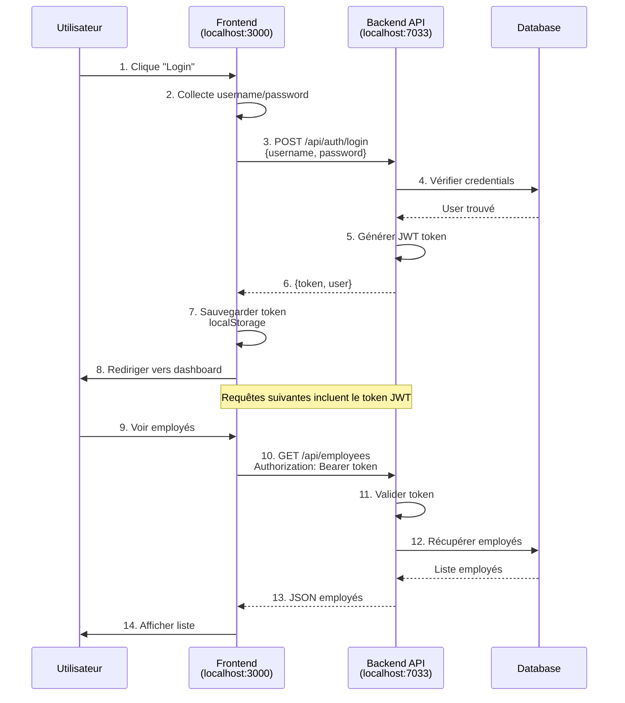
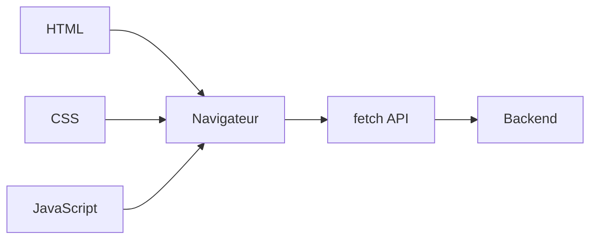
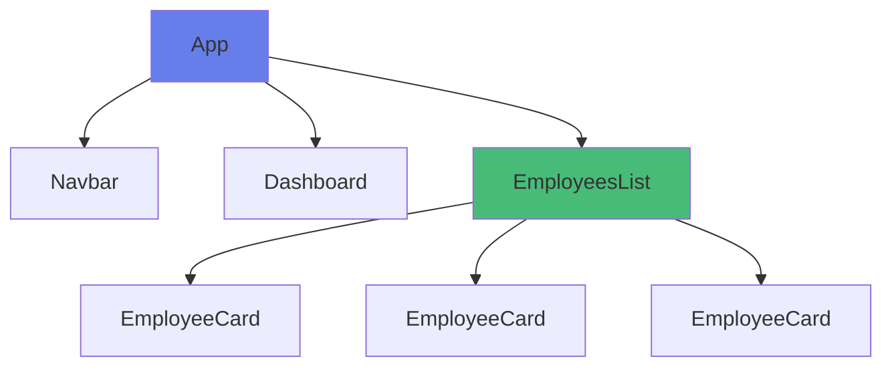
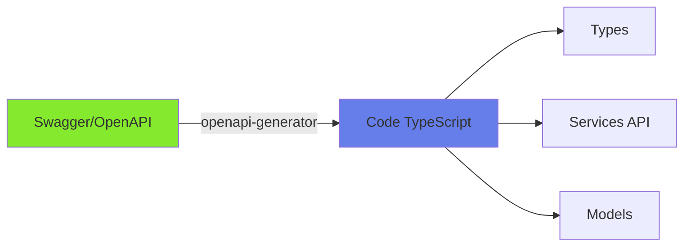

# Guide Pratique - Connexion Frontend-Backend en Local

## Table des matières

1. [Comprendre la connexion Frontend-Backend](#comprendre-la-connexion-frontend-backend)
2. [Techniques de création des vues](#techniques-de-création-des-vues)
3. [Consommation des endpoints - Étape par étape](#consommation-des-endpoints-étape-par-étape)
4. [Exemple complet pas à pas](#exemple-complet-pas-à-pas)
5. [Scaffolding vs Code manuel](#scaffolding-vs-code-manuel)
6. [Comparaison des approches](#comparaison-des-approches)

---

## Comprendre la connexion Frontend-Backend

### Schéma de fonctionnement



### Points clés

1. **Frontend et Backend sont SÉPARÉS**
   - Frontend : HTML/CSS/JavaScript (sur son propre port)
   - Backend : API ASP.NET Core (port 7033)

2. **Communication via HTTP**
   - Frontend envoie des requêtes HTTP (GET, POST, PUT, DELETE)
   - Backend répond avec des données JSON

3. **CORS doit être configuré**
   - Backend doit autoriser les requêtes du Frontend
   - Configuration dans `Program.cs`

---

## Techniques de création des vues

Il existe **3 techniques principales** pour créer un frontend qui consomme l'API :

### Technique 1 : HTML Manuel (Pur)

**Description** : Vous écrivez tout le code HTML/CSS/JavaScript à la main.



**Avantages** : Contrôle total, pas de dépendances, idéal pour apprendre

**Inconvénients** : Beaucoup de code répétitif, pas de réutilisation

**Quand utiliser** : Apprentissage, prototypes simples, applications très petites

---

### Technique 2 : Frameworks avec Composants (React, Vue, Angular)

**Description** : Vous créez des composants réutilisables qui sont assemblés.



**Avantages** : Réutilisation, structure organisée, outils puissants, productif

**Inconvénients** : Courbe d'apprentissage, configuration nécessaire

**Quand utiliser** : Applications moyennes à grandes, travail en équipe, production

---

### Technique 3 : Scaffolding (Génération automatique)

**Description** : Des outils génèrent automatiquement le code à partir de votre API.



**Exemples** : OpenAPI Generator, NSwag, Swagger Codegen

**Avantages** : Gain de temps énorme, synchronisation API-Frontend automatique

**Inconvénients** : Code généré à personnaliser, dépendance aux outils

**Quand utiliser** : Grandes applications, API stable, besoin de rapidité

---

## Consommation des endpoints - Étape par étape

### Étape 0 : Démarrer le Backend

**TOUJOURS faire cela en premier !**

```powershell
# Dans le dossier XtraWork
cd XtraWork
dotnet run
```

Vous devez voir :
```
Now listening on: https://localhost:7033
```

**Tester que l'API fonctionne** :
- Ouvrir https://localhost:7033/swagger dans le navigateur
- Accepter le certificat SSL
- Vous devez voir la documentation Swagger

---

### Étape 1 : Créer un fichier HTML de base

**Créer** : `test-connexion.html`

```html
<!DOCTYPE html>
<html lang="fr">
<head>
    <meta charset="UTF-8">
    <meta name="viewport" content="width=device-width, initial-scale=1.0">
    <title>Test Connexion API</title>
    <style>
        body {
            font-family: Arial, sans-serif;
            max-width: 800px;
            margin: 50px auto;
            padding: 20px;
        }
        button {
            padding: 10px 20px;
            font-size: 16px;
            cursor: pointer;
            margin: 5px;
        }
        #result {
            margin-top: 20px;
            padding: 15px;
            border: 1px solid #ddd;
            border-radius: 5px;
            background-color: #f9f9f9;
        }
        .success { color: green; }
        .error { color: red; }
    </style>
</head>
<body>
    <h1>Test Connexion à l'API XtraWork</h1>
    
    <h2>Étape 1 : Tester la connexion</h2>
    <button onclick="testConnexion()">Tester la connexion</button>
    
    <h2>Étape 2 : Récupérer les titres</h2>
    <button onclick="getTitles()">GET /api/titles</button>
    
    <h2>Étape 3 : Se connecter</h2>
    <button onclick="login()">POST /api/auth/login</button>
    
    <h2>Étape 4 : Récupérer les employés (nécessite connexion)</h2>
    <button onclick="getEmployees()">GET /api/employees</button>
    
    <div id="result"></div>

    <script>
        const API_URL = 'https://localhost:7033/api';
        const resultDiv = document.getElementById('result');
        
        function showResult(message, isError = false) {
            resultDiv.innerHTML = `
                <p class="${isError ? 'error' : 'success'}">
                    ${message}
                </p>
            `;
        }
        
        function showJSON(data) {
            resultDiv.innerHTML = `
                <p class="success">Succès !</p>
                <pre>${JSON.stringify(data, null, 2)}</pre>
            `;
        }
        
        // ÉTAPE 1 : Tester la connexion
        async function testConnexion() {
            showResult('Test en cours...');
            
            try {
                const response = await fetch(`${API_URL}/titles`);
                
                if (response.ok) {
                    showResult('✓ Connexion réussie ! L\'API est accessible.', false);
                } else {
                    showResult(`✗ Erreur ${response.status}`, true);
                }
            } catch (error) {
                showResult(`✗ Erreur de connexion : ${error.message}<br><br>
                    Vérifiez que :<br>
                    1. L'API est démarrée (dotnet run dans XtraWork/)<br>
                    2. Vous avez accepté le certificat SSL (visiter https://localhost:7033)`, true);
            }
        }
        
        // ÉTAPE 2 : Récupérer les titres (endpoint public)
        async function getTitles() {
            showResult('Chargement des titres...');
            
            try {
                const response = await fetch(`${API_URL}/titles`);
                const data = await response.json();
                
                showJSON(data);
            } catch (error) {
                showResult(`Erreur : ${error.message}`, true);
            }
        }
        
        // ÉTAPE 3 : Se connecter
        async function login() {
            showResult('Connexion en cours...');
            
            try {
                const response = await fetch(`${API_URL}/auth/login`, {
                    method: 'POST',
                    headers: {
                        'Content-Type': 'application/json'
                    },
                    body: JSON.stringify({
                        username: 'admin',
                        password: 'Admin123!'
                    })
                });
                
                if (response.ok) {
                    const data = await response.json();
                    
                    // IMPORTANT : Sauvegarder le token
                    localStorage.setItem('token', data.token);
                    
                    showResult(`✓ Connexion réussie !<br>
                        Token sauvegardé dans localStorage.<br>
                        Vous pouvez maintenant accéder aux endpoints protégés.`, false);
                } else {
                    const error = await response.json();
                    showResult(`Erreur de connexion : ${error.message}`, true);
                }
            } catch (error) {
                showResult(`Erreur : ${error.message}`, true);
            }
        }
        
        // ÉTAPE 4 : Récupérer les employés (nécessite authentification)
        async function getEmployees() {
            showResult('Chargement des employés...');
            
            // Récupérer le token
            const token = localStorage.getItem('token');
            
            if (!token) {
                showResult('Vous devez d\'abord vous connecter (Étape 3)', true);
                return;
            }
            
            try {
                const response = await fetch(`${API_URL}/employees`, {
                    method: 'GET',
                    headers: {
                        'Authorization': `Bearer ${token}`,
                        'Content-Type': 'application/json'
                    }
                });
                
                if (response.ok) {
                    const data = await response.json();
                    showJSON(data);
                } else if (response.status === 401) {
                    showResult('Token invalide ou expiré. Reconnectez-vous.', true);
                    localStorage.removeItem('token');
                } else {
                    showResult(`Erreur ${response.status}`, true);
                }
            } catch (error) {
                showResult(`Erreur : ${error.message}`, true);
            }
        }
    </script>
</body>
</html>
```

### Comment utiliser ce fichier

1. **Ouvrir le fichier dans un navigateur**
   - Double-cliquer sur `test-connexion.html`
   - OU utiliser Live Server dans VS Code

2. **Suivre les étapes dans l'ordre**
   - Étape 1 : Tester la connexion
   - Étape 2 : Récupérer les titres
   - Étape 3 : Se connecter
   - Étape 4 : Récupérer les employés

3. **Observer les résultats**
   - La zone "result" affiche les réponses
   - Ouvrir F12 pour voir la console

---

### Étape 2 : Comprendre les requêtes HTTP

#### GET (Récupérer des données)

```javascript
// Sans authentification
const response = await fetch('https://localhost:7033/api/titles');
const data = await response.json();
console.log(data);

// Avec authentification
const token = localStorage.getItem('token');
const response = await fetch('https://localhost:7033/api/employees', {
    headers: {
        'Authorization': `Bearer ${token}`
    }
});
const data = await response.json();
```

#### POST (Créer des données)

```javascript
// Login (sans token)
const response = await fetch('https://localhost:7033/api/auth/login', {
    method: 'POST',
    headers: {
        'Content-Type': 'application/json'
    },
    body: JSON.stringify({
        username: 'admin',
        password: 'Admin123!'
    })
});
const data = await response.json();

// Créer un employé (avec token)
const token = localStorage.getItem('token');
const response = await fetch('https://localhost:7033/api/employees', {
    method: 'POST',
    headers: {
        'Authorization': `Bearer ${token}`,
        'Content-Type': 'application/json'
    },
    body: JSON.stringify({
        firstName: 'Jean',
        lastName: 'Dupont',
        birthDate: '1990-01-01',
        gender: 'Homme',
        titleId: 'guid-du-titre'
    })
});
```

#### PUT (Modifier des données)

```javascript
const token = localStorage.getItem('token');
const employeeId = 'guid-de-l-employe';

const response = await fetch(`https://localhost:7033/api/employees/${employeeId}`, {
    method: 'PUT',
    headers: {
        'Authorization': `Bearer ${token}`,
        'Content-Type': 'application/json'
    },
    body: JSON.stringify({
        firstName: 'Jean',
        lastName: 'Martin',  // Modifié
        birthDate: '1990-01-01',
        gender: 'Homme',
        titleId: 'guid-du-titre'
    })
});
```

#### DELETE (Supprimer des données)

```javascript
const token = localStorage.getItem('token');
const employeeId = 'guid-de-l-employe';

const response = await fetch(`https://localhost:7033/api/employees/${employeeId}`, {
    method: 'DELETE',
    headers: {
        'Authorization': `Bearer ${token}`
    }
});
```

---

## Exemple complet pas à pas

### Créer une page de Login complète

**Fichier** : `login-complet.html`

```html
<!DOCTYPE html>
<html lang="fr">
<head>
    <meta charset="UTF-8">
    <title>Login - XtraWork</title>
    <style>
        * {
            margin: 0;
            padding: 0;
            box-sizing: border-box;
        }
        
        body {
            font-family: 'Segoe UI', Tahoma, Geneva, Verdana, sans-serif;
            background: linear-gradient(135deg, #667eea 0%, #764ba2 100%);
            min-height: 100vh;
            display: flex;
            justify-content: center;
            align-items: center;
        }
        
        .container {
            background: white;
            padding: 40px;
            border-radius: 10px;
            box-shadow: 0 10px 40px rgba(0, 0, 0, 0.2);
            width: 100%;
            max-width: 400px;
        }
        
        h1 {
            text-align: center;
            color: #333;
            margin-bottom: 30px;
        }
        
        .form-group {
            margin-bottom: 20px;
        }
        
        label {
            display: block;
            margin-bottom: 5px;
            color: #555;
            font-weight: 500;
        }
        
        input {
            width: 100%;
            padding: 12px;
            border: 2px solid #ddd;
            border-radius: 5px;
            font-size: 16px;
            transition: border-color 0.3s;
        }
        
        input:focus {
            outline: none;
            border-color: #667eea;
        }
        
        button {
            width: 100%;
            padding: 12px;
            background: #667eea;
            color: white;
            border: none;
            border-radius: 5px;
            font-size: 16px;
            font-weight: 600;
            cursor: pointer;
            transition: background 0.3s;
        }
        
        button:hover {
            background: #5568d3;
        }
        
        button:disabled {
            background: #ccc;
            cursor: not-allowed;
        }
        
        .alert {
            padding: 12px;
            border-radius: 5px;
            margin-bottom: 20px;
            display: none;
        }
        
        .alert.show {
            display: block;
        }
        
        .alert-error {
            background: #fee;
            border: 1px solid #fcc;
            color: #c33;
        }
        
        .alert-success {
            background: #efe;
            border: 1px solid #cfc;
            color: #3c3;
        }
        
        .demo-info {
            margin-top: 20px;
            padding: 12px;
            background: #e3f2fd;
            border-radius: 5px;
            font-size: 14px;
        }
        
        .loading {
            display: inline-block;
            width: 16px;
            height: 16px;
            border: 3px solid rgba(255, 255, 255, 0.3);
            border-radius: 50%;
            border-top-color: white;
            animation: spin 1s ease-in-out infinite;
        }
        
        @keyframes spin {
            to { transform: rotate(360deg); }
        }
    </style>
</head>
<body>
    <div class="container">
        <h1>Connexion XtraWork</h1>
        
        <!-- Message d'alerte -->
        <div id="alert" class="alert"></div>
        
        <!-- Formulaire -->
        <form id="loginForm">
            <div class="form-group">
                <label for="username">Nom d'utilisateur</label>
                <input 
                    type="text" 
                    id="username" 
                    name="username" 
                    required
                    autocomplete="username"
                >
            </div>
            
            <div class="form-group">
                <label for="password">Mot de passe</label>
                <input 
                    type="password" 
                    id="password" 
                    name="password" 
                    required
                    autocomplete="current-password"
                >
            </div>
            
            <button type="submit" id="submitBtn">
                Se connecter
            </button>
        </form>
        
        <!-- Info compte de démo -->
        <div class="demo-info">
            <strong>Compte de test :</strong><br>
            Username : admin<br>
            Password : Admin123!
        </div>
    </div>

    <script>
        // Configuration
        const API_URL = 'https://localhost:7033/api';
        
        // Éléments du DOM
        const form = document.getElementById('loginForm');
        const alertDiv = document.getElementById('alert');
        const submitBtn = document.getElementById('submitBtn');
        const usernameInput = document.getElementById('username');
        const passwordInput = document.getElementById('password');
        
        // Fonction pour afficher un message
        function showAlert(message, type = 'error') {
            alertDiv.textContent = message;
            alertDiv.className = `alert alert-${type} show`;
        }
        
        // Fonction pour cacher le message
        function hideAlert() {
            alertDiv.className = 'alert';
        }
        
        // Fonction de connexion
        async function login(username, password) {
            // Cacher les messages précédents
            hideAlert();
            
            // Désactiver le bouton et afficher le loading
            submitBtn.disabled = true;
            submitBtn.innerHTML = '<span class="loading"></span> Connexion...';
            
            try {
                // Appel à l'API
                const response = await fetch(`${API_URL}/auth/login`, {
                    method: 'POST',
                    headers: {
                        'Content-Type': 'application/json'
                    },
                    body: JSON.stringify({
                        username: username,
                        password: password
                    })
                });
                
                // Vérifier le statut de la réponse
                if (response.ok) {
                    // Succès : parser la réponse
                    const data = await response.json();
                    
                    // Sauvegarder le token et les infos utilisateur
                    localStorage.setItem('token', data.token);
                    localStorage.setItem('user', JSON.stringify(data.user));
                    
                    // Afficher le succès
                    showAlert('Connexion réussie ! Redirection...', 'success');
                    
                    // Rediriger après 1 seconde
                    setTimeout(() => {
                        window.location.href = 'dashboard.html';
                    }, 1000);
                    
                } else {
                    // Erreur : parser le message d'erreur
                    const error = await response.json();
                    showAlert(error.message || 'Nom d\'utilisateur ou mot de passe incorrect');
                    
                    // Réactiver le bouton
                    submitBtn.disabled = false;
                    submitBtn.textContent = 'Se connecter';
                }
                
            } catch (error) {
                // Erreur réseau ou autre
                console.error('Erreur:', error);
                
                showAlert(
                    'Impossible de contacter le serveur. ' +
                    'Vérifiez que l\'API est démarrée (dotnet run dans XtraWork/) ' +
                    'et que vous avez accepté le certificat SSL.'
                );
                
                // Réactiver le bouton
                submitBtn.disabled = false;
                submitBtn.textContent = 'Se connecter';
            }
        }
        
        // Gérer la soumission du formulaire
        form.addEventListener('submit', async (event) => {
            event.preventDefault();  // Empêcher le rechargement de la page
            
            // Récupérer les valeurs
            const username = usernameInput.value.trim();
            const password = passwordInput.value;
            
            // Valider
            if (!username || !password) {
                showAlert('Veuillez remplir tous les champs');
                return;
            }
            
            // Appeler la fonction de connexion
            await login(username, password);
        });
        
        // Rediriger si déjà connecté
        const token = localStorage.getItem('token');
        if (token) {
            window.location.href = 'dashboard.html';
        }
    </script>
</body>
</html>
```

### Créer une page Dashboard

**Fichier** : `dashboard.html`

```html
<!DOCTYPE html>
<html lang="fr">
<head>
    <meta charset="UTF-8">
    <title>Dashboard - XtraWork</title>
    <style>
        * {
            margin: 0;
            padding: 0;
            box-sizing: border-box;
        }
        
        body {
            font-family: 'Segoe UI', Tahoma, Geneva, Verdana, sans-serif;
            background: #f5f5f5;
        }
        
        .navbar {
            background: #2c3e50;
            color: white;
            padding: 1rem 2rem;
            display: flex;
            justify-content: space-between;
            align-items: center;
        }
        
        .navbar h1 {
            font-size: 1.5rem;
        }
        
        .navbar button {
            padding: 8px 16px;
            background: #e74c3c;
            color: white;
            border: none;
            border-radius: 4px;
            cursor: pointer;
        }
        
        .navbar button:hover {
            background: #c0392b;
        }
        
        .container {
            max-width: 1200px;
            margin: 40px auto;
            padding: 0 20px;
        }
        
        .welcome-card {
            background: white;
            padding: 30px;
            border-radius: 8px;
            box-shadow: 0 2px 4px rgba(0, 0, 0, 0.1);
            margin-bottom: 30px;
        }
        
        .welcome-card h2 {
            color: #333;
            margin-bottom: 10px;
        }
        
        .user-info {
            color: #666;
        }
        
        .cards-grid {
            display: grid;
            grid-template-columns: repeat(auto-fit, minmax(250px, 1fr));
            gap: 20px;
        }
        
        .card {
            background: white;
            padding: 30px;
            border-radius: 8px;
            box-shadow: 0 2px 4px rgba(0, 0, 0, 0.1);
            cursor: pointer;
            transition: transform 0.3s, box-shadow 0.3s;
        }
        
        .card:hover {
            transform: translateY(-5px);
            box-shadow: 0 4px 12px rgba(0, 0, 0, 0.15);
        }
        
        .card h3 {
            color: #333;
            margin-bottom: 10px;
        }
        
        .card p {
            color: #666;
        }
        
        .loading {
            text-align: center;
            padding: 40px;
        }
    </style>
</head>
<body>
    <!-- Barre de navigation -->
    <nav class="navbar">
        <h1>XtraWork Dashboard</h1>
        <button onclick="logout()">Déconnexion</button>
    </nav>
    
    <!-- Contenu principal -->
    <div class="container">
        <!-- Carte de bienvenue -->
        <div class="welcome-card">
            <h2>Bienvenue, <span id="userName"></span> !</h2>
            <p class="user-info">
                Email : <span id="userEmail"></span><br>
                Rôle : <span id="userRole"></span>
            </p>
        </div>
        
        <!-- Cartes d'action -->
        <div class="cards-grid">
            <div class="card" onclick="window.location.href='employees.html'">
                <h3>Employés</h3>
                <p>Gérer la liste des employés</p>
            </div>
            
            <div class="card" onclick="window.location.href='titles.html'">
                <h3>Titres</h3>
                <p>Gérer les postes et titres</p>
            </div>
            
            <div class="card" onclick="window.location.href='profile.html'">
                <h3>Mon Profil</h3>
                <p>Voir mon profil utilisateur</p>
            </div>
        </div>
    </div>

    <script>
        // Vérifier l'authentification
        const token = localStorage.getItem('token');
        const userJson = localStorage.getItem('user');
        
        if (!token || !userJson) {
            // Pas connecté, rediriger vers login
            window.location.href = 'login-complet.html';
        } else {
            // Afficher les infos utilisateur
            const user = JSON.parse(userJson);
            document.getElementById('userName').textContent = user.firstName + ' ' + user.lastName;
            document.getElementById('userEmail').textContent = user.email;
            document.getElementById('userRole').textContent = user.role;
        }
        
        // Fonction de déconnexion
        async function logout() {
            const API_URL = 'https://localhost:7033/api';
            const token = localStorage.getItem('token');
            
            try {
                // Appeler l'API de déconnexion
                await fetch(`${API_URL}/auth/logout`, {
                    method: 'POST',
                    headers: {
                        'Authorization': `Bearer ${token}`
                    }
                });
            } catch (error) {
                console.error('Erreur lors de la déconnexion:', error);
            } finally {
                // Nettoyer le localStorage
                localStorage.removeItem('token');
                localStorage.removeItem('user');
                
                // Rediriger vers login
                window.location.href = 'login-complet.html';
            }
        }
    </script>
</body>
</html>
```

---

## Scaffolding vs Code manuel

### Comparaison visuelle

```mermaid
graph TB
    subgraph "Option 1: Code Manuel"
        A1[Écrire HTML] --> A2[Écrire JavaScript]
        A2 --> A3[Écrire fetch/axios]
        A3 --> A4[Gérer données]
        A4 --> A5[Application]
    end
    
    subgraph "Option 2: Scaffolding"
        B1[Swagger JSON] --> B2[openapi-generator]
        B2 --> B3[Code auto-généré]
        B3 --> B4[Personnaliser]
        B4 --> B5[Application]
    end
    
    subgraph "Option 3: Framework CLI"
        C1[create-react-app] --> C2[Structure générée]
        C2 --> C3[Écrire services]
        C3 --> C4[Créer composants]
        C4 --> C5[Application]
    end
    
    style A5 fill:#48bb78
    style B5 fill:#667eea
    style C5 fill:#f6ad55
```



### Option 1 : Code Manuel

**Avantages** : Contrôle total, comprendre exactement ce qui se passe

**Inconvénients** : Plus long, maintenance manuelle

---

### Option 2 : Scaffolding avec OpenAPI/Swagger

**Outil : OpenAPI Generator**

```bash
# Installer OpenAPI Generator
npm install @openapitools/openapi-generator-cli -g

# Générer le client TypeScript
openapi-generator-cli generate \
  -i https://localhost:7033/swagger/v1/swagger.json \
  -g typescript-fetch \
  -o ./generated-client
```

**Résultat** : Dossier avec tout le code client généré automatiquement.

**Avantages** : Très rapide, synchronisé avec l'API, types TypeScript automatiques

**Inconvénients** : Code généré peut être complexe, moins de contrôle

---

### Option 3 : Framework avec CLI

**Exemple avec React** :

```bash
npx create-react-app mon-app
cd mon-app
npm install axios
```

Puis créer les services manuellement.

**Avantages** : Structure de base générée, reste flexible

**Inconvénients** : Services API à créer manuellement

---

## Comparaison des approches

### Pour l'apprentissage

**Recommandation** : Code manuel (HTML + Fetch API)

**Raison** : Comprendre les fondamentaux

**Temps** : 2-4 semaines

---

### Pour un projet réel

**Recommandation** : Framework (React/Vue/Angular) + Code manuel des services

**Raison** : Équilibre entre contrôle et productivité

**Temps** : Setup 1 jour, développement selon besoin

---

### Pour une grande entreprise

**Recommandation** : Framework + Scaffolding (OpenAPI Generator)

**Raison** : Rapidité, synchronisation API-Frontend

**Temps** : Setup 2-3 jours, ensuite très rapide

---

## Résumé des étapes pratiques

### Étapes minimales pour connecter Frontend-Backend

1. **Démarrer l'API Backend**
   ```bash
   cd XtraWork
   dotnet run
   ```

2. **Créer un fichier HTML**
   ```html
   <!DOCTYPE html>
   <html>
   <body>
       <button onclick="test()">Test</button>
       <div id="result"></div>
       <script>
           async function test() {
               const response = await fetch('https://localhost:7033/api/titles');
               const data = await response.json();
               document.getElementById('result').innerHTML = JSON.stringify(data);
           }
       </script>
   </body>
   </html>
   ```

3. **Ouvrir dans le navigateur**
   - Double-clic ou Live Server

4. **Accepter le certificat SSL**
   - Visiter https://localhost:7033
   - Cliquer "Avancé" > "Continuer"

5. **Tester le bouton**
   - Cliquer sur "Test"
   - Les données s'affichent

**C'EST TOUT ! Vous avez connecté le Frontend au Backend !**

---

## Conclusion

### Les 3 façons de créer des vues

1. **HTML pur** : Vous écrivez tout à la main
2. **Framework** : Vous créez des composants (React, Vue, etc.)
3. **Scaffolding** : Un outil génère le code automatiquement

### Consommation des endpoints

- Toujours via `fetch()` ou `axios`
- Toujours avec les headers appropriés (Authorization pour JWT)
- Toujours gérer les erreurs

### Pas de scaffolding de vues dans ASP.NET Core

ASP.NET Core est une API pure. Il ne génère PAS de vues HTML.

Les vues sont 100% séparées et peuvent être :
- HTML pur
- React
- Vue
- Angular
- Blazor
- Etc.

---

**Vous savez maintenant exactement comment connecter un frontend à votre API backend !**

