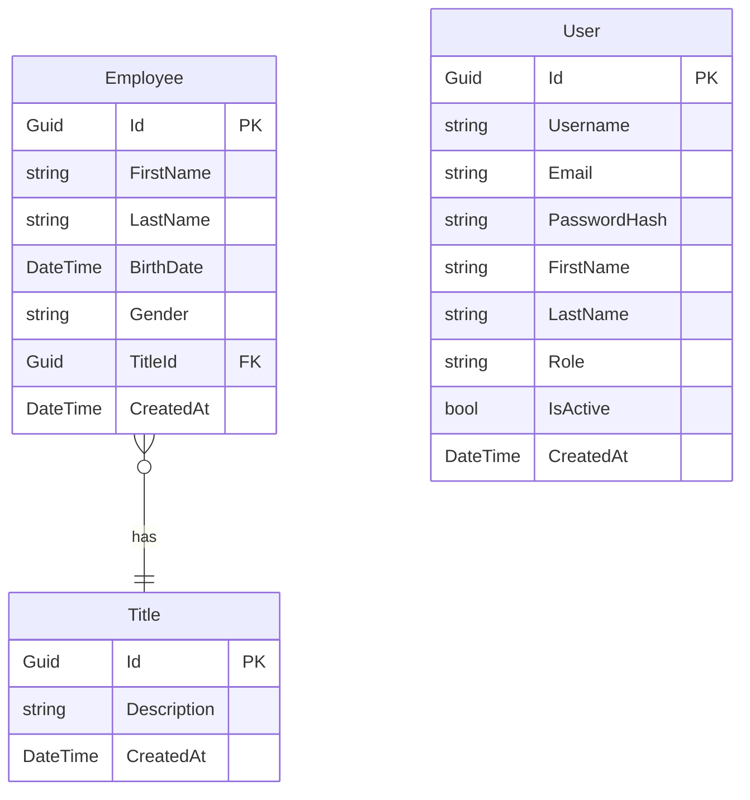

# Analyse Complète du Backend XtraWork

## Vue d'ensemble

Le backend XtraWork est une API REST ASP.NET Core 8.0 avec authentification JWT et gestion des employés.

---

## Entités de la base de données

### 1. Employee (Employé)



### Employee (XtraWork/Entities/Employee.cs)

| Propriété | Type | Contraintes | Description |
|-----------|------|-------------|-------------|
| Id | Guid | PK | Identifiant unique |
| FirstName | string | Required, MaxLength(50) | Prénom |
| LastName | string | Required, MaxLength(50) | Nom |
| BirthDate | DateTime | Required | Date de naissance |
| Gender | string | Required, MaxLength(10) | Genre (Homme/Femme/Autre) |
| TitleId | Guid | Required, FK | ID du titre/poste |
| CreatedAt | DateTime | Auto | Date de création |
| Title | Title | Navigation | Objet titre associé |

### Title (Titre/Poste)

| Propriété | Type | Contraintes | Description |
|-----------|------|-------------|-------------|
| Id | Guid | PK | Identifiant unique |
| Description | string | Required, MaxLength(100) | Description du poste |
| CreatedAt | DateTime | Auto | Date de création |
| Employees | ICollection<Employee> | Navigation | Liste des employés |

### User (Utilisateur)

| Propriété | Type | Contraintes | Description |
|-----------|------|-------------|-------------|
| Id | Guid | PK | Identifiant unique |
| Username | string | Required, MaxLength(50), Unique | Nom d'utilisateur |
| Email | string | Required, MaxLength(100), Email, Unique | Email |
| PasswordHash | string | Required | Hash du mot de passe (BCrypt) |
| FirstName | string | MaxLength(50) | Prénom |
| LastName | string | MaxLength(50) | Nom |
| Role | string | Default: "User" | Rôle (User/Manager/Admin) |
| IsActive | bool | Default: true | Compte actif |
| CreatedAt | DateTime | Auto | Date de création |
| LastLoginAt | DateTime? | Nullable | Dernière connexion |

---

## API Endpoints

### Base URL
```
https://localhost:7033/api
```

### Authentification Endpoints

#### POST /api/auth/login
**Description** : Connexion utilisateur

**Request** :
```json
{
  "username": "admin",
  "password": "Admin123!"
}
```

**Response 200** :
```json
{
  "token": "eyJhbGciOiJIUzI1NiIsInR5cCI6IkpXVCJ9...",
  "user": {
    "id": "3fa85f64-5717-4562-b3fc-2c963f66afa6",
    "username": "admin",
    "email": "admin@xtrawork.com",
    "firstName": "Admin",
    "lastName": "User",
    "role": "Admin"
  }
}
```

**Response 401** : Nom d'utilisateur ou mot de passe incorrect

---

#### POST /api/auth/register
**Description** : Inscription nouvel utilisateur

**Request** :
```json
{
  "username": "newuser",
  "email": "newuser@example.com",
  "password": "Password123!",
  "firstName": "John",
  "lastName": "Doe"
}
```

**Response 201** :
```json
{
  "token": "eyJhbGciOiJIUzI1NiIsInR5cCI6IkpXVCJ9...",
  "user": {
    "id": "...",
    "username": "newuser",
    "email": "newuser@example.com",
    "firstName": "John",
    "lastName": "Doe",
    "role": "User"
  }
}
```

**Response 400** : Username ou email déjà utilisé

---

#### GET /api/auth/me
**Description** : Informations de l'utilisateur connecté

**Headers** :
```
Authorization: Bearer {token}
```

**Response 200** :
```json
{
  "id": "...",
  "username": "admin",
  "email": "admin@xtrawork.com",
  "firstName": "Admin",
  "lastName": "User",
  "role": "Admin"
}
```

---

#### POST /api/auth/logout
**Description** : Déconnexion (invalidation côté client)

**Headers** :
```
Authorization: Bearer {token}
```

**Response 200** :
```json
{
  "message": "Déconnexion réussie",
  "user": "admin",
  "timestamp": "2025-10-30T13:00:00Z"
}
```

---

### Employees Endpoints

#### GET /api/employees
**Description** : Récupérer tous les employés

**Headers** :
```
Authorization: Bearer {token}
```

**Response 200** :
```json
[
  {
    "id": "3fa85f64-5717-4562-b3fc-2c963f66afa6",
    "firstName": "Jean",
    "lastName": "Dupont",
    "birthDate": "1990-05-15T00:00:00Z",
    "gender": "Homme",
    "titleId": "...",
    "titleDescription": "Développeur Senior",
    "createdAt": "2025-01-01T00:00:00Z",
    "age": 35
  }
]
```

---

#### GET /api/employees/{id}
**Description** : Récupérer un employé par ID

**Headers** :
```
Authorization: Bearer {token}
```

**Response 200** : Objet Employee
**Response 404** : Employé non trouvé

---

#### POST /api/employees
**Description** : Créer un employé

**Headers** :
```
Authorization: Bearer {token}
```

**Request** :
```json
{
  "firstName": "Jean",
  "lastName": "Dupont",
  "birthDate": "1990-05-15",
  "gender": "Homme",
  "titleId": "3fa85f64-5717-4562-b3fc-2c963f66afa6"
}
```

**Validation** :
- firstName : Required, MaxLength(50)
- lastName : Required, MaxLength(50)
- birthDate : Required, Format ISO 8601
- gender : Required, MaxLength(10)
- titleId : Required, doit exister

**Response 201** : Objet Employee créé
**Response 400** : Données invalides

---

#### PUT /api/employees/{id}
**Description** : Modifier un employé

**Headers** :
```
Authorization: Bearer {token}
```

**Request** : Même structure que POST

**Response 200** : Objet Employee modifié
**Response 404** : Employé non trouvé

---

#### DELETE /api/employees/{id}
**Description** : Supprimer un employé

**Autorisation** : Manager ou Admin

**Headers** :
```
Authorization: Bearer {token}
```

**Response 204** : Suppression réussie (No Content)
**Response 403** : Accès refusé
**Response 404** : Employé non trouvé

---

### Titles Endpoints

#### GET /api/titles
**Description** : Récupérer tous les titres

**Headers** :
```
Authorization: Bearer {token}
```

**Response 200** :
```json
[
  {
    "id": "3fa85f64-5717-4562-b3fc-2c963f66afa6",
    "description": "Développeur Senior",
    "createdAt": "2025-01-01T00:00:00Z"
  }
]
```

---

#### GET /api/titles/{id}
**Description** : Récupérer un titre par ID

**Response 200** : Objet Title
**Response 404** : Titre non trouvé

---

#### POST /api/titles
**Description** : Créer un titre

**Autorisation** : Admin uniquement

**Request** :
```json
{
  "description": "Développeur Senior"
}
```

**Response 201** : Objet Title créé
**Response 403** : Accès refusé (pas Admin)

---

#### PUT /api/titles/{id}
**Description** : Modifier un titre

**Autorisation** : Manager ou Admin

**Request** :
```json
{
  "description": "Développeur Senior .NET"
}
```

**Response 200** : Objet Title modifié
**Response 403** : Accès refusé

---

#### DELETE /api/titles/{id}
**Description** : Supprimer un titre

**Autorisation** : Admin uniquement

**Response 204** : Suppression réussie
**Response 403** : Accès refusé
**Response 404** : Titre non trouvé

---

## Authentification et Autorisation

### JWT Token

**Structure du token** :
```json
{
  "sub": "user-id-guid",
  "name": "username",
  "email": "user@example.com",
  "role": "Admin",
  "firstName": "John",
  "lastName": "Doe",
  "exp": 1730390400,
  "iss": "XtraWork-Issuer",
  "aud": "XtraWork-Audience"
}
```

**Durée de validité** : 24 heures

**Header requis** :
```
Authorization: Bearer {token}
```

### Rôles

| Rôle | Permissions |
|------|-------------|
| **User** | - Lecture employés et titres<br>- Création d'employés<br>- Modification d'employés |
| **Manager** | - Tout de User<br>- Suppression d'employés<br>- Modification de titres |
| **Admin** | - Toutes les permissions<br>- Création de titres<br>- Suppression de titres |

---

## CORS Configuration

**Origins autorisées** :
```csharp
"http://localhost:3000",    // Next.js
"https://localhost:3000",
"http://localhost:5173",    // Vite (React, Vue, Svelte)
"http://localhost:4200",    // Angular
"http://localhost:5500",    // Live Server
"http://localhost:8080"     // Autres
```

**Headers** : Tous autorisés
**Methods** : Tous autorisés (GET, POST, PUT, DELETE, etc.)
**Credentials** : Autorisés

---

## Validation

### EmployeeRequest

| Champ | Validation |
|-------|------------|
| firstName | Required, MaxLength(50) |
| lastName | Required, MaxLength(50) |
| birthDate | Required, Format Date |
| gender | Required, MaxLength(10) |
| titleId | Required, Format Guid, Doit exister |

### TitleRequest

| Champ | Validation |
|-------|------------|
| description | Required, MaxLength(100) |

### LoginRequest

| Champ | Validation |
|-------|------------|
| username | Required |
| password | Required |

### RegisterRequest

| Champ | Validation |
|-------|------------|
| username | Required |
| email | Required, Format Email |
| password | Required, MinLength(6) |
| firstName | Required |
| lastName | Required |

---

## Messages d'erreur

### Formats de réponse d'erreur

**400 Bad Request** :
```json
{
  "message": "Validation échouée",
  "errors": {
    "FirstName": ["Le prénom est obligatoire"],
    "TitleId": ["Le titre est obligatoire"]
  }
}
```

**401 Unauthorized** :
```json
{
  "message": "Nom d'utilisateur ou mot de passe incorrect"
}
```

**403 Forbidden** :
```json
{
  "message": "Accès refusé"
}
```

**404 Not Found** :
```json
{
  "message": "Employé avec l'ID xxx non trouvé"
}
```

**500 Internal Server Error** :
```json
{
  "message": "Une erreur interne est survenue"
}
```

---

## Compte de test par défaut

Un compte admin est créé automatiquement au démarrage :

```
Username: admin
Password: Admin123!
Email: admin@xtrawork.com
FirstName: Admin
LastName: User
Role: Admin
```

---

## Configuration requise

### appsettings.json

```json
{
  "ConnectionStrings": {
    "XtraWork": "Server=.;Database=XtraWork;Trusted_Connection=True;..."
  },
  "Jwt": {
    "Issuer": "XtraWork-Issuer",
    "Audience": "XtraWork-Audience",
    "Key": "votre-cle-secrete-64-caracteres"
  }
}
```

---

## Points importants pour le Frontend

### 1. Format des dates

**Envoi au backend** : Format ISO 8601
```json
{
  "birthDate": "1990-05-15"
}
```

**Réception du backend** :
```json
{
  "birthDate": "1990-05-15T00:00:00Z"
}
```

### 2. Format des Guid

Les IDs sont des GUID au format :
```
3fa85f64-5717-4562-b3fc-2c963f66afa6
```

### 3. Gestion des erreurs

Toujours vérifier :
- Status Code (200, 201, 204, 400, 401, 403, 404, 500)
- Message d'erreur dans la réponse
- Rediriger vers login si 401

### 4. Stockage du token

Le frontend doit :
1. Recevoir le token lors du login
2. Le stocker (localStorage/sessionStorage)
3. L'envoyer dans chaque requête :
   ```
   Authorization: Bearer {token}
   ```
4. Le supprimer lors du logout

### 5. Certificat SSL en développement

L'API utilise HTTPS avec un certificat auto-signé.
Le frontend doit accepter ce certificat en développement.

---

## Exemples de requêtes complètes

### Login puis récupération des employés

```javascript
// 1. Login
const loginResponse = await fetch('https://localhost:7033/api/auth/login', {
  method: 'POST',
  headers: { 'Content-Type': 'application/json' },
  body: JSON.stringify({
    username: 'admin',
    password: 'Admin123!'
  })
});

const loginData = await loginResponse.json();
const token = loginData.token;

// 2. Récupérer les employés
const employeesResponse = await fetch('https://localhost:7033/api/employees', {
  headers: { 'Authorization': `Bearer ${token}` }
});

const employees = await employeesResponse.json();
```

### Créer un employé

```javascript
const createResponse = await fetch('https://localhost:7033/api/employees', {
  method: 'POST',
  headers: {
    'Authorization': `Bearer ${token}`,
    'Content-Type': 'application/json'
  },
  body: JSON.stringify({
    firstName: 'Jean',
    lastName: 'Dupont',
    birthDate: '1990-05-15',
    gender: 'Homme',
    titleId: '3fa85f64-5717-4562-b3fc-2c963f66afa6'
  })
});

const newEmployee = await createResponse.json();
```

---

## Swagger Documentation

Disponible sur : https://localhost:7033/swagger

La documentation Swagger contient :
- Tous les endpoints
- Schémas des DTOs
- Possibilité de tester directement
- Exemples de requêtes/réponses

---

**Ce document doit être la référence pour créer tous les exemples frontend.**

---

**Date de création** : 30 octobre 2025
**Version API** : 1.0
**Backend** : ASP.NET Core 8.0

