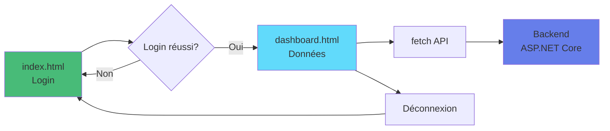

# 01 - HTML Vanilla Simple

## Description

Le frontend **le plus simple possible** pour consommer l'API XtraWork.

Aucune dépendance, aucun framework, juste HTML + CSS + JavaScript pur.

---

## Fonctionnalités

- Login avec JWT
- Liste des employés
- Liste des titres
- Déconnexion
- Design simple et fonctionnel

---

## Structure

```
01-html-vanilla-simple/
├── index.html              # Page de login
├── dashboard.html          # Dashboard avec données
├── css/
│   └── style.css          # Styles
├── js/
│   ├── config.js          # Configuration API
│   ├── auth.js            # Gestion authentification
│   └── api.js             # Appels API
├── README.md              # Ce fichier
├── DEMARRAGE-RAPIDE.txt   # Commandes essentielles
└── EXPLICATIONS.md        # Explications pédagogiques
```

---

## Prérequis

### Backend en cours d'exécution

```bash
cd XtraWork
dotnet run
```

L'API doit tourner sur : `https://localhost:7033`

### Certificat SSL accepté

1. Ouvrir https://localhost:7033 dans le navigateur
2. Cliquer "Avancé"
3. Cliquer "Continuer vers le site"

---

## Démarrage

### Méthode 1 : Double-clic

Double-cliquer sur `index.html`

### Méthode 2 : Live Server (VS Code)

1. Installer l'extension "Live Server"
2. Clic droit sur `index.html`
3. Sélectionner "Open with Live Server"

### Méthode 3 : Python HTTP Server

```bash
cd frontend-exemples/01-html-vanilla-simple
python -m http.server 8080
```

Ouvrir : http://localhost:8080

---

## Utilisation

### 1. Page de login (index.html)

Ouvrir `index.html` dans le navigateur.

**Credentials de test** :
- Username : `admin`
- Password : `Admin123!`

### 2. Dashboard (dashboard.html)

Après connexion réussie, vous êtes redirigé vers le dashboard.

Le dashboard affiche :
- Informations utilisateur
- Liste des employés
- Liste des titres

### 3. Déconnexion

Cliquer sur "Déconnexion" dans le dashboard.

Le token JWT est supprimé et vous êtes redirigé vers la page de login.

---

## Architecture technique



### Flow d'authentification

1. Utilisateur entre username/password
2. JavaScript fait `POST /api/auth/login`
3. Backend retourne un JWT token
4. Token stocké dans `localStorage`
5. Redirection vers dashboard.html
6. Dashboard récupère les données avec le token

---

## Fichiers JavaScript

### js/config.js

Configuration de l'API :
- URL de base
- Clés de stockage localStorage

### js/auth.js

Fonctions d'authentification :
- `login(username, password)` - Connexion
- `logout()` - Déconnexion
- `isAuthenticated()` - Vérifier si connecté
- `getToken()` - Récupérer le token
- `getCurrentUser()` - Info utilisateur

### js/api.js

Appels API :
- `getEmployees()` - Liste des employés
- `getTitles()` - Liste des titres

Tous les appels incluent automatiquement le token JWT.

---

## Données affichées

### Employés

Pour chaque employé :
- Nom complet (Prénom + Nom)
- Date de naissance
- Âge (calculé)
- Genre
- Titre/Poste

### Titres

Pour chaque titre :
- Description du poste
- Date de création

---

## Gestion des erreurs

### Erreur de connexion

Si le username ou password est incorrect :
- Message d'erreur affiché
- Champs du formulaire restent remplis

### Token expiré

Si le token JWT est expiré (24h) :
- Redirection automatique vers login
- Message informatif

### API non disponible

Si l'API ne répond pas :
- Message clair affiché
- Instructions pour démarrer l'API

---

## Points pédagogiques

### Ce que vous apprenez

1. **Fetch API** - Requêtes HTTP en JavaScript
2. **Promises et async/await** - Programmation asynchrone
3. **localStorage** - Stockage côté client
4. **JWT** - Authentification par token
5. **DOM manipulation** - Affichage dynamique
6. **Gestion d'erreurs** - Try/catch et gestion des statuts HTTP

### Concepts importants

**Authentification JWT** :
```javascript
// 1. Login - Obtenir le token
const response = await fetch('/api/auth/login', {
  method: 'POST',
  body: JSON.stringify({ username, password })
});
const data = await response.json();
localStorage.setItem('token', data.token);

// 2. Requête avec token
const response = await fetch('/api/employees', {
  headers: { 'Authorization': `Bearer ${token}` }
});
```

**Gestion des erreurs** :
```javascript
if (response.status === 401) {
  // Token invalide ou expiré
  redirectToLogin();
}
```

---

## Limitations

Cet exemple est volontairement simple :

- Pas de création d'employé
- Pas de modification
- Pas de suppression
- Pas de pagination
- Pas de recherche
- Pas de validation avancée

Pour ces fonctionnalités, voir : `02-html-vanilla-complet/`

---

## Évolutions possibles

Pour améliorer cet exemple :

1. **Ajouter la recherche** - Filtrer la liste
2. **Ajouter le tri** - Trier par colonne
3. **Ajouter des détails** - Page détail d'un employé
4. **Améliorer le design** - Plus de CSS
5. **Ajouter des animations** - Transitions CSS

---

## Résolution de problèmes

### "Failed to fetch"

**Cause** : L'API n'est pas démarrée

**Solution** :
```bash
cd XtraWork
dotnet run
```

### "Certificat SSL non valide"

**Cause** : Certificat auto-signé non accepté

**Solution** :
1. Ouvrir https://localhost:7033
2. Accepter le certificat

### "Token expiré"

**Cause** : Le token JWT dure 24h

**Solution** :
```javascript
// Dans la console navigateur (F12)
localStorage.clear()
```
Puis se reconnecter.

### La page est vide

**Cause** : Erreur JavaScript

**Solution** :
1. Ouvrir DevTools (F12)
2. Onglet Console
3. Lire le message d'erreur

---

## Code source

Tous les fichiers sont commentés en détail.

Ouvrez les fichiers pour comprendre le fonctionnement :
- `index.html` - Structure de la page de login
- `dashboard.html` - Structure du dashboard
- `js/auth.js` - Logique d'authentification
- `js/api.js` - Logique d'appels API

---

## Prochaines étapes

Après avoir compris cet exemple :

1. **Modifier le code** - Changez les couleurs, le texte
2. **Ajouter des fonctionnalités** - Ajoutez une page détail
3. **Passer à l'exemple suivant** - `02-html-vanilla-complet/`

---

## Support

### Documentation

- `EXPLICATIONS.md` - Explications détaillées
- `../ANALYSE-BACKEND-XTRAWORK.md` - Documentation API
- `../../12-OPTIONS-FRONTEND/01-HTML-VANILLA.md` - Guide complet

### Swagger

Tester l'API : https://localhost:7033/swagger

---

**Bon apprentissage !**

