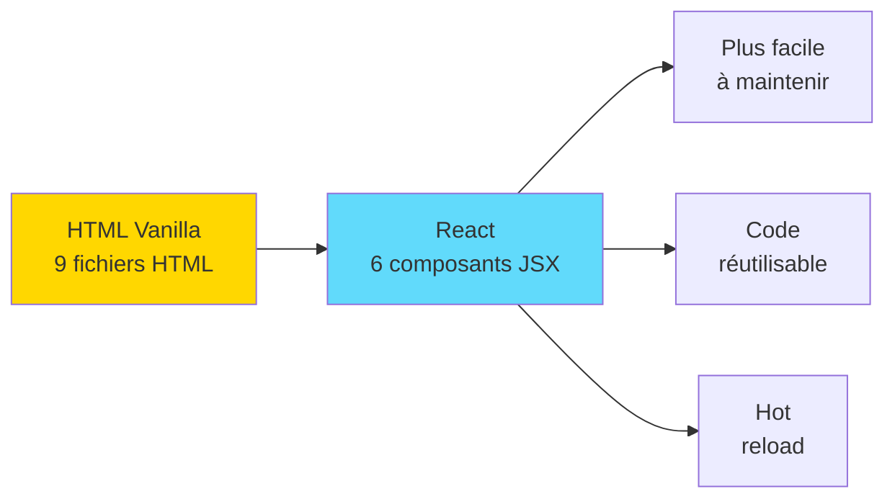

# LIRE EN PREMIER - React Vite Simple

## Bienvenue dans React !

Cet exemple vous introduit à **React** - la bibliothèque JavaScript la plus populaire pour créer des interfaces utilisateur.

---

## Démarrage en 3 minutes

### 1. Backend

```bash
cd XtraWork
dotnet run
```

### 2. Frontend React

```bash
cd frontend-exemples/03-react-vite-simple
npm install
npm run dev
```

### 3. Navigateur

Ouvrir : **http://localhost:5173**

Se connecter avec : `admin` / `Admin123!`

---

## C'est quoi React ?

**React** = Bibliothèque JavaScript pour créer des interfaces avec des **composants réutilisables**.



---

## Différence principale avec HTML Vanilla

### HTML Vanilla (Exemples 01-02)

**9 fichiers HTML séparés** :
- index.html
- login.html
- dashboard.html
- employees.html
- etc.

Chaque page = un fichier complet

**Navigation** : Rechargement de page
```javascript
window.location.href = 'dashboard.html';
```

---

### React (Exemple 03)

**1 seule page HTML** (index.html)
**Composants JSX** changent dynamiquement :
- Login.jsx
- Dashboard.jsx
- Employees.jsx

**Navigation** : Instantanée (pas de rechargement)
```jsx
navigate('/dashboard');  // Changement instantané
```

---

## Structure du projet

```
03-react-vite-simple/
│
├── 📘 00-LIRE-EN-PREMIER.md      ← Vous êtes ici
├── 📘 README.md                   ← Documentation complète
├── 📘 DEMARRAGE-RAPIDE.txt       ← Commandes essentielles
├── 📘 INSTALLATION-COMPLETE.md   ← Guide d'installation
├── 📘 EXPLICATIONS.md            ← Concepts React expliqués
│
├── 📦 package.json                ← Dépendances npm
├── ⚙️ vite.config.js             ← Configuration Vite
├── 🌐 index.html                  ← Point d'entrée HTML
│
└── 📁 src/                        ← Code source React
    ├── main.jsx                   ← Point d'entrée React
    ├── App.jsx                    ← Composant racine + Router
    │
    ├── 📁 components/             ← Composants réutilisables
    │   ├── Navbar.jsx            ← Barre de navigation
    │   └── ProtectedRoute.jsx    ← Protection des routes
    │
    ├── 📁 pages/                  ← Pages de l'application
    │   ├── Login.jsx             ← Page de connexion
    │   ├── Dashboard.jsx         ← Tableau de bord
    │   └── Employees.jsx         ← Liste employés
    │
    ├── 📁 services/               ← Communication API
    │   ├── api.js                ← Client Axios
    │   ├── authService.js        ← Service authentification
    │   └── employeeService.js    ← Service employés
    │
    └── 📁 context/                ← État global
        └── AuthContext.jsx       ← Context authentification
```

---

## Concepts React dans cet exemple

### 1. Composants

**Un composant = Une fonction qui retourne du JSX**

```jsx
function Navbar() {
    return (
        <nav>
            <h1>XtraWork</h1>
        </nav>
    );
}
```

Réutilisable partout !

---

### 2. State (useState)

**Gérer les données qui changent**

```jsx
const [employees, setEmployees] = useState([]);

// Modifier
setEmployees(newData);  // React met à jour l'UI automatiquement !
```

---

### 3. Effects (useEffect)

**Exécuter du code au chargement**

```jsx
useEffect(() => {
    loadEmployees();  // Charger les données
}, []);  // [] = une seule fois
```

---

### 4. Context

**Partager l'état entre composants**

```jsx
// Créer
const AuthContext = createContext();

// Utiliser
const { user, login } = useContext(AuthContext);
```

---

### 5. Router

**Navigation sans rechargement**

```jsx
navigate('/dashboard');  // Instantané !
```

---

## Commandes essentielles

```bash
# Installer les dépendances
npm install

# Lancer en développement (hot reload)
npm run dev

# Build pour production
npm run build

# Vérifier le code
npm run lint
```

---

## Ordre de lecture recommandé

### Pour comprendre React

1. **00-LIRE-EN-PREMIER.md** ← Vous êtes ici
2. **INSTALLATION-COMPLETE.md** ← Installer et lancer
3. **EXPLICATIONS.md** ← Concepts React détaillés
4. **Code source** ← Lire dans cet ordre :
   - `src/main.jsx` → Point d'entrée
   - `src/App.jsx` → Routes
   - `src/context/AuthContext.jsx` → Context
   - `src/pages/Login.jsx` → Premier composant
   - `src/pages/Dashboard.jsx` → useState/useEffect
   - `src/components/Navbar.jsx` → Composant réutilisable

---

## Comparaison rapide

| | HTML Vanilla | React |
|---|---|---|
| **Fichiers HTML** | 9 pages | 1 seul |
| **Navigation** | Rechargement | Instantané |
| **Réutilisation** | Copy-paste | Composants |
| **Hot Reload** | Non | Oui |
| **Installation** | Aucune | npm install |
| **Courbe apprentissage** | Facile | Moyenne |
| **Productivité** | Moyenne | Élevée |

---

## Ce qui est différent de HTML Vanilla

### Pas de fichiers HTML séparés

**HTML Vanilla** :
- login.html
- dashboard.html
- employees.html

**React** :
- Login.jsx (composant)
- Dashboard.jsx (composant)
- Employees.jsx (composant)
- Tous chargés dans le même index.html

---

### Pas de getElementById

**HTML Vanilla** :
```javascript
document.getElementById('user-name').textContent = user.name;
```

**React** :
```jsx
<span>{user.name}</span>
```

React met à jour automatiquement quand `user` change !

---

### Pas de addEventListener

**HTML Vanilla** :
```javascript
button.addEventListener('click', handleClick);
```

**React** :
```jsx
<button onClick={handleClick}>Cliquer</button>
```

---

## Avantages de React

**1. Composants réutilisables**
```jsx
<Navbar />  // Utilisé dans Dashboard, Employees, etc.
```

**2. UI automatiquement mise à jour**
```jsx
setEmployees(newData);  // L'UI se met à jour automatiquement !
```

**3. Hot reload**
Modifiez le code → Voir les changements instantanément

**4. Écosystème énorme**
Des milliers de bibliothèques disponibles

---

## Prochaines étapes

### Aujourd'hui

1. Lancer le projet (npm run dev)
2. Explorer l'interface
3. Lire le code source
4. Modifier quelque chose

### Cette semaine

1. Lire EXPLICATIONS.md
2. Comprendre useState et useEffect
3. Faire les exercices
4. Créer votre propre composant

### Plus tard

1. Version complète : `04-react-vite-complet/`
2. Ou explorer Vue.js : `05-vuejs-simple/`
3. Puis Next.js : `07-nextjs-reference/`

---

## Support

### En cas de problème

1. Lire INSTALLATION-COMPLETE.md
2. Vérifier que le backend tourne
3. Vérifier la console navigateur (F12)
4. Vérifier le terminal (erreurs de compilation)

### Documentation

- Dans ce dossier : EXPLICATIONS.md
- React officiel : https://react.dev
- Vite officiel : https://vitejs.dev

---

**Bienvenue dans le monde de React - vous allez adorer !**

