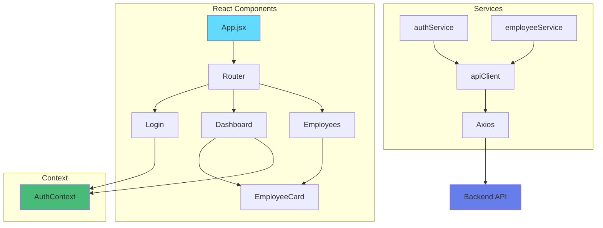

# 03 - React Vite Simple

## Description

Introduction à **React** avec Vite - un framework moderne pour créer des interfaces utilisateur avec des composants réutilisables.

Version simple avec les fonctionnalités de base pour comprendre les concepts fondamentaux de React.

---

## Fonctionnalités

- Login avec JWT
- Dashboard utilisateur
- Liste des employés
- Liste des titres
- Composants React réutilisables
- React Router pour la navigation
- Context API pour l'authentification

---

## Architecture



---

## Structure du projet

```
03-react-vite-simple/
├── public/
│   └── vite.svg
├── src/
│   ├── components/          # Composants réutilisables
│   │   ├── Navbar.jsx
│   │   ├── EmployeeCard.jsx
│   │   └── ProtectedRoute.jsx
│   ├── pages/              # Pages de l'application
│   │   ├── Login.jsx
│   │   ├── Dashboard.jsx
│   │   └── Employees.jsx
│   ├── services/           # Communication API
│   │   ├── api.js
│   │   ├── authService.js
│   │   ├── employeeService.js
│   │   └── titleService.js
│   ├── context/            # Context API
│   │   └── AuthContext.jsx
│   ├── config.js           # Configuration
│   ├── App.jsx             # Composant principal
│   ├── App.css             # Styles
│   └── main.jsx            # Point d'entrée
├── package.json
├── vite.config.js
├── README.md
├── DEMARRAGE-RAPIDE.txt
└── EXPLICATIONS.md
```

---

## Prérequis

### Backend en cours d'exécution

```bash
cd XtraWork
dotnet run
```

API sur : `https://localhost:7033`

### Node.js installé

```bash
node --version    # v18 ou supérieur
npm --version     # 9 ou supérieur
```

Installation : https://nodejs.org/

---

## Installation

### Étape 1 : Aller dans le dossier

```bash
cd frontend-exemples/03-react-vite-simple
```

### Étape 2 : Installer les dépendances

```bash
npm install
```

Cela va installer :
- React 18
- React Router DOM
- Axios
- Vite

### Étape 3 : Lancer en mode développement

```bash
npm run dev
```

L'application sera disponible sur : **http://localhost:5173**

---

## Utilisation

### 1. Ouvrir l'application

Navigateur : http://localhost:5173

### 2. Se connecter

**Credentials de test** :
- Username : `admin`
- Password : `Admin123!`

### 3. Explorer

Après connexion :
- Dashboard avec informations utilisateur
- Liste des employés
- Liste des titres

### 4. Hot Reload

Modifiez n'importe quel fichier .jsx :
- Les changements apparaissent instantanément
- Pas besoin de rafraîchir le navigateur

---

## Concepts React expliqués

### 1. Composants

**Qu'est-ce que c'est** :
Une fonction JavaScript qui retourne du HTML (JSX).

```jsx
function EmployeeCard({ employee }) {
    return (
        <div className="card">
            <h3>{employee.firstName} {employee.lastName}</h3>
            <p>{employee.titleDescription}</p>
        </div>
    );
}
```

**Réutilisation** :
```jsx
<EmployeeCard employee={employee1} />
<EmployeeCard employee={employee2} />
<EmployeeCard employee={employee3} />
```

---

### 2. Hooks

**useState** - Gérer l'état local :
```jsx
const [employees, setEmployees] = useState([]);
const [loading, setLoading] = useState(true);

// Modifier l'état
setEmployees(newData);
setLoading(false);
```

**useEffect** - Exécuter du code au montage :
```jsx
useEffect(() => {
    // S'exécute quand le composant s'affiche
    loadEmployees();
}, []); // [] = une seule fois
```

**useNavigate** - Navigation :
```jsx
const navigate = useNavigate();
navigate('/dashboard');
```

---

### 3. Context API

**Partager l'état entre composants** :

```jsx
// Créer le context
const AuthContext = createContext();

// Fournir les données
<AuthContext.Provider value={{ user, login, logout }}>
    <App />
</AuthContext.Provider>

// Utiliser dans un composant
const { user, login } = useContext(AuthContext);
```

---

### 4. JSX

**Qu'est-ce que c'est** :
JavaScript + XML (HTML-like)

```jsx
// JavaScript classique
const element = <h1>Bonjour {name}</h1>;

// Conditions
{isAuthenticated ? <Dashboard /> : <Login />}

// Boucles
{employees.map(emp => (
    <div key={emp.id}>{emp.name}</div>
))}
```

---

## Avantages par rapport à HTML Vanilla

### Code plus concis

**HTML Vanilla** :
```javascript
const row = document.createElement('tr');
row.innerHTML = `
    <td>${employee.firstName}</td>
    <td>${employee.lastName}</td>
`;
tbody.appendChild(row);
```

**React** :
```jsx
<tr>
    <td>{employee.firstName}</td>
    <td>{employee.lastName}</td>
</tr>
```

---

### Composants réutilisables

**HTML Vanilla** :
Copier-coller la navbar dans chaque page

**React** :
```jsx
// Navbar.jsx (une seule fois)
export function Navbar() {
    return <nav>...</nav>;
}

// Utiliser partout
<Navbar />
```

---

### State management

**HTML Vanilla** :
```javascript
let employees = [];
localStorage.setItem('employees', JSON.stringify(employees));
```

**React** :
```jsx
const [employees, setEmployees] = useState([]);
// React met à jour automatiquement l'UI
```

---

## Commandes disponibles

```bash
# Développement avec hot reload
npm run dev

# Build pour production
npm run build

# Prévisualiser le build
npm run preview

# Linter
npm run lint
```

---

## Résolution de problèmes

### Port 5173 déjà utilisé

```bash
npm run dev -- --port 5174
```

### Erreur "Cannot find module"

```bash
rm -rf node_modules
npm install
```

### API ne répond pas

Vérifier que le backend tourne :
```bash
cd XtraWork
dotnet run
```

### Erreur CORS

Vérifier `XtraWork/Program.cs` :
```csharp
policy.WithOrigins("http://localhost:5173")
```

---

## Différences avec HTML Vanilla

| Aspect | HTML Vanilla | React |
|--------|-------------|--------|
| **Fichiers** | 2 HTML | 5+ Components JSX |
| **Réutilisation** | Copy-paste | Composants |
| **State** | localStorage | useState/Context |
| **Routing** | window.location | React Router |
| **UI Update** | DOM manuel | Automatique |
| **Hot Reload** | Non | Oui |
| **Build** | Aucun | Vite |

---

## Prochaines étapes

Après avoir maîtrisé cet exemple :

1. **Comprendre chaque composant**
2. **Modifier et expérimenter**
3. **Passer à la version complète** : `04-react-vite-complet/`
4. **Ou explorer Vue.js** : `05-vuejs-simple/`

---

## Documentation

- `EXPLICATIONS.md` - Concepts React expliqués
- `../ANALYSE-BACKEND-XTRAWORK.md` - API Documentation
- React Docs : https://react.dev

---

**Bienvenue dans le monde de React !**

