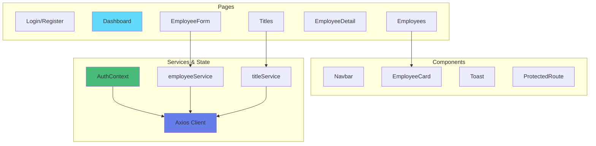

# 04 - React Vite Complet

## Description

Application **React complète** avec toutes les fonctionnalités CRUD, formulaires avancés, et gestion d'état sophistiquée.

Cet exemple démontre une application React production-ready.

---

## Fonctionnalités

- Authentification complète (Login + Register)
- CRUD Employés complet (Create, Read, Update, Delete)
- CRUD Titres complet
- Formulaires avec React Hook Form
- Validation avec Zod
- State management avec Context API
- Recherche et filtres
- Notifications toast
- Gestion des permissions
- Design moderne et responsive

---

## Architecture



---

## Structure du projet

```
04-react-vite-complet/
├── src/
│   ├── components/          # Composants réutilisables
│   │   ├── Navbar.jsx
│   │   ├── EmployeeCard.jsx
│   │   ├── Toast.jsx
│   │   ├── ProtectedRoute.jsx
│   │   ├── SearchBar.jsx
│   │   └── ConfirmDialog.jsx
│   │
│   ├── pages/              # Pages
│   │   ├── Login.jsx
│   │   ├── Register.jsx
│   │   ├── Dashboard.jsx
│   │   ├── Employees.jsx
│   │   ├── EmployeeForm.jsx
│   │   ├── EmployeeDetail.jsx
│   │   ├── Titles.jsx
│   │   └── TitleForm.jsx
│   │
│   ├── services/           # API Services
│   │   ├── api.js
│   │   ├── authService.js
│   │   ├── employeeService.js
│   │   └── titleService.js
│   │
│   ├── context/            # State Management
│   │   ├── AuthContext.jsx
│   │   └── ToastContext.jsx
│   │
│   ├── hooks/              # Custom Hooks
│   │   ├── useAuth.js
│   │   ├── useEmployees.js
│   │   └── useToast.js
│   │
│   ├── utils/              # Utilitaires
│   │   ├── validation.js
│   │   ├── formatters.js
│   │   └── permissions.js
│   │
│   ├── App.jsx
│   └── main.jsx
│
├── package.json
├── vite.config.js
├── README.md
├── DEMARRAGE-RAPIDE.txt
└── EXPLICATIONS.md
```

---

## Prérequis

### Backend

```bash
cd XtraWork
dotnet run
```

### Node.js

```bash
node --version    # v18+
npm --version     # 9+
```

---

## Installation

```bash
cd frontend-exemples/04-react-vite-complet
npm install
npm run dev
```

Application sur : **http://localhost:5173**

---

## Nouveautés par rapport à la version simple

### 1. React Hook Form

Gestion avancée des formulaires :
- Validation en temps réel
- Messages d'erreur personnalisés
- Performance optimale

```jsx
import { useForm } from 'react-hook-form';

const { register, handleSubmit, formState: { errors } } = useForm();

<input {...register('firstName', { required: 'Prénom requis' })} />
{errors.firstName && <span>{errors.firstName.message}</span>}
```

---

### 2. Zod pour validation

Schémas de validation type-safe :

```javascript
import { z } from 'zod';

const employeeSchema = z.object({
    firstName: z.string().min(2, 'Minimum 2 caractères'),
    lastName: z.string().min(2, 'Minimum 2 caractères'),
    birthDate: z.string().refine(date => calculateAge(date) >= 16)
});
```

---

### 3. Custom Hooks

Logique réutilisable :

```jsx
// hooks/useEmployees.js
export function useEmployees() {
    const [employees, setEmployees] = useState([]);
    const [loading, setLoading] = useState(true);
    
    const loadEmployees = async () => {
        const data = await employeeService.getAll();
        setEmployees(data);
        setLoading(false);
    };
    
    return { employees, loading, loadEmployees };
}

// Utilisation
const { employees, loading } = useEmployees();
```

---

### 4. Toast Context

Notifications globales :

```jsx
const { showToast } = useToast();

showToast('Employé créé avec succès', 'success');
showToast('Erreur lors de la suppression', 'error');
```

---

### 5. Recherche et filtres

```jsx
const [search, setSearch] = useState('');
const [genderFilter, setGenderFilter] = useState('');

const filteredEmployees = employees
    .filter(emp => 
        emp.firstName.toLowerCase().includes(search.toLowerCase())
    )
    .filter(emp => 
        genderFilter === '' || emp.gender === genderFilter
    );
```

---

### 6. Gestion des permissions

```jsx
import { useAuth } from '../hooks/useAuth';

const { user, hasPermission } = useAuth();

{hasPermission('Manager') && (
    <button onClick={deleteEmployee}>Supprimer</button>
)}
```

---

## Fonctionnalités complètes

### Authentification

- [x] Login avec validation
- [x] Register avec validation complète
- [x] Logout
- [x] Protection des routes
- [x] Persistance de la session

### CRUD Employés

- [x] Liste avec recherche et filtres
- [x] Création avec formulaire complet
- [x] Modification (formulaire pré-rempli)
- [x] Suppression avec confirmation
- [x] Détail complet
- [x] Validation avancée

### CRUD Titres

- [x] Liste complète
- [x] Création (Admin)
- [x] Modification (Manager/Admin)
- [x] Suppression (Admin)
- [x] Validation

### UX/UI

- [x] Toast notifications
- [x] Loading states partout
- [x] Confirmation dialogs
- [x] Empty states
- [x] Error handling
- [x] Responsive design

---

## Technologies utilisées

```json
{
  "react": "^18.3.1",
  "react-router-dom": "^6.22.0",
  "axios": "^1.6.7",
  "react-hook-form": "^7.51.0",
  "zod": "^3.22.4",
  "@hookform/resolvers": "^3.3.4"
}
```

---

## Commandes

```bash
# Installation
npm install

# Développement
npm run dev

# Build production
npm run build

# Preview production
npm run preview

# Linter
npm run lint

# Tests (si configurés)
npm run test
```

---

## Comparaison avec version simple

| Fonctionnalité | Simple (03) | Complet (04) |
|----------------|-------------|--------------|
| Pages | 3 | 8 |
| Composants | 2 | 7 |
| Fonctionnalités | Login + Liste | CRUD complet |
| Formulaires | Basique | React Hook Form + Zod |
| Recherche | Non | Oui |
| Filtres | Non | Oui |
| Toast | Non | Oui |
| Validation | Basique | Avancée |
| Custom Hooks | 1 | 4 |
| Code | ~600 lignes | ~2000 lignes |

---

## Points d'apprentissage

### Concepts React avancés

- Custom Hooks réutilisables
- Multiple Contexts
- React Hook Form
- Zod validation schemas
- Conditional rendering avancé
- Component composition

### Patterns de code

- Container/Presentational pattern
- Custom hooks pattern
- Context provider pattern
- Service layer pattern

---

## Exercices pratiques

### Exercice 1 : Ajouter la pagination

Afficher 10 employés par page avec navigation.

### Exercice 2 : Ajouter le tri

Trier les colonnes en cliquant sur les en-têtes.

### Exercice 3 : Ajouter React Query

Implémenter le cache automatique des données.

### Exercice 4 : Ajouter des tests

Écrire des tests avec Vitest et React Testing Library.

---

## Résolution de problèmes

### npm install échoue

```bash
rm -rf node_modules package-lock.json
npm install
```

### Build échoue

```bash
npm run lint
# Corriger les erreurs
npm run build
```

---

## Prochaines étapes

Après avoir maîtrisé cet exemple :

1. **Comparer avec HTML Vanilla** - Voir la différence de productivité
2. **Explorer Vue.js** - `05-vuejs-complet/`
3. **Découvrir Next.js** - `07-nextjs-reference/`
4. **Créer votre propre projet**

---

**Application React complète prête pour la production !**

