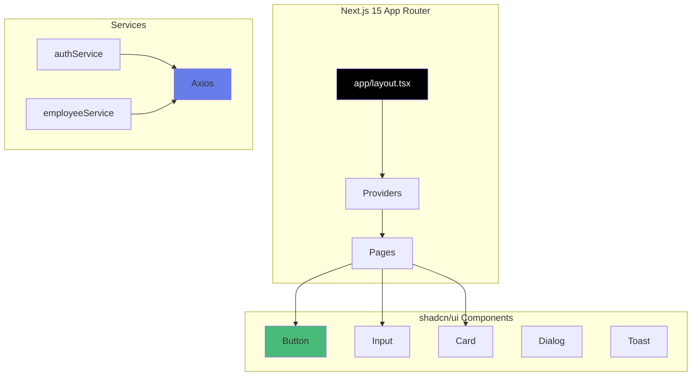

# 08 - Next.js 15 Complet avec shadcn/ui

## Description

Application **Next.js 15 complète** avec shadcn/ui, Tailwind CSS v3, et toutes les fonctionnalités CRUD.

Version production-ready avec les meilleures pratiques Next.js.

---

## Technologies

- Next.js 15 (latest)
- React 18
- TypeScript 5
- Tailwind CSS 3.4 (stable)
- shadcn/ui (composants)
- Axios
- Zod (validation)
- React Hook Form

---

## Fonctionnalités

- Authentification complète (Login + Register)
- CRUD Employés complet avec shadcn/ui
- CRUD Titres complet
- Dashboard avec statistiques
- Composants shadcn/ui (Button, Input, Card, Dialog, etc.)
- Server Components et Client Components
- Middleware pour protection des routes
- Toast notifications avec shadcn/ui
- Formulaires avec React Hook Form + Zod
- Design moderne avec Tailwind CSS v3

---

## Architecture



---

## Structure du projet

```
08-nextjs-complet/
├── app/
│   ├── layout.tsx              # Layout racine
│   ├── page.tsx                # Page d'accueil
│   ├── globals.css             # Tailwind CSS v3
│   ├── providers.tsx           # Providers (Toast, etc.)
│   ├── login/
│   │   └── page.tsx           # Login
│   ├── register/
│   │   └── page.tsx           # Register
│   └── dashboard/
│       ├── page.tsx           # Dashboard
│       ├── employees/
│       │   ├── page.tsx       # Liste
│       │   ├── new/page.tsx   # Créer
│       │   ├── [id]/page.tsx  # Détail
│       │   └── [id]/edit/page.tsx  # Modifier
│       └── titles/
│           ├── page.tsx       # Liste
│           ├── new/page.tsx   # Créer
│           └── [id]/edit/page.tsx  # Modifier
│
├── components/
│   ├── ui/                    # shadcn/ui components
│   │   ├── button.tsx
│   │   ├── input.tsx
│   │   ├── card.tsx
│   │   ├── dialog.tsx
│   │   ├── label.tsx
│   │   └── toast.tsx
│   └── navbar.tsx             # Navigation custom
│
├── lib/
│   ├── api-client.ts
│   └── utils.ts               # cn() et autres
│
├── services/
│   ├── auth.service.ts
│   ├── employee.service.ts
│   └── title.service.ts
│
├── types/
│   └── index.ts
│
├── middleware.ts              # Protection routes
├── next.config.mjs
├── tailwind.config.ts         # Tailwind v3 + shadcn
├── components.json            # shadcn config
├── tsconfig.json
└── package.json
```

---

## Installation

### Étape 1 : Installer les dépendances

```bash
cd frontend-exemples/08-nextjs-complet
npm install
```

### Étape 2 : Initialiser shadcn/ui (déjà configuré)

Les composants shadcn/ui sont déjà inclus dans le projet.

### Étape 3 : Lancer

```bash
npm run dev
```

Application sur : **http://localhost:3000**

---

## shadcn/ui - Qu'est-ce que c'est ?

**shadcn/ui** = Collection de composants React réutilisables et accessibles.

**Avantages** :
- Composants prêts à l'emploi
- Personnalisables avec Tailwind
- Accessibles (ARIA)
- Pas de dépendance lourde (code copié dans votre projet)

**Composants utilisés** :
- Button - Boutons stylisés
- Input - Champs de formulaire
- Card - Cartes de contenu
- Dialog - Modales
- Toast - Notifications
- Label - Labels de formulaire

---

## Tailwind CSS v3 - Configuration

**Version stable** : 3.4.1

**Configuration** : `tailwind.config.ts`

```typescript
export default {
  content: ['./app/**/*.{ts,tsx}', './components/**/*.{ts,tsx}'],
  theme: {
    extend: {
      colors: {
        // Couleurs personnalisées
      }
    }
  }
}
```

**Classes utilitaires** :
- `className="flex items-center gap-4"`
- `className="bg-white p-6 rounded-lg shadow-md"`
- `className="text-2xl font-bold text-gray-900"`

---

## Fonctionnalités complètes

### Authentification

- [x] Login avec shadcn/ui Input et Button
- [x] Register avec validation Zod
- [x] Logout
- [x] Protection des routes (Middleware)
- [x] Gestion des permissions

### CRUD Employés

- [x] Liste avec shadcn/ui Card
- [x] Création avec formulaire shadcn/ui
- [x] Modification
- [x] Suppression avec Dialog de confirmation
- [x] Détail complet
- [x] Validation Zod

### CRUD Titres

- [x] Liste complète
- [x] Création (Admin)
- [x] Modification (Manager/Admin)
- [x] Suppression (Admin)

### UX/UI

- [x] Toast notifications shadcn/ui
- [x] Loading states
- [x] Responsive design (Tailwind)
- [x] Dark mode ready
- [x] Animations Tailwind

---

## Commandes

```bash
# Développement
npm run dev

# Build production
npm run build

# Démarrer production
npm start

# Linter
npm run lint
```

---

## Différences avec React Vite Complet

| Aspect | React Vite | Next.js |
|--------|-----------|---------|
| **Routing** | React Router | App Router (dossiers) |
| **SSR** | Non | Oui |
| **SEO** | Moyen | Excellent |
| **Images** | Standard | next/image (optimisé) |
| **Tailwind** | Configuration manuelle | Intégré |
| **shadcn/ui** | Compatible | Optimisé pour |
| **TypeScript** | Optionnel | Recommandé |

---

## shadcn/ui vs CSS custom

**Avant (CSS custom)** :
```jsx
<button className="px-4 py-2 bg-blue-600 hover:bg-blue-700 text-white rounded">
  Cliquer
</button>
```

**Avec shadcn/ui** :
```jsx
import { Button } from '@/components/ui/button';

<Button>Cliquer</Button>
```

**Avantages** :
- Plus concis
- Cohérent
- Accessible
- Personnalisable

---

## Prérequis

### Backend

```bash
cd XtraWork
dotnet run
```

### Node.js

```bash
node --version    # v18+
```

---

## Credentials

Username : `admin`
Password : `Admin123!`

---

**Next.js 15 avec shadcn/ui et Tailwind v3 - Production ready !**

