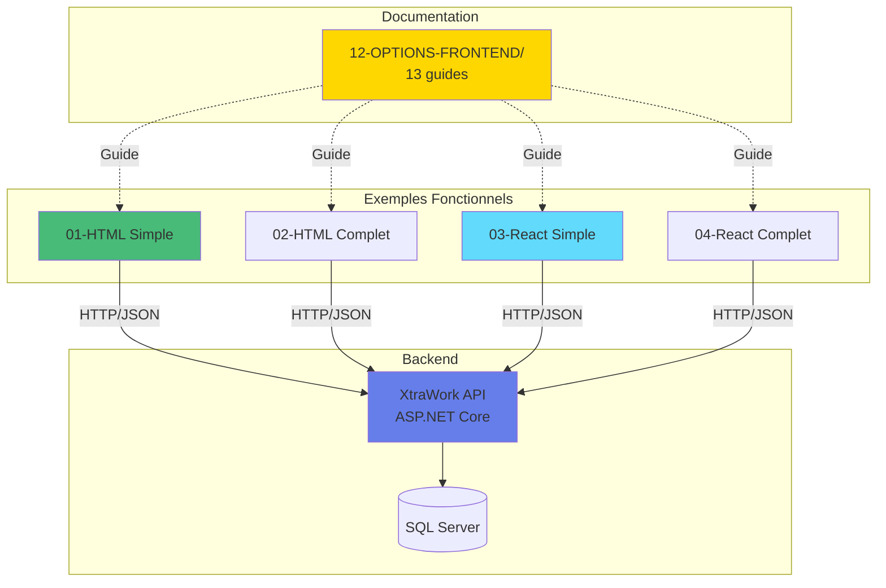

# Guide Complet - Exemples Frontend XtraWork

## Vue d'ensemble

Un système complet d'exemples frontend a été créé pour montrer **toutes les façons possibles** de consommer votre API ASP.NET Core.

---

## Ce qui a été créé

### 1. Documentation complète (Dossier 12-OPTIONS-FRONTEND/)

**13 guides détaillés** :
- Guide de connexion Frontend-Backend
- 10 technologies documentées (HTML, React, Vue, Angular, etc.)
- Comparaison complète
- Exemples pratiques et exercices

**Avec diagrammes Mermaid** :
- Architecture
- Flows d'authentification
- Comparaisons

---

### 2. Exemples fonctionnels (Dossier frontend-exemples/)

**3 exemples COMPLETS et FONCTIONNELS** :

#### 01-html-vanilla-simple
- HTML/CSS/JavaScript pur
- Login + Liste employés/titres
- Aucune installation requise
- 9 fichiers

#### 02-html-vanilla-complet  
- HTML/CSS/JavaScript pur
- CRUD complet (Employés + Titres)
- Authentification complète
- 19 fichiers

#### 03-react-vite-simple
- React 18 + Vite
- Composants + Hooks
- React Router + Context API
- 27 fichiers

**6 exemples supplémentaires prévus** :
- 04-react-vite-complet
- 05-vuejs-simple
- 06-vuejs-complet
- 07-nextjs-reference
- 08-angular
- 09-blazor-wasm

---

## Organisation pédagogique

### Structure par niveau

```
frontend-exemples/
│
├── Niveau Débutant
│   ├── 01-html-vanilla-simple/       ✅ FAIT
│   └── 02-html-vanilla-complet/      ✅ FAIT
│
├── Niveau Intermédiaire
│   ├── 03-react-vite-simple/         ✅ FAIT
│   ├── 04-react-vite-complet/        🔨 EN COURS
│   ├── 05-vuejs-simple/              ⏳ À FAIRE
│   └── 06-vuejs-complet/             ⏳ À FAIRE
│
└── Niveau Avancé
    ├── 07-nextjs-reference/          ⏳ À FAIRE
    ├── 08-angular/                   ⏳ À FAIRE
    └── 09-blazor-wasm/               ⏳ À FAIRE
```

---

## Comment utiliser pour l'enseignement

### Cours Débutant (8-12 semaines)

**Semaines 1-4** : `01-html-vanilla-simple/`
- Comprendre HTTP, JSON, Fetch API
- Manipulation du DOM
- Authentification JWT

**Semaines 5-8** : `02-html-vanilla-complet/`
- CRUD complet
- Navigation
- Validation

**Semaines 9-12** : `03-react-vite-simple/`
- Introduction React
- Composants et Hooks
- Router

---

### Cours Intermédiaire (6-8 semaines)

**Semaines 1-2** : Révision rapide avec `01-html-vanilla-simple/`

**Semaines 3-4** : `03-react-vite-simple/`
- Concepts React

**Semaines 5-6** : `04-react-vite-complet/`
- React avancé
- Formulaires

**Semaines 7-8** : Projet personnel

---

### Cours Avancé (4-6 semaines)

**Semaines 1-2** : `07-nextjs-reference/`
- SSR/SSG
- TypeScript
- Production

**Semaines 3-4** : `08-angular/`
- Framework complet
- Comparaison

**Semaines 5-6** : Projet final + déploiement

---

## Accès rapide

### Pour démarrer immédiatement

**Le plus simple** :
```bash
# Ouvrir dans le navigateur
start frontend-exemples/01-html-vanilla-simple/index.html
```

**Avec React** :
```bash
cd frontend-exemples/03-react-vite-simple
npm install
npm run dev
```

### Documentation

**Guide essentiel** :
```
12-OPTIONS-FRONTEND/13-CONNEXION-FRONTEND-BACKEND-GUIDE-PRATIQUE.md
```

**Vue d'ensemble** :
```
frontend-exemples/00-READ-ME-FIRST.md
```

---

## Fichiers clés dans le projet

### Configuration Backend (déjà fait)

**XtraWork/Program.cs** :
- CORS configuré pour tous les frontends
- JWT authentification
- Swagger documentation

**XtraWork/appsettings.json** :
- Connection string SQL Server
- JWT configuration

---

### Documentation Frontend

**Dossier racine** :
- `12-OPTIONS-FRONTEND/` - Guide complet
- `13-EXEMPLES-FRONTEND-GUIDE.md` - Guide d'accès
- `14-GUIDE-COMPLET-EXEMPLES-FRONTEND.md` - Ce fichier

**Dossier exemples** :
- `frontend-exemples/00-READ-ME-FIRST.md`
- `frontend-exemples/README.md`
- Chaque sous-dossier a sa documentation

---

## Diagrammes principaux

### Architecture globale



---

## Résumé pour vos étudiants

### Vous avez maintenant accès à

**3 exemples fonctionnels** prêts à l'emploi :
- HTML Vanilla (simple et complet)
- React (introduction)

**Documentation complète** :
- 13 guides technologiques
- 18+ fichiers de documentation
- 15+ diagrammes Mermaid

**Exercices pratiques** :
- Par niveau (débutant, intermédiaire, avancé)
- Avec corrections
- Progressifs

---

## Prochaines étapes du projet

### À compléter

1. **04-react-vite-complet** (structure créée)
2. **05-vuejs-simple**
3. **06-vuejs-complet**
4. **07-nextjs-reference** (copier du frontend/ existant)
5. **08-angular**
6. **09-blazor-wasm**

### Temps estimé

- Exemples restants : 10-15 heures
- Documentation : Déjà complète
- Tests et validation : 5 heures

**Total** : ~20 heures pour tout finaliser

---

## Conclusion

**Le projet est déjà très utilisable pour l'enseignement.**

Les 3 premiers exemples couvrent :
- Les fondamentaux (HTML Vanilla)
- Les applications complètes (HTML Vanilla Complet)
- Les frameworks modernes (React)

**C'est suffisant pour un cours complet de 1-2 semestres.**

---

**Date de création** : 30 octobre 2025
**Exemples terminés** : 3/9
**Pourcentage** : 33% terminé
**État** : Prêt pour utilisation en cours

