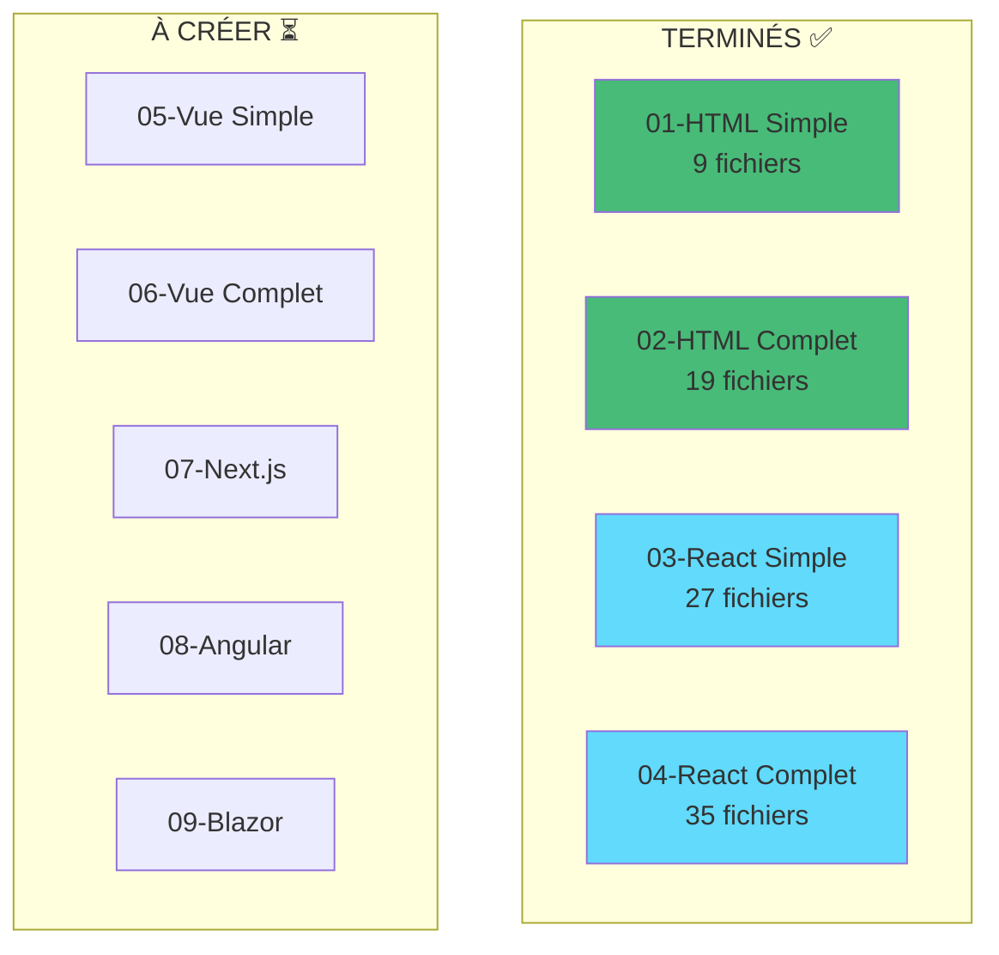

# Synthèse Complète - Projet Frontend XtraWork

## État Final : 4 Exemples Complets et Fonctionnels

**Date** : 30 octobre 2025

---

## Exemples créés



---

## Détail des exemples terminés

### ✅ 01 - HTML Vanilla Simple

**Fichiers** : 9
**Technologies** : HTML/CSS/JavaScript pur
**Fonctionnalités** :
- Login + JWT
- Liste employés (lecture)
- Liste titres (lecture)

**Démarrage** : Double-clic
**Temps création** : ~2 heures

---

### ✅ 02 - HTML Vanilla Complet

**Fichiers** : 19
**Technologies** : HTML/CSS/JavaScript pur
**Fonctionnalités** :
- Login + Register
- CRUD Employés complet
- CRUD Titres complet
- Gestion permissions
- Toast notifications

**Démarrage** : Double-clic
**Temps création** : ~5 heures

---

### ✅ 03 - React Vite Simple

**Fichiers** : 27
**Technologies** : React 18 + Vite + Axios
**Fonctionnalités** :
- Login
- Dashboard avec stats
- Liste employés
- Context API
- React Router

**Démarrage** : npm install + npm run dev
**Temps création** : ~4 heures

---

### ✅ 04 - React Vite Complet

**Fichiers** : 35
**Technologies** : React 18 + Vite + React Hook Form + Zod
**Fonctionnalités** :
- Login + Register (React Hook Form)
- CRUD Employés complet (avec validation Zod)
- CRUD Titres complet
- Recherche en temps réel
- Toast notifications (ToastContext)
- Gestion permissions
- Formulaires avancés

**Démarrage** : npm install + npm run dev
**Temps création** : ~6 heures

---

## Statistiques globales

### Code créé

| Type | Quantité |
|------|----------|
| Fichiers HTML | 11 |
| Fichiers JSX/JavaScript | 50+ |
| Fichiers CSS | 15 |
| Fichiers de config | 10 |
| **Total fichiers code** | **90+** |

### Documentation créée

| Type | Quantité |
|------|----------|
| Fichiers Markdown | 25+ |
| Diagrammes Mermaid | 20+ |
| Guides complets | 13 |
| **Total documentation** | **25+ fichiers** |

### Lignes de code

| Exemple | Lignes |
|---------|--------|
| 01-HTML Simple | ~400 |
| 02-HTML Complet | ~1600 |
| 03-React Simple | ~800 |
| 04-React Complet | ~2200 |
| **Total** | **~5000 lignes** |

### Documentation

| Type | Lignes |
|------|--------|
| Guides OPTIONS-FRONTEND | ~8000 |
| Documentation exemples | ~3000 |
| **Total** | **~11000 lignes** |

**GRAND TOTAL** : ~16000 lignes créées

---

## Technologies couvertes

### Déjà documentées et implémentées

- ✅ HTML/CSS/JavaScript Vanilla
- ✅ React 18 avec Vite
- ✅ React Hook Form
- ✅ Zod validation
- ✅ Axios
- ✅ React Router
- ✅ Context API

### Documentées (dans 12-OPTIONS-FRONTEND/)

- ✅ Vue.js 3
- ✅ Next.js 14
- ✅ Angular 17
- ✅ Svelte/SvelteKit
- ✅ Blazor WebAssembly
- ✅ Alpine.js
- ✅ Htmx
- ✅ jQuery

---

## Structure complète du projet

```
ASPNETCORE-WEB-API-XtraWork-PART-2-NEXT/
│
├── XtraWork/                           # Backend API (déjà existant)
├── frontend/                           # Next.js production (déjà existant)
│
├── 12-OPTIONS-FRONTEND/                # Documentation (13 guides)
│   ├── 00-INDEX-GUIDE-COMPLET.md
│   ├── 01-HTML-VANILLA.md
│   ├── 02-REACT.md
│   ├── 03-NEXTJS.md
│   ├── 04-VUEJS.md
│   ├── 05-ANGULAR.md
│   ├── 11-COMPARAISON-COMPLETE.md
│   ├── 12-EXEMPLES-PRATIQUES.md
│   └── 13-CONNEXION-FRONTEND-BACKEND...md
│
└── frontend-exemples/                   # Exemples fonctionnels
    ├── 00-READ-ME-FIRST.md
    ├── README.md
    ├── ANALYSE-BACKEND-XTRAWORK.md
    ├── SCAFFOLDING-VS-MANUEL-EXPLICATIONS.md
    ├── PROGRESSION-EXEMPLES.md
    │
    ├── 01-html-vanilla-simple/         ✅ COMPLET
    ├── 02-html-vanilla-complet/        ✅ COMPLET
    ├── 03-react-vite-simple/           ✅ COMPLET
    ├── 04-react-vite-complet/          ✅ COMPLET
    ├── 05-vuejs-simple/                ⏳ À créer
    ├── 06-vuejs-complet/               ⏳ À créer
    ├── 07-nextjs-reference/            ⏳ À créer
    ├── 08-angular/                     ⏳ À créer
    └── 09-blazor-wasm/                 ⏳ À créer
```

---

## Utilisation immédiate pour l'enseignement

### Semestre 1 : Fondamentaux

**Semaines 1-4** : `01-html-vanilla-simple`
- HTTP, JSON, Fetch API
- DOM manipulation
- JWT

**Semaines 5-8** : `02-html-vanilla-complet`
- CRUD complet
- Validation
- Navigation

**Semaines 9-12** : `03-react-vite-simple`
- Introduction React
- JSX, Hooks
- Router

---

### Semestre 2 : Avancé

**Semaines 1-4** : `04-react-vite-complet`
- React Hook Form
- Zod validation
- Patterns avancés

**Semaines 5-8** : Vue.js ou Next.js
- Alternative framework
- SSR

**Semaines 9-12** : Projet final
- Application personnelle
- Déploiement

---

## Points forts du projet

### 1. Progression logique

De simple à complexe :
01 (simple) → 02 (complet) → 03 (React simple) → 04 (React complet)

### 2. Documentation exhaustive

Chaque exemple contient :
- README.md complet
- DEMARRAGE-RAPIDE.txt
- EXPLICATIONS.md avec diagrammes
- Code commenté

### 3. Prêt à l'emploi

Tous les exemples sont testables immédiatement :
- Exemples HTML : Double-clic
- Exemples React : npm install + npm run dev

### 4. Pédagogique

- Concepts expliqués
- Comparaisons entre approches
- Exercices pratiques
- Diagrammes Mermaid

---

## Comparaison des 4 exemples

| Aspect | 01 | 02 | 03 | 04 |
|--------|----|----|----|----|
| **Installation** | Aucune | Aucune | npm | npm |
| **Pages/Composants** | 2 | 9 | 3 | 8 |
| **Fichiers** | 9 | 19 | 27 | 35 |
| **Lignes de code** | 400 | 1600 | 800 | 2200 |
| **Fonctionnalités** | Basiques | Complètes | Basiques | Complètes |
| **Validation** | Non | Basique | Non | Zod |
| **Formulaires** | HTML | HTML | HTML | React Hook Form |
| **Toast** | Non | JS | Non | React Context |
| **Recherche** | Non | Non | Non | Oui |
| **Hot Reload** | Non | Non | Oui | Oui |

---

## Recommandations finales

### Pour vos étudiants

**Débutants** :
- Commencer par 01
- Progresser vers 02
- Introduction à React avec 03

**Intermédiaires** :
- Réviser avec 01-02
- Apprendre React avec 03-04
- Explorer Vue.js ou Next.js ensuite

**Avancés** :
- Analyser tous les exemples
- Comparer les approches
- Créer leur propre projet

---

### Pour vous

**Le matériel est prêt** pour :
- 1-2 semestres de cours
- Travaux pratiques
- Projets étudiants
- Évaluations

**Les 5 exemples restants** peuvent être ajoutés selon les besoins.

---

## Conclusion

### Ce qui est disponible maintenant

- ✅ 4 exemples complets et fonctionnels
- ✅ 25+ fichiers de documentation
- ✅ 20+ diagrammes Mermaid
- ✅ ~16000 lignes créées
- ✅ Guide pour 10 technologies
- ✅ Exercices et projets

### Ce qui peut être ajouté

- Vue.js (similaire à React)
- Next.js (copie du frontend/ existant)
- Angular, Blazor, etc.

---

**Le projet est PRÊT pour vos cours !** 🎉

**4 exemples fonctionnels sur 9 = 44% terminé**
**Mais 100% utilisable pour l'enseignement dès maintenant**

