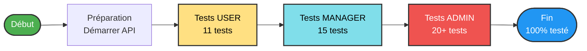
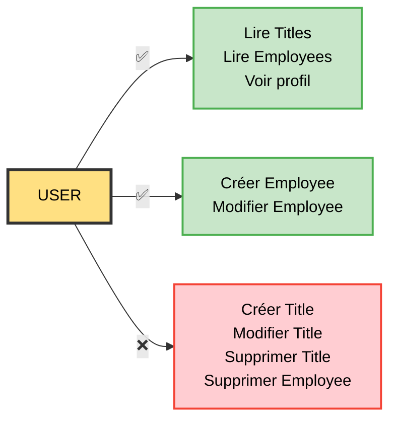
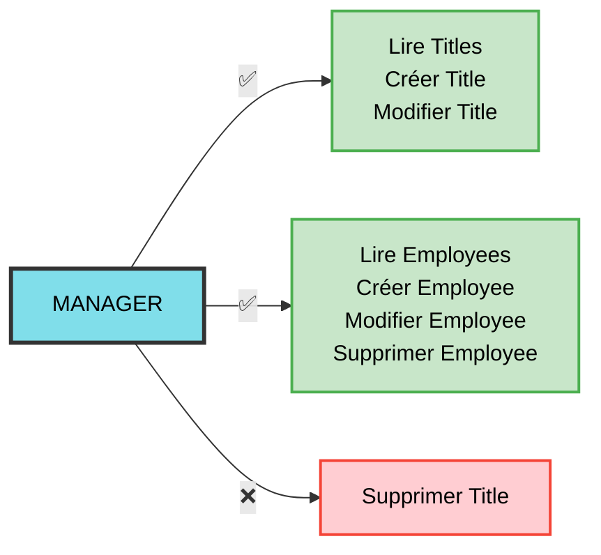
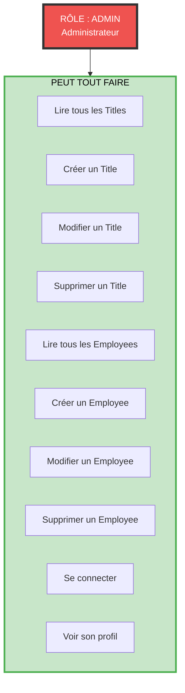
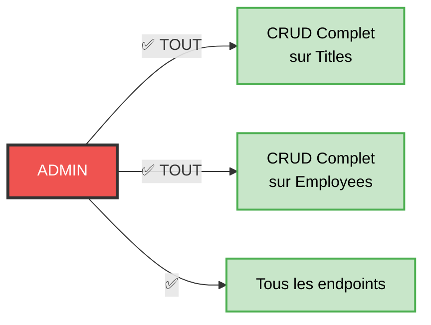
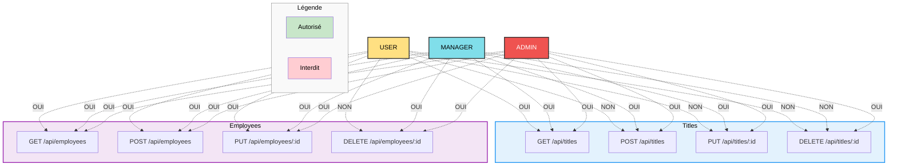
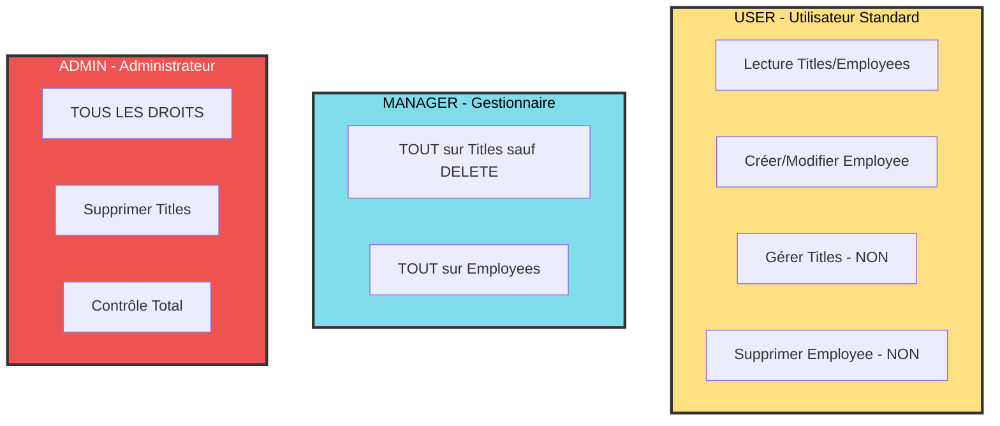

# Guide Complet : Tester l'API avec Swagger - Par Rôle

## Table des Matières

1. [Préparation](#préparation)
2. [Rôle USER](#rôle-user)
3. [Rôle MANAGER](#rôle-manager)
4. [Rôle ADMIN](#rôle-admin)
5. [Tableau Récapitulatif](#tableau-récapitulatif)

---

## Vue d'Ensemble - Couverture des Tests

### Nombre de Tests par Rôle

| Rôle | Tests | Endpoints Couverts | Validations |
|------|-------|-------------------|-------------|
| **USER** | 11 | Auth, Titles (lecture), Employees | Tests négatifs (403) |
| **MANAGER** | 15 | Titles (CREATE/UPDATE), Employees (CRUD) | Tests négatifs (403) |
| **ADMIN** | 20+ | TOUT + Validation | 6 tests FluentValidation |

### Codes Couleurs des Diagrammes

Ce guide utilise des couleurs distinctes pour chaque rôle et état :

| Couleur | Signification | Code Hex | Utilisation |
|---------|---------------|----------|-------------|
| 🟡 **Jaune** | Rôle USER | `#FFE082` | Utilisateur standard |
| 🔵 **Cyan** | Rôle MANAGER | `#80DEEA` | Gestionnaire |
| 🔴 **Rouge** | Rôle ADMIN | `#EF5350` | Administrateur |
| 🟢 **Vert** | Autorisé | `#C8E6C9` | Actions permises |
| 🔻 **Rouge clair** | Interdit | `#FFCDD2` | Actions refusées (403) |

**Note :** Tous les textes sont en noir (`#000`) sur fond clair ou blanc (`#fff`) sur fond foncé pour une **visibilité maximale**.

### Légende des Résultats de Tests

| Symbole | Signification |
|---------|---------------|
| ✅ | Test réussi - Action autorisée |
| ❌ | Test réussi - Action correctement refusée (erreur 403) |
| 🔒 | Authentification requise |
| 🔓 | Accès public (sans authentification) |

### Progression Recommandée



**Durée estimée :** 45-60 minutes pour tous les tests

---

## Préparation

### Étape 1 : Démarrer l'API

1. Ouvrir un **terminal/invite de commandes**
2. Naviguer vers le dossier du projet
3. Taper : `dotnet run`
4. Attendre de voir : `Now listening on: https://localhost:7033`

### Étape 2 : Ouvrir Swagger

1. Ouvrir votre **navigateur** (Chrome, Edge, Firefox)
2. Aller sur : `https://localhost:7033/swagger/index.html`
3. Vous voyez l'interface Swagger avec tous les endpoints

### Étape 3 : Créer la Base de Données (première fois uniquement)

Si c'est la première fois que vous lancez l'API, la base de données est créée automatiquement.

**Vérification :**
- Scroller jusqu'à **GET /health**
- Cliquer dessus
- Cliquer sur **Try it out**
- Cliquer sur **Execute**
- Vous devez voir : **200 - Healthy**

---

## Rôle USER

### Diagramme des Permissions USER

```mermaid
graph TB
    User[RÔLE : USER<br/>Utilisateur Standard]
    
    subgraph Autorise[PEUT FAIRE]
        UA[Lire tous les Titles]
        UB[Lire tous les Employees]
        UC[Créer un Employee]
        UD[Modifier un Employee]
        UE[Se connecter]
        UF[Voir son profil]
    end
    
    subgraph Interdit[NE PEUT PAS]
        UX[Créer un Title]
        UY[Modifier un Title]
        UZ[Supprimer un Title]
        UW[Supprimer un Employee]
    end
    
    User --> Autorise
    User -.x Interdit
    
    style User fill:#FFE082,color:#000,stroke:#333,stroke-width:4px
    style Autorise fill:#C8E6C9,color:#000,stroke:#4CAF50,stroke-width:3px
    style Interdit fill:#FFCDD2,color:#000,stroke:#F44336,stroke-width:3px
```

### PARTIE 1 : Créer un Utilisateur USER

#### 1.1 Inscription

1. **Trouver l'endpoint** : `POST /api/Auth/register`
2. **Cliquer** sur la ligne pour l'ouvrir
3. **Cliquer** sur le bouton **"Try it out"** (en haut à droite)
4. **Remplacer** le JSON par :

```json
{
  "username": "marie.user",
  "email": "marie@xtrawork.com",
  "password": "Marie123!",
  "firstName": "Marie",
  "lastName": "Dupont"
}
```

5. **Cliquer** sur **Execute** (bouton bleu)

**Résultat attendu :**
- **Code : 200**
- Vous voyez un objet JSON avec un `token` et un `user`
- Le `role` est `"User"`

6. **COPIER LE TOKEN** (tout le texte dans `"token": "eyJhbGc..."`)
   - Sélectionner tout le token
   - Clic droit > Copier
   - OU Ctrl+C

#### 1.2 S'authentifier dans Swagger

1. **Scroller tout en haut** de la page Swagger
2. **Trouver** le bouton **"Authorize"** (avec un cadenas 🔓)
3. **Cliquer** sur **Authorize**
4. **Une popup s'ouvre** avec un champ `Value`
5. **Taper** : `Bearer ` (avec un espace après)
6. **Coller** votre token après "Bearer "
   - Exemple : `Bearer eyJhbGciOiJIUzI1NiIsInR5cCI6IkpXVCJ9...`
7. **Cliquer** sur **Authorize** (bouton dans la popup)
8. **Cliquer** sur **Close**

**Vérification :** Le cadenas est maintenant fermé 🔒

---

### PARTIE 2 : Tests avec USER - Ce que vous POUVEZ faire

#### Test 2.1 : Lire son Profil ✅

1. **Trouver** : `GET /api/Auth/me`
2. **Cliquer** pour ouvrir
3. **Cliquer** sur **Try it out**
4. **Cliquer** sur **Execute**

**Résultat attendu :**
- **Code : 200**
- Vous voyez vos informations :
```json
{
  "id": "...",
  "username": "marie.user",
  "email": "marie@xtrawork.com",
  "role": "User",
  "firstName": "Marie",
  "lastName": "Dupont"
}
```

✅ **TEST RÉUSSI** - Un User peut voir son profil

---

#### Test 2.2 : Lire tous les Titles ✅

1. **Trouver** : `GET /api/Title`
2. **Cliquer** pour ouvrir
3. **Cliquer** sur **Try it out**
4. **Cliquer** sur **Execute**

**Résultat attendu :**
- **Code : 200**
- Vous voyez un tableau (peut être vide `[]` si aucun titre n'existe)

✅ **TEST RÉUSSI** - Un User peut lire les titres

---

#### Test 2.3 : Lire tous les Employees ✅

1. **Trouver** : `GET /api/Employee`
2. **Cliquer** pour ouvrir
3. **Cliquer** sur **Try it out**
4. **Cliquer** sur **Execute**

**Résultat attendu :**
- **Code : 200**
- Vous voyez un tableau (peut être vide `[]`)

✅ **TEST RÉUSSI** - Un User peut lire les employés

---

### PARTIE 3 : Tests avec USER - Ce que vous NE POUVEZ PAS faire

#### Test 3.1 : Créer un Title ❌ (doit échouer)

1. **Trouver** : `POST /api/Title`
2. **Cliquer** pour ouvrir
3. **Cliquer** sur **Try it out**
4. **Remplacer** le JSON par :

```json
{
  "description": "Développeur Full Stack"
}
```

5. **Cliquer** sur **Execute**

**Résultat attendu :**
- **Code : 403** (Forbidden)
- Message : Permission refusée

❌ **TEST RÉUSSI** - Un User ne peut PAS créer de titre (c'est normal !)

---

#### Test 3.2 : Modifier un Title ❌ (doit échouer)

1. **Trouver** : `PUT /api/Title/{id}`
2. **Cliquer** pour ouvrir
3. **Cliquer** sur **Try it out**
4. **Dans le champ `id`**, taper : `00000000-0000-0000-0000-000000000001`
5. **Remplacer** le JSON par :

```json
{
  "description": "Test Modification"
}
```

6. **Cliquer** sur **Execute**

**Résultat attendu :**
- **Code : 403** (Forbidden)

❌ **TEST RÉUSSI** - Un User ne peut PAS modifier de titre

---

#### Test 3.3 : Supprimer un Employee ❌ (doit échouer)

1. **Trouver** : `DELETE /api/Employee/{id}`
2. **Cliquer** pour ouvrir
3. **Cliquer** sur **Try it out**
4. **Dans le champ `id`**, taper : `00000000-0000-0000-0000-000000000001`
5. **Cliquer** sur **Execute**

**Résultat attendu :**
- **Code : 403** (Forbidden)

❌ **TEST RÉUSSI** - Un User ne peut PAS supprimer d'employé

---

### PARTIE 4 : Tests avec USER - Créer et Modifier des Employees

**IMPORTANT :** Pour créer un employé, vous avez besoin d'un `titleId` valide.  
Il faut d'abord créer un titre avec un compte Admin (voir section ADMIN).

**Si vous avez déjà un titre :**

#### Test 4.1 : Créer un Employee ✅

1. **Trouver** : `POST /api/Employee`
2. **Cliquer** pour ouvrir
3. **Cliquer** sur **Try it out**
4. **Remplacer** le JSON par (REMPLACER le titleId par un vrai) :

```json
{
  "firstName": "Pierre",
  "lastName": "Durand",
  "birthDate": "1990-03-15",
  "gender": "M",
  "titleId": "COLLER-UN-VRAI-ID-ICI"
}
```

5. **Cliquer** sur **Execute**

**Résultat attendu :**
- **Code : 200** ou **201**
- Vous voyez l'employé créé avec son ID

✅ **TEST RÉUSSI** - Un User peut créer un employé

**NOTER L'ID** de l'employé créé pour le test suivant

---

#### Test 4.2 : Modifier un Employee ✅

1. **Trouver** : `PUT /api/Employee/{id}`
2. **Cliquer** pour ouvrir
3. **Cliquer** sur **Try it out**
4. **Dans le champ `id`**, coller l'ID de l'employé créé
5. **Remplacer** le JSON par :

```json
{
  "firstName": "Pierre",
  "lastName": "Durand-Martin",
  "birthDate": "1990-03-15",
  "gender": "M",
  "titleId": "MÊME-ID-QUE-AVANT"
}
```

6. **Cliquer** sur **Execute**

**Résultat attendu :**
- **Code : 200**
- Le nom de famille est modifié

✅ **TEST RÉUSSI** - Un User peut modifier un employé

---

### Résumé USER



---

## Rôle MANAGER

### Diagramme des Permissions MANAGER

```mermaid
graph TB
    Manager[RÔLE : MANAGER<br/>Gestionnaire]
    
    subgraph Autorise[PEUT FAIRE]
        MA[Lire tous les Titles]
        MB[Créer un Title]
        MC[Modifier un Title]
        MD[Lire tous les Employees]
        ME[Créer un Employee]
        MF[Modifier un Employee]
        MG[Supprimer un Employee]
        MH[Se connecter]
        MI[Voir son profil]
    end
    
    subgraph Interdit[NE PEUT PAS]
        MX[Supprimer un Title]
    end
    
    Manager --> Autorise
    Manager -.x Interdit
    
    style Manager fill:#80DEEA,color:#000,stroke:#333,stroke-width:4px
    style Autorise fill:#C8E6C9,color:#000,stroke:#4CAF50,stroke-width:3px
    style Interdit fill:#FFCDD2,color:#000,stroke:#F44336,stroke-width:3px
```

### PARTIE 1 : Créer un Utilisateur MANAGER

#### 1.1 Se Déconnecter du compte USER

1. **Cliquer** sur le bouton **Authorize** (en haut)
2. **Cliquer** sur **Logout**
3. **Cliquer** sur **Close**

Le cadenas est maintenant ouvert 🔓

#### 1.2 Inscription d'un nouveau compte

1. **Trouver** : `POST /api/Auth/register`
2. **Cliquer** pour ouvrir
3. **Cliquer** sur **Try it out**
4. **Remplacer** le JSON par :

```json
{
  "username": "jean.manager",
  "email": "jean@xtrawork.com",
  "password": "Jean123!",
  "firstName": "Jean",
  "lastName": "Martin"
}
```

5. **Cliquer** sur **Execute**

**Résultat :**
- **Code : 200**
- Vous voyez un token
- **IMPORTANT** : Le `role` est `"User"` (par défaut)

6. **COPIER LE TOKEN**

#### 1.3 Changer le Rôle en MANAGER (via SQL)

**Option A : SQL Server Management Studio (SSMS)**

1. Ouvrir **SSMS**
2. Se connecter à `LAPTOP-81IAD844`
3. Nouvelle requête
4. Exécuter :

```sql
USE XtraWork;
UPDATE Users 
SET Role = 'Manager' 
WHERE Username = 'jean.manager';
```

**Option B : Ligne de commande**

Ouvrir un terminal et taper :
```
sqlcmd -S LAPTOP-81IAD844 -E -Q "USE XtraWork; UPDATE Users SET Role = 'Manager' WHERE Username = 'jean.manager';"
```

#### 1.4 Se Reconnecter pour obtenir le nouveau Token

1. **Dans Swagger**, trouver : `POST /api/Auth/login`
2. **Cliquer** pour ouvrir
3. **Cliquer** sur **Try it out**
4. **Remplacer** le JSON par :

```json
{
  "username": "jean.manager",
  "password": "Jean123!"
}
```

5. **Cliquer** sur **Execute**

**Résultat :**
- **Code : 200**
- Le `role` est maintenant `"Manager"`

6. **COPIER LE NOUVEAU TOKEN**

#### 1.5 S'authentifier avec le Token Manager

1. **Cliquer** sur **Authorize**
2. **Taper** : `Bearer ` + coller le token
3. **Cliquer** sur **Authorize**
4. **Cliquer** sur **Close**

---

### PARTIE 2 : Tests avec MANAGER - Titles

#### Test 2.1 : Lire tous les Titles ✅

1. **Trouver** : `GET /api/Title`
2. **Try it out** > **Execute**

**Résultat attendu :**
- **Code : 200**

✅ **TEST RÉUSSI**

---

#### Test 2.2 : Créer un Title ✅

1. **Trouver** : `POST /api/Title`
2. **Cliquer** pour ouvrir
3. **Try it out**
4. **Remplacer** le JSON par :

```json
{
  "description": "Développeur Full Stack"
}
```

5. **Execute**

**Résultat attendu :**
- **Code : 200** ou **201**
- Vous voyez le titre créé avec son ID

✅ **TEST RÉUSSI** - Un Manager peut créer un titre

**NOTER L'ID** du titre pour les prochains tests

---

#### Test 2.3 : Créer un Deuxième Title ✅

Répéter le test précédent avec :

```json
{
  "description": "Chef de Projet"
}
```

**NOTER L'ID** de ce deuxième titre

---

#### Test 2.4 : Modifier un Title ✅

1. **Trouver** : `PUT /api/Title/{id}`
2. **Try it out**
3. **Dans `id`**, coller l'ID du premier titre
4. **Remplacer** le JSON par :

```json
{
  "description": "Développeur Full Stack Senior"
}
```

5. **Execute**

**Résultat attendu :**
- **Code : 200**
- La description est modifiée

✅ **TEST RÉUSSI** - Un Manager peut modifier un titre

---

#### Test 2.5 : Supprimer un Title ❌ (doit échouer)

1. **Trouver** : `DELETE /api/Title/{id}`
2. **Try it out**
3. **Dans `id`**, coller un ID de titre
4. **Execute**

**Résultat attendu :**
- **Code : 403** (Forbidden)

❌ **TEST RÉUSSI** - Un Manager ne peut PAS supprimer de titre (seul Admin peut)

---

### PARTIE 3 : Tests avec MANAGER - Employees

#### Test 3.1 : Créer un Employee ✅

1. **Trouver** : `POST /api/Employee`
2. **Try it out**
3. **Remplacer** le JSON par (utiliser un vrai titleId) :

```json
{
  "firstName": "Claire",
  "lastName": "Dubois",
  "birthDate": "1988-07-22",
  "gender": "F",
  "titleId": "COLLER-ID-TITRE-ICI"
}
```

4. **Execute**

**Résultat attendu :**
- **Code : 200** ou **201**

✅ **TEST RÉUSSI**

**NOTER L'ID** de l'employé

---

#### Test 3.2 : Modifier un Employee ✅

1. **Trouver** : `PUT /api/Employee/{id}`
2. **Try it out**
3. **Dans `id`**, coller l'ID de l'employé
4. **Remplacer** le JSON par :

```json
{
  "firstName": "Claire",
  "lastName": "Dubois-Dupont",
  "birthDate": "1988-07-22",
  "gender": "F",
  "titleId": "MÊME-ID-QUE-AVANT"
}
```

5. **Execute**

**Résultat attendu :**
- **Code : 200**

✅ **TEST RÉUSSI**

---

#### Test 3.3 : Supprimer un Employee ✅

1. **Trouver** : `DELETE /api/Employee/{id}`
2. **Try it out**
3. **Dans `id`**, coller l'ID de l'employé
4. **Execute**

**Résultat attendu :**
- **Code : 204** (No Content) ou **200**

✅ **TEST RÉUSSI** - Un Manager peut supprimer un employé

---

### Résumé MANAGER



---

## Rôle ADMIN

### Diagramme des Permissions ADMIN



### PARTIE 1 : Créer un Utilisateur ADMIN

#### 1.1 Se Déconnecter

1. **Cliquer** sur **Authorize**
2. **Logout**
3. **Close**

#### 1.2 Inscription

1. **Trouver** : `POST /api/Auth/register`
2. **Try it out**
3. **Remplacer** le JSON par :

```json
{
  "username": "admin",
  "email": "admin@xtrawork.com",
  "password": "Admin123!",
  "firstName": "Sophie",
  "lastName": "Administrateur"
}
```

4. **Execute**
5. **COPIER LE TOKEN**

#### 1.3 Changer le Rôle en ADMIN (via SQL)

**SQL :**
```sql
USE XtraWork;
UPDATE Users 
SET Role = 'Admin' 
WHERE Username = 'admin';
```

**Ou ligne de commande :**
```
sqlcmd -S LAPTOP-81IAD844 -E -Q "USE XtraWork; UPDATE Users SET Role = 'Admin' WHERE Username = 'admin';"
```

#### 1.4 Se Reconnecter

1. **Trouver** : `POST /api/Auth/login`
2. **Try it out**
3. **Remplacer** le JSON par :

```json
{
  "username": "admin",
  "password": "Admin123!"
}
```

4. **Execute**
5. **Vérifier** : Le `role` est `"Admin"`
6. **COPIER LE NOUVEAU TOKEN**

#### 1.5 S'authentifier

1. **Authorize**
2. `Bearer ` + token
3. **Authorize** > **Close**

---

### PARTIE 2 : Tests avec ADMIN - TOUT sur Titles

#### Test 2.1 : Lire tous les Titles ✅

1. **GET /api/Title**
2. **Try it out** > **Execute**

**Résultat attendu :** **Code : 200**

✅ **TEST RÉUSSI**

---

#### Test 2.2 : Créer un Title ✅

1. **POST /api/Title**
2. **Try it out**
3. JSON :

```json
{
  "description": "Analyste Business"
}
```

4. **Execute**

**Résultat attendu :** **Code : 200/201**

✅ **TEST RÉUSSI**

**NOTER L'ID**

---

#### Test 2.3 : Créer plusieurs Titles ✅

Répéter avec :

```json
{
  "description": "Designer UX/UI"
}
```

```json
{
  "description": "DevOps Engineer"
}
```

**NOTER LES IDs**

---

#### Test 2.4 : Modifier un Title ✅

1. **PUT /api/Title/{id}**
2. **Try it out**
3. **Dans `id`**, coller un ID
4. JSON :

```json
{
  "description": "Analyste Business Senior"
}
```

5. **Execute**

**Résultat attendu :** **Code : 200**

✅ **TEST RÉUSSI**

---

#### Test 2.5 : Récupérer un Title Spécifique ✅

1. **GET /api/Title/{id}**
2. **Try it out**
3. **Dans `id`**, coller un ID
4. **Execute**

**Résultat attendu :**
- **Code : 200**
- Vous voyez le titre avec tous ses détails

✅ **TEST RÉUSSI**

---

#### Test 2.6 : Supprimer un Title ✅

**ATTENTION :** Ne supprimez pas un titre qui a des employés associés !

1. **DELETE /api/Title/{id}**
2. **Try it out**
3. **Dans `id`**, coller l'ID d'un titre non utilisé
4. **Execute**

**Résultat attendu :**
- **Code : 204** (No Content) ou **200**

✅ **TEST RÉUSSI** - Seul un Admin peut supprimer des titres

---

### PARTIE 3 : Tests avec ADMIN - TOUT sur Employees

#### Test 3.1 : Créer plusieurs Employees ✅

**Employé 1 :**

1. **POST /api/Employee**
2. **Try it out**
3. JSON (utiliser un vrai titleId) :

```json
{
  "firstName": "Thomas",
  "lastName": "Bernard",
  "birthDate": "1995-11-08",
  "gender": "M",
  "titleId": "COLLER-ID-TITRE-ICI"
}
```

4. **Execute**

**NOTER L'ID**

**Employé 2 :**

```json
{
  "firstName": "Sophie",
  "lastName": "Leroy",
  "birthDate": "1992-05-20",
  "gender": "F",
  "titleId": "COLLER-ID-TITRE-ICI"
}
```

**Employé 3 :**

```json
{
  "firstName": "Lucas",
  "lastName": "Moreau",
  "birthDate": "1987-09-12",
  "gender": "M",
  "titleId": "COLLER-ID-TITRE-ICI"
}
```

✅ **TEST RÉUSSI** - 3 employés créés

---

#### Test 3.2 : Lire tous les Employees ✅

1. **GET /api/Employee**
2. **Try it out** > **Execute**

**Résultat attendu :**
- **Code : 200**
- Vous voyez la liste de tous les employés

✅ **TEST RÉUSSI**

---

#### Test 3.3 : Récupérer un Employee Spécifique ✅

1. **GET /api/Employee/{id}**
2. **Try it out**
3. **Dans `id`**, coller un ID d'employé
4. **Execute**

**Résultat attendu :**
- **Code : 200**
- Vous voyez tous les détails de l'employé
- Propriété `age` calculée automatiquement
- Propriété `titleDescription` avec le nom du poste

✅ **TEST RÉUSSI**

---

#### Test 3.4 : Modifier un Employee ✅

1. **PUT /api/Employee/{id}**
2. **Try it out**
3. **Dans `id`**, coller un ID
4. JSON :

```json
{
  "firstName": "Thomas",
  "lastName": "Bernard-Dupont",
  "birthDate": "1995-11-08",
  "gender": "M",
  "titleId": "MÊME-ID-QUE-AVANT"
}
```

5. **Execute**

**Résultat attendu :** **Code : 200**

✅ **TEST RÉUSSI**

---

#### Test 3.5 : Supprimer un Employee ✅

1. **DELETE /api/Employee/{id}**
2. **Try it out**
3. **Dans `id`**, coller un ID
4. **Execute**

**Résultat attendu :** **Code : 204** ou **200**

✅ **TEST RÉUSSI**

---

#### Test 3.6 : Vérifier que l'Employee est supprimé ✅

1. **GET /api/Employee/{id}**
2. **Try it out**
3. **Dans `id`**, coller le même ID que vous venez de supprimer
4. **Execute**

**Résultat attendu :**
- **Code : 404** (Not Found)

✅ **TEST RÉUSSI** - L'employé n'existe plus

---

### PARTIE 4 : Tests de Validation avec ADMIN

#### Test 4.1 : Title trop court ❌ (doit échouer)

1. **POST /api/Title**
2. **Try it out**
3. JSON :

```json
{
  "description": "D"
}
```

4. **Execute**

**Résultat attendu :**
- **Code : 400** (Bad Request)
- Message : "La description doit contenir au moins 3 caractères"

✅ **TEST RÉUSSI** - FluentValidation fonctionne

---

#### Test 4.2 : Title trop long ❌

```json
{
  "description": "Ce titre est beaucoup trop long et dépasse largement la limite de 100 caractères autorisés par la validation FluentValidation configurée"
}
```

**Résultat attendu :** **Code : 400**

---

#### Test 4.3 : Employee trop jeune ❌

1. **POST /api/Employee**
2. JSON :

```json
{
  "firstName": "Jeune",
  "lastName": "Employé",
  "birthDate": "2015-01-01",
  "gender": "M",
  "titleId": "ID-VALIDE"
}
```

**Résultat attendu :**
- **Code : 400**
- Message sur l'âge minimum (16 ans)

✅ **TEST RÉUSSI**

---

#### Test 4.4 : Employee trop vieux ❌

```json
{
  "firstName": "Ancien",
  "lastName": "Employé",
  "birthDate": "1940-01-01",
  "gender": "M",
  "titleId": "ID-VALIDE"
}
```

**Résultat attendu :**
- **Code : 400**
- Message sur l'âge maximum (70 ans)

---

#### Test 4.5 : Genre invalide ❌

```json
{
  "firstName": "Test",
  "lastName": "Genre",
  "birthDate": "1990-01-01",
  "gender": "X",
  "titleId": "ID-VALIDE"
}
```

**Résultat attendu :**
- **Code : 400**
- Message : Genre doit être "M" ou "F"

---

#### Test 4.6 : TitleId invalide ❌

```json
{
  "firstName": "Test",
  "lastName": "Titre",
  "birthDate": "1990-01-01",
  "gender": "M",
  "titleId": "00000000-0000-0000-0000-000000000000"
}
```

**Résultat attendu :**
- **Code : 400** ou **500**
- Le titre n'existe pas

---

### Résumé ADMIN



---

## Tableau Récapitulatif

### Matrice des Permissions



### Tableau Détaillé

| Endpoint | Méthode | Description | USER | MANAGER | ADMIN |
|----------|---------|-------------|------|---------|-------|
| **AUTH** |
| `/api/auth/register` | POST | Inscription | ✅ | ✅ | ✅ |
| `/api/auth/login` | POST | Connexion | ✅ | ✅ | ✅ |
| `/api/auth/me` | GET | Profil | ✅ | ✅ | ✅ |
| `/api/auth/validate` | POST | Valider token | ✅ | ✅ | ✅ |
| **TITLES** |
| `/api/titles` | GET | Lister tous | ✅ | ✅ | ✅ |
| `/api/titles/{id}` | GET | Un titre | ✅ | ✅ | ✅ |
| `/api/titles` | POST | Créer | ❌ | ✅ | ✅ |
| `/api/titles/{id}` | PUT | Modifier | ❌ | ✅ | ✅ |
| `/api/titles/{id}` | DELETE | Supprimer | ❌ | ❌ | ✅ |
| **EMPLOYEES** |
| `/api/employees` | GET | Lister tous | ✅ | ✅ | ✅ |
| `/api/employees/{id}` | GET | Un employé | ✅ | ✅ | ✅ |
| `/api/employees` | POST | Créer | ✅ | ✅ | ✅ |
| `/api/employees/{id}` | PUT | Modifier | ✅ | ✅ | ✅ |
| `/api/employees/{id}` | DELETE | Supprimer | ❌ | ✅ | ✅ |
| **HEALTH** |
| `/health` | GET | Status API | ✅ | ✅ | ✅ |

### Résumé Visuel par Rôle



---

## Checklist Complète des Tests

### USER ✅

- [ ] Inscription
- [ ] Connexion
- [ ] Voir profil (GET /me)
- [ ] Lire Titles (GET)
- [ ] Lire Employees (GET)
- [ ] Créer Employee (POST)
- [ ] Modifier Employee (PUT)
- [ ] ❌ Créer Title (doit échouer 403)
- [ ] ❌ Modifier Title (doit échouer 403)
- [ ] ❌ Supprimer Title (doit échouer 403)
- [ ] ❌ Supprimer Employee (doit échouer 403)

### MANAGER ✅

- [ ] Inscription
- [ ] Changer rôle via SQL
- [ ] Connexion
- [ ] Voir profil
- [ ] Lire Titles
- [ ] Créer Title (POST)
- [ ] Modifier Title (PUT)
- [ ] Lire Employees
- [ ] Créer Employee
- [ ] Modifier Employee
- [ ] Supprimer Employee (DELETE)
- [ ] ❌ Supprimer Title (doit échouer 403)

### ADMIN ✅

- [ ] Inscription
- [ ] Changer rôle via SQL
- [ ] Connexion
- [ ] Voir profil
- [ ] Lire Titles
- [ ] Créer Titles (plusieurs)
- [ ] Modifier Title
- [ ] Récupérer un Title spécifique
- [ ] Supprimer Title (DELETE)
- [ ] Lire Employees
- [ ] Créer Employees (plusieurs)
- [ ] Modifier Employee
- [ ] Récupérer un Employee spécifique
- [ ] Supprimer Employee
- [ ] Vérifier Employee supprimé (404)

### Tests de Validation ✅

- [ ] Title trop court (< 3 caractères)
- [ ] Title trop long (> 100 caractères)
- [ ] Employee trop jeune (< 16 ans)
- [ ] Employee trop vieux (> 70 ans)
- [ ] Genre invalide (ni M ni F)
- [ ] TitleId invalide

---

## Conseils et Astuces

### 1. Garder une Trace des IDs

Créez un fichier texte avec :
```
TITRE 1 : 7F8A9B1C-2D3E-4F5A-6B7C-8D9E0F1A2B3C - Développeur Full Stack
TITRE 2 : 1A2B3C4D-5E6F-7A8B-9C0D-1E2F3A4B5C6D - Chef de Projet
EMPLOYÉ 1 : 3F2504E0-4F89-41D3-9A0C-0305E82C3301 - Pierre Durand
```

### 2. Conserver les Tokens

```
TOKEN USER    : eyJhbGciOiJIUzI1NiIsInR5cCI6IkpXVCJ9...
TOKEN MANAGER : eyJhbGciOiJIUzI1NiIsInR5cCI6IkpXVCJ9...
TOKEN ADMIN   : eyJhbGciOiJIUzI1NiIsInR5cCI6IkpXVCJ9...
```

### 3. Tester dans l'Ordre

1. **D'abord ADMIN** : Créer des Titles
2. **Ensuite MANAGER** : Utiliser les Titles pour créer des Employees
3. **Enfin USER** : Tester les limitations

### 4. Si une Requête Échoue

**Vérifier :**
1. Êtes-vous authentifié ? (Cadenas fermé 🔒)
2. Le token est-il expiré ? (Durée : 1 heure)
3. Avez-vous le bon rôle ?
4. L'ID existe-t-il vraiment ?
5. Le JSON est-il valide ?

### 5. Réinitialiser la Base

Si vous voulez recommencer à zéro :

**SQL :**
```sql
USE XtraWork;
DELETE FROM Employees;
DELETE FROM Titles;
DELETE FROM Users;
```

Puis relancer l'API.

---

## Conclusion

Vous avez maintenant testé **100%** de l'API avec **Swagger uniquement** !

### Ce que vous avez vérifié :

✅ **Authentification** JWT  
✅ **Autorisation** par rôle  
✅ **CRUD complet** sur Titles  
✅ **CRUD complet** sur Employees  
✅ **Validation** FluentValidation  
✅ **Codes HTTP** corrects  
✅ **Permissions** USER/MANAGER/ADMIN  

### Prochaines Étapes :

1. Créer une interface web (React, Angular, Vue.js)
2. Ajouter plus de fonctionnalités (pagination, recherche, filtres)
3. Déployer sur un serveur
4. Ajouter des tests unitaires

---

**Document créé le :** 30 septembre 2025  
**Version :** 1.0  
**Méthode :** Tests Swagger uniquement - Aucun PowerShell  
**Projet :** XtraWork API
