# Architecture Complète : XtraWork API - Guide Détaillé

## Table des Matières

1. [Glossaire Technique](#glossaire-technique)
2. [Vue d'Ensemble](#vue-densemble)
3. [Architecture en Couches](#architecture-en-couches)
4. [Injection de Dépendances](#injection-de-dépendances)
5. [Couche Entités (Entities)](#couche-entités-entities)
6. [Couche Accès Données (Repositories)](#couche-accès-données-repositories)
7. [Couche Logique Métier (Services)](#couche-logique-métier-services)
8. [Couche Présentation (Controllers)](#couche-présentation-controllers)
9. [DTOs (Requests & Responses)](#dtos-requests--responses)
10. [Validation (FluentValidation)](#validation-fluentvalidation)
11. [Authentification et Autorisation](#authentification-et-autorisation)
12. [Flux Complet d'une Requête](#flux-complet-dune-requête)
13. [Configuration (Program.cs)](#configuration-programcs)

---

## Glossaire Technique

### Serveur Kestrel

**Définition :** Kestrel est le **serveur web** par défaut d'ASP.NET Core. C'est lui qui écoute les requêtes HTTP/HTTPS sur les ports configurés.

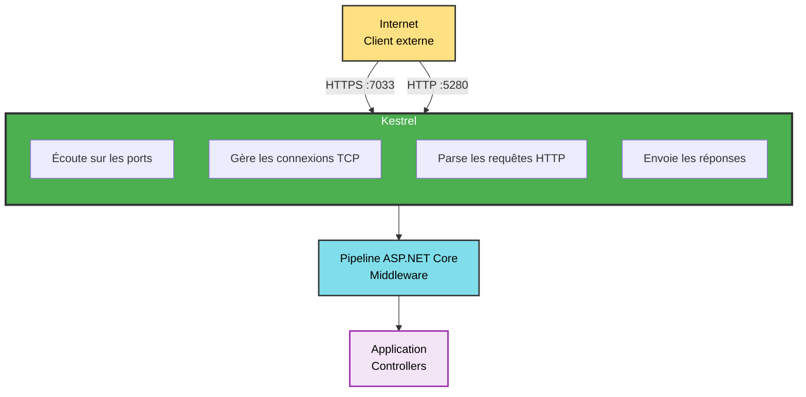

**Analogie :** Kestrel est comme un **serveur de restaurant** qui :
- Accueille les clients (connexions)
- Prend les commandes (requêtes HTTP)
- Transmet à la cuisine (votre application)
- Retourne les plats (réponses HTTP)

**Caractéristiques :**
- Cross-platform (Windows, Linux, macOS)
- Haute performance
- Supporte HTTP/1.1, HTTP/2, HTTPS
- Léger et rapide

---

### Entity Framework Core

**Définition :** Entity Framework Core (EF Core) est un **ORM** (Object-Relational Mapper) qui permet de travailler avec une base de données en utilisant des objets C# au lieu d'écrire du SQL.

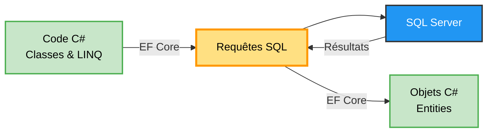

**Sans EF Core :**
```csharp
// Écrire du SQL manuellement
string sql = "SELECT * FROM Employees WHERE Id = @id";
SqlCommand cmd = new SqlCommand(sql, connection);
cmd.Parameters.AddWithValue("@id", employeeId);
SqlDataReader reader = cmd.ExecuteReader();
// ... parser les résultats manuellement
```

**Avec EF Core :**
```csharp
// Code simple et lisible
var employee = await _context.Employees.FindAsync(employeeId);
```

**Avantages :**
- Pas besoin d'écrire du SQL
- Protection contre les injections SQL
- Gestion automatique des connexions
- Support des migrations
- LINQ (Language Integrated Query)

---

### DbContext

**Définition :** Le DbContext est la **classe principale** d'Entity Framework Core qui représente une session avec la base de données.

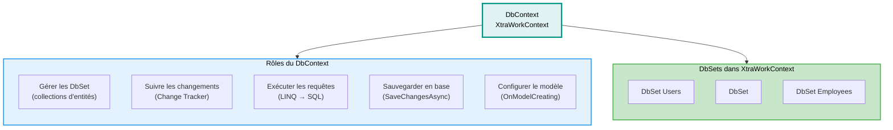

**Analogie :** Le DbContext est comme un **gestionnaire de stock** :
- Il sait ce qu'il y a en magasin (DbSet)
- Il suit ce qui a changé (Change Tracker)
- Il passe les commandes au fournisseur (SQL Server)
- Il met à jour le stock (SaveChanges)

---

### Middleware

**Définition :** Un middleware est un **composant logiciel** qui s'exécute dans le pipeline de traitement des requêtes HTTP.

```mermaid
graph LR
    Request["Requête<br/>Entrante"]
    
    Request --> MW1["Middleware 1<br/>Exception Handler"]
    MW1 --> MW2["Middleware 2<br/>Logging"]
    MW2 --> MW3["Middleware 3<br/>Authentication"]
    MW3 --> MW4["Middleware 4<br/>Authorization"]
    MW4 --> App["Application<br/>Controller"]
    
    App --> MW4B["Authorization"]
    MW4B --> MW3B["Authentication"]
    MW3B --> MW2B["Logging"]
    MW2B --> MW1B["Exception Handler"]
    MW1B --> Response["Réponse<br/>Sortante"]
    
    style Request fill:#FFE082,color:#000,stroke:#333,stroke-width:2px
    style MW1 fill:#FFCDD2,color:#000,stroke:#F44336,stroke-width:2px
    style MW2 fill:#FFF9C4,color:#000,stroke:#FFC107,stroke-width:2px
    style MW3 fill:#FF9800,color:#fff,stroke:#333,stroke-width:2px
    style MW4 fill:#FF9800,color:#fff,stroke:#333,stroke-width:2px
    style App fill:#C8E6C9,color:#000,stroke:#4CAF50,stroke-width:2px
    style Response fill:#C8E6C9,color:#000,stroke:#4CAF50,stroke-width:2px
```

**Chaque middleware peut :**
1. Traiter la requête
2. Modifier la requête
3. Passer au middleware suivant
4. Court-circuiter (arrêter) le pipeline
5. Traiter la réponse au retour

**Exemples dans XtraWork :**
- `app.UseExceptionHandler()` : Capture les erreurs
- `app.UseSerilogRequestLogging()` : Log les requêtes
- `app.UseAuthentication()` : Vérifie le token JWT
- `app.UseAuthorization()` : Vérifie les permissions

---

### JWT (JSON Web Token)

**Définition :** JWT est un **standard ouvert** pour créer des tokens d'accès qui permettent de transmettre des informations de manière sécurisée entre parties.

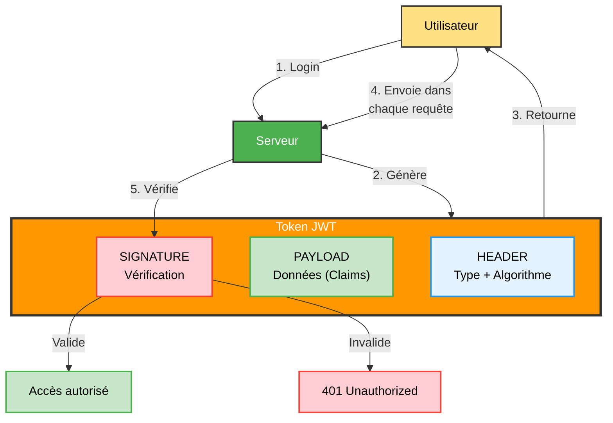

**Avantages :**
- Stateless (pas de session côté serveur)
- Contient toutes les infos (role, username)
- Peut être vérifié sans base de données
- Expire automatiquement

**Inconvénient :**
- Ne peut pas être révoqué facilement avant expiration

---

### BCrypt

**Définition :** BCrypt est un **algorithme de hachage** conçu spécifiquement pour sécuriser les mots de passe.

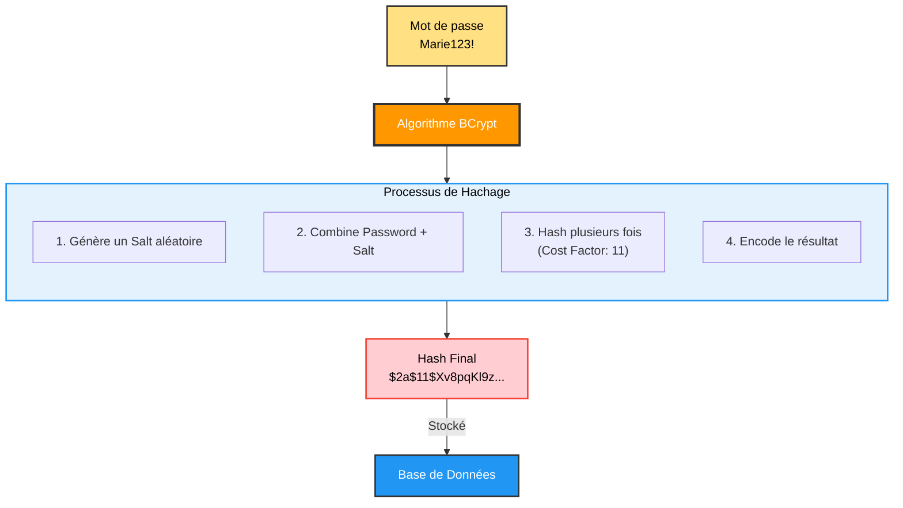

**Pourquoi BCrypt ?**
- **Lent par design** : Résiste aux attaques par force brute
- **Salt automatique** : Deux mêmes mots de passe = hashes différents
- **Coût ajustable** : Peut augmenter la difficulté avec le temps
- **Irréversible** : Impossible de retrouver le mot de passe original

**Vérification :**
```csharp
// Lors du login
bool isValid = BCrypt.Net.BCrypt.Verify(passwordEntré, passwordHashStocké);
```

---

### LINQ (Language Integrated Query)

**Définition :** LINQ est une **syntaxe de requête** intégrée à C# qui permet d'interroger des collections de données.

```mermaid
graph LR
    Collection["Collection<br/>List<Employee>"]
    
    Collection -->|LINQ| Query
    
    subgraph Query["Opérations LINQ"]
        direction TB
        Q1["Where (filtrer)"]
        Q2["Select (projeter)"]
        Q3["OrderBy (trier)"]
        Q4["Include (charger relations)"]
        Q5["FirstOrDefault"]
        Q6["ToListAsync"]
    end
    
    Query -->|EF Core| SQL["Requête SQL<br/>SELECT ... FROM ... WHERE ..."]
    
    SQL --> DB["Base de Données"]
    
    style Collection fill:#C8E6C9,color:#000,stroke:#4CAF50,stroke-width:2px
    style Query fill:#FFE082,color:#000,stroke:#FF9800,stroke-width:3px
    style SQL fill:#E3F2FD,color:#000,stroke:#2196F3,stroke-width:2px
    style DB fill:#2196F3,color:#fff,stroke:#333,stroke-width:2px
```

**Exemple :**
```csharp
// Code LINQ
var employees = await _context.Employees
    .Where(e => e.Gender == "M")
    .OrderBy(e => e.LastName)
    .ToListAsync();

// SQL généré automatiquement
SELECT * FROM Employees 
WHERE Gender = 'M' 
ORDER BY LastName
```

---

### Async/Await

**Définition :** `async` et `await` sont des mots-clés C# qui permettent d'écrire du **code asynchrone** de manière lisible.

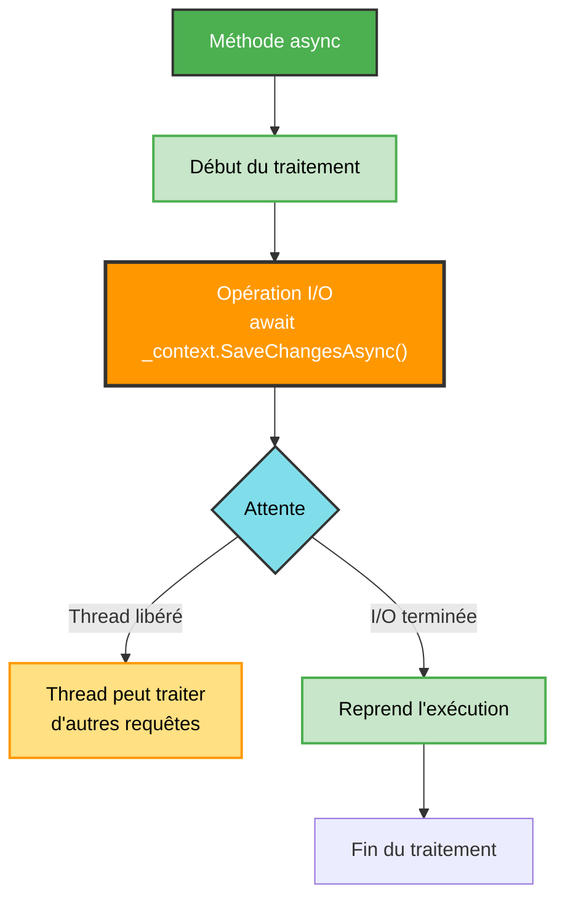

**Sans async (synchrone - bloque le thread) :**
```csharp
public List<Employee> GetAll()
{
    return _context.Employees.ToList();  // Bloque pendant la requête DB
}
```

**Avec async (asynchrone - libère le thread) :**
```csharp
public async Task<List<Employee>> GetAllAsync()
{
    return await _context.Employees.ToListAsync();  // Thread libéré pendant l'attente
}
```

**Avantages :**
- Meilleure **scalabilité** (plus de requêtes simultanées)
- Thread pool non saturé
- Application plus réactive

---

### Dependency Injection (DI)

**Définition :** L'injection de dépendances est un **pattern** qui permet de fournir les dépendances d'une classe depuis l'extérieur plutôt que de les créer à l'intérieur.

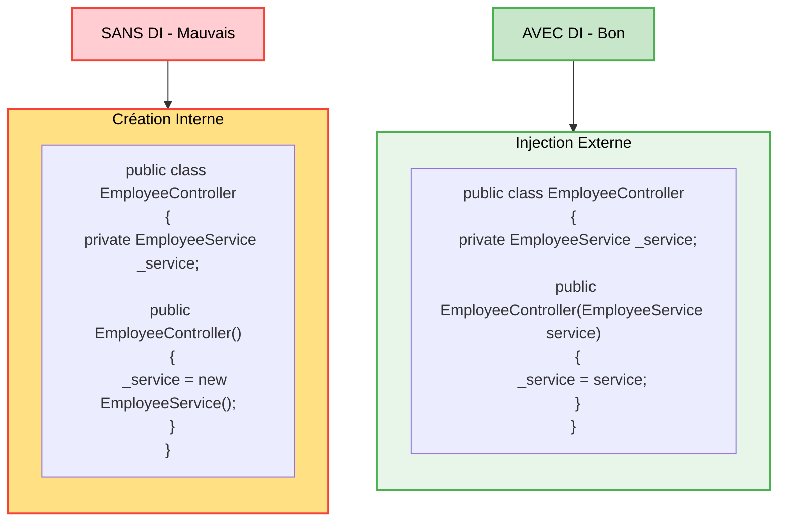

**Avantages de la DI :**
- **Testabilité** : On peut injecter des mocks pour les tests
- **Flexibilité** : Facile de changer l'implémentation
- **Couplage faible** : Les classes ne dépendent pas d'implémentations concrètes
- **Gestion automatique** : Le container DI crée et détruit les instances

---

### Scoped Service

**Définition :** Un service **Scoped** est créé **une fois par requête HTTP** et partagé dans toute la durée de cette requête.

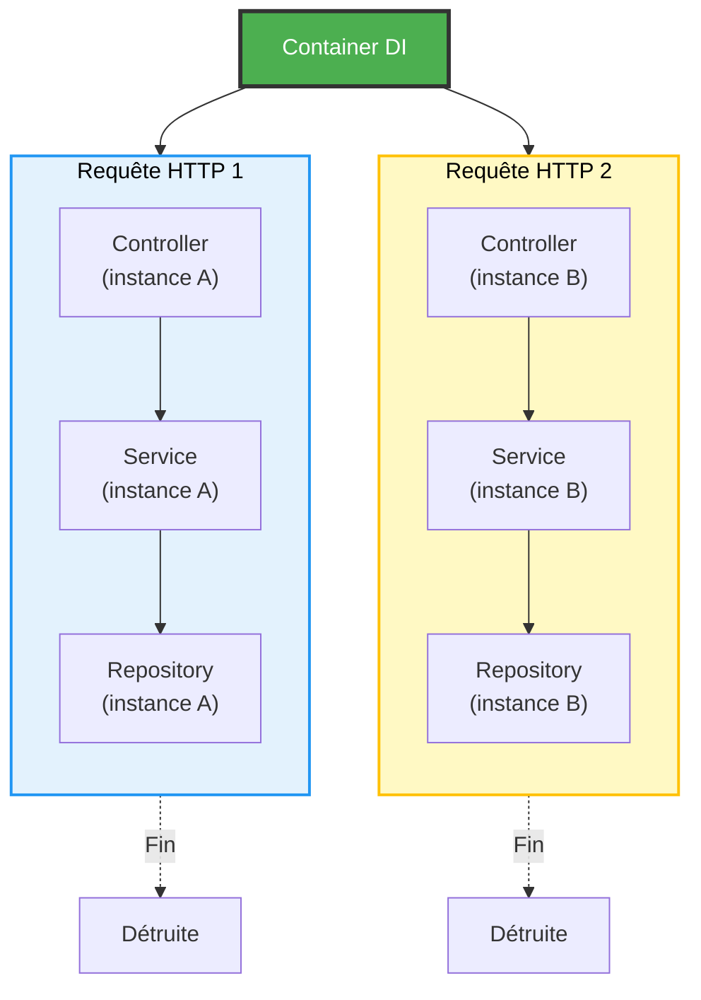

**Autres cycles de vie :**
- **Singleton** : Une seule instance pour toute l'application
- **Transient** : Une nouvelle instance à chaque injection
- **Scoped** : Une instance par requête (utilisé dans XtraWork)

---

### API REST

**Définition :** REST (Representational State Transfer) est un **style d'architecture** pour les services web qui utilise HTTP de manière standardisée.

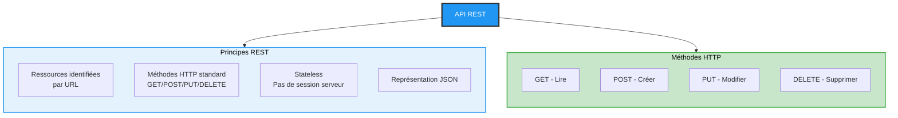

**Exemple de ressources REST :**
```
GET    /api/employees        → Lister tous les employés
GET    /api/employees/123    → Récupérer l'employé 123
POST   /api/employees        → Créer un nouvel employé
PUT    /api/employees/123    → Modifier l'employé 123
DELETE /api/employees/123    → Supprimer l'employé 123
```

---

### ORM (Object-Relational Mapper)

**Définition :** Un ORM est un outil qui **fait le pont** entre le monde objet (C#) et le monde relationnel (SQL).

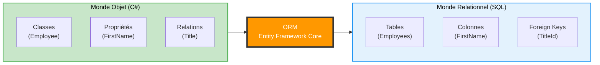

**Correspondances :**

| C# (Objet) | SQL (Relationnel) |
|------------|-------------------|
| Classe | Table |
| Propriété | Colonne |
| Instance | Ligne |
| Collection | Relation 1:N |
| Guid | UNIQUEIDENTIFIER |
| string | NVARCHAR |
| DateTime | DATETIME2 |

---

### Code First vs Database First

**Définition :** **Code First** signifie qu'on écrit d'abord le code C#, et la base de données est générée automatiquement.

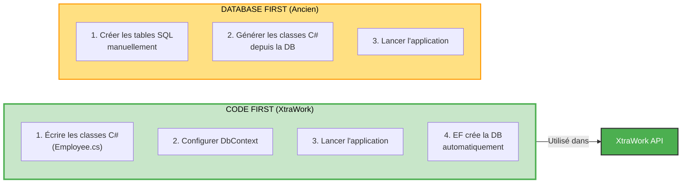

**Avantages Code First :**
- Pas besoin de connaître le SQL
- Base de données créée automatiquement
- Migrations pour les changements de schéma
- Un seul endroit pour le modèle de données (code C#)

**XtraWork utilise Code First :**
```csharp
// Dans Program.cs
ctx.Database.EnsureCreated();  // Crée la DB si elle n'existe pas
```

---

### Swagger / OpenAPI

**Définition :** Swagger est un **framework** qui génère automatiquement une documentation interactive pour votre API.

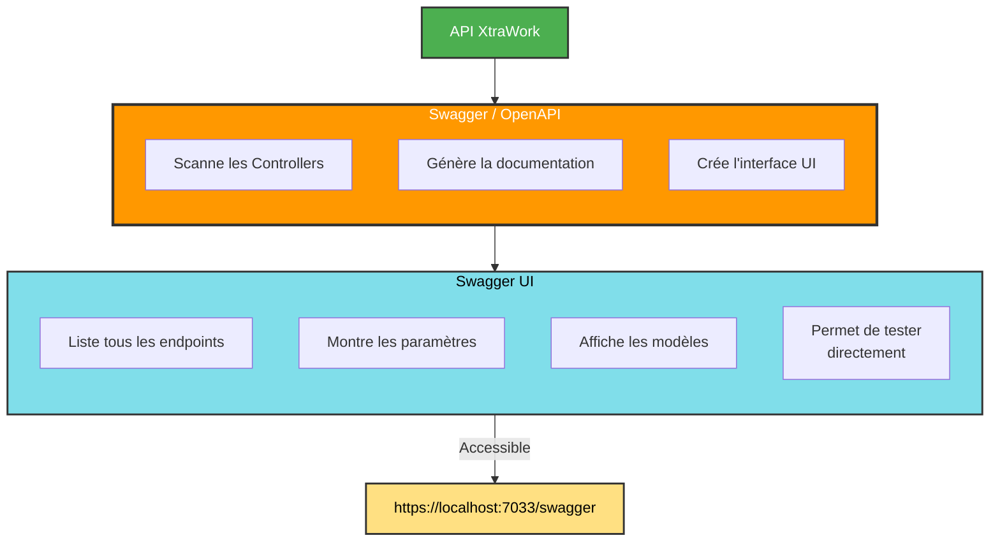

**Avantages :**
- Documentation automatique (toujours à jour)
- Interface de test intégrée
- Support JWT (bouton Authorize)
- Export OpenAPI pour générer des clients

---

### FluentValidation

**Définition :** FluentValidation est une **bibliothèque** qui permet de définir des règles de validation de manière **fluide et lisible**.

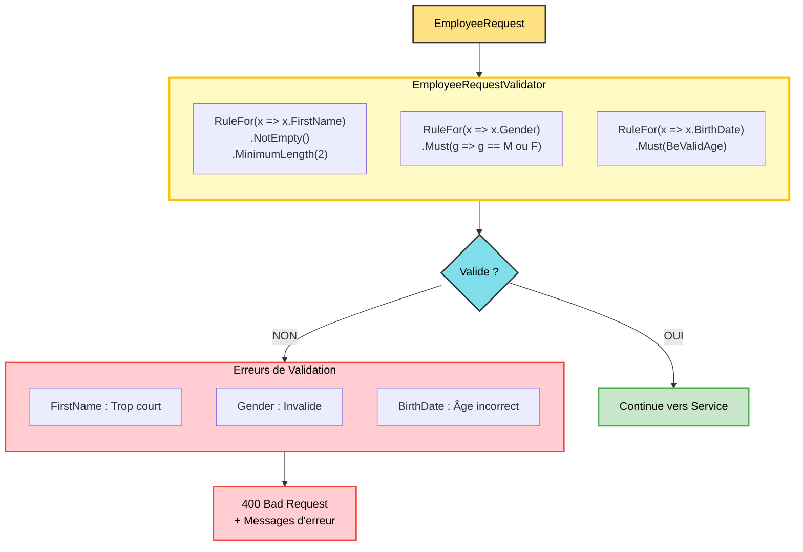

**Avantages :**
- Syntaxe claire et lisible
- Règles réutilisables
- Messages d'erreur personnalisés
- Validation automatique avant le controller

---

### Serilog

**Définition :** Serilog est une **bibliothèque de logging** qui enregistre les événements de l'application de manière structurée.

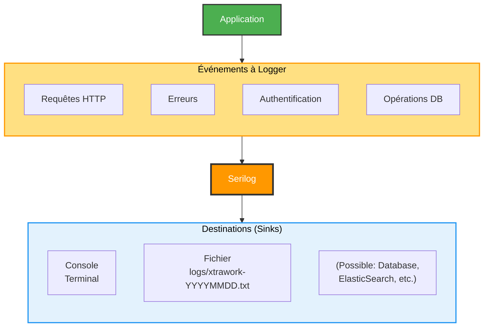

**Format des logs :**
```
[19:45:23 INF] HTTP GET /api/employees responded 200 in 45.2345 ms
[19:46:15 ERR] Database connection failed {"ConnectionString": "Server=..."}
```

**Avantages :**
- Logs structurés (JSON)
- Multiples destinations
- Filtrage par niveau (Info, Warning, Error)
- Enrichissement automatique (timestamp, machine, thread)

---

### Health Check

**Définition :** Un Health Check est un **endpoint** qui permet de vérifier rapidement si l'API fonctionne correctement.

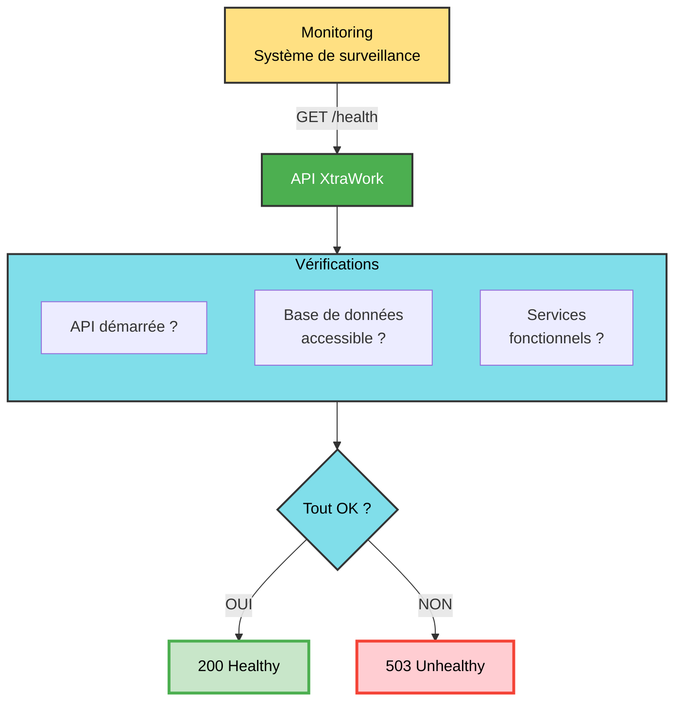

**Utilisation :**
- Monitoring en production
- Load balancers
- Docker health checks
- Tests automatisés

---

### GUID (Globally Unique Identifier)

**Définition :** Un GUID est un **identifiant unique universel** de 128 bits (16 octets).

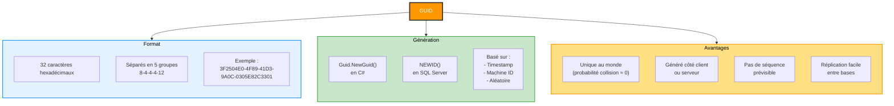

**Comparaison GUID vs INT :**

| Aspect | INT | GUID |
|--------|-----|------|
| **Taille** | 4 octets | 16 octets |
| **Valeurs** | 1, 2, 3... | 3F2504E0-4F89... |
| **Unicité** | Unique dans la table | Unique au monde |
| **Performance** | Légèrement plus rapide | Très rapide quand même |
| **Prévisibilité** | Prévisible | Imprévisible |
| **Réplication** | Complexe | Simple |

---

### Claims (Revendications)

**Définition :** Les claims sont des **paires clé-valeur** stockées dans le token JWT qui décrivent l'utilisateur.

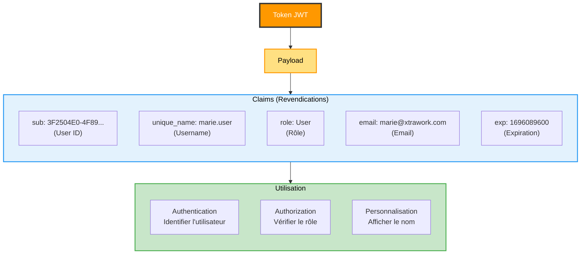

**Accès aux claims dans le code :**
```csharp
// Dans un controller
var userId = User.FindFirst(ClaimTypes.NameIdentifier)?.Value;
var username = User.FindFirst(ClaimTypes.Name)?.Value;
var role = User.FindFirst(ClaimTypes.Role)?.Value;
```

---

### Policy (Politique d'Autorisation)

**Définition :** Une policy est une **règle nommée** qui définit qui peut accéder à une ressource.

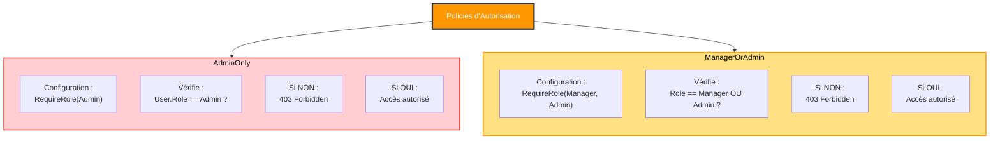

**Application sur un endpoint :**
```csharp
[HttpDelete("{id}")]
[Authorize(Policy = "AdminOnly")]
public async Task<ActionResult> Delete(Guid id)
{
    // Seuls les Admins peuvent accéder ici
}
```

---

### Navigation Property

**Définition :** Une navigation property est une **propriété** qui représente une **relation** entre deux entités.

```mermaid
graph TB
    Employee["Employee Entity"]
    
    Employee --> Props
    Employee --> NavProp
    
    subgraph Props["Propriétés Standards"]
        direction TB
        P1["Id : Guid"]
        P2["FirstName : string"]
        P3["TitleId : Guid (FK)"]
    end
    
    subgraph NavProp["Navigation Property"]
        direction TB
        N1["Title : Title<br/>L'objet Title complet"]
    end
    
    NavProp -->|Permet| Access["Accéder à<br/>employee.Title.Description"]
    
    Props -->|Nécessite| Include["Include(e => e.Title)<br/>pour charger"]
    
    style Employee fill:#4CAF50,color:#fff,stroke:#333,stroke-width:3px
    style Props fill:#E3F2FD,color:#000,stroke:#2196F3,stroke-width:2px
    style NavProp fill:#C8E6C9,color:#000,stroke:#4CAF50,stroke-width:3px
    style Access fill:#FFE082,color:#000,stroke:#FF9800,stroke-width:2px
```

**Exemple :**
```csharp
public class Employee
{
    public Guid TitleId { get; set; }        // Foreign Key
    public Title Title { get; set; }          // Navigation Property
}

// Utilisation
var employees = await _context.Employees
    .Include(e => e.Title)  // Charge la relation
    .ToListAsync();

// Maintenant on peut faire :
string titleName = employees[0].Title.Description;
```

---

### ActionResult

**Définition :** `ActionResult` est le **type de retour** des méthodes de controller qui encapsule la réponse HTTP.

```mermaid
graph TB
    ActionResult["ActionResult<T>"]
    
    ActionResult --> Types
    
    subgraph Types["Types de Réponses"]
        direction TB
        T1["Ok(data)<br/>→ 200 OK"]
        T2["Created(...)<br/>→ 201 Created"]
        T3["NoContent()<br/>→ 204 No Content"]
        T4["BadRequest(error)<br/>→ 400 Bad Request"]
        T5["Unauthorized()<br/>→ 401 Unauthorized"]
        T6["Forbid()<br/>→ 403 Forbidden"]
        T7["NotFound()<br/>→ 404 Not Found"]
    end
    
    Types --> HTTP
    
    subgraph HTTP["Réponse HTTP"]
        direction TB
        H1["Status Code"]
        H2["Headers"]
        H3["Body (JSON)"]
    end
    
    style ActionResult fill:#F3E5F5,color:#000,stroke:#9C27B0,stroke-width:3px
    style Types fill:#E3F2FD,color:#000,stroke:#2196F3,stroke-width:2px
    style HTTP fill:#C8E6C9,color:#000,stroke:#4CAF50,stroke-width:2px
```

**Exemples :**
```csharp
// 200 OK avec données
return Ok(employees);

// 201 Created avec location header
return CreatedAtAction(nameof(GetById), new { id = employee.Id }, employee);

// 204 No Content
return NoContent();

// 404 Not Found
return NotFound();
```

---

### Attribute (Attributs C#)

**Définition :** Les attributs sont des **métadonnées** qu'on ajoute aux classes, méthodes ou propriétés pour modifier leur comportement.

```mermaid
graph TB
    Attributes["Attributs C#"]
    
    Attributes --> Controllers
    Attributes --> Methods
    Attributes --> Props
    
    subgraph Controllers["Sur les Controllers"]
        direction TB
        C1["[ApiController]<br/>Active conventions API"]
        C2["[Route(api/employee)]<br/>Définit la route de base"]
        C3["[Authorize]<br/>Nécessite authentification"]
    end
    
    subgraph Methods["Sur les Méthodes"]
        direction TB
        M1["[HttpGet]<br/>Méthode GET"]
        M2["[HttpPost]<br/>Méthode POST"]
        M3["[HttpPut]<br/>Méthode PUT"]
        M4["[HttpDelete]<br/>Méthode DELETE"]
        M5["[Authorize(Policy=...)]<br/>Nécessite policy"]
    end
    
    subgraph Props["Sur les Propriétés"]
        direction TB
        P1["[Required]<br/>Champ obligatoire"]
        P2["[MaxLength(50)]<br/>Longueur max"]
        P3["[EmailAddress]<br/>Format email"]
    end
    
    style Attributes fill:#FF9800,color:#fff,stroke:#333,stroke-width:3px
    style Controllers fill:#F3E5F5,color:#000,stroke:#9C27B0,stroke-width:2px
    style Methods fill:#E8F5E9,color:#000,stroke:#4CAF50,stroke-width:2px
    style Props fill:#FFE082,color:#000,stroke:#FF9800,stroke-width:2px
```

**Exemple complet :**
```csharp
[ApiController]
[Route("api/[controller]")]
[Authorize]
public class EmployeeController : ControllerBase
{
    [HttpGet]
    public async Task<ActionResult<List<EmployeeResponse>>> GetAll() { }
    
    [HttpDelete("{id}")]
    [Authorize(Policy = "ManagerOrAdmin")]
    public async Task<ActionResult> Delete(Guid id) { }
}
```

---

### FromBody

**Définition :** `[FromBody]` est un attribut qui indique que les données viennent du **corps de la requête HTTP** (en JSON).

```mermaid
graph TB
    Request["Requête HTTP POST"]
    
    Request --> Parts
    
    subgraph Parts["Parties de la Requête"]
        direction TB
        P1["URL :<br/>https://localhost:7033/api/employee"]
        P2["Headers :<br/>Authorization: Bearer token<br/>Content-Type: application/json"]
        P3["Body :<br/>{<br/>  firstName: Pierre,<br/>  lastName: Durand,<br/>  ...<br/>}"]
    end
    
    P3 -->|FromBody| Param["Paramètre du Controller<br/>[FromBody] EmployeeRequest request"]
    
    Param --> Deserialization["Désérialisation<br/>JSON → Objet C#"]
    
    Deserialization --> Object["EmployeeRequest<br/>Objet C# utilisable"]
    
    style Request fill:#FFE082,color:#000,stroke:#333,stroke-width:2px
    style Parts fill:#E3F2FD,color:#000,stroke:#2196F3,stroke-width:2px
    style P3 fill:#C8E6C9,color:#000,stroke:#4CAF50,stroke-width:3px
    style Param fill:#FF9800,color:#fff,stroke:#333,stroke-width:2px
    style Deserialization fill:#80DEEA,color:#000,stroke:#333,stroke-width:2px
    style Object fill:#C8E6C9,color:#000,stroke:#4CAF50,stroke-width:2px
```

**Sans [FromBody] :**
```csharp
public async Task<ActionResult> Create(string firstName, string lastName, ...)
{
    // Trop de paramètres, compliqué
}
```

**Avec [FromBody] :**
```csharp
public async Task<ActionResult> Create([FromBody] EmployeeRequest request)
{
    // Un seul objet, propre et simple
}
```

---

### Change Tracker

**Définition :** Le Change Tracker est un mécanisme d'Entity Framework qui **suit les modifications** apportées aux entités.

```mermaid
graph TB
    Load["Charger une entité<br/>var employee = await _context.Employees.FindAsync(id)"]
    
    Load --> State1["État : Unchanged"]
    
    State1 --> Modify["Modifier l'entité<br/>employee.FirstName = Pierre"]
    
    Modify --> State2["État : Modified<br/>Change Tracker enregistre"]
    
    State2 --> Save["SaveChangesAsync()"]
    
    Save --> Detect["Change Tracker<br/>détecte les changements"]
    
    Detect --> SQL["Génère UPDATE SQL<br/>UPDATE Employees<br/>SET FirstName = 'Pierre'<br/>WHERE Id = @id"]
    
    SQL --> DB["Base de Données"]
    
    style Load fill:#FFE082,color:#000,stroke:#FF9800,stroke-width:2px
    style State1 fill:#C8E6C9,color:#000,stroke:#4CAF50,stroke-width:2px
    style Modify fill:#FF9800,color:#fff,stroke:#333,stroke-width:2px
    style State2 fill:#FFE082,color:#000,stroke:#FF9800,stroke-width:2px
    style Save fill:#80DEEA,color:#000,stroke:#333,stroke-width:2px
    style Detect fill:#FF9800,color:#fff,stroke:#333,stroke-width:3px
    style SQL fill:#E3F2FD,color:#000,stroke:#2196F3,stroke-width:2px
    style DB fill:#2196F3,color:#fff,stroke:#333,stroke-width:2px
```

**États possibles :**
- **Unchanged** : Pas de modification
- **Added** : Nouvel objet (→ INSERT)
- **Modified** : Objet modifié (→ UPDATE)
- **Deleted** : Objet supprimé (→ DELETE)
- **Detached** : Pas suivi

---

## Récapitulatif des Concepts

### Table des Concepts

| Concept | Définition Courte | Rôle dans XtraWork |
|---------|-------------------|-------------------|
| **Kestrel** | Serveur web ASP.NET Core | Écoute ports 7033/5280, gère HTTP/HTTPS |
| **Entity Framework** | ORM pour .NET | Transforme C# ↔ SQL |
| **DbContext** | Session base de données | Contient DbSet<User>, DbSet<Title>, DbSet<Employee> |
| **Middleware** | Composant du pipeline | ExceptionHandler, Logging, Auth |
| **JWT** | Token d'authentification | Contient id, username, role |
| **BCrypt** | Algorithme de hachage | Sécurise les mots de passe |
| **LINQ** | Langage de requête | Where, Select, OrderBy |
| **Async/Await** | Programmation asynchrone | Toutes les méthodes du projet |
| **DI** | Injection de dépendances | Injection des services |
| **Scoped** | Cycle de vie service | Une instance par requête |
| **API REST** | Style d'architecture | GET/POST/PUT/DELETE |
| **ORM** | Mapping objet-relationnel | EF Core |
| **Code First** | Approche de développement | Classes C# → Tables SQL |
| **Swagger** | Documentation API | Interface UI de test |
| **FluentValidation** | Validation des données | Règles sur Request DTOs |
| **Serilog** | Logging structuré | Console + Fichiers |
| **Health Check** | Vérification statut | Endpoint /health |
| **GUID** | Identifiant unique | Type des IDs |
| **Claims** | Informations utilisateur | Dans le token JWT |
| **Policy** | Règle d'autorisation | AdminOnly, ManagerOrAdmin |
| **Navigation Property** | Relation entre entités | employee.Title |
| **ActionResult** | Type retour controller | Ok(), Created(), NotFound() |
| **Attribute** | Métadonnée C# | [Authorize], [HttpGet] |
| **FromBody** | Source des paramètres | Données depuis le body JSON |
| **Change Tracker** | Suivi des modifications | Détecte les changements EF |

---

## Vue d'Ensemble

### Architecture Globale du Projet

```mermaid
graph TB
    Client["Client<br/>(Navigateur/Postman/App)"]
    
    Client -->|HTTPS Request| Kestrel
    
    subgraph API["API XtraWork"]
        Kestrel["Serveur Kestrel<br/>Port 7033/5280"]
        
        Kestrel --> Middleware
        
        subgraph Middleware["Middleware Pipeline"]
            MW1["Exception Handler"]
            MW2["Serilog Logging"]
            MW3["Authentication JWT"]
            MW4["Authorization"]
        end
        
        Middleware --> Controllers
        
        subgraph Controllers["Couche Controllers"]
            AuthC["AuthController"]
            TitleC["TitleController"]
            EmployeeC["EmployeeController"]
        end
        
        Controllers --> Services
        
        subgraph Services["Couche Services"]
            AuthS["AuthService"]
            TitleS["TitleService"]
            EmployeeS["EmployeeService"]
        end
        
        Services --> Repos
        
        subgraph Repos["Couche Repositories"]
            UserR["UserRepository"]
            TitleR["TitleRepository"]
            EmployeeR["EmployeeRepository"]
        end
        
        Repos --> EF
        
        EF["Entity Framework Core<br/>DbContext"]
    end
    
    EF -->|SQL| DB["SQL Server<br/>Base XtraWork"]
    
    style Client fill:#FFE082,color:#000,stroke:#333,stroke-width:3px
    style API fill:#E3F2FD,color:#000,stroke:#2196F3,stroke-width:3px
    style Middleware fill:#FFF9C4,color:#000,stroke:#FFC107,stroke-width:2px
    style Controllers fill:#F3E5F5,color:#000,stroke:#9C27B0,stroke-width:2px
    style Services fill:#E8F5E9,color:#000,stroke:#4CAF50,stroke-width:2px
    style Repos fill:#FCE4EC,color:#000,stroke:#E91E63,stroke-width:2px
    style EF fill:#E0F2F1,color:#000,stroke:#009688,stroke-width:2px
    style DB fill:#2196F3,color:#fff,stroke:#333,stroke-width:3px
```

---

## Architecture en Couches

### Principe de l'Architecture en Couches

L'API XtraWork utilise une **architecture en couches** (Layered Architecture) où chaque couche a une responsabilité spécifique.

```mermaid
graph TB
    subgraph Layer1["COUCHE 1 : PRÉSENTATION"]
        direction TB
        L1["Controllers<br/>Points d'entrée HTTP<br/>Gestion des requêtes/réponses"]
    end
    
    subgraph Layer2["COUCHE 2 : LOGIQUE MÉTIER"]
        direction TB
        L2["Services<br/>Règles métier<br/>Orchestration<br/>Transformation DTO"]
    end
    
    subgraph Layer3["COUCHE 3 : ACCÈS DONNÉES"]
        direction TB
        L3["Repositories<br/>CRUD sur la DB<br/>Requêtes Entity Framework"]
    end
    
    subgraph Layer4["COUCHE 4 - BASE DONNEES"]
        direction TB
        L4["SQL Server<br/>Stockage persistant<br/>Tables et relations"]
    end
    
    Layer1 --> Layer2
    Layer2 --> Layer3
    Layer3 --> Layer4
    
    style Layer1 fill:#F3E5F5,color:#000,stroke:#9C27B0,stroke-width:3px
    style Layer2 fill:#E8F5E9,color:#000,stroke:#4CAF50,stroke-width:3px
    style Layer3 fill:#FCE4EC,color:#000,stroke:#E91E63,stroke-width:3px
    style Layer4 fill:#E3F2FD,color:#000,stroke:#2196F3,stroke-width:3px
```

### Rôle de Chaque Couche

| Couche | Nom | Responsabilité | Exemples |
|--------|-----|----------------|----------|
| **1** | Présentation | Recevoir requêtes HTTP, valider, retourner réponses | AuthController, TitleController |
| **2** | Logique Métier | Appliquer les règles métier, orchestrer | AuthService, EmployeeService |
| **3** | Accès Données | Communiquer avec la base de données | UserRepository, TitleRepository |
| **4** | Base de Données | Stocker les données de manière persistante | SQL Server |

### Principe de Séparation des Responsabilités

```mermaid
graph LR
    Request["Requête HTTP<br/>POST /api/employees"]
    
    Request --> C["Controller<br/>Reçoit la requête<br/>Valide le format"]
    C --> S["Service<br/>Applique règles métier<br/>Transforme DTO"]
    S --> R["Repository<br/>Exécute requête SQL<br/>via Entity Framework"]
    R --> DB["Base de Données<br/>INSERT INTO Employees"]
    
    DB --> R2["Repository<br/>Retourne Entity"]
    R2 --> S2["Service<br/>Transforme en Response"]
    S2 --> C2["Controller<br/>Retourne JSON"]
    C2 --> Response["Réponse HTTP<br/>201 Created"]
    
    style Request fill:#FFE082,color:#000,stroke:#333,stroke-width:2px
    style Response fill:#C8E6C9,color:#000,stroke:#333,stroke-width:2px
    style C fill:#F3E5F5,color:#000,stroke:#9C27B0,stroke-width:2px
    style S fill:#E8F5E9,color:#000,stroke:#4CAF50,stroke-width:2px
    style R fill:#FCE4EC,color:#000,stroke:#E91E63,stroke-width:2px
    style DB fill:#2196F3,color:#fff,stroke:#333,stroke-width:2px
    style C2 fill:#F3E5F5,color:#000,stroke:#9C27B0,stroke-width:2px
    style S2 fill:#E8F5E9,color:#000,stroke:#4CAF50,stroke-width:2px
    style R2 fill:#FCE4EC,color:#000,stroke:#E91E63,stroke-width:2px
```

---

## Injection de Dépendances

### Qu'est-ce que l'Injection de Dépendances ?

L'injection de dépendances (DI) est un pattern qui permet de **fournir les dépendances** d'une classe **depuis l'extérieur** plutôt que de les créer à l'intérieur.

### Configuration dans Program.cs

```mermaid
graph TB
    Program["Program.cs<br/>Configuration DI"]
    
    Program --> Register
    
    subgraph Register["Enregistrement des Services"]
        direction TB
        R1["AddDbContext<br/>(XtraWorkContext)"]
        R2["AddScoped<br/>(Repositories)"]
        R3["AddScoped<br/>(Services)"]
        R4["AddAuthentication<br/>(JWT)"]
        R5["AddFluentValidation<br/>(Validators)"]
    end
    
    Register --> Container
    
    Container["Container DI<br/>(ServiceProvider)"]
    
    Container --> Injection
    
    subgraph Injection["Injection Automatique"]
        direction TB
        I1["Constructeur Controller"]
        I2["Constructeur Service"]
        I3["Constructeur Repository"]
    end
    
    style Program fill:#4CAF50,color:#fff,stroke:#333,stroke-width:3px
    style Register fill:#FFE082,color:#000,stroke:#333,stroke-width:2px
    style Container fill:#80DEEA,color:#000,stroke:#333,stroke-width:3px
    style Injection fill:#C8E6C9,color:#000,stroke:#333,stroke-width:2px
```

### Cycle de Vie des Services

```csharp
// Dans Program.cs

// Scoped : Une instance par requête HTTP
builder.Services.AddScoped<TitleRepository>();
builder.Services.AddScoped<EmployeeRepository>();
builder.Services.AddScoped<UserRepository>();

builder.Services.AddScoped<TitleService>();
builder.Services.AddScoped<EmployeeService>();
builder.Services.AddScoped<IAuthService, AuthService>();
```

**Scoped** signifie :
- Une nouvelle instance est créée pour chaque requête HTTP
- L'instance est partagée dans toute la durée de la requête
- L'instance est détruite à la fin de la requête

```mermaid
graph LR
    Req1["Requête 1"]
    Req2["Requête 2"]
    Req3["Requête 3"]
    
    Req1 --> Inst1["Instance Service A"]
    Req2 --> Inst2["Instance Service A"]
    Req3 --> Inst3["Instance Service A"]
    
    Inst1 -.->|Fin requête| Destroy1["Détruite"]
    Inst2 -.->|Fin requête| Destroy2["Détruite"]
    Inst3 -.->|Fin requête| Destroy3["Détruite"]
    
    style Req1 fill:#FFE082,color:#000,stroke:#333,stroke-width:2px
    style Req2 fill:#FFE082,color:#000,stroke:#333,stroke-width:2px
    style Req3 fill:#FFE082,color:#000,stroke:#333,stroke-width:2px
    style Inst1 fill:#C8E6C9,color:#000,stroke:#333,stroke-width:2px
    style Inst2 fill:#C8E6C9,color:#000,stroke:#333,stroke-width:2px
    style Inst3 fill:#C8E6C9,color:#000,stroke:#333,stroke-width:2px
```

### Exemple Concret : EmployeeController

```csharp
public class EmployeeController : ControllerBase
{
    private readonly EmployeeService _employeeService;

    // Le constructeur reçoit automatiquement l'instance
    public EmployeeController(EmployeeService employeeService)
    {
        _employeeService = employeeService;
    }
    
    [HttpGet]
    public async Task<ActionResult<List<EmployeeResponse>>> GetAll()
    {
        // Utilise le service injecté
        var employees = await _employeeService.GetAllAsync();
        return Ok(employees);
    }
}
```

**Diagramme de l'Injection :**

```mermaid
graph TB
    DI["Container DI"]
    
    DI -->|1. Crée| Repo["EmployeeRepository<br/>(avec DbContext)"]
    DI -->|2. Crée| Service["EmployeeService<br/>(avec Repository)"]
    DI -->|3. Crée| Controller["EmployeeController<br/>(avec Service)"]
    
    Controller -->|Utilise| Service
    Service -->|Utilise| Repo
    Repo -->|Utilise| DB["DbContext"]
    
    style DI fill:#4CAF50,color:#fff,stroke:#333,stroke-width:3px
    style Repo fill:#FCE4EC,color:#000,stroke:#E91E63,stroke-width:2px
    style Service fill:#E8F5E9,color:#000,stroke:#4CAF50,stroke-width:2px
    style Controller fill:#F3E5F5,color:#000,stroke:#9C27B0,stroke-width:2px
    style DB fill:#E0F2F1,color:#000,stroke:#009688,stroke-width:2px
```

---

## Couche Entités (Entities)

### Rôle des Entités

Les entités représentent les **objets métier** et correspondent aux **tables de la base de données**.

```mermaid
graph TB
    Entity["Entity<br/>(Classe C#)"]
    
    Entity -->|Mapping| Table["Table SQL Server"]
    
    subgraph EntityProps["Propriétés de l'Entity"]
        direction TB
        P1["Id (Guid)"]
        P2["FirstName (string)"]
        P3["LastName (string)"]
        P4["BirthDate (DateTime)"]
    end
    
    subgraph TableCols["Colonnes de la Table"]
        direction TB
        C1["Id (UNIQUEIDENTIFIER)"]
        C2["FirstName (NVARCHAR)"]
        C3["LastName (NVARCHAR)"]
        C4["BirthDate (DATE)"]
    end
    
    EntityProps -.->|Entity Framework<br/>Code First| TableCols
    
    style Entity fill:#FFE082,color:#000,stroke:#333,stroke-width:3px
    style Table fill:#2196F3,color:#fff,stroke:#333,stroke-width:3px
    style EntityProps fill:#C8E6C9,color:#000,stroke:#4CAF50,stroke-width:2px
    style TableCols fill:#E3F2FD,color:#000,stroke:#2196F3,stroke-width:2px
```

### Les 3 Entités du Projet

```mermaid
graph TB
    subgraph Entities["Entities du Projet XtraWork"]
        direction TB
        User["User<br/>Utilisateur système"]
        Title["Title<br/>Poste/Fonction"]
        Employee["Employee<br/>Employé"]
    end
    
    User -.->|Authentification| Auth["Gère l'accès"]
    Title -->|Relation 1:N| Employee
    Employee -->|TitleId FK| Title
    
    style User fill:#FF9800,color:#fff,stroke:#333,stroke-width:2px
    style Title fill:#2196F3,color:#fff,stroke:#333,stroke-width:2px
    style Employee fill:#4CAF50,color:#fff,stroke:#333,stroke-width:2px
    style Auth fill:#FFE082,color:#000,stroke:#333,stroke-width:2px
```

### Détail Entity : User

```csharp
public class User
{
    public Guid Id { get; set; }
    public string Username { get; set; } = string.Empty;
    public string Email { get; set; } = string.Empty;
    public string PasswordHash { get; set; } = string.Empty;
    public string FirstName { get; set; } = string.Empty;
    public string LastName { get; set; } = string.Empty;
    public string Role { get; set; } = "User"; // User, Admin, Manager
    public bool IsActive { get; set; } = true;
    public DateTime CreatedAt { get; set; } = DateTime.UtcNow;
    public DateTime? LastLoginAt { get; set; }
}
```

**Diagramme :**

```mermaid
graph TB
    UserEntity["Entity User"]
    
    UserEntity --> Identity
    UserEntity --> Auth
    UserEntity --> Profile
    UserEntity --> Tracking
    
    subgraph Identity["Identité"]
        direction TB
        I1["Id : Guid"]
        I2["Username : string"]
        I3["Email : string"]
    end
    
    subgraph Auth["Authentification"]
        direction TB
        A1["PasswordHash : string"]
        A2["Role : string"]
        A3["IsActive : bool"]
    end
    
    subgraph Profile["Profil"]
        direction TB
        P1["FirstName : string"]
        P2["LastName : string"]
    end
    
    subgraph Tracking["Traçabilité"]
        direction TB
        T1["CreatedAt : DateTime"]
        T2["LastLoginAt : DateTime?"]
    end
    
    style UserEntity fill:#FF9800,color:#fff,stroke:#333,stroke-width:3px
    style Identity fill:#E3F2FD,color:#000,stroke:#2196F3,stroke-width:2px
    style Auth fill:#FFCDD2,color:#000,stroke:#F44336,stroke-width:2px
    style Profile fill:#C8E6C9,color:#000,stroke:#4CAF50,stroke-width:2px
    style Tracking fill:#FFF9C4,color:#000,stroke:#FFC107,stroke-width:2px
```

### Détail Entity : Title

```csharp
public class Title
{
    public Guid Id { get; set; }
    public string Description { get; set; } = string.Empty;
    public DateTime CreatedAt { get; set; } = DateTime.UtcNow;
    
    // Navigation property
    public ICollection<Employee> Employees { get; set; } = new List<Employee>();
}
```

**Diagramme :**

```mermaid
graph TB
    TitleEntity["Entity Title"]
    
    TitleEntity --> Props
    TitleEntity --> Nav
    
    subgraph Props["Propriétés"]
        direction TB
        P1["Id : Guid"]
        P2["Description : string"]
        P3["CreatedAt : DateTime"]
    end
    
    subgraph Nav["Navigation Property"]
        direction TB
        N1["Employees : ICollection<Employee><br/>Liste des employés ayant ce poste"]
    end
    
    style TitleEntity fill:#2196F3,color:#fff,stroke:#333,stroke-width:3px
    style Props fill:#E3F2FD,color:#000,stroke:#2196F3,stroke-width:2px
    style Nav fill:#C8E6C9,color:#000,stroke:#4CAF50,stroke-width:2px
```

### Détail Entity : Employee

```csharp
public class Employee
{
    public Guid Id { get; set; }
    public string FirstName { get; set; } = string.Empty;
    public string LastName { get; set; } = string.Empty;
    public DateTime BirthDate { get; set; }
    public string Gender { get; set; } = string.Empty;
    public Guid TitleId { get; set; }
    public DateTime CreatedAt { get; set; } = DateTime.UtcNow;
    
    // Navigation property
    public Title Title { get; set; } = null!;
}
```

**Diagramme :**

```mermaid
graph TB
    EmployeeEntity["Entity Employee"]
    
    EmployeeEntity --> Identity
    EmployeeEntity --> Personal
    EmployeeEntity --> Work
    EmployeeEntity --> Nav
    
    subgraph Identity["Identité"]
        direction TB
        I1["Id : Guid"]
    end
    
    subgraph Personal["Informations Personnelles"]
        direction TB
        P1["FirstName : string"]
        P2["LastName : string"]
        P3["BirthDate : DateTime"]
        P4["Gender : string"]
    end
    
    subgraph Work["Informations Professionnelles"]
        direction TB
        W1["TitleId : Guid (FK)"]
        W2["CreatedAt : DateTime"]
    end
    
    subgraph Nav["Navigation Property"]
        direction TB
        N1["Title : Title<br/>Poste de l'employé"]
    end
    
    style EmployeeEntity fill:#4CAF50,color:#fff,stroke:#333,stroke-width:3px
    style Identity fill:#E3F2FD,color:#000,stroke:#2196F3,stroke-width:2px
    style Personal fill:#C8E6C9,color:#000,stroke:#4CAF50,stroke-width:2px
    style Work fill:#FFF9C4,color:#000,stroke:#FFC107,stroke-width:2px
    style Nav fill:#F3E5F5,color:#000,stroke:#9C27B0,stroke-width:2px
```

---

## Couche Accès Données (Repositories)

### Rôle des Repositories

Les repositories **encapsulent** toute la logique d'accès aux données.

```mermaid
graph TB
    Service["Service<br/>(Logique Métier)"]
    
    Service -->|Demande| Repo["Repository<br/>(Accès Données)"]
    
    Repo --> Operations
    
    subgraph Operations["Opérations CRUD"]
        direction TB
        O1["GetAllAsync()<br/>Récupérer tous"]
        O2["GetByIdAsync(id)<br/>Récupérer un"]
        O3["CreateAsync(entity)<br/>Créer"]
        O4["UpdateAsync(entity)<br/>Modifier"]
        O5["DeleteAsync(id)<br/>Supprimer"]
    end
    
    Operations --> EF
    
    EF["Entity Framework<br/>DbContext"]
    
    EF -->|SQL| DB["SQL Server"]
    
    style Service fill:#E8F5E9,color:#000,stroke:#4CAF50,stroke-width:2px
    style Repo fill:#FCE4EC,color:#000,stroke:#E91E63,stroke-width:3px
    style Operations fill:#FFF9C4,color:#000,stroke:#FFC107,stroke-width:2px
    style EF fill:#E0F2F1,color:#000,stroke:#009688,stroke-width:2px
    style DB fill:#2196F3,color:#fff,stroke:#333,stroke-width:2px
```

### TitleRepository - Exemple Complet

```csharp
public class TitleRepository
{
    private readonly XtraWorkContext _context;

    // Injection du DbContext
    public TitleRepository(XtraWorkContext context)
    {
        _context = context;
    }

    public async Task<List<Title>> GetAllAsync()
    {
        return await _context.Titles.ToListAsync();
    }

    public async Task<Title?> GetByIdAsync(Guid id)
    {
        return await _context.Titles.FindAsync(id);
    }

    public async Task<Title> CreateAsync(Title title)
    {
        _context.Titles.Add(title);
        await _context.SaveChangesAsync();
        return title;
    }

    public async Task<Title> UpdateAsync(Title title)
    {
        _context.Titles.Update(title);
        await _context.SaveChangesAsync();
        return title;
    }

    public async Task DeleteAsync(Guid id)
    {
        var title = await _context.Titles.FindAsync(id);
        if (title != null)
        {
            _context.Titles.Remove(title);
            await _context.SaveChangesAsync();
        }
    }
}
```

**Diagramme des Méthodes :**

```mermaid
graph TB
    TitleRepo["TitleRepository"]
    
    TitleRepo --> Methods
    
    subgraph Methods["Méthodes Disponibles"]
        direction TB
        M1["GetAllAsync()<br/>→ List<Title>"]
        M2["GetByIdAsync(id)<br/>→ Title?"]
        M3["CreateAsync(title)<br/>→ Title"]
        M4["UpdateAsync(title)<br/>→ Title"]
        M5["DeleteAsync(id)<br/>→ void"]
    end
    
    Methods --> DbContext
    
    DbContext["XtraWorkContext<br/>DbSet<Title>"]
    
    DbContext -->|SQL| SQL
    
    subgraph SQL["Requêtes SQL Générées"]
        direction TB
        S1["SELECT * FROM Titles"]
        S2["SELECT * FROM Titles WHERE Id=@id"]
        S3["INSERT INTO Titles ..."]
        S4["UPDATE Titles SET ..."]
        S5["DELETE FROM Titles WHERE Id=@id"]
    end
    
    style TitleRepo fill:#FCE4EC,color:#000,stroke:#E91E63,stroke-width:3px
    style Methods fill:#FFF9C4,color:#000,stroke:#FFC107,stroke-width:2px
    style DbContext fill:#E0F2F1,color:#000,stroke:#009688,stroke-width:2px
    style SQL fill:#E3F2FD,color:#000,stroke:#2196F3,stroke-width:2px
```

### EmployeeRepository - Spécificité Include

```csharp
public async Task<List<Employee>> GetAllAsync()
{
    return await _context.Employees
        .Include(e => e.Title)  // IMPORTANT : Charge la relation
        .OrderBy(e => e.FirstName)
        .ToListAsync();
}
```

**Pourquoi Include ?**

```mermaid
graph LR
    Query["GetAllAsync()"]
    
    Query -->|Sans Include| NoInclude["Employees seulement<br/>Title = null"]
    Query -->|Avec Include| WithInclude["Employees + Titles<br/>Title chargé"]
    
    WithInclude --> Join["JOIN SQL<br/>SELECT e.*, t.*<br/>FROM Employees e<br/>INNER JOIN Titles t<br/>ON e.TitleId = t.Id"]
    
    style Query fill:#FCE4EC,color:#000,stroke:#E91E63,stroke-width:2px
    style NoInclude fill:#FFCDD2,color:#000,stroke:#F44336,stroke-width:2px
    style WithInclude fill:#C8E6C9,color:#000,stroke:#4CAF50,stroke-width:2px
    style Join fill:#E3F2FD,color:#000,stroke:#2196F3,stroke-width:2px
```

**Sans Include :**
- SQL : `SELECT * FROM Employees`
- Résultat : `employee.Title` est `null`
- Erreur si on essaie d'accéder à `employee.Title.Description`

**Avec Include :**
- SQL : `SELECT ... FROM Employees INNER JOIN Titles ...`
- Résultat : `employee.Title` est chargé
- On peut accéder à `employee.Title.Description`

---

## Couche Logique Métier (Services)

### Rôle des Services

Les services **orchestrent** la logique métier et **transforment** les données entre Entities et DTOs.

```mermaid
graph TB
    Service["Service"]
    
    Service --> Receive
    Service --> Process
    Service --> Return
    
    subgraph Receive["1. RECEVOIR"]
        direction TB
        R1["Request DTO<br/>depuis Controller"]
    end
    
    subgraph Process["2. TRAITER"]
        direction TB
        P1["Valider données"]
        P2["Appliquer règles métier"]
        P3["Transformer Request → Entity"]
        P4["Appeler Repository"]
        P5["Transformer Entity → Response"]
    end
    
    subgraph Return["3. RETOURNER"]
        direction TB
        Ret1["Response DTO<br/>vers Controller"]
    end
    
    style Service fill:#E8F5E9,color:#000,stroke:#4CAF50,stroke-width:3px
    style Receive fill:#FFE082,color:#000,stroke:#333,stroke-width:2px
    style Process fill:#80DEEA,color:#000,stroke:#333,stroke-width:2px
    style Return fill:#C8E6C9,color:#000,stroke:#4CAF50,stroke-width:2px
```

### EmployeeService - Exemple Complet

```csharp
public class EmployeeService
{
    private readonly EmployeeRepository _employeeRepository;

    public EmployeeService(EmployeeRepository employeeRepository)
    {
        _employeeRepository = employeeRepository;
    }

    public async Task<List<EmployeeResponse>> GetAllAsync()
    {
        // 1. Récupérer les entités depuis le Repository
        var employees = await _employeeRepository.GetAllAsync();
        
        // 2. Transformer Entity → Response DTO
        var response = employees.Select(e => new EmployeeResponse
        {
            Id = e.Id,
            FirstName = e.FirstName,
            LastName = e.LastName,
            BirthDate = e.BirthDate,
            Gender = e.Gender,
            Age = CalculateAge(e.BirthDate),  // Logique métier
            TitleId = e.TitleId,
            TitleDescription = e.Title.Description  // Flatten
        }).ToList();
        
        return response;
    }
    
    private int CalculateAge(DateTime birthDate)
    {
        var today = DateTime.Today;
        var age = today.Year - birthDate.Year;
        if (birthDate.Date > today.AddYears(-age)) age--;
        return age;
    }
}
```

**Diagramme du Flux :**

```mermaid
graph TB
    Controller["Controller<br/>appelle GetAllAsync()"]
    
    Controller --> Service
    
    Service["EmployeeService<br/>GetAllAsync()"]
    
    Service --> Step1
    
    Step1["Étape 1<br/>Appeler Repository"]
    
    Step1 --> Repo["EmployeeRepository<br/>GetAllAsync()"]
    
    Repo --> DB["Base de Données<br/>SELECT avec JOIN"]
    
    DB --> Entities["List<Employee><br/>avec Title chargé"]
    
    Entities --> Service2["Service"]
    
    Service2 --> Transform
    
    subgraph Transform["Étape 2 : Transformation"]
        direction TB
        T1["Calculer Age"]
        T2["Flatten Title.Description"]
        T3["Créer EmployeeResponse"]
    end
    
    Transform --> Response["List<EmployeeResponse>"]
    
    Response --> Controller2["Controller<br/>Retourne JSON"]
    
    style Controller fill:#F3E5F5,color:#000,stroke:#9C27B0,stroke-width:2px
    style Service fill:#E8F5E9,color:#000,stroke:#4CAF50,stroke-width:3px
    style Repo fill:#FCE4EC,color:#000,stroke:#E91E63,stroke-width:2px
    style DB fill:#2196F3,color:#fff,stroke:#333,stroke-width:2px
    style Transform fill:#FFE082,color:#000,stroke:#333,stroke-width:2px
    style Response fill:#C8E6C9,color:#000,stroke:#4CAF50,stroke-width:2px
    style Controller2 fill:#F3E5F5,color:#000,stroke:#9C27B0,stroke-width:2px
```

### Différence Entity vs Response

```mermaid
graph LR
    Entity["Employee Entity<br/>(de la DB)"]
    
    Entity --> Transform["Transformation<br/>dans Service"]
    
    Transform --> Response["EmployeeResponse<br/>(vers Client)"]
    
    subgraph EntityProps["Entity Properties"]
        direction TB
        E1["Id, FirstName, LastName"]
        E2["BirthDate, Gender"]
        E3["TitleId"]
        E4["Title (objet complet)"]
        E5["CreatedAt"]
    end
    
    subgraph ResponseProps["Response Properties"]
        direction TB
        R1["Id, FirstName, LastName"]
        R2["BirthDate, Gender"]
        R3["Age (calculé)"]
        R4["TitleId"]
        R5["TitleDescription (flatté)"]
    end
    
    EntityProps -.->|Transformation| ResponseProps
    
    style Entity fill:#4CAF50,color:#fff,stroke:#333,stroke-width:2px
    style Transform fill:#FF9800,color:#fff,stroke:#333,stroke-width:3px
    style Response fill:#2196F3,color:#fff,stroke:#333,stroke-width:2px
    style EntityProps fill:#E8F5E9,color:#000,stroke:#4CAF50,stroke-width:2px
    style ResponseProps fill:#E3F2FD,color:#000,stroke:#2196F3,stroke-width:2px
```

**Pourquoi cette séparation ?**

| Aspect | Entity | Response DTO |
|--------|--------|--------------|
| **Usage** | Base de données | Communication HTTP |
| **Propriétés** | Toutes (même internes) | Seulement publiques |
| **Relations** | Objets complexes (`Title`) | Données flatées (`TitleDescription`) |
| **Calculs** | Non | Oui (`Age`) |
| **Avantages** | Correspond à la DB | Optimisé pour le client |

---

## Couche Présentation (Controllers)

### Rôle des Controllers

Les controllers sont les **points d'entrée** de l'API. Ils reçoivent les requêtes HTTP et retournent les réponses.

```mermaid
graph TB
    HTTP["Requête HTTP"]
    
    HTTP --> Controller
    
    Controller["Controller"]
    
    Controller --> Responsibilities
    
    subgraph Responsibilities["Responsabilités"]
        direction TB
        R1["Recevoir la requête"]
        R2["Extraire les paramètres"]
        R3["Vérifier l'authentification"]
        R4["Appeler le Service"]
        R5["Retourner la réponse HTTP"]
        R6["Gérer les erreurs"]
    end
    
    Responsibilities --> Service["Service"]
    
    Service --> Result["Résultat"]
    
    Result --> HTTPResponse["Réponse HTTP<br/>200/201/400/401/403/404"]
    
    style HTTP fill:#FFE082,color:#000,stroke:#333,stroke-width:2px
    style Controller fill:#F3E5F5,color:#000,stroke:#9C27B0,stroke-width:3px
    style Responsibilities fill:#E3F2FD,color:#000,stroke:#2196F3,stroke-width:2px
    style Service fill:#E8F5E9,color:#000,stroke:#4CAF50,stroke-width:2px
    style HTTPResponse fill:#C8E6C9,color:#000,stroke:#4CAF50,stroke-width:2px
```

### EmployeeController - Structure

```csharp
[ApiController]
[Route("api/[controller]")]
[Authorize]  // Tous les endpoints nécessitent authentification
public class EmployeeController : ControllerBase
{
    private readonly EmployeeService _employeeService;

    public EmployeeController(EmployeeService employeeService)
    {
        _employeeService = employeeService;
    }

    [HttpGet]
    public async Task<ActionResult<List<EmployeeResponse>>> GetAll()
    {
        var employees = await _employeeService.GetAllAsync();
        return Ok(employees);  // 200 OK
    }

    [HttpPost]
    public async Task<ActionResult<EmployeeResponse>> Create([FromBody] EmployeeRequest request)
    {
        var employee = await _employeeService.CreateAsync(request);
        return CreatedAtAction(nameof(GetById), new { id = employee.Id }, employee);  // 201 Created
    }

    [HttpDelete("{id}")]
    [Authorize(Policy = "ManagerOrAdmin")]
    public async Task<ActionResult> Delete(Guid id)
    {
        await _employeeService.DeleteAsync(id);
        return NoContent();  // 204 No Content
    }
}
```

**Diagramme des Endpoints :**

```mermaid
graph TB
    EmployeeController["EmployeeController<br/>/api/employee"]
    
    EmployeeController --> Endpoints
    
    subgraph Endpoints["Endpoints"]
        direction TB
        E1["GET /<br/>GetAll()<br/>→ 200 OK"]
        E2["GET /:id<br/>GetById(id)<br/>→ 200 OK"]
        E3["POST /<br/>Create(request)<br/>→ 201 Created"]
        E4["PUT /:id<br/>Update(id, request)<br/>→ 200 OK"]
        E5["DELETE /:id<br/>Delete(id)<br/>→ 204 No Content<br/>Policy: ManagerOrAdmin"]
    end
    
    Endpoints --> Service["EmployeeService"]
    
    style EmployeeController fill:#F3E5F5,color:#000,stroke:#9C27B0,stroke-width:3px
    style Endpoints fill:#E3F2FD,color:#000,stroke:#2196F3,stroke-width:2px
    style Service fill:#E8F5E9,color:#000,stroke:#4CAF50,stroke-width:2px
```

### Les 3 Controllers du Projet

```mermaid
graph TB
    API["API XtraWork"]
    
    API --> Controllers
    
    subgraph Controllers["Controllers"]
        direction TB
        AuthC["AuthController<br/>/api/auth"]
        TitleC["TitleController<br/>/api/title"]
        EmployeeC["EmployeeController<br/>/api/employee"]
    end
    
    AuthC --> AuthS["AuthService"]
    TitleC --> TitleS["TitleService"]
    EmployeeC --> EmployeeS["EmployeeService"]
    
    subgraph Services["Services"]
        direction TB
        AuthS
        TitleS
        EmployeeS
    end
    
    style API fill:#4CAF50,color:#fff,stroke:#333,stroke-width:3px
    style Controllers fill:#F3E5F5,color:#000,stroke:#9C27B0,stroke-width:3px
    style Services fill:#E8F5E9,color:#000,stroke:#4CAF50,stroke-width:2px
```

---

## DTOs (Requests & Responses)

### Qu'est-ce qu'un DTO ?

**DTO = Data Transfer Object** (Objet de Transfert de Données)

C'est un objet simple utilisé pour **transférer des données** entre les couches.

```mermaid
graph LR
    Client["Client"]
    
    Client -->|Envoie| Request["Request DTO<br/>(Données entrantes)"]
    
    Request --> Controller["Controller"]
    
    Controller --> Service["Service"]
    
    Service -->|Transformation| Entity["Entity<br/>(Objet métier)"]
    
    Entity --> Repository["Repository"]
    
    Repository --> DB["Base de Données"]
    
    DB --> Repository2["Repository"]
    
    Repository2 --> Entity2["Entity"]
    
    Entity2 -->|Transformation| Response["Response DTO<br/>(Données sortantes)"]
    
    Response --> Controller2["Controller"]
    
    Controller2 -->|Retourne| Client2["Client"]
    
    style Client fill:#FFE082,color:#000,stroke:#333,stroke-width:2px
    style Request fill:#FFCDD2,color:#000,stroke:#F44336,stroke-width:2px
    style Entity fill:#4CAF50,color:#fff,stroke:#333,stroke-width:2px
    style Response fill:#C8E6C9,color:#000,stroke:#4CAF50,stroke-width:2px
    style Client2 fill:#FFE082,color:#000,stroke:#333,stroke-width:2px
```

### Exemple : EmployeeRequest

```csharp
public class EmployeeRequest
{
    public string FirstName { get; set; } = string.Empty;
    public string LastName { get; set; } = string.Empty;
    public DateTime BirthDate { get; set; }
    public string Gender { get; set; } = string.Empty;
    public Guid TitleId { get; set; }
}
```

**Diagramme :**

```mermaid
graph TB
    EmployeeRequest["EmployeeRequest DTO"]
    
    EmployeeRequest --> Props
    
    subgraph Props["Propriétés (Entrantes)"]
        direction TB
        P1["FirstName : string"]
        P2["LastName : string"]
        P3["BirthDate : DateTime"]
        P4["Gender : string"]
        P5["TitleId : Guid"]
    end
    
    Props --> Purpose
    
    subgraph Purpose["Utilisation"]
        direction TB
        U1["POST /api/employee<br/>Créer employé"]
        U2["PUT /api/employee/:id<br/>Modifier employé"]
    end
    
    style EmployeeRequest fill:#FFCDD2,color:#000,stroke:#F44336,stroke-width:3px
    style Props fill:#FFF9C4,color:#000,stroke:#FFC107,stroke-width:2px
    style Purpose fill:#E3F2FD,color:#000,stroke:#2196F3,stroke-width:2px
```

### Exemple : EmployeeResponse

```csharp
public class EmployeeResponse
{
    public Guid Id { get; set; }
    public string FirstName { get; set; } = string.Empty;
    public string LastName { get; set; } = string.Empty;
    public DateTime BirthDate { get; set; }
    public string Gender { get; set; } = string.Empty;
    public int Age { get; set; }  // Calculé
    public Guid TitleId { get; set; }
    public string TitleDescription { get; set; } = string.Empty;  // Flatté
}
```

**Diagramme :**

```mermaid
graph TB
    EmployeeResponse["EmployeeResponse DTO"]
    
    EmployeeResponse --> From
    EmployeeResponse --> Added
    
    subgraph From["Depuis Entity Employee"]
        direction TB
        F1["Id, FirstName, LastName"]
        F2["BirthDate, Gender"]
        F3["TitleId"]
    end
    
    subgraph Added["Ajouté par Service"]
        direction TB
        A1["Age (calculé)"]
        A2["TitleDescription<br/>(depuis Title.Description)"]
    end
    
    style EmployeeResponse fill:#C8E6C9,color:#000,stroke:#4CAF50,stroke-width:3px
    style From fill:#E3F2FD,color:#000,stroke:#2196F3,stroke-width:2px
    style Added fill:#FFE082,color:#000,stroke:#FF9800,stroke-width:2px
```

### Transformation Request → Entity → Response

```mermaid
graph LR
    Request["EmployeeRequest<br/>du Client"]
    
    Request -->|Service.CreateAsync| Transform1["Transformation 1"]
    
    Transform1 --> Entity["Employee Entity"]
    
    Entity -->|Repository.CreateAsync| DB["Base de Données<br/>INSERT"]
    
    DB --> Entity2["Employee Entity<br/>(avec Id généré)"]
    
    Entity2 -->|Service| Transform2["Transformation 2"]
    
    Transform2 --> Response["EmployeeResponse<br/>vers Client"]
    
    style Request fill:#FFCDD2,color:#000,stroke:#F44336,stroke-width:2px
    style Transform1 fill:#FF9800,color:#fff,stroke:#333,stroke-width:2px
    style Entity fill:#4CAF50,color:#fff,stroke:#333,stroke-width:2px
    style DB fill:#2196F3,color:#fff,stroke:#333,stroke-width:2px
    style Entity2 fill:#4CAF50,color:#fff,stroke:#333,stroke-width:2px
    style Transform2 fill:#FF9800,color:#fff,stroke:#333,stroke-width:2px
    style Response fill:#C8E6C9,color:#000,stroke:#4CAF50,stroke-width:2px
```

---

## Validation (FluentValidation)

### Rôle des Validators

Les validators **vérifient** que les données entrantes respectent les règles métier **AVANT** de les traiter.

```mermaid
graph TB
    Request["Client envoie<br/>EmployeeRequest"]
    
    Request --> Controller["Controller reçoit"]
    
    Controller --> Validation
    
    subgraph Validation["Validation Automatique"]
        direction TB
        V1["FluentValidation<br/>EmployeeRequestValidator"]
        V2["Vérifie toutes les règles"]
    end
    
    Validation --> Check{Données<br/>valides ?}
    
    Check -->|NON| Error["Retourne 400<br/>Bad Request<br/>+ Messages d'erreur"]
    
    Check -->|OUI| Service["Appelle le Service<br/>CreateAsync()"]
    
    Service --> Success["200/201<br/>Succès"]
    
    style Request fill:#FFE082,color:#000,stroke:#333,stroke-width:2px
    style Validation fill:#FFF9C4,color:#000,stroke:#FFC107,stroke-width:3px
    style Check fill:#80DEEA,color:#000,stroke:#333,stroke-width:2px
    style Error fill:#FFCDD2,color:#000,stroke:#F44336,stroke-width:3px
    style Service fill:#E8F5E9,color:#000,stroke:#4CAF50,stroke-width:2px
    style Success fill:#C8E6C9,color:#000,stroke:#4CAF50,stroke-width:2px
```

### EmployeeRequestValidator - Règles

```csharp
public class EmployeeRequestValidator : AbstractValidator<EmployeeRequest>
{
    public EmployeeRequestValidator()
    {
        RuleFor(x => x.FirstName)
            .NotEmpty().WithMessage("Le prénom est obligatoire.")
            .MinimumLength(2).WithMessage("Le prénom doit contenir au moins 2 caractères.")
            .MaximumLength(50).WithMessage("Le prénom ne peut pas dépasser 50 caractères.");
        
        RuleFor(x => x.Gender)
            .Must(g => g == "M" || g == "F")
            .WithMessage("Le genre doit être 'M' ou 'F'.");
        
        RuleFor(x => x.BirthDate)
            .Must(BeValidAge)
            .WithMessage("L'employé doit avoir entre 16 et 70 ans.");
    }
    
    private bool BeValidAge(DateTime birthDate)
    {
        var age = DateTime.Today.Year - birthDate.Year;
        return age >= 16 && age <= 70;
    }
}
```

**Diagramme des Règles :**

```mermaid
graph TB
    Validator["EmployeeRequestValidator"]
    
    Validator --> Rules
    
    subgraph Rules["Règles de Validation"]
        direction TB
        R1["FirstName<br/>- NotEmpty<br/>- Min 2 caractères<br/>- Max 50 caractères"]
        R2["LastName<br/>- NotEmpty<br/>- Min 2 caractères<br/>- Max 50 caractères"]
        R3["BirthDate<br/>- Âge entre 16 et 70 ans"]
        R4["Gender<br/>- Doit être M ou F"]
        R5["TitleId<br/>- NotEmpty<br/>- Doit exister en base"]
    end
    
    Rules --> Result{Toutes<br/>valides ?}
    
    Result -->|NON| Errors["Liste des erreurs<br/>400 Bad Request"]
    Result -->|OUI| Continue["Continuer<br/>vers Service"]
    
    style Validator fill:#FFF9C4,color:#000,stroke:#FFC107,stroke-width:3px
    style Rules fill:#E3F2FD,color:#000,stroke:#2196F3,stroke-width:2px
    style Result fill:#80DEEA,color:#000,stroke:#333,stroke-width:2px
    style Errors fill:#FFCDD2,color:#000,stroke:#F44336,stroke-width:2px
    style Continue fill:#C8E6C9,color:#000,stroke:#4CAF50,stroke-width:2px
```

### Exemple de Réponse d'Erreur

**Requête invalide :**
```json
{
  "firstName": "P",
  "lastName": "",
  "birthDate": "2015-01-01",
  "gender": "X",
  "titleId": "00000000-0000-0000-0000-000000000000"
}
```

**Réponse 400 :**
```json
{
  "type": "https://tools.ietf.org/html/rfc7231#section-6.5.1",
  "title": "One or more validation errors occurred.",
  "status": 400,
  "errors": {
    "FirstName": ["Le prénom doit contenir au moins 2 caractères."],
    "LastName": ["Le nom est obligatoire."],
    "BirthDate": ["L'employé doit avoir entre 16 et 70 ans."],
    "Gender": ["Le genre doit être 'M' ou 'F'."]
  }
}
```

---

## Authentification et Autorisation

### Flux d'Authentification JWT

```mermaid
sequenceDiagram
    participant Client
    participant AuthController
    participant AuthService
    participant UserRepository
    participant DB
    
    Client->>AuthController: POST /api/auth/login<br/>{username, password}
    AuthController->>AuthService: LoginAsync(request)
    AuthService->>UserRepository: GetByUsernameAsync(username)
    UserRepository->>DB: SELECT FROM Users WHERE Username=?
    DB-->>UserRepository: User trouvé
    UserRepository-->>AuthService: User
    AuthService->>AuthService: Vérifier BCrypt<br/>password vs PasswordHash
    
    alt Mot de passe valide
        AuthService->>AuthService: Générer Token JWT<br/>(claims: id, username, role)
        AuthService-->>AuthController: AuthResponse{token, user}
        AuthController-->>Client: 200 OK + Token
    else Mot de passe invalide
        AuthService-->>AuthController: Exception
        AuthController-->>Client: 401 Unauthorized
    end
```

### Structure du Token JWT

```mermaid
graph TB
    Token["Token JWT"]
    
    Token --> Parts
    
    subgraph Parts["3 Parties du Token"]
        direction TB
        
        Header["HEADER<br/>{<br/> alg: HS256,<br/> typ: JWT<br/>}"]
        
        Payload["PAYLOAD (Claims)<br/>{<br/> sub: userId,<br/> unique_name: username,<br/> role: User/Manager/Admin,<br/> exp: expiration<br/>}"]
        
        Signature["SIGNATURE<br/>HMACSHA256(<br/> base64(header) + . +<br/> base64(payload),<br/> secret_key<br/>)"]
    end
    
    Parts --> Final["eyJhbGciOiJIUzI1NiIsInR5cCI6IkpXVCJ9.<br/>eyJzdWIiOiIxMjM0NTY3ODkwIiwibmFtZSI6IkpvaG4gRG9lIiwiaWF0IjoxNTE2MjM5MDIyfQ.<br/>SflKxwRJSMeKKF2QT4fwpMeJf36POk6yJV_adQssw5c"]
    
    style Token fill:#FF9800,color:#fff,stroke:#333,stroke-width:3px
    style Header fill:#E3F2FD,color:#000,stroke:#2196F3,stroke-width:2px
    style Payload fill:#C8E6C9,color:#000,stroke:#4CAF50,stroke-width:2px
    style Signature fill:#FFCDD2,color:#000,stroke:#F44336,stroke-width:2px
    style Final fill:#FFF9C4,color:#000,stroke:#FFC107,stroke-width:2px
```

### Autorisation par Politique (Policy)

```mermaid
graph TB
    Request["Requête avec Token"]
    
    Request --> Auth["Middleware<br/>Authentication"]
    
    Auth --> Verify{Token<br/>valide ?}
    
    Verify -->|NON| Reject1["401 Unauthorized"]
    
    Verify -->|OUI| Extract["Extraire les Claims<br/>(role, username, id)"]
    
    Extract --> Controller["Controller"]
    
    Controller --> CheckPolicy{Policy<br/>requise ?}
    
    CheckPolicy -->|AdminOnly| CheckAdmin{Role =<br/>Admin ?}
    CheckPolicy -->|ManagerOrAdmin| CheckManager{Role = Manager<br/>ou Admin ?}
    CheckPolicy -->|Aucune| Allow["Autoriser"]
    
    CheckAdmin -->|NON| Reject2["403 Forbidden"]
    CheckAdmin -->|OUI| Allow
    
    CheckManager -->|NON| Reject3["403 Forbidden"]
    CheckManager -->|OUI| Allow
    
    Allow --> Execute["Exécuter<br/>l'endpoint"]
    
    style Request fill:#FFE082,color:#000,stroke:#333,stroke-width:2px
    style Auth fill:#FF9800,color:#fff,stroke:#333,stroke-width:2px
    style Verify fill:#80DEEA,color:#000,stroke:#333,stroke-width:2px
    style CheckPolicy fill:#80DEEA,color:#000,stroke:#333,stroke-width:2px
    style CheckAdmin fill:#80DEEA,color:#000,stroke:#333,stroke-width:2px
    style CheckManager fill:#80DEEA,color:#000,stroke:#333,stroke-width:2px
    style Reject1 fill:#FFCDD2,color:#000,stroke:#F44336,stroke-width:2px
    style Reject2 fill:#FFCDD2,color:#000,stroke:#F44336,stroke-width:2px
    style Reject3 fill:#FFCDD2,color:#000,stroke:#F44336,stroke-width:2px
    style Allow fill:#C8E6C9,color:#000,stroke:#4CAF50,stroke-width:2px
    style Execute fill:#C8E6C9,color:#000,stroke:#4CAF50,stroke-width:2px
```

### Configuration des Policies

```csharp
// Dans Program.cs
builder.Services.AddAuthorization(options =>
{
    options.AddPolicy("AdminOnly", p => p.RequireRole("Admin"));
    options.AddPolicy("ManagerOrAdmin", p => p.RequireRole("Manager", "Admin"));
});
```

**Diagramme des Policies :**

```mermaid
graph TB
    Policies["Policies d'Autorisation"]
    
    Policies --> P1
    Policies --> P2
    
    subgraph P1["AdminOnly"]
        direction TB
        A1["Nécessite Role = Admin"]
        A2["Utilisé pour :<br/>- DELETE /api/title/:id"]
    end
    
    subgraph P2["ManagerOrAdmin"]
        direction TB
        M1["Nécessite Role = Manager<br/>OU Role = Admin"]
        M2["Utilisé pour :<br/>- POST /api/title<br/>- PUT /api/title/:id<br/>- DELETE /api/employee/:id"]
    end
    
    style Policies fill:#FF9800,color:#fff,stroke:#333,stroke-width:3px
    style P1 fill:#FFCDD2,color:#000,stroke:#F44336,stroke-width:2px
    style P2 fill:#FFE082,color:#000,stroke:#FF9800,stroke-width:2px
```

---

## Flux Complet d'une Requête

### Exemple : POST /api/employee (Créer un Employé)

```mermaid
sequenceDiagram
    participant Client
    participant Kestrel as Serveur Kestrel
    participant MW as Middleware
    participant Controller as EmployeeController
    participant Validator as EmployeeRequestValidator
    participant Service as EmployeeService
    participant Repository as EmployeeRepository
    participant DbContext as XtraWorkContext
    participant DB as SQL Server
    
    Client->>Kestrel: POST /api/employee<br/>Body: EmployeeRequest<br/>Header: Bearer token
    
    Kestrel->>MW: Passe au middleware
    
    MW->>MW: 1. Exception Handler
    MW->>MW: 2. Serilog Logging
    MW->>MW: 3. Authentication<br/>(Vérifier token)
    MW->>MW: 4. Authorization<br/>(Vérifier policy)
    
    MW->>Controller: Route vers EmployeeController
    
    Controller->>Validator: Valider EmployeeRequest
    
    alt Validation échouée
        Validator-->>Controller: Erreurs de validation
        Controller-->>Client: 400 Bad Request + Erreurs
    else Validation réussie
        Validator-->>Controller: OK
        
        Controller->>Service: CreateAsync(request)
        
        Service->>Service: Transformer Request → Entity
        
        Service->>Repository: CreateAsync(employee)
        
        Repository->>DbContext: Add(employee)
        Repository->>DbContext: SaveChangesAsync()
        
        DbContext->>DB: INSERT INTO Employees VALUES (...)
        
        DB-->>DbContext: Employee créé (avec Id)
        DbContext-->>Repository: Employee Entity
        Repository-->>Service: Employee Entity
        
        Service->>Service: Transformer Entity → Response<br/>(calculer Age, flatten Title)
        
        Service-->>Controller: EmployeeResponse
        
        Controller-->>Client: 201 Created + EmployeeResponse
    end
```

### Flux Simplifié Vertical

```mermaid
graph TB
    Start["Client envoie<br/>POST /api/employee"]
    
    Start --> Step1
    
    subgraph Step1["ÉTAPE 1 : Middleware"]
        direction TB
        M1["Authentication<br/>Vérifier token"]
        M2["Authorization<br/>Vérifier policy"]
    end
    
    Step1 --> Step2
    
    subgraph Step2["ÉTAPE 2 : Validation"]
        direction TB
        V1["FluentValidation<br/>Vérifier données"]
    end
    
    Step2 --> Check{Valide ?}
    
    Check -->|NON| Error["400 Bad Request"]
    
    Check -->|OUI| Step3
    
    subgraph Step3["ÉTAPE 3 : Controller"]
        direction TB
        C1["Appeler Service"]
    end
    
    Step3 --> Step4
    
    subgraph Step4["ÉTAPE 4 : Service"]
        direction TB
        S1["Transformer Request → Entity"]
        S2["Appeler Repository"]
        S3["Transformer Entity → Response"]
    end
    
    Step4 --> Step5
    
    subgraph Step5["ÉTAPE 5 : Repository"]
        direction TB
        R1["Appeler DbContext"]
        R2["SaveChangesAsync()"]
    end
    
    Step5 --> Step6
    
    subgraph Step6["ÉTAPE 6 : Base de Données"]
        direction TB
        D1["INSERT INTO Employees"]
    end
    
    Step6 --> Success["201 Created<br/>+ EmployeeResponse"]
    
    style Start fill:#FFE082,color:#000,stroke:#333,stroke-width:3px
    style Step1 fill:#FFF9C4,color:#000,stroke:#FFC107,stroke-width:2px
    style Step2 fill:#FFF9C4,color:#000,stroke:#FFC107,stroke-width:2px
    style Check fill:#80DEEA,color:#000,stroke:#333,stroke-width:2px
    style Error fill:#FFCDD2,color:#000,stroke:#F44336,stroke-width:2px
    style Step3 fill:#F3E5F5,color:#000,stroke:#9C27B0,stroke-width:2px
    style Step4 fill:#E8F5E9,color:#000,stroke:#4CAF50,stroke-width:2px
    style Step5 fill:#FCE4EC,color:#000,stroke:#E91E63,stroke-width:2px
    style Step6 fill:#E3F2FD,color:#000,stroke:#2196F3,stroke-width:2px
    style Success fill:#C8E6C9,color:#000,stroke:#4CAF50,stroke-width:3px
```

---

## Configuration (Program.cs)

### Organisation du Fichier Program.cs

```mermaid
graph TB
    ProgramStart["Program.cs"]
    
    ProgramStart --> Config
    
    subgraph Config["CONFIGURATION (Avant builder.Build)"]
        direction TB
        C1["1. Serilog<br/>Logging"]
        C2["2. DbContext<br/>Entity Framework"]
        C3["3. Repositories<br/>AddScoped"]
        C4["4. Services<br/>AddScoped"]
        C5["5. FluentValidation<br/>Validators"]
        C6["6. JWT Authentication<br/>Bearer"]
        C7["7. Authorization<br/>Policies"]
        C8["8. Health Checks<br/>Database"]
        C9["9. Swagger<br/>Documentation"]
    end
    
    Config --> Build["app = builder.Build()"]
    
    Build --> Pipeline
    
    subgraph Pipeline["MIDDLEWARE PIPELINE (Après builder.Build)"]
        direction TB
        P1["1. Exception Handler"]
        P2["2. Serilog Request Logging"]
        P3["3. Swagger UI"]
        P4["4. HTTPS Redirection"]
        P5["5. Authentication"]
        P6["6. Authorization"]
        P7["7. Health Checks"]
        P8["8. MapControllers"]
    end
    
    Pipeline --> Run["app.Run()<br/>Démarrage serveur"]
    
    style ProgramStart fill:#4CAF50,color:#fff,stroke:#333,stroke-width:3px
    style Config fill:#FFE082,color:#000,stroke:#333,stroke-width:3px
    style Build fill:#FF9800,color:#fff,stroke:#333,stroke-width:3px
    style Pipeline fill:#80DEEA,color:#000,stroke:#333,stroke-width:3px
    style Run fill:#2196F3,color:#fff,stroke:#333,stroke-width:3px
```

### Configuration Serilog (Logging)

```csharp
builder.Host.UseSerilog((ctx, cfg) =>
{
    cfg.ReadFrom.Configuration(ctx.Configuration)
       .WriteTo.Console(...)
       .WriteTo.File(path: "logs/xtrawork-.txt", ...)
       .Enrich.FromLogContext()
       .Enrich.WithProperty("Application", "XtraWork API");
});
```

**Diagramme :**

```mermaid
graph TB
    App["Application"]
    
    App --> Serilog["Serilog"]
    
    Serilog --> Outputs
    
    subgraph Outputs["Destinations des Logs"]
        direction TB
        O1["Console<br/>Terminal"]
        O2["Fichier<br/>logs/xtrawork-YYYYMMDD.txt"]
    end
    
    Serilog --> Enrichers
    
    subgraph Enrichers["Enrichissements"]
        direction TB
        E1["Application: XtraWork API"]
        E2["MachineName"]
        E3["ThreadId"]
        E4["Timestamp"]
    end
    
    style App fill:#4CAF50,color:#fff,stroke:#333,stroke-width:2px
    style Serilog fill:#FF9800,color:#fff,stroke:#333,stroke-width:3px
    style Outputs fill:#E3F2FD,color:#000,stroke:#2196F3,stroke-width:2px
    style Enrichers fill:#FFF9C4,color:#000,stroke:#FFC107,stroke-width:2px
```

### Pipeline Middleware (Ordre Important)

```mermaid
graph TB
    Request["Requête HTTP Entrante"]
    
    Request --> MW1["1. Exception Handler<br/>Capture toutes les erreurs"]
    MW1 --> MW2["2. Serilog Request Logging<br/>Log la requête"]
    MW2 --> MW3["3. Swagger<br/>Documentation"]
    MW3 --> MW4["4. HTTPS Redirection<br/>Force HTTPS"]
    MW4 --> MW5["5. Authentication<br/>Valider le token JWT"]
    MW5 --> MW6["6. Authorization<br/>Vérifier les policies"]
    MW6 --> MW7["7. MapControllers<br/>Router vers le bon controller"]
    MW7 --> Endpoint["Endpoint<br/>(Méthode du Controller)"]
    
    Endpoint --> Response["Réponse HTTP"]
    
    Response --> MW6B["6. Authorization"]
    MW6B --> MW5B["5. Authentication"]
    MW5B --> MW4B["4. HTTPS"]
    MW4B --> MW3B["3. Swagger"]
    MW3B --> MW2B["2. Logging"]
    MW2B --> MW1B["1. Exception Handler"]
    MW1B --> Client["Client"]
    
    style Request fill:#FFE082,color:#000,stroke:#333,stroke-width:2px
    style MW1 fill:#FFCDD2,color:#000,stroke:#F44336,stroke-width:2px
    style MW2 fill:#FFF9C4,color:#000,stroke:#FFC107,stroke-width:2px
    style MW5 fill:#FF9800,color:#fff,stroke:#333,stroke-width:2px
    style MW6 fill:#FF9800,color:#fff,stroke:#333,stroke-width:2px
    style MW7 fill:#F3E5F5,color:#000,stroke:#9C27B0,stroke-width:2px
    style Endpoint fill:#4CAF50,color:#fff,stroke:#333,stroke-width:2px
    style Response fill:#C8E6C9,color:#000,stroke:#4CAF50,stroke-width:2px
    style Client fill:#FFE082,color:#000,stroke:#333,stroke-width:2px
```

---

## Récapitulatif Complet par Couche

### Résumé Textuel

```
ARCHITECTURE XTRAWORK API

1. COUCHE PRÉSENTATION (Controllers/)
   │
   ├── AuthController.cs
   │   ├── POST /api/auth/register    → Register(RegisterRequest)
   │   ├── POST /api/auth/login       → Login(LoginRequest)
   │   ├── POST /api/auth/validate    → ValidateToken(string)
   │   └── GET /api/auth/me           → GetCurrentUser()
   │
   ├── TitleController.cs
   │   ├── GET /api/title             → GetAll()
   │   ├── GET /api/title/:id         → GetById(id)
   │   ├── POST /api/title            → Create(TitleRequest) [Policy: ManagerOrAdmin]
   │   ├── PUT /api/title/:id         → Update(id, TitleRequest) [Policy: ManagerOrAdmin]
   │   └── DELETE /api/title/:id      → Delete(id) [Policy: AdminOnly]
   │
   └── EmployeeController.cs
       ├── GET /api/employee          → GetAll()
       ├── GET /api/employee/:id      → GetById(id)
       ├── POST /api/employee         → Create(EmployeeRequest)
       ├── PUT /api/employee/:id      → Update(id, EmployeeRequest)
       └── DELETE /api/employee/:id   → Delete(id) [Policy: ManagerOrAdmin]

2. COUCHE LOGIQUE MÉTIER (Services/)
   │
   ├── AuthService.cs
   │   ├── RegisterAsync(request)     → Hasher password, créer User, générer token
   │   ├── LoginAsync(request)        → Vérifier password, générer token
   │   ├── ValidateTokenAsync(token)  → Valider signature JWT
   │   └── GetUserByIdAsync(id)       → Récupérer User
   │
   ├── TitleService.cs
   │   ├── GetAllAsync()              → Title[] → TitleResponse[]
   │   ├── GetByIdAsync(id)           → Title → TitleResponse
   │   ├── CreateAsync(request)       → TitleRequest → Title → TitleResponse
   │   ├── UpdateAsync(id, request)   → Title → TitleResponse
   │   └── DeleteAsync(id)            → void
   │
   └── EmployeeService.cs
       ├── GetAllAsync()              → Employee[] → EmployeeResponse[] (calcule Age)
       ├── GetByIdAsync(id)           → Employee → EmployeeResponse
       ├── CreateAsync(request)       → EmployeeRequest → Employee → EmployeeResponse
       ├── UpdateAsync(id, request)   → Employee → EmployeeResponse
       └── DeleteAsync(id)            → void

3. COUCHE ACCÈS DONNÉES (Repositories/)
   │
   ├── XtraWorkContext.cs
   │   ├── DbSet<User> Users
   │   ├── DbSet<Title> Titles
   │   ├── DbSet<Employee> Employees
   │   └── OnModelCreating()          → Configure relations, contraintes
   │
   ├── UserRepository.cs
   │   ├── GetByIdAsync(id)           → SELECT WHERE Id=?
   │   ├── GetByUsernameAsync()       → SELECT WHERE Username=?
   │   ├── GetByEmailAsync()          → SELECT WHERE Email=?
   │   ├── CreateAsync(user)          → INSERT
   │   └── UpdateAsync(user)          → UPDATE
   │
   ├── TitleRepository.cs
   │   ├── GetAllAsync()              → SELECT * FROM Titles
   │   ├── GetByIdAsync(id)           → SELECT WHERE Id=?
   │   ├── CreateAsync(title)         → INSERT
   │   ├── UpdateAsync(title)         → UPDATE
   │   └── DeleteAsync(id)            → DELETE
   │
   └── EmployeeRepository.cs
       ├── GetAllAsync()              → SELECT avec Include(Title)
       ├── GetByIdAsync(id)           → SELECT avec Include(Title)
       ├── CreateAsync(employee)      → INSERT
       ├── UpdateAsync(employee)      → UPDATE
       └── DeleteAsync(id)            → DELETE

4. VALIDATION (Validators/)
   │
   ├── TitleRequestValidator.cs
   │   └── RuleFor(x => x.Description)
   │       ├── NotEmpty
   │       ├── MinimumLength(3)
   │       └── MaximumLength(100)
   │
   └── EmployeeRequestValidator.cs
       ├── RuleFor(x => x.FirstName)  → NotEmpty, Min(2), Max(50)
       ├── RuleFor(x => x.LastName)   → NotEmpty, Min(2), Max(50)
       ├── RuleFor(x => x.BirthDate)  → Age entre 16 et 70 ans
       ├── RuleFor(x => x.Gender)     → Must be M ou F
       └── RuleFor(x => x.TitleId)    → NotEmpty

5. DTOs (Requests/ et Responses/)
   │
   ├── Requests/
   │   ├── RegisterRequest           → username, email, password, firstName, lastName
   │   ├── LoginRequest              → username, password
   │   ├── TitleRequest              → description
   │   └── EmployeeRequest           → firstName, lastName, birthDate, gender, titleId
   │
   └── Responses/
       ├── AuthResponse              → token, user
       ├── TitleResponse             → id, description, createdAt
       └── EmployeeResponse          → id, firstName, lastName, age, titleDescription

6. BASE DE DONNÉES (SQL Server)
   │
   ├── Users
   │   ├── Id (UNIQUEIDENTIFIER PK)
   │   ├── Username (NVARCHAR UK)
   │   ├── Email (NVARCHAR UK)
   │   ├── PasswordHash (NVARCHAR)
   │   └── Role, FirstName, LastName, IsActive, CreatedAt, LastLoginAt
   │
   ├── Titles
   │   ├── Id (UNIQUEIDENTIFIER PK)
   │   ├── Description (NVARCHAR)
   │   └── CreatedAt (DATETIME2)
   │
   └── Employees
       ├── Id (UNIQUEIDENTIFIER PK)
       ├── FirstName, LastName (NVARCHAR)
       ├── BirthDate (DATE)
       ├── Gender (NVARCHAR)
       ├── TitleId (UNIQUEIDENTIFIER FK → Titles.Id)
       └── CreatedAt (DATETIME2)
```

---

## Communication Entre les Couches

### Vue Verticale Complète

```mermaid
graph TB
    Client["CLIENT<br/>Navigateur/Postman"]
    
    Client -->|HTTP Request| Server
    
    Server["SERVEUR<br/>Kestrel :7033/:5280"]
    
    Server --> L1
    
    subgraph L1["COUCHE 1 - CONTROLLERS"]
        direction LR
        L1A["AuthController"]
        L1B["TitleController"]
        L1C["EmployeeController"]
    end
    
    L1 -->|Appelle| L2
    
    subgraph L2["COUCHE 2 - SERVICES"]
        direction LR
        L2A["AuthService"]
        L2B["TitleService"]
        L2C["EmployeeService"]
    end
    
    L2 -->|Appelle| L3
    
    subgraph L3["COUCHE 3 - REPOSITORIES"]
        direction LR
        L3A["UserRepository"]
        L3B["TitleRepository"]
        L3C["EmployeeRepository"]
    end
    
    L3 -->|Utilise| L4
    
    L4["COUCHE 4 - DbContext<br/>XtraWorkContext"]
    
    L4 -->|Entity Framework| L5
    
    L5["COUCHE 5 - BASE DONNEES<br/>SQL Server - XtraWork"]
    
    L5 -.->|Données| L4
    L4 -.->|Entities| L3
    L3 -.->|Entities| L2
    L2 -.->|Response DTOs| L1
    L1 -.->|HTTP Response| Client
    
    style Client fill:#FFE082,color:#000,stroke:#333,stroke-width:3px
    style Server fill:#4CAF50,color:#fff,stroke:#333,stroke-width:3px
    style L1 fill:#F3E5F5,color:#000,stroke:#9C27B0,stroke-width:3px
    style L2 fill:#E8F5E9,color:#000,stroke:#4CAF50,stroke-width:3px
    style L3 fill:#FCE4EC,color:#000,stroke:#E91E63,stroke-width:3px
    style L4 fill:#E0F2F1,color:#000,stroke:#009688,stroke-width:3px
    style L5 fill:#2196F3,color:#fff,stroke:#333,stroke-width:3px
```

### Communication Détaillée : Créer un Title

```mermaid
graph TB
    Step1["1. Client envoie<br/>POST /api/title<br/>Body: TitleRequest"]
    
    Step1 --> Step2
    
    Step2["2. TitleController.Create()<br/>Reçoit TitleRequest"]
    
    Step2 --> Step3
    
    Step3["3. FluentValidation<br/>Valide Description (3-100 char)"]
    
    Step3 --> Check{Valide ?}
    
    Check -->|NON| Error["400 Bad Request"]
    
    Check -->|OUI| Step4
    
    Step4["4. TitleService.CreateAsync(request)<br/>Transforme Request → Entity"]
    
    Step4 --> Step5
    
    Step5["5. TitleRepository.CreateAsync(title)<br/>Prépare INSERT"]
    
    Step5 --> Step6
    
    Step6["6. DbContext.Add(title)<br/>SaveChangesAsync()"]
    
    Step6 --> Step7
    
    Step7["7. SQL Server<br/>INSERT INTO Titles<br/>VALUES (NEWID(), 'Description', GETUTCDATE())"]
    
    Step7 --> Step8
    
    Step8["8. Repository retourne<br/>Title avec Id généré"]
    
    Step8 --> Step9
    
    Step9["9. Service transforme<br/>Entity → TitleResponse"]
    
    Step9 --> Step10
    
    Step10["10. Controller retourne<br/>201 Created + TitleResponse"]
    
    Step10 --> Client["Client reçoit JSON"]
    
    style Step1 fill:#FFE082,color:#000,stroke:#333,stroke-width:2px
    style Step2 fill:#F3E5F5,color:#000,stroke:#9C27B0,stroke-width:2px
    style Step3 fill:#FFF9C4,color:#000,stroke:#FFC107,stroke-width:2px
    style Check fill:#80DEEA,color:#000,stroke:#333,stroke-width:2px
    style Error fill:#FFCDD2,color:#000,stroke:#F44336,stroke-width:2px
    style Step4 fill:#E8F5E9,color:#000,stroke:#4CAF50,stroke-width:2px
    style Step5 fill:#FCE4EC,color:#000,stroke:#E91E63,stroke-width:2px
    style Step6 fill:#E0F2F1,color:#000,stroke:#009688,stroke-width:2px
    style Step7 fill:#2196F3,color:#fff,stroke:#333,stroke-width:2px
    style Step8 fill:#FCE4EC,color:#000,stroke:#E91E63,stroke-width:2px
    style Step9 fill:#E8F5E9,color:#000,stroke:#4CAF50,stroke-width:2px
    style Step10 fill:#F3E5F5,color:#000,stroke:#9C27B0,stroke-width:2px
    style Client fill:#C8E6C9,color:#000,stroke:#4CAF50,stroke-width:2px
```

---

## Conclusion

### Architecture Complète en Un Diagramme

```mermaid
graph TB
    Client["CLIENT"]
    
    Client -->|1| API
    
    subgraph API["API XTRAWORK"]
        direction TB
        
        Middleware["MIDDLEWARE<br/>Auth, Logging, Validation"]
        
        Controllers["CONTROLLERS<br/>Auth, Title, Employee"]
        
        Services["SERVICES<br/>Logique Métier<br/>Transformation DTOs"]
        
        Repos["REPOSITORIES<br/>Accès Données<br/>CRUD Entity Framework"]
        
        DbContext["DbContext<br/>XtraWorkContext"]
        
        Middleware --> Controllers
        Controllers --> Services
        Services --> Repos
        Repos --> DbContext
    end
    
    DbContext -->|2| DB["SQL SERVER<br/>Base XtraWork"]
    
    DB -.->|3| DbContext
    DbContext -.->|4| Repos
    Repos -.->|5| Services
    Services -.->|6| Controllers
    Controllers -.->|7| Client
    
    style Client fill:#FFE082,color:#000,stroke:#333,stroke-width:3px
    style API fill:#E3F2FD,color:#000,stroke:#2196F3,stroke-width:4px
    style Middleware fill:#FFF9C4,color:#000,stroke:#FFC107,stroke-width:2px
    style Controllers fill:#F3E5F5,color:#000,stroke:#9C27B0,stroke-width:2px
    style Services fill:#E8F5E9,color:#000,stroke:#4CAF50,stroke-width:2px
    style Repos fill:#FCE4EC,color:#000,stroke:#E91E63,stroke-width:2px
    style DbContext fill:#E0F2F1,color:#000,stroke:#009688,stroke-width:2px
    style DB fill:#2196F3,color:#fff,stroke:#333,stroke-width:3px
```

### Principes Clés

| Principe | Explication | Avantage |
|----------|-------------|----------|
| **Séparation des Responsabilités** | Chaque couche a un rôle unique | Code organisé et maintenable |
| **Injection de Dépendances** | Les dépendances sont injectées | Testabilité et flexibilité |
| **Code First** | Les entités C# génèrent la DB | Pas de SQL manuel |
| **DTOs** | Séparation Entity/Request/Response | Sécurité et flexibilité |
| **FluentValidation** | Validation déclarative | Règles claires et réutilisables |
| **Async/Await** | Opérations asynchrones | Performance et scalabilité |

---

**Document créé le :** 30 septembre 2025  
**Version :** 1.0  
**Projet :** XtraWork API  
**Auteur :** Guide Architecture Complète
