# Guide Complet : Migrations Entity Framework Core

## Table des Matières

1. [Qu'est-ce qu'une Migration ?](#quest-ce-quune-migration)
2. [EnsureCreated vs Migrations](#ensurecreated-vs-migrations)
3. [Installation des Outils](#installation-des-outils)
4. [Commandes Essentielles](#commandes-essentielles)
5. [Scénarios Pratiques](#scénarios-pratiques)
6. [Migration XtraWork](#migration-xtrawork)
7. [Bonnes Pratiques](#bonnes-pratiques)
8. [Dépannage](#dépannage)

---

## Qu'est-ce qu'une Migration ?

### Définition

Une **migration** est un fichier qui contient les **instructions** pour faire évoluer le schéma de la base de données.

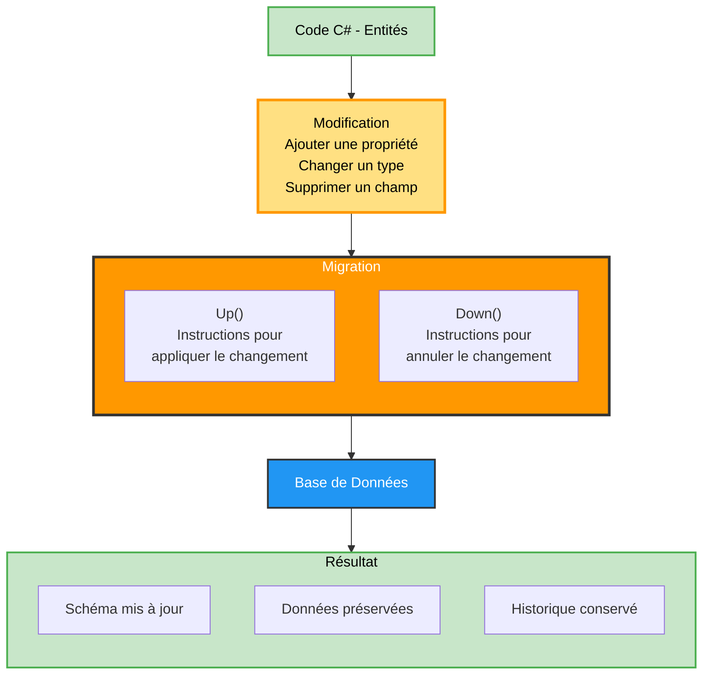
```mermaid
graph TB
    Code["Code C# - Entités"]
    
    Code --> Change["Modification<br/>Ajouter une propriété<br/>Changer un type<br/>Supprimer un champ"]
    
    Change --> Migration
    
    subgraph Migration["Migration"]
        direction TB
        M1["Up()<br/>Instructions pour<br/>appliquer le changement"]
        M2["Down()<br/>Instructions pour<br/>annuler le changement"]
    end
    
    Migration --> DB["Base de Données"]
    
    DB --> Result
    
    subgraph Result["Résultat"]
        direction TB
        R1["Schéma mis à jour"]
        R2["Données préservées"]
        R3["Historique conservé"]
    end
    
    style Code fill:#C8E6C9,color:#000,stroke:#4CAF50,stroke-width:2px
    style Change fill:#FFE082,color:#000,stroke:#FF9800,stroke-width:3px
    style Migration fill:#FF9800,color:#fff,stroke:#333,stroke-width:3px
    style DB fill:#2196F3,color:#fff,stroke:#333,stroke-width:2px
    style Result fill:#C8E6C9,color:#000,stroke:#4CAF50,stroke-width:2px
```

### Exemple Concret

**Avant (Entity Employee) :**
```csharp
public class Employee
{
    public Guid Id { get; set; }
    public string FirstName { get; set; }
    public string LastName { get; set; }
}
```

**Après (on ajoute Email) :**
```csharp
public class Employee
{
    public Guid Id { get; set; }
    public string FirstName { get; set; }
    public string LastName { get; set; }
    public string Email { get; set; }  // NOUVEAU
}
```

**Migration générée :**
```csharp
public partial class AddEmailToEmployee : Migration
{
    protected override void Up(MigrationBuilder migrationBuilder)
    {
        migrationBuilder.AddColumn<string>(
            name: "Email",
            table: "Employees",
            nullable: true);
    }
    
    protected override void Down(MigrationBuilder migrationBuilder)
    {
        migrationBuilder.DropColumn(
            name: "Email",
            table: "Employees");
    }
}
```

**SQL généré :**
```sql
-- Up
ALTER TABLE Employees ADD Email NVARCHAR(MAX) NULL;

-- Down
ALTER TABLE Employees DROP COLUMN Email;
```

---

## EnsureCreated vs Migrations

### Différences Importantes

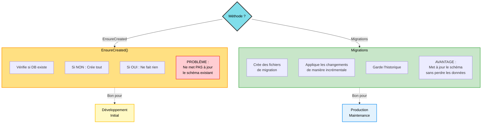
```mermaid
graph TB
    Choice{Méthode ?}
    
    Choice -->|EnsureCreated| EC
    Choice -->|Migrations| Mig
    
    subgraph EC["EnsureCreated()"]
        direction TB
        EC1["Vérifie si DB existe"]
        EC2["Si NON : Crée tout"]
        EC3["Si OUI : Ne fait rien"]
        EC4["PROBLÈME :<br/>Ne met PAS à jour<br/>le schéma existant"]
    end
    
    subgraph Mig["Migrations"]
        direction TB
        M1["Crée des fichiers<br/>de migration"]
        M2["Applique les changements<br/>de manière incrémentale"]
        M3["Garde l'historique"]
        M4["AVANTAGE :<br/>Met à jour le schéma<br/>sans perdre les données"]
    end
    
    EC -.->|Bon pour| Dev["Développement<br/>Initial"]
    Mig -.->|Bon pour| Prod["Production<br/>Maintenance"]
    
    style Choice fill:#80DEEA,color:#000,stroke:#333,stroke-width:3px
    style EC fill:#FFE082,color:#000,stroke:#FF9800,stroke-width:2px
    style EC4 fill:#FFCDD2,color:#000,stroke:#F44336,stroke-width:2px
    style Mig fill:#C8E6C9,color:#000,stroke:#4CAF50,stroke-width:2px
    style Dev fill:#FFF9C4,color:#000,stroke:#FFC107,stroke-width:2px
    style Prod fill:#E3F2FD,color:#000,stroke:#2196F3,stroke-width:2px
```

### Tableau Comparatif

| Aspect | EnsureCreated() | Migrations |
|--------|-----------------|------------|
| **Commande** | `ctx.Database.EnsureCreated()` | `dotnet ef database update` |
| **Crée la DB** | ✅ Oui | ✅ Oui |
| **Met à jour** | ❌ Non | ✅ Oui |
| **Historique** | ❌ Non | ✅ Oui (fichiers) |
| **Rollback** | ❌ Non | ✅ Oui (Down) |
| **Production** | ❌ Non recommandé | ✅ Recommandé |
| **Données** | Peut être perdu | Préservées |
| **XtraWork actuel** | ✅ Utilisé | ❌ Pas encore |

### Quand Utiliser Quoi ?

**EnsureCreated() - Utilisé actuellement dans XtraWork :**
- ✅ Développement initial
- ✅ Prototypage rapide
- ✅ Tests unitaires
- ❌ Production

**Migrations :**
- ✅ Production
- ✅ Équipe (plusieurs développeurs)
- ✅ Base de données avec données importantes
- ✅ Évolution du schéma

---

## Installation des Outils

### Vérifier si les Outils sont Installés

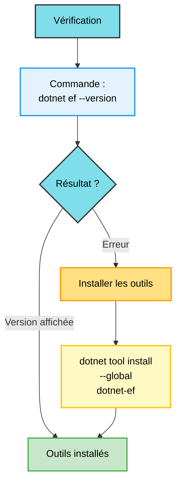
```mermaid
graph TB
    Check["Vérification"]
    
    Check --> CMD1["Commande :<br/>dotnet ef --version"]
    
    CMD1 --> Result{Résultat ?}
    
    Result -->|Version affichée| OK["Outils installés"]
    Result -->|Erreur| Install["Installer les outils"]
    
    Install --> CMD2["dotnet tool install<br/>--global<br/>dotnet-ef"]
    
    CMD2 --> OK
    
    style Check fill:#80DEEA,color:#000,stroke:#333,stroke-width:2px
    style CMD1 fill:#E3F2FD,color:#000,stroke:#2196F3,stroke-width:2px
    style Result fill:#80DEEA,color:#000,stroke:#333,stroke-width:2px
    style OK fill:#C8E6C9,color:#000,stroke:#4CAF50,stroke-width:2px
    style Install fill:#FFE082,color:#000,stroke:#FF9800,stroke-width:2px
    style CMD2 fill:#FFF9C4,color:#000,stroke:#FFC107,stroke-width:2px
```

### Commandes d'Installation

**1. Vérifier si installé :**
```bash
dotnet ef --version
```

**Résultat attendu :**
```
Entity Framework Core .NET Command-line Tools
8.0.0
```

**2. Si non installé :**
```bash
dotnet tool install --global dotnet-ef
```

**3. Si besoin de mise à jour :**
```bash
dotnet tool update --global dotnet-ef
```

### Packages NuGet Nécessaires

Dans `XtraWork.csproj`, vérifier ces packages :

```xml
<PackageReference Include="Microsoft.EntityFrameworkCore.Design" Version="8.0.0" />
<PackageReference Include="Microsoft.EntityFrameworkCore.SqlServer" Version="8.0.0" />
<PackageReference Include="Microsoft.EntityFrameworkCore.Tools" Version="8.0.0" />
```

---

## Commandes Essentielles

### Vue d'Ensemble des Commandes

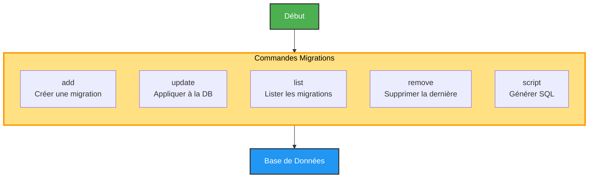
```mermaid
graph TB
    Start["Début"]
    
    Start --> Commands
    
    subgraph Commands["Commandes Migrations"]
        direction TB
        C1["add<br/>Créer une migration"]
        C2["update<br/>Appliquer à la DB"]
        C3["list<br/>Lister les migrations"]
        C4["remove<br/>Supprimer la dernière"]
        C5["script<br/>Générer SQL"]
    end
    
    Commands --> DB["Base de Données"]
    
    style Start fill:#4CAF50,color:#fff,stroke:#333,stroke-width:2px
    style Commands fill:#FFE082,color:#000,stroke:#FF9800,stroke-width:3px
    style DB fill:#2196F3,color:#fff,stroke:#333,stroke-width:2px
```

### 1. Créer une Migration

**Commande :**
```bash
dotnet ef migrations add NomDeLaMigration
```

**Exemple :**
```bash
dotnet ef migrations add InitialCreate
dotnet ef migrations add AddEmailToEmployee
dotnet ef migrations add ChangeGenderMaxLength
```

**Ce que cette commande fait :**

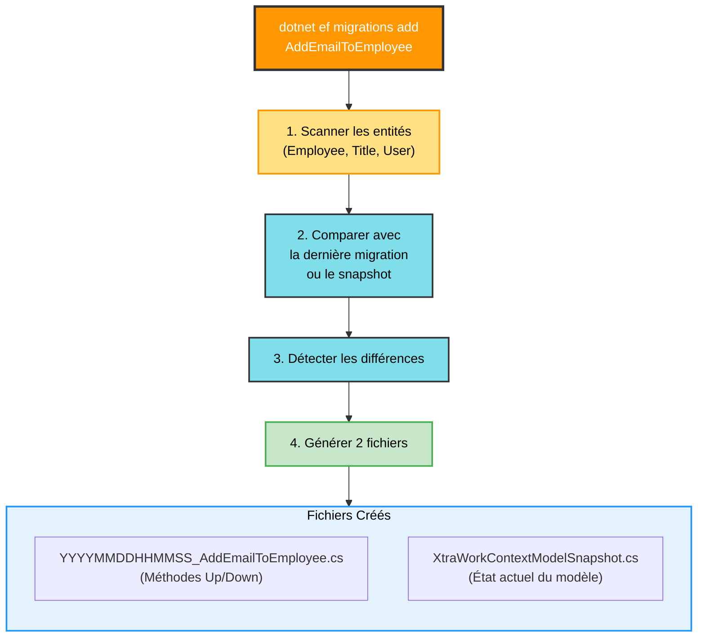
```mermaid
graph TB
    Command["dotnet ef migrations add<br/>AddEmailToEmployee"]
    
    Command --> Scan
    
    Scan["1. Scanner les entités<br/>(Employee, Title, User)"]
    
    Scan --> Compare
    
    Compare["2. Comparer avec<br/>la dernière migration<br/>ou le snapshot"]
    
    Compare --> Detect
    
    Detect["3. Détecter les différences"]
    
    Detect --> Generate
    
    Generate["4. Générer 2 fichiers"]
    
    Generate --> Files
    
    subgraph Files["Fichiers Créés"]
        direction TB
        F1["YYYYMMDDHHMMSS_AddEmailToEmployee.cs<br/>(Méthodes Up/Down)"]
        F2["XtraWorkContextModelSnapshot.cs<br/>(État actuel du modèle)"]
    end
    
    style Command fill:#FF9800,color:#fff,stroke:#333,stroke-width:3px
    style Scan fill:#FFE082,color:#000,stroke:#FF9800,stroke-width:2px
    style Compare fill:#80DEEA,color:#000,stroke:#333,stroke-width:2px
    style Detect fill:#80DEEA,color:#000,stroke:#333,stroke-width:2px
    style Generate fill:#C8E6C9,color:#000,stroke:#4CAF50,stroke-width:2px
    style Files fill:#E3F2FD,color:#000,stroke:#2196F3,stroke-width:2px
```

**Fichiers créés :**
```
Migrations/
├── 20250930120000_InitialCreate.cs
├── 20250930130000_AddEmailToEmployee.cs
└── XtraWorkContextModelSnapshot.cs
```

### 2. Appliquer les Migrations

**Commande :**
```bash
dotnet ef database update
```

**Ce que cette commande fait :**

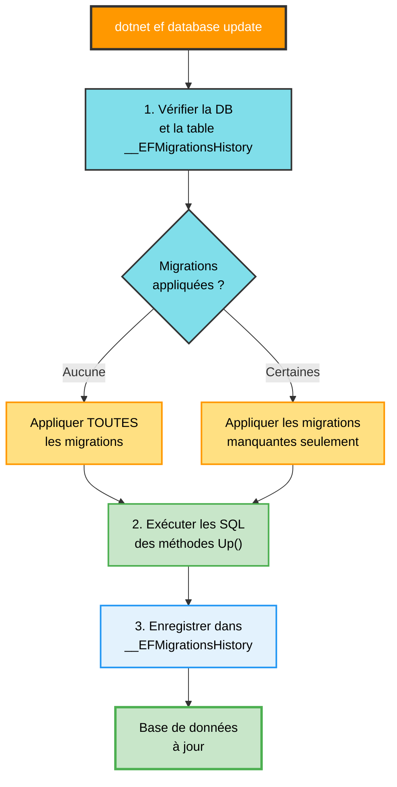
```mermaid
graph TB
    Command["dotnet ef database update"]
    
    Command --> Check
    
    Check["1. Vérifier la DB<br/>et la table __EFMigrationsHistory"]
    
    Check --> History{Migrations<br/>appliquées ?}
    
    History -->|Aucune| All["Appliquer TOUTES<br/>les migrations"]
    History -->|Certaines| Pending["Appliquer les migrations<br/>manquantes seulement"]
    
    All --> Execute
    Pending --> Execute
    
    Execute["2. Exécuter les SQL<br/>des méthodes Up()"]
    
    Execute --> Record
    
    Record["3. Enregistrer dans<br/>__EFMigrationsHistory"]
    
    Record --> Result["Base de données<br/>à jour"]
    
    style Command fill:#FF9800,color:#fff,stroke:#333,stroke-width:3px
    style Check fill:#80DEEA,color:#000,stroke:#333,stroke-width:2px
    style History fill:#80DEEA,color:#000,stroke:#333,stroke-width:2px
    style All fill:#FFE082,color:#000,stroke:#FF9800,stroke-width:2px
    style Pending fill:#FFE082,color:#000,stroke:#FF9800,stroke-width:2px
    style Execute fill:#C8E6C9,color:#000,stroke:#4CAF50,stroke-width:2px
    style Record fill:#E3F2FD,color:#000,stroke:#2196F3,stroke-width:2px
    style Result fill:#C8E6C9,color:#000,stroke:#4CAF50,stroke-width:3px
```

### 3. Lister les Migrations

**Commande :**
```bash
dotnet ef migrations list
```

**Résultat :**
```
20250930120000_InitialCreate (Applied)
20250930130000_AddEmailToEmployee (Applied)
20250930140000_ChangeGenderMaxLength (Pending)
```

### 4. Supprimer la Dernière Migration

**Commande :**
```bash
dotnet ef migrations remove
```

**ATTENTION :** Fonctionne seulement si la migration n'a PAS encore été appliquée à la DB !

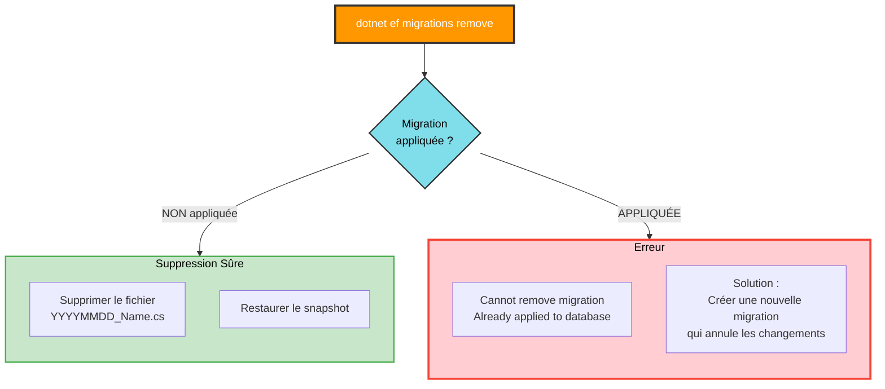
```mermaid
graph TB
    Remove["dotnet ef migrations remove"]
    
    Remove --> Check{Migration<br/>appliquée ?}
    
    Check -->|NON appliquée| Safe
    
    subgraph Safe["Suppression Sûre"]
        direction TB
        S1["Supprimer le fichier<br/>YYYYMMDD_Name.cs"]
        S2["Restaurer le snapshot"]
    end
    
    Check -->|APPLIQUÉE| Danger
    
    subgraph Danger["Erreur"]
        direction TB
        D1["Cannot remove migration<br/>Already applied to database"]
        D2["Solution :<br/>Créer une nouvelle migration<br/>qui annule les changements"]
    end
    
    style Remove fill:#FF9800,color:#fff,stroke:#333,stroke-width:3px
    style Check fill:#80DEEA,color:#000,stroke:#333,stroke-width:2px
    style Safe fill:#C8E6C9,color:#000,stroke:#4CAF50,stroke-width:2px
    style Danger fill:#FFCDD2,color:#000,stroke:#F44336,stroke-width:3px
```

### 5. Générer un Script SQL

**Commande :**
```bash
dotnet ef migrations script
```

**Résultat :**
```sql
-- Migration: InitialCreate
CREATE TABLE [Users] (
    [Id] uniqueidentifier NOT NULL,
    [Username] nvarchar(50) NOT NULL,
    ...
    CONSTRAINT [PK_Users] PRIMARY KEY ([Id])
);

-- Migration: AddEmailToEmployee
ALTER TABLE [Employees] ADD [Email] nvarchar(100) NULL;
```

**Utilité :**
- Vérifier le SQL avant de l'appliquer
- Exécuter manuellement sur un serveur de production
- Audit et documentation

---

## Scénarios Pratiques

### Scénario 1 : Premier Démarrage (Projet Nouveau)

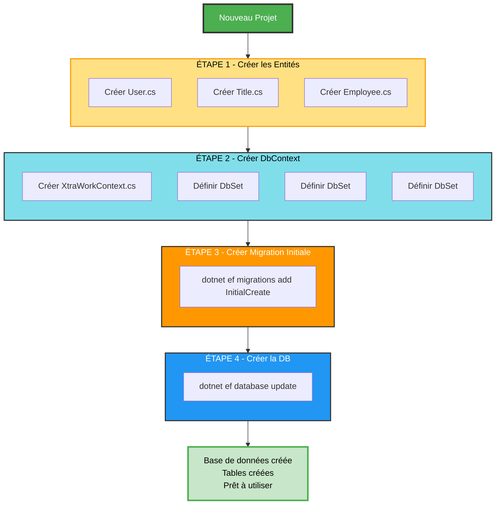
```mermaid
graph TB
    Start["Nouveau Projet"]
    
    Start --> Step1
    
    subgraph Step1["ÉTAPE 1 - Créer les Entités"]
        direction TB
        S1["Créer User.cs"]
        S2["Créer Title.cs"]
        S3["Créer Employee.cs"]
    end
    
    Step1 --> Step2
    
    subgraph Step2["ÉTAPE 2 - Créer DbContext"]
        direction TB
        D1["Créer XtraWorkContext.cs"]
        D2["Définir DbSet<User>"]
        D3["Définir DbSet<Title>"]
        D4["Définir DbSet<Employee>"]
    end
    
    Step2 --> Step3
    
    subgraph Step3["ÉTAPE 3 - Créer Migration Initiale"]
        direction TB
        M1["dotnet ef migrations add InitialCreate"]
    end
    
    Step3 --> Step4
    
    subgraph Step4["ÉTAPE 4 - Créer la DB"]
        direction TB
        U1["dotnet ef database update"]
    end
    
    Step4 --> Done["Base de données créée<br/>Tables créées<br/>Prêt à utiliser"]
    
    style Start fill:#4CAF50,color:#fff,stroke:#333,stroke-width:3px
    style Step1 fill:#FFE082,color:#000,stroke:#FF9800,stroke-width:2px
    style Step2 fill:#80DEEA,color:#000,stroke:#333,stroke-width:2px
    style Step3 fill:#FF9800,color:#fff,stroke:#333,stroke-width:2px
    style Step4 fill:#2196F3,color:#fff,stroke:#333,stroke-width:2px
    style Done fill:#C8E6C9,color:#000,stroke:#4CAF50,stroke-width:3px
```

**Commandes complètes :**

```bash
# 1. Créer la migration initiale
dotnet ef migrations add InitialCreate

# 2. Appliquer à la base de données
dotnet ef database update
```

---

### Scénario 2 : Ajouter une Propriété

**Situation :** Vous voulez ajouter `PhoneNumber` à `Employee`.

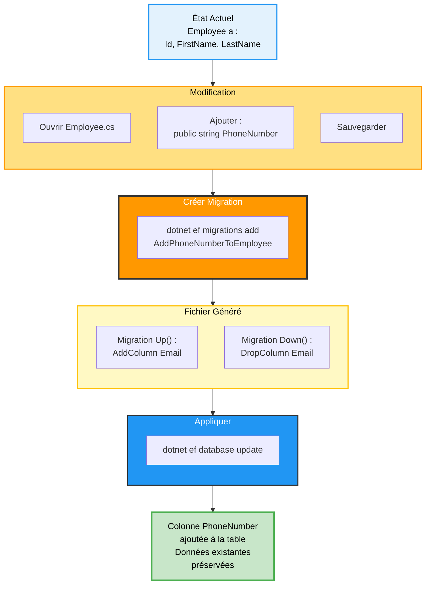
```mermaid
graph TB
    Current["État Actuel<br/>Employee a :<br/>Id, FirstName, LastName"]
    
    Current --> Modify
    
    subgraph Modify["Modification"]
        direction TB
        M1["Ouvrir Employee.cs"]
        M2["Ajouter :<br/>public string PhoneNumber"]
        M3["Sauvegarder"]
    end
    
    Modify --> Migration
    
    subgraph Migration["Créer Migration"]
        direction TB
        MG1["dotnet ef migrations add<br/>AddPhoneNumberToEmployee"]
    end
    
    Migration --> Files
    
    subgraph Files["Fichier Généré"]
        direction TB
        F1["Migration Up() :<br/>AddColumn Email"]
        F2["Migration Down() :<br/>DropColumn Email"]
    end
    
    Files --> Apply
    
    subgraph Apply["Appliquer"]
        direction TB
        A1["dotnet ef database update"]
    end
    
    Apply --> Result["Colonne PhoneNumber<br/>ajoutée à la table<br/>Données existantes<br/>préservées"]
    
    style Current fill:#E3F2FD,color:#000,stroke:#2196F3,stroke-width:2px
    style Modify fill:#FFE082,color:#000,stroke:#FF9800,stroke-width:2px
    style Migration fill:#FF9800,color:#fff,stroke:#333,stroke-width:3px
    style Files fill:#FFF9C4,color:#000,stroke:#FFC107,stroke-width:2px
    style Apply fill:#2196F3,color:#fff,stroke:#333,stroke-width:2px
    style Result fill:#C8E6C9,color:#000,stroke:#4CAF50,stroke-width:3px
```

**Étapes détaillées :**

**1. Modifier Employee.cs :**
```csharp
public class Employee
{
    public Guid Id { get; set; }
    public string FirstName { get; set; }
    public string LastName { get; set; }
    public DateTime BirthDate { get; set; }
    public string Gender { get; set; }
    public Guid TitleId { get; set; }
    public string PhoneNumber { get; set; } = string.Empty;  // NOUVEAU
    
    public Title Title { get; set; } = null!;
}
```

**2. Créer la migration :**
```bash
dotnet ef migrations add AddPhoneNumberToEmployee
```

**3. Vérifier le fichier généré :**
```csharp
// Migrations/20250930150000_AddPhoneNumberToEmployee.cs
public partial class AddPhoneNumberToEmployee : Migration
{
    protected override void Up(MigrationBuilder migrationBuilder)
    {
        migrationBuilder.AddColumn<string>(
            name: "PhoneNumber",
            table: "Employees",
            type: "nvarchar(max)",
            nullable: false,
            defaultValue: "");
    }

    protected override void Down(MigrationBuilder migrationBuilder)
    {
        migrationBuilder.DropColumn(
            name: "PhoneNumber",
            table: "Employees");
    }
}
```

**4. Appliquer à la base de données :**
```bash
dotnet ef database update
```

**Résultat :**
```
Applying migration '20250930150000_AddPhoneNumberToEmployee'.
Done.
```

---

### Scénario 3 : Modifier le Type d'une Propriété

**Situation :** Changer `Gender` de `string` à `char`.

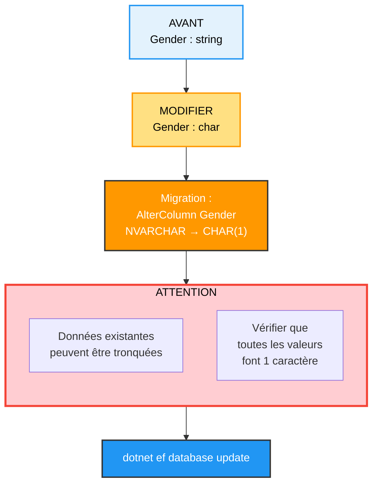
```mermaid
graph TB
    Before["AVANT<br/>Gender : string"]
    
    Before --> Change["MODIFIER<br/>Gender : char"]
    
    Change --> Migration["Migration :<br/>AlterColumn Gender<br/>NVARCHAR → CHAR(1)"]
    
    Migration --> Warning
    
    subgraph Warning["ATTENTION"]
        direction TB
        W1["Données existantes<br/>peuvent être tronquées"]
        W2["Vérifier que<br/>toutes les valeurs<br/>font 1 caractère"]
    end
    
    Warning --> Apply["dotnet ef database update"]
    
    style Before fill:#E3F2FD,color:#000,stroke:#2196F3,stroke-width:2px
    style Change fill:#FFE082,color:#000,stroke:#FF9800,stroke-width:2px
    style Migration fill:#FF9800,color:#fff,stroke:#333,stroke-width:2px
    style Warning fill:#FFCDD2,color:#000,stroke:#F44336,stroke-width:3px
    style Apply fill:#2196F3,color:#fff,stroke:#333,stroke-width:2px
```

**Commandes :**

```bash
# 1. Créer la migration
dotnet ef migrations add ChangeGenderType

# 2. Vérifier le fichier généré
# Si besoin, modifier manuellement pour gérer les données

# 3. Appliquer
dotnet ef database update
```

---

### Scénario 4 : Annuler une Migration

**Situation :** Vous avez appliqué une migration mais vous voulez revenir en arrière.

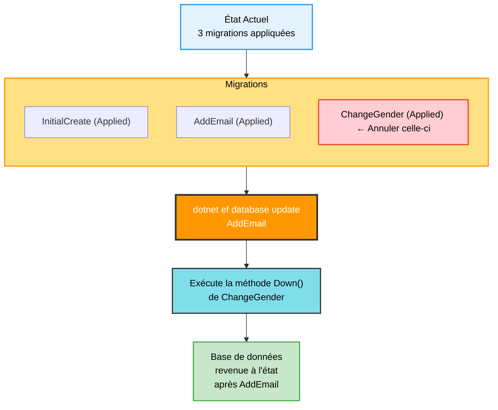
```mermaid
graph TB
    Current["État Actuel<br/>3 migrations appliquées"]
    
    Current --> List
    
    subgraph List["Migrations"]
        direction TB
        L1["InitialCreate (Applied)"]
        L2["AddEmail (Applied)"]
        L3["ChangeGender (Applied) ← Annuler celle-ci"]
    end
    
    List --> Rollback
    
    Rollback["dotnet ef database update<br/>AddEmail"]
    
    Rollback --> Execute
    
    Execute["Exécute la méthode Down()<br/>de ChangeGender"]
    
    Execute --> Result["Base de données<br/>revenue à l'état<br/>après AddEmail"]
    
    style Current fill:#E3F2FD,color:#000,stroke:#2196F3,stroke-width:2px
    style List fill:#FFE082,color:#000,stroke:#FF9800,stroke-width:2px
    style L3 fill:#FFCDD2,color:#000,stroke:#F44336,stroke-width:2px
    style Rollback fill:#FF9800,color:#fff,stroke:#333,stroke-width:3px
    style Execute fill:#80DEEA,color:#000,stroke:#333,stroke-width:2px
    style Result fill:#C8E6C9,color:#000,stroke:#4CAF50,stroke-width:2px
```

**Commandes :**

```bash
# Lister les migrations
dotnet ef migrations list

# Annuler jusqu'à une migration spécifique
dotnet ef database update AddEmail

# Annuler TOUTES les migrations (vider la DB)
dotnet ef database update 0
```

---

### Scénario 5 : Supprimer la Base et Recréer

**Situation :** Repartir de zéro avec les migrations.

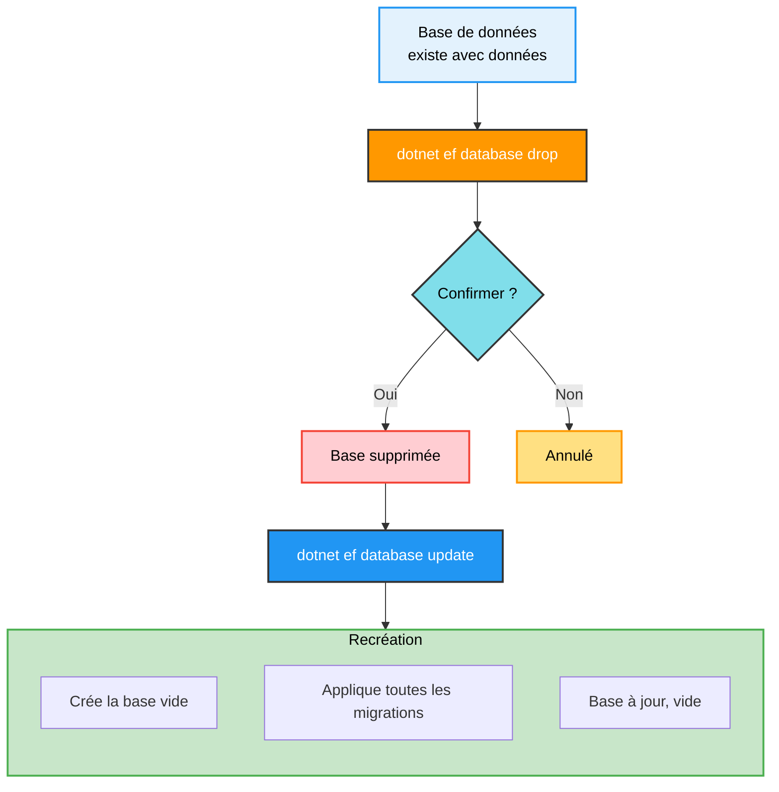
```mermaid
graph TB
    Start["Base de données<br/>existe avec données"]
    
    Start --> Drop
    
    Drop["dotnet ef database drop"]
    
    Drop --> Confirm{Confirmer ?}
    
    Confirm -->|Oui| Deleted["Base supprimée"]
    Confirm -->|Non| Cancel["Annulé"]
    
    Deleted --> Update
    
    Update["dotnet ef database update"]
    
    Update --> Recreate
    
    subgraph Recreate["Recréation"]
        direction TB
        R1["Crée la base vide"]
        R2["Applique toutes les migrations"]
        R3["Base à jour, vide"]
    end
    
    style Start fill:#E3F2FD,color:#000,stroke:#2196F3,stroke-width:2px
    style Drop fill:#FF9800,color:#fff,stroke:#333,stroke-width:2px
    style Confirm fill:#80DEEA,color:#000,stroke:#333,stroke-width:2px
    style Deleted fill:#FFCDD2,color:#000,stroke:#F44336,stroke-width:2px
    style Cancel fill:#FFE082,color:#000,stroke:#FF9800,stroke-width:2px
    style Update fill:#2196F3,color:#fff,stroke:#333,stroke-width:2px
    style Recreate fill:#C8E6C9,color:#000,stroke:#4CAF50,stroke-width:2px
```

**Commandes :**

```bash
# Supprimer la base de données
dotnet ef database drop

# Réponse : Are you sure? (y/N)
y

# Recréer avec les migrations
dotnet ef database update
```

---

## Migration XtraWork

### Passer de EnsureCreated() à Migrations

**État actuel de XtraWork :**

```csharp
// Dans Program.cs (ligne 112-116)
using (var scope = app.Services.CreateScope())
{
    var ctx = scope.ServiceProvider.GetRequiredService<XtraWorkContext>();
    ctx.Database.EnsureCreated();  // ← Méthode actuelle
}
```

**Problème avec EnsureCreated() :**
- Ne gère PAS les modifications de schéma
- Si on ajoute une propriété, elle n'est pas créée en DB
- Il faut supprimer toute la base pour recréer

### Migration XtraWork - Étape par Étape

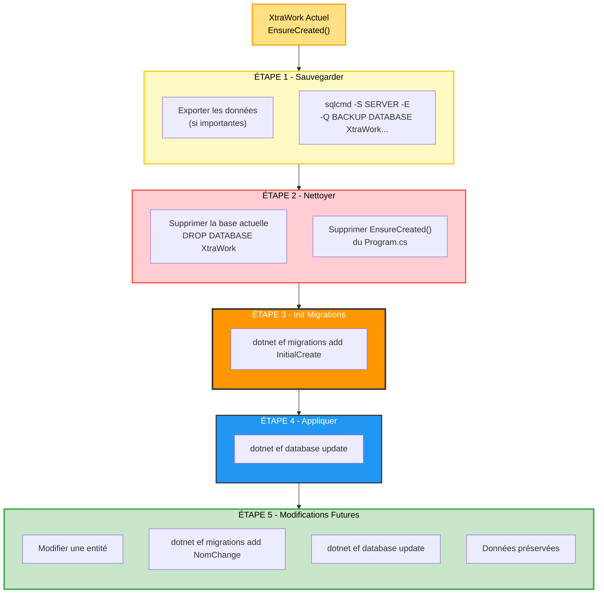
```mermaid
graph TB
    Current["XtraWork Actuel<br/>EnsureCreated()"]
    
    Current --> Backup
    
    subgraph Backup["ÉTAPE 1 - Sauvegarder"]
        direction TB
        B1["Exporter les données<br/>(si importantes)"]
        B2["sqlcmd -S SERVER -E<br/>-Q BACKUP DATABASE XtraWork..."]
    end
    
    Backup --> Remove
    
    subgraph Remove["ÉTAPE 2 - Nettoyer"]
        direction TB
        R1["Supprimer la base actuelle<br/>DROP DATABASE XtraWork"]
        R2["Supprimer EnsureCreated()<br/>du Program.cs"]
    end
    
    Remove --> Init
    
    subgraph Init["ÉTAPE 3 - Init Migrations"]
        direction TB
        I1["dotnet ef migrations add InitialCreate"]
    end
    
    Init --> Apply
    
    subgraph Apply["ÉTAPE 4 - Appliquer"]
        direction TB
        A1["dotnet ef database update"]
    end
    
    Apply --> Future
    
    subgraph Future["ÉTAPE 5 - Modifications Futures"]
        direction TB
        F1["Modifier une entité"]
        F2["dotnet ef migrations add NomChange"]
        F3["dotnet ef database update"]
        F4["Données préservées"]
    end
    
    style Current fill:#FFE082,color:#000,stroke:#FF9800,stroke-width:2px
    style Backup fill:#FFF9C4,color:#000,stroke:#FFC107,stroke-width:2px
    style Remove fill:#FFCDD2,color:#000,stroke:#F44336,stroke-width:2px
    style Init fill:#FF9800,color:#fff,stroke:#333,stroke-width:3px
    style Apply fill:#2196F3,color:#fff,stroke:#333,stroke-width:2px
    style Future fill:#C8E6C9,color:#000,stroke:#4CAF50,stroke-width:3px
```

### Commandes Pour XtraWork

**ÉTAPE 1 : Installer les outils (si pas fait)**

```bash
dotnet tool install --global dotnet-ef
```

**ÉTAPE 2 : Vérifier les packages NuGet**

Le fichier `XtraWork.csproj` doit avoir :
```xml
<PackageReference Include="Microsoft.EntityFrameworkCore.Design" Version="8.0.0" />
<PackageReference Include="Microsoft.EntityFrameworkCore.Tools" Version="8.0.0" />
```

**ÉTAPE 3 : Supprimer l'ancienne base**

```bash
# Option A : Via SQL
sqlcmd -S LAPTOP-81IAD844 -E -Q "DROP DATABASE IF EXISTS XtraWork;"

# Option B : Via dotnet ef
dotnet ef database drop --force
```

**ÉTAPE 4 : Modifier Program.cs**

**AVANT :**
```csharp
using (var scope = app.Services.CreateScope())
{
    var ctx = scope.ServiceProvider.GetRequiredService<XtraWorkContext>();
    ctx.Database.EnsureCreated();  // ← SUPPRIMER CETTE LIGNE
}
```

**APRÈS :**
```csharp
// Supprimer tout le bloc
// OU le remplacer par :
using (var scope = app.Services.CreateScope())
{
    var ctx = scope.ServiceProvider.GetRequiredService<XtraWorkContext>();
    ctx.Database.Migrate();  // ← Utilise les migrations
}
```

**ÉTAPE 5 : Créer la migration initiale**

```bash
# Aller dans le dossier du projet
cd C:\Users\rehou\Downloads\2-SuiviEtudiantsEtape2\SuiviEtudiantsEtape2\XtraWork

# Créer la migration
dotnet ef migrations add InitialCreate
```

**Résultat :**
```
Build started...
Build succeeded.
Done. To undo this action, use 'ef migrations remove'
```

**Fichiers créés :**
```
XtraWork/
└── Migrations/
    ├── 20250930_InitialCreate.cs
    └── XtraWorkContextModelSnapshot.cs
```

**ÉTAPE 6 : Appliquer la migration**

```bash
dotnet ef database update
```

**Résultat :**
```
Applying migration '20250930_InitialCreate'.
Done.
```

**ÉTAPE 7 : Vérifier**

```bash
# Lister les migrations
dotnet ef migrations list

# Résultat attendu :
# 20250930_InitialCreate (Applied)
```

**ÉTAPE 8 : Test - Ajouter une propriété**

```csharp
// Dans Employee.cs
public string Department { get; set; } = string.Empty;
```

```bash
# Créer la migration
dotnet ef migrations add AddDepartmentToEmployee

# Appliquer
dotnet ef database update
```

**Résultat :** La colonne `Department` est ajoutée SANS supprimer les données existantes !

---

## Commandes Complètes - Référence Rapide

### Commandes de Base

```bash
# Créer une migration
dotnet ef migrations add NomDeLaMigration

# Appliquer les migrations
dotnet ef database update

# Lister les migrations
dotnet ef migrations list

# Supprimer la dernière migration (non appliquée)
dotnet ef migrations remove

# Générer le script SQL
dotnet ef migrations script

# Appliquer jusqu'à une migration spécifique
dotnet ef database update NomDeLaMigration

# Annuler toutes les migrations
dotnet ef database update 0

# Supprimer la base de données
dotnet ef database drop
dotnet ef database drop --force  # Sans confirmation
```

### Commandes Avancées

```bash
# Voir les infos du DbContext
dotnet ef dbcontext info

# Lister tous les DbContext
dotnet ef dbcontext list

# Générer le script SQL depuis une migration spécifique
dotnet ef migrations script InitialCreate AddEmail

# Générer un script SQL idempotent (vérifications IF EXISTS)
dotnet ef migrations script --idempotent

# Créer une migration vide (pour du SQL personnalisé)
dotnet ef migrations add CustomChanges --no-build

# Appliquer en mode verbose (debug)
dotnet ef database update --verbose
```

### Options Utiles

```bash
# Spécifier le projet
dotnet ef migrations add Init --project XtraWork

# Spécifier le dossier de sortie
dotnet ef migrations add Init --output-dir Data/Migrations

# Spécifier le contexte (si plusieurs DbContext)
dotnet ef migrations add Init --context XtraWorkContext

# Sans rebuild
dotnet ef migrations add Init --no-build
```

---

## Flux de Travail Complet

### Développement Quotidien avec Migrations


```mermaid
graph TB
    Day1["JOUR 1<br/>Créer le projet"]
    
    Day1 --> D1M1["dotnet ef migrations add InitialCreate"]
    D1M1 --> D1M2["dotnet ef database update"]
    
    D1M2 --> Day2["JOUR 2<br/>Ajouter Email à Employee"]
    
    Day2 --> D2M1["Modifier Employee.cs"]
    D2M1 --> D2M2["dotnet ef migrations add AddEmail"]
    D2M2 --> D2M3["dotnet ef database update"]
    
    D2M3 --> Day3["JOUR 3<br/>Ajouter entity Department"]
    
    Day3 --> D3M1["Créer Department.cs"]
    D3M1 --> D3M2["Ajouter DbSet<Department>"]
    D3M2 --> D3M3["dotnet ef migrations add AddDepartment"]
    D3M3 --> D3M4["dotnet ef database update"]
    
    D3M4 --> Day4["JOUR 4<br/>Corriger un nom de colonne"]
    
    Day4 --> D4M1["Renommer propriété"]
    D4M1 --> D4M2["dotnet ef migrations add RenameColumn"]
    D4M2 --> D4M3["dotnet ef database update"]
    
    style Day1 fill:#FFE082,color:#000,stroke:#333,stroke-width:2px
    style Day2 fill:#FFE082,color:#000,stroke:#333,stroke-width:2px
    style Day3 fill:#FFE082,color:#000,stroke:#333,stroke-width:2px
    style Day4 fill:#FFE082,color:#000,stroke:#333,stroke-width:2px
    style D1M1 fill:#FF9800,color:#fff,stroke:#333,stroke-width:2px
    style D1M2 fill:#2196F3,color:#fff,stroke:#333,stroke-width:2px
    style D2M2 fill:#FF9800,color:#fff,stroke:#333,stroke-width:2px
    style D2M3 fill:#2196F3,color:#fff,stroke:#333,stroke-width:2px
    style D3M3 fill:#FF9800,color:#fff,stroke:#333,stroke-width:2px
    style D3M4 fill:#2196F3,color:#fff,stroke:#333,stroke-width:2px
    style D4M2 fill:#FF9800,color:#fff,stroke:#333,stroke-width:2px
    style D4M3 fill:#2196F3,color:#fff,stroke:#333,stroke-width:2px
```

### Historique des Migrations

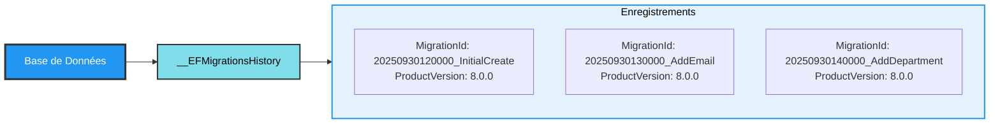
```mermaid
graph LR
    DB["Base de Données"]
    
    DB --> Table["__EFMigrationsHistory"]
    
    Table --> Records
    
    subgraph Records["Enregistrements"]
        direction TB
        R1["MigrationId: 20250930120000_InitialCreate<br/>ProductVersion: 8.0.0"]
        R2["MigrationId: 20250930130000_AddEmail<br/>ProductVersion: 8.0.0"]
        R3["MigrationId: 20250930140000_AddDepartment<br/>ProductVersion: 8.0.0"]
    end
    
    style DB fill:#2196F3,color:#fff,stroke:#333,stroke-width:3px
    style Table fill:#80DEEA,color:#000,stroke:#333,stroke-width:2px
    style Records fill:#E3F2FD,color:#000,stroke:#2196F3,stroke-width:2px
```

Cette table spéciale permet à EF Core de savoir quelles migrations ont déjà été appliquées.

---

## Bonnes Pratiques

### 1. Nommage des Migrations

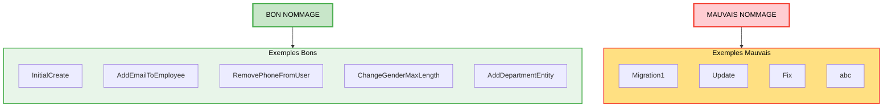
```mermaid
graph TB
    Good["BON NOMMAGE"]
    Bad["MAUVAIS NOMMAGE"]
    
    Good --> GoodEx
    Bad --> BadEx
    
    subgraph GoodEx["Exemples Bons"]
        direction TB
        G1["InitialCreate"]
        G2["AddEmailToEmployee"]
        G3["RemovePhoneFromUser"]
        G4["ChangeGenderMaxLength"]
        G5["AddDepartmentEntity"]
    end
    
    subgraph BadEx["Exemples Mauvais"]
        direction TB
        B1["Migration1"]
        B2["Update"]
        B3["Fix"]
        B4["abc"]
    end
    
    style Good fill:#C8E6C9,color:#000,stroke:#4CAF50,stroke-width:3px
    style Bad fill:#FFCDD2,color:#000,stroke:#F44336,stroke-width:3px
    style GoodEx fill:#E8F5E9,color:#000,stroke:#4CAF50,stroke-width:2px
    style BadEx fill:#FFE082,color:#000,stroke:#F44336,stroke-width:2px
```

**Règles :**
- Nom descriptif (ce que fait la migration)
- En anglais
- PascalCase
- Verbe d'action (Add, Remove, Change, Update)

### 2. Fréquence des Migrations

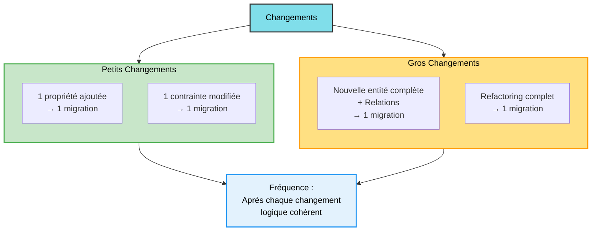
```mermaid
graph TB
    Changes["Changements"]
    
    Changes --> Small
    Changes --> Big
    
    subgraph Small["Petits Changements"]
        direction TB
        S1["1 propriété ajoutée<br/>→ 1 migration"]
        S2["1 contrainte modifiée<br/>→ 1 migration"]
    end
    
    subgraph Big["Gros Changements"]
        direction TB
        B1["Nouvelle entité complète<br/>+ Relations<br/>→ 1 migration"]
        B2["Refactoring complet<br/>→ 1 migration"]
    end
    
    Small --> Frequency["Fréquence :<br/>Après chaque changement<br/>logique cohérent"]
    Big --> Frequency
    
    style Changes fill:#80DEEA,color:#000,stroke:#333,stroke-width:2px
    style Small fill:#C8E6C9,color:#000,stroke:#4CAF50,stroke-width:2px
    style Big fill:#FFE082,color:#000,stroke:#FF9800,stroke-width:2px
    style Frequency fill:#E3F2FD,color:#000,stroke:#2196F3,stroke-width:2px
```

**Recommandation :**
- Créer une migration par **fonctionnalité**
- Pas une migration par propriété (trop granulaire)
- Pas tout dans une migration (trop gros)

### 3. Vérifier Avant d'Appliquer

```bash
# 1. Créer la migration
dotnet ef migrations add AddEmail

# 2. Générer le SQL pour vérifier
dotnet ef migrations script

# 3. Vérifier le SQL généré
# (Ouvrir le fichier ou copier l'output)

# 4. Si OK, appliquer
dotnet ef database update
```

### 4. Ne Jamais Modifier une Migration Appliquée

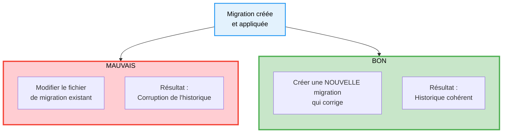
```mermaid
graph TB
    Migration["Migration créée<br/>et appliquée"]
    
    Migration --> Wrong
    Migration --> Right
    
    subgraph Wrong["MAUVAIS"]
        direction TB
        W1["Modifier le fichier<br/>de migration existant"]
        W2["Résultat :<br/>Corruption de l'historique"]
    end
    
    subgraph Right["BON"]
        direction TB
        R1["Créer une NOUVELLE migration<br/>qui corrige"]
        R2["Résultat :<br/>Historique cohérent"]
    end
    
    style Migration fill:#E3F2FD,color:#000,stroke:#2196F3,stroke-width:2px
    style Wrong fill:#FFCDD2,color:#000,stroke:#F44336,stroke-width:3px
    style Right fill:#C8E6C9,color:#000,stroke:#4CAF50,stroke-width:3px
```

---

## Dépannage

### Problème 1 : "Build failed"

**Erreur :**
```
Build failed. Use dotnet build to see the errors.
```

**Solution :**

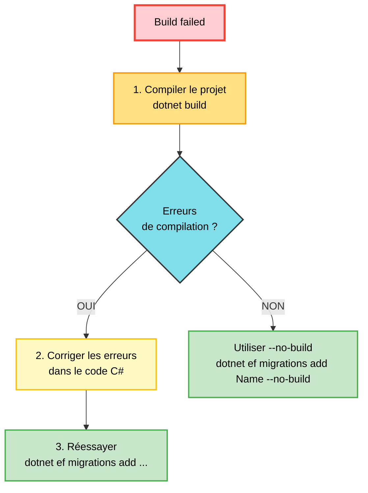
```mermaid
graph TB
    Error["Build failed"]
    
    Error --> Fix1["1. Compiler le projet<br/>dotnet build"]
    
    Fix1 --> Check{Erreurs<br/>de compilation ?}
    
    Check -->|OUI| Fix2["2. Corriger les erreurs<br/>dans le code C#"]
    
    Fix2 --> Retry["3. Réessayer<br/>dotnet ef migrations add ..."]
    
    Check -->|NON| Fix3["Utiliser --no-build<br/>dotnet ef migrations add Name --no-build"]
    
    style Error fill:#FFCDD2,color:#000,stroke:#F44336,stroke-width:3px
    style Fix1 fill:#FFE082,color:#000,stroke:#FF9800,stroke-width:2px
    style Check fill:#80DEEA,color:#000,stroke:#333,stroke-width:2px
    style Fix2 fill:#FFF9C4,color:#000,stroke:#FFC107,stroke-width:2px
    style Retry fill:#C8E6C9,color:#000,stroke:#4CAF50,stroke-width:2px
    style Fix3 fill:#C8E6C9,color:#000,stroke:#4CAF50,stroke-width:2px
```

**Commandes :**
```bash
# Vérifier les erreurs
dotnet build

# Si erreurs, les corriger puis :
dotnet ef migrations add NomMigration
```

---

### Problème 2 : "No DbContext was found"

**Erreur :**
```
No DbContext was found in assembly 'XtraWork'
```

**Solution :**

```bash
# Spécifier le contexte explicitement
dotnet ef migrations add Init --context XtraWorkContext

# Vérifier que XtraWorkContext hérite de DbContext
# Vérifier que le namespace est correct
```

---

### Problème 3 : "Unable to create migrations"

**Erreur :**
```
Unable to create an object of type 'XtraWorkContext'
```

**Cause :** Le DbContext nécessite un constructeur avec `DbContextOptions`.

**Solution :**

Vérifier que `XtraWorkContext.cs` a :

```csharp
public class XtraWorkContext : DbContext
{
    // Ce constructeur est OBLIGATOIRE pour les migrations
    public XtraWorkContext(DbContextOptions<XtraWorkContext> options) 
        : base(options)
    {
    }
    
    public DbSet<User> Users { get; set; }
    public DbSet<Title> Titles { get; set; }
    public DbSet<Employee> Employees { get; set; }
}
```

---

### Problème 4 : Migration Déjà Appliquée

**Erreur :**
```
The migration '...' has already been applied to the database.
```

**Solution :**

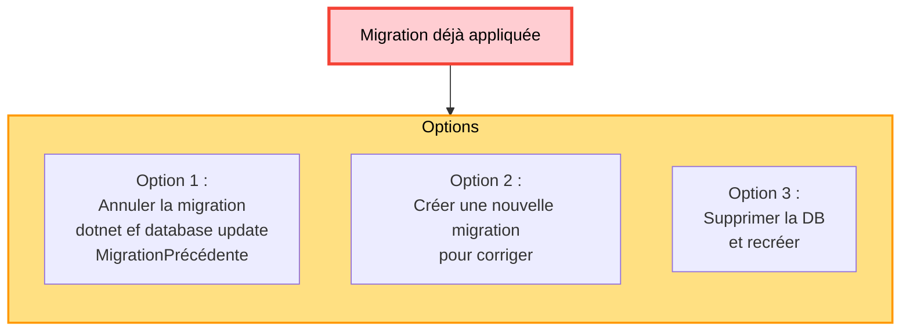
```mermaid
graph TB
    Error["Migration déjà appliquée"]
    
    Error --> Options
    
    subgraph Options["Options"]
        direction TB
        O1["Option 1 :<br/>Annuler la migration<br/>dotnet ef database update<br/>MigrationPrécédente"]
        O2["Option 2 :<br/>Créer une nouvelle migration<br/>pour corriger"]
        O3["Option 3 :<br/>Supprimer la DB<br/>et recréer"]
    end
    
    style Error fill:#FFCDD2,color:#000,stroke:#F44336,stroke-width:3px
    style Options fill:#FFE082,color:#000,stroke:#FF9800,stroke-width:2px
```

---

### Problème 5 : Conflit de Migration

**Situation :** Deux développeurs créent des migrations en parallèle.

```mermaid
graph TB
    Dev1["Développeur 1"]
    Dev2["Développeur 2"]
    
    Dev1 --> M1["Migration A<br/>20250930120000"]
    Dev2 --> M2["Migration B<br/>20250930120001"]
    
    M1 --> Conflict
    M2 --> Conflict
    
    Conflict["CONFLIT<br/>Deux migrations<br/>avec timestamps proches"]
    
    Conflict --> Solution
    
    subgraph Solution["Solution"]
        direction TB
        S1["1. Récupérer les deux migrations"]
        S2["2. Supprimer les migrations locales"]
        S3["3. dotnet ef database update"]
        S4["4. Recréer sa propre migration"]
    end
    
    style Dev1 fill:#FFE082,color:#000,stroke:#333,stroke-width:2px
    style Dev2 fill:#FFE082,color:#000,stroke:#333,stroke-width:2px
    style Conflict fill:#FFCDD2,color:#000,stroke:#F44336,stroke-width:3px
    style Solution fill:#C8E6C9,color:#000,stroke:#4CAF50,stroke-width:2px
```

---

## Exemple Complet : XtraWork avec Migrations

### Scénario : Ajouter PhoneNumber à Employee

**Résumé Visuel :**

```mermaid
graph TB
    Step1["1. Modifier<br/>Employee.cs"]
    
    Step1 --> Code
    
    subgraph Code["Code"]
        direction TB
        C1["public string PhoneNumber"]
    end
    
    Code --> Step2["2. Créer Migration"]
    
    Step2 --> CMD1["dotnet ef migrations add<br/>AddPhoneToEmployee"]
    
    CMD1 --> Step3["3. Vérifier"]
    
    Step3 --> Files
    
    subgraph Files["Fichiers Générés"]
        direction TB
        F1["20250930_AddPhoneToEmployee.cs"]
        F2["Snapshot mis à jour"]
    end
    
    Files --> Step4["4. Appliquer"]
    
    Step4 --> CMD2["dotnet ef database update"]
    
    CMD2 --> Result["Table Employees<br/>Colonne PhoneNumber ajoutée<br/>Données préservées"]
    
    style Step1 fill:#FFE082,color:#000,stroke:#FF9800,stroke-width:2px
    style Code fill:#C8E6C9,color:#000,stroke:#4CAF50,stroke-width:2px
    style Step2 fill:#FF9800,color:#fff,stroke:#333,stroke-width:2px
    style CMD1 fill:#FFF9C4,color:#000,stroke:#FFC107,stroke-width:2px
    style Step3 fill:#80DEEA,color:#000,stroke:#333,stroke-width:2px
    style Files fill:#E3F2FD,color:#000,stroke:#2196F3,stroke-width:2px
    style Step4 fill:#2196F3,color:#fff,stroke:#333,stroke-width:2px
    style CMD2 fill:#FFF9C4,color:#000,stroke:#FFC107,stroke-width:2px
    style Result fill:#C8E6C9,color:#000,stroke:#4CAF50,stroke-width:3px
```

**Étapes Détaillées :**

**ÉTAPE 1 : Modifier Employee.cs**

```csharp
public class Employee
{
    public Guid Id { get; set; }
    public string FirstName { get; set; } = string.Empty;
    public string LastName { get; set; } = string.Empty;
    public DateTime BirthDate { get; set; }
    public string Gender { get; set; } = string.Empty;
    public Guid TitleId { get; set; }
    public DateTime CreatedAt { get; set; } = DateTime.UtcNow;
    
    // NOUVEAU
    public string PhoneNumber { get; set; } = string.Empty;
    
    public Title Title { get; set; } = null!;
}
```

**ÉTAPE 2 : Créer la Migration**

```bash
cd C:\Users\rehou\Downloads\2-SuiviEtudiantsEtape2\SuiviEtudiantsEtape2\XtraWork

dotnet ef migrations add AddPhoneNumberToEmployee
```

**ÉTAPE 3 : Vérifier le Fichier Généré**

```csharp
// Migrations/20250930_AddPhoneNumberToEmployee.cs
public partial class AddPhoneNumberToEmployee : Migration
{
    protected override void Up(MigrationBuilder migrationBuilder)
    {
        migrationBuilder.AddColumn<string>(
            name: "PhoneNumber",
            table: "Employees",
            type: "nvarchar(max)",
            nullable: false,
            defaultValue: "");
    }

    protected override void Down(MigrationBuilder migrationBuilder)
    {
        migrationBuilder.DropColumn(
            name: "PhoneNumber",
            table: "Employees");
    }
}
```

**ÉTAPE 4 : Appliquer la Migration**

```bash
dotnet ef database update
```

**Résultat :**
```
Applying migration '20250930_AddPhoneNumberToEmployee'.
Done.
```

**ÉTAPE 5 : Vérifier en SQL**

```sql
-- Vérifier que la colonne existe
SELECT COLUMN_NAME, DATA_TYPE 
FROM INFORMATION_SCHEMA.COLUMNS 
WHERE TABLE_NAME = 'Employees';

-- Résultat :
-- PhoneNumber | nvarchar
```

---

## Résumé - Quand Utiliser les Migrations ?

### Décision : EnsureCreated vs Migrations

```mermaid
graph TB
    Start{Type de<br/>Projet ?}
    
    Start -->|Prototype<br/>Rapide| UseEnsure
    Start -->|Application<br/>Réelle| UseMig
    
    subgraph UseEnsure["Utiliser EnsureCreated()"]
        direction TB
        E1["- Développement initial"]
        E2["- Tests rapides"]
        E3["- Pas de données importantes"]
        E4["- Suppression/Recréation OK"]
    end
    
    subgraph UseMig["Utiliser Migrations"]
        direction TB
        M1["- Production"]
        M2["- Données à préserver"]
        M3["- Équipe de développeurs"]
        M4["- Évolution du schéma"]
    end
    
    UseEnsure --> Current["XtraWork ACTUEL<br/>EnsureCreated()"]
    
    UseMig --> Future["XtraWork FUTUR<br/>Migrations recommandées"]
    
    style Start fill:#80DEEA,color:#000,stroke:#333,stroke-width:3px
    style UseEnsure fill:#FFE082,color:#000,stroke:#FF9800,stroke-width:2px
    style UseMig fill:#C8E6C9,color:#000,stroke:#4CAF50,stroke-width:3px
    style Current fill:#FFF9C4,color:#000,stroke:#FFC107,stroke-width:2px
    style Future fill:#4CAF50,color:#fff,stroke:#333,stroke-width:2px
```

---

## Aide-Mémoire

### Commandes Essentielles

```
╔════════════════════════════════════════════════════════════╗
║           MIGRATIONS ENTITY FRAMEWORK CORE                 ║
╚════════════════════════════════════════════════════════════╝

INSTALLATION
------------
dotnet tool install --global dotnet-ef
dotnet tool update --global dotnet-ef
dotnet ef --version


CRÉER UNE MIGRATION
-------------------
dotnet ef migrations add NomDeLaMigration


APPLIQUER LES MIGRATIONS
-------------------------
dotnet ef database update                    # Toutes les migrations
dotnet ef database update NomMigration       # Jusqu'à une migration
dotnet ef database update 0                  # Annuler toutes


LISTER LES MIGRATIONS
---------------------
dotnet ef migrations list


SUPPRIMER LA DERNIÈRE MIGRATION (non appliquée)
-----------------------------------------------
dotnet ef migrations remove


GÉNÉRER LE SCRIPT SQL
---------------------
dotnet ef migrations script                  # Tout
dotnet ef migrations script From To          # Entre deux migrations
dotnet ef migrations script --idempotent     # Avec IF EXISTS


BASE DE DONNÉES
---------------
dotnet ef database drop                      # Supprimer
dotnet ef database drop --force              # Sans confirmation


INFORMATIONS
------------
dotnet ef dbcontext info                     # Info sur DbContext
dotnet ef dbcontext list                     # Lister les contextes
```

---

## Conclusion

### Récapitulatif

```mermaid
graph TB
    Start["Changement dans<br/>Entity (Code First)"]
    
    Start --> Create["dotnet ef migrations add<br/>NomDuChangement"]
    
    Create --> Files["Fichiers créés<br/>dans /Migrations"]
    
    Files --> Apply["dotnet ef database update"]
    
    Apply --> DB["Base de données<br/>mise à jour"]
    
    DB --> History["Historique dans<br/>__EFMigrationsHistory"]
    
    History --> Next["Prêt pour le<br/>prochain changement"]
    
    style Start fill:#FFE082,color:#000,stroke:#FF9800,stroke-width:3px
    style Create fill:#FF9800,color:#fff,stroke:#333,stroke-width:2px
    style Files fill:#E3F2FD,color:#000,stroke:#2196F3,stroke-width:2px
    style Apply fill:#2196F3,color:#fff,stroke:#333,stroke-width:2px
    style DB fill:#C8E6C9,color:#000,stroke:#4CAF50,stroke-width:2px
    style History fill:#80DEEA,color:#000,stroke:#333,stroke-width:2px
    style Next fill:#C8E6C9,color:#000,stroke:#4CAF50,stroke-width:3px
```

### Points Clés

✅ **Migrations = Historique** des changements du schéma  
✅ **Code First** : On modifie C#, la DB suit  
✅ **Commandes simples** : `add` puis `update`  
✅ **Données préservées** contrairement à EnsureCreated  
✅ **Rollback possible** avec la méthode Down()  
✅ **Production-ready** avec scripts SQL  

---

**Document créé le :** 30 septembre 2025  
**Version :** 1.0  
**Projet :** XtraWork API  
**Sujet :** Entity Framework Core Migrations
