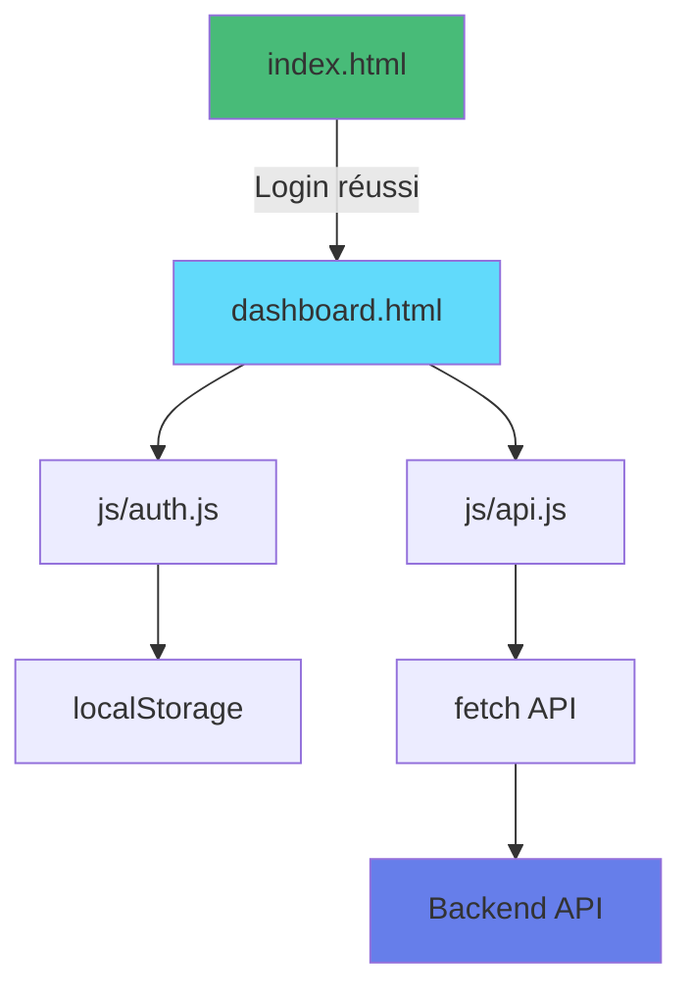
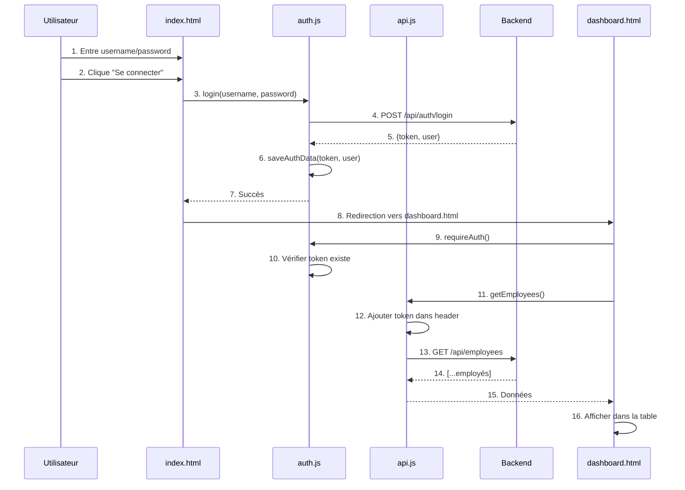

# Explications Pédagogiques - HTML Vanilla Simple

## Vue d'ensemble

Cet exemple démontre comment créer un frontend **sans aucun framework**, en utilisant seulement les technologies natives du navigateur.

---

## Architecture de l'exemple



---

## Fichiers et leurs rôles

### 1. index.html - Page de login

**Rôle** : Point d'entrée de l'application

**Responsabilités** :
- Afficher le formulaire de connexion
- Collecter username et password
- Appeler la fonction `login()`
- Rediriger vers dashboard.html si succès

**Code clé** :
```javascript
form.addEventListener('submit', async (event) => {
    event.preventDefault();  // Empêcher rechargement de la page
    
    const username = usernameInput.value.trim();
    const password = passwordInput.value;
    
    await login(username, password);  // Fonction dans auth.js
    window.location.href = 'dashboard.html';
});
```

---

### 2. dashboard.html - Dashboard principal

**Rôle** : Afficher les données après authentification

**Responsabilités** :
- Vérifier l'authentification (sinon rediriger)
- Afficher les infos utilisateur
- Charger et afficher les employés
- Charger et afficher les titres
- Permettre la déconnexion

**Code clé** :
```javascript
// Protection de la page
requireAuth();  // Redirige vers index.html si pas connecté

// Affichage des infos utilisateur
const user = getCurrentUser();
document.getElementById('user-fullname').textContent = `${user.firstName} ${user.lastName}`;

// Chargement des données
loadEmployees();
loadTitles();
```

---

### 3. js/config.js - Configuration

**Rôle** : Centraliser la configuration

**Contenu** :
```javascript
const API_BASE_URL = 'https://localhost:7033/api';

const STORAGE_KEYS = {
    TOKEN: 'xtrawork_token',
    USER: 'xtrawork_user'
};
```

**Pourquoi c'est important** :
- Si l'URL de l'API change, on la modifie à un seul endroit
- Éviter les "magic strings" dans le code
- Faciliter la configuration

---

### 4. js/auth.js - Authentification

**Rôle** : Gérer tout ce qui concerne l'authentification

**Fonctions principales** :

#### login(username, password)

**Ce qu'elle fait** :
1. Envoie une requête POST à `/api/auth/login`
2. Si succès : sauvegarde le token et les infos user
3. Si échec : lance une exception avec le message d'erreur

**Code** :
```javascript
async function login(username, password) {
    const response = await fetch(`${API_BASE_URL}/auth/login`, {
        method: 'POST',
        headers: { 'Content-Type': 'application/json' },
        body: JSON.stringify({ username, password })
    });
    
    if (!response.ok) {
        throw new Error('Nom d\'utilisateur ou mot de passe incorrect');
    }
    
    const data = await response.json();
    saveAuthData(data.token, data.user);
    return data;
}
```

#### isAuthenticated()

**Ce qu'elle fait** :
Vérifie si un token existe dans localStorage

**Code** :
```javascript
function isAuthenticated() {
    const token = localStorage.getItem(STORAGE_KEYS.TOKEN);
    return token !== null && token !== '';
}
```

#### requireAuth()

**Ce qu'elle fait** :
Protège une page en redirigeant vers login si pas connecté

**Code** :
```javascript
function requireAuth() {
    if (!isAuthenticated()) {
        window.location.href = 'index.html';
        return false;
    }
    return true;
}
```

---

### 5. js/api.js - Appels API

**Rôle** : Communiquer avec le backend

**Fonctions principales** :

#### fetchAPI(endpoint, options)

**Ce qu'elle fait** :
1. Construit l'URL complète
2. Ajoute automatiquement le token JWT dans les headers
3. Effectue la requête
4. Gère les erreurs (401, 404, 500, etc.)
5. Retourne les données JSON

**Code** :
```javascript
async function fetchAPI(endpoint, options = {}) {
    const url = `${API_BASE_URL}${endpoint}`;
    
    const headers = {
        'Content-Type': 'application/json',
        ...options.headers
    };
    
    // Ajouter le token JWT
    const token = getToken();
    if (token) {
        headers['Authorization'] = `Bearer ${token}`;
    }
    
    const response = await fetch(url, { ...options, headers });
    
    // Gérer 401 (token expiré)
    if (response.status === 401) {
        clearAuthData();
        window.location.href = 'index.html';
        throw new Error('Session expirée');
    }
    
    return await response.json();
}
```

#### getEmployees()

**Ce qu'elle fait** :
Récupère la liste des employés depuis `/api/employees`

**Code** :
```javascript
async function getEmployees() {
    return await fetchAPI('/employees');
}
```

---

### 6. css/style.css - Styles

**Rôle** : Rendre l'application visuellement agréable

**Organisation** :
- Reset CSS (normaliser tous les navigateurs)
- Styles de base (body, containers)
- Composants (boutons, formulaires, tables)
- Layout (header, sections)
- Utilitaires (hidden, text-center, etc.)
- Responsive (media queries)

---

## Concepts techniques expliqués

### 1. localStorage

**Qu'est-ce que c'est ?**
Un espace de stockage dans le navigateur pour sauvegarder des données.

**Utilisation** :
```javascript
// Sauvegarder
localStorage.setItem('cle', 'valeur');

// Récupérer
const valeur = localStorage.getItem('cle');

// Supprimer
localStorage.removeItem('cle');

// Tout supprimer
localStorage.clear();
```

**Dans notre app** :
- On sauvegarde le token JWT
- On sauvegarde les infos utilisateur (JSON stringifié)

**Avantages** :
- Persiste même après fermeture du navigateur
- Facile à utiliser
- Pas besoin de serveur

**Inconvénients** :
- Accessible en JavaScript (risque XSS)
- Limité à ~5-10 MB
- Seulement côté client

---

### 2. Fetch API

**Qu'est-ce que c'est ?**
L'API native du navigateur pour faire des requêtes HTTP.

**Syntaxe de base** :
```javascript
const response = await fetch(url, {
    method: 'GET',    // ou POST, PUT, DELETE
    headers: {
        'Content-Type': 'application/json'
    },
    body: JSON.stringify(data)  // Pour POST/PUT
});

const data = await response.json();
```

**Dans notre app** :
```javascript
// GET - Récupérer des données
const employees = await fetch('https://localhost:7033/api/employees', {
    headers: { 'Authorization': `Bearer ${token}` }
});

// POST - Envoyer des données
const response = await fetch('https://localhost:7033/api/auth/login', {
    method: 'POST',
    headers: { 'Content-Type': 'application/json' },
    body: JSON.stringify({ username, password })
});
```

---

### 3. JWT (JSON Web Token)

**Qu'est-ce que c'est ?**
Un token sécurisé qui prouve l'identité de l'utilisateur.

**Structure** :
```
eyJhbGciOiJIUzI1NiIsInR5cCI6IkpXVCJ9.eyJzdWIiOiIxMjM0NTY3ODkwIn0.SflKxwRJ...
│                                    │                           │
│        Header                      │       Payload             │    Signature
```

**Dans notre app** :
1. Login → Backend génère un token
2. Frontend sauvegarde le token
3. Chaque requête envoie le token dans le header :
   ```
   Authorization: Bearer {token}
   ```
4. Backend valide le token et autorise la requête

**Expiration** : 24 heures

---

### 4. Async/Await et Promises

**Qu'est-ce que c'est ?**
Une façon de gérer le code asynchrone (qui prend du temps).

**Sans async/await** (ancien style) :
```javascript
fetch(url)
    .then(response => response.json())
    .then(data => console.log(data))
    .catch(error => console.error(error));
```

**Avec async/await** (moderne) :
```javascript
async function getData() {
    try {
        const response = await fetch(url);
        const data = await response.json();
        console.log(data);
    } catch (error) {
        console.error(error);
    }
}
```

**Dans notre app** :
Toutes les fonctions qui font des requêtes HTTP sont `async` :
```javascript
async function login(username, password) {
    const response = await fetch(...);  // Attend la réponse
    const data = await response.json(); // Attend le parsing JSON
    return data;
}
```

---

### 5. Manipulation du DOM

**Qu'est-ce que c'est ?**
Modifier le HTML dynamiquement avec JavaScript.

**Opérations courantes** :

**Récupérer un élément** :
```javascript
const element = document.getElementById('mon-id');
const element = document.querySelector('.ma-classe');
```

**Modifier le contenu** :
```javascript
element.textContent = 'Nouveau texte';
element.innerHTML = '<strong>HTML</strong>';
```

**Ajouter/Supprimer des classes** :
```javascript
element.classList.add('hidden');
element.classList.remove('hidden');
```

**Créer un élément** :
```javascript
const row = document.createElement('tr');
row.innerHTML = `<td>Contenu</td>`;
tbody.appendChild(row);
```

**Dans notre app** :
```javascript
// Afficher les employés dynamiquement
employees.forEach(employee => {
    const row = document.createElement('tr');
    row.innerHTML = `
        <td>${employee.firstName}</td>
        <td>${employee.lastName}</td>
    `;
    tbody.appendChild(row);
});
```

---

## Flow complet de l'application

### Scénario : Login puis affichage des employés



---

## Gestion des erreurs expliquée

### Pourquoi gérer les erreurs ?

Sans gestion d'erreurs, si l'API ne répond pas, l'application crashe silencieusement.

Avec gestion d'erreurs, on informe l'utilisateur du problème.

### Types d'erreurs gérées

**1. Erreur de connexion (401)** :
```javascript
if (response.status === 401) {
    // Token invalide ou expiré
    clearAuthData();
    window.location.href = 'index.html';
}
```

**2. Erreur réseau** :
```javascript
catch (error) {
    if (error.message.includes('Failed to fetch')) {
        throw new Error('API non accessible. Vérifiez qu\'elle est démarrée.');
    }
}
```

**3. Erreur serveur (500)** :
```javascript
if (!response.ok) {
    const error = await response.json();
    throw new Error(error.message || 'Erreur serveur');
}
```

---

## Sécurité

### Ce qui est fait

**Stockage du token** :
- Token dans localStorage (standard pour les SPA)
- Pas de stockage du mot de passe

**Envoi du token** :
- Toujours dans le header Authorization
- Format : `Bearer {token}`

**Protection des pages** :
- Vérification de l'authentification au chargement
- Redirection automatique si non connecté

### Limitations de sécurité

Cet exemple est à but pédagogique. En production :

**À ajouter** :
- HTTPS obligatoire (pas de HTTP)
- Refresh token (renouveler le token)
- httpOnly cookies (plus sécurisé que localStorage)
- CSP (Content Security Policy)
- Validation côté client ET serveur

**Risques actuels** :
- localStorage accessible en JavaScript (risque XSS)
- Pas de protection CSRF
- Certificat SSL auto-signé (dev uniquement)

---

## Points d'apprentissage

### Ce que vous apprenez avec cet exemple

**1. Communication HTTP**
- Méthodes HTTP (GET, POST)
- Headers (Content-Type, Authorization)
- Body (JSON stringify)
- Status codes (200, 401, 404, 500)

**2. JavaScript moderne**
- async/await
- Promises
- Arrow functions
- Template literals
- Destructuring

**3. Authentification**
- Flow JWT complet
- Stockage du token
- Envoi du token
- Gestion de l'expiration

**4. DOM Manipulation**
- querySelector/getElementById
- createElement
- innerHTML
- classList (add, remove)
- addEventListener

**5. Gestion d'état simple**
- localStorage pour persistance
- Variables globales pour données temporaires
- Rechargement des données au besoin

---

## Comparaison avec les frameworks

### Ce que fait cet exemple manuellement

**Gestion du routing** :
```javascript
// Manuel : Redirection explicite
window.location.href = 'dashboard.html';

// Framework (React Router) :
// navigate('/dashboard');
```

**Gestion de l'état** :
```javascript
// Manuel : localStorage + rechargement
const user = JSON.parse(localStorage.getItem('user'));

// Framework (React useState) :
// const [user, setUser] = useState(null);
```

**Affichage des données** :
```javascript
// Manuel : Manipulation DOM
employees.forEach(emp => {
    const row = document.createElement('tr');
    tbody.appendChild(row);
});

// Framework (React) :
// {employees.map(emp => <tr key={emp.id}>...</tr>)}
```

**Réutilisation** :
```javascript
// Manuel : Copy-paste le code
// Répéter le même code pour chaque table

// Framework :
// <EmployeeTable data={employees} />
```

---

## Exercices pratiques

### Exercice 1 : Modifier le design

**Objectif** : Personnaliser l'apparence

**Tâches** :
1. Changer les couleurs dans `css/style.css`
2. Modifier le gradient de fond
3. Ajouter un logo
4. Changer la police de caractères

**Fichier à modifier** : `css/style.css`

---

### Exercice 2 : Ajouter le comptage

**Objectif** : Afficher le nombre total d'employés et titres

**Tâches** :
1. Ajouter deux `<div>` dans dashboard.html
2. Après chargement, afficher le `employees.length`
3. Faire pareil pour les titres

**Indice** :
```javascript
async function loadEmployees() {
    const employees = await getEmployees();
    
    // Afficher le nombre
    document.getElementById('employee-count').textContent = employees.length;
    
    // ... reste du code
}
```

---

### Exercice 3 : Ajouter la recherche

**Objectif** : Filtrer la liste des employés

**Tâches** :
1. Ajouter un champ `<input type="text">` au-dessus de la table
2. Écouter l'événement `input`
3. Filtrer le tableau en fonction du texte

**Indice** :
```javascript
searchInput.addEventListener('input', (e) => {
    const searchText = e.target.value.toLowerCase();
    
    const rows = document.querySelectorAll('#employees-tbody tr');
    rows.forEach(row => {
        const text = row.textContent.toLowerCase();
        row.style.display = text.includes(searchText) ? '' : 'none';
    });
});
```

---

### Exercice 4 : Ajouter le tri

**Objectif** : Trier les employés par nom

**Tâches** :
1. Rendre les `<th>` cliquables
2. Trier le tableau JavaScript
3. Ré-afficher les lignes triées

**Indice** :
```javascript
function sortByName() {
    employees.sort((a, b) => a.lastName.localeCompare(b.lastName));
    displayEmployees(employees);
}
```

---

## Limites de cet exemple

### Ce qui n'est PAS implémenté (volontairement)

- Création d'employé (formulaire complexe)
- Modification d'employé
- Suppression d'employé
- Validation avancée des formulaires
- Pagination
- Recherche côté serveur
- Gestion des rôles (permissions)

### Pourquoi ces limites ?

**Objectif** : Rester simple pour l'apprentissage

Pour ces fonctionnalités, voir :
- `02-html-vanilla-complet/` - Version complète en HTML
- `03-react-vite-simple/` - Avec un framework

---

## Debugging

### Utiliser les DevTools (F12)

**Console** :
- Voir les erreurs JavaScript
- Voir les logs `console.log()`
- Tester du code

**Network** :
- Voir toutes les requêtes HTTP
- Vérifier les headers
- Voir les réponses

**Application** :
- Voir localStorage
- Voir les cookies
- Voir le cache

### Problèmes courants

**"employees.forEach is not a function"**
→ `employees` n'est pas un tableau. Vérifier la réponse de l'API.

**"Cannot read property 'firstName' of null"**
→ L'objet `user` est null. Vérifier que `getCurrentUser()` retourne bien un objet.

**Page blanche**
→ Erreur JavaScript. Ouvrir la console (F12) pour voir l'erreur.

**"Failed to fetch"**
→ L'API ne répond pas. Vérifier que `dotnet run` est actif.

---

## Améliorations possibles

### Niveau débutant

1. Ajouter une favicon
2. Ajouter un loader animé
3. Améliorer les messages d'erreur
4. Ajouter des transitions CSS

### Niveau intermédiaire

1. Implémenter une recherche locale
2. Ajouter le tri des colonnes
3. Sauvegarder les préférences utilisateur
4. Ajouter un mode sombre

### Niveau avancé

1. Implémenter un router simple
2. Créer un système de composants
3. Ajouter un state manager simple
4. Implémenter du virtual scrolling

---

## Conclusion

### Ce que vous avez appris

- Comment créer une application web sans framework
- Comment communiquer avec une API REST
- Comment gérer l'authentification JWT
- Comment manipuler le DOM
- Comment gérer les erreurs

### Pourquoi c'est important

**Avant d'utiliser un framework, il faut comprendre** :
- Ce que fait le framework pour vous
- Pourquoi les frameworks existent
- Les problèmes qu'ils résolvent

**Maintenant vous pouvez** :
- Apprécier la valeur des frameworks
- Déboguer plus facilement
- Faire des choix techniques éclairés

---

## Prochaines étapes

1. **Maîtriser cet exemple** - Comprendre chaque ligne de code
2. **Faire les exercices** - Modifier et améliorer
3. **Passer au suivant** - `02-html-vanilla-complet/`
4. **Apprendre un framework** - React ou Vue.js

---

**Bon apprentissage !**

