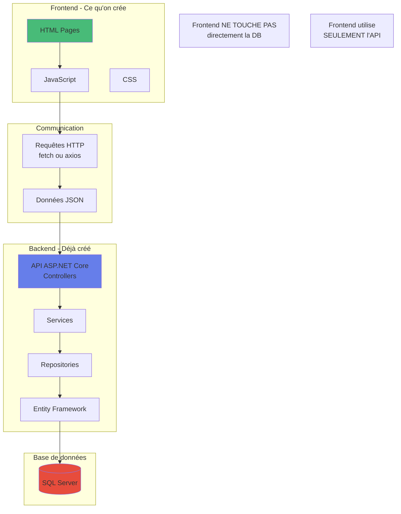
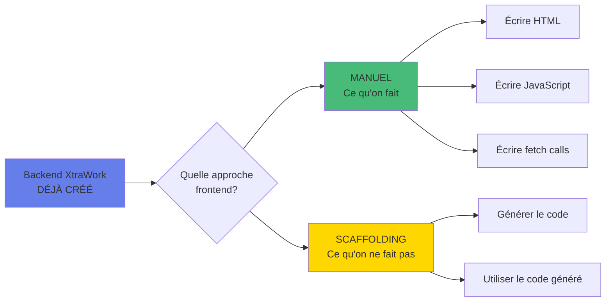
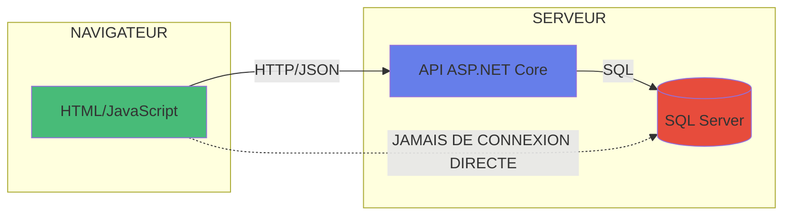
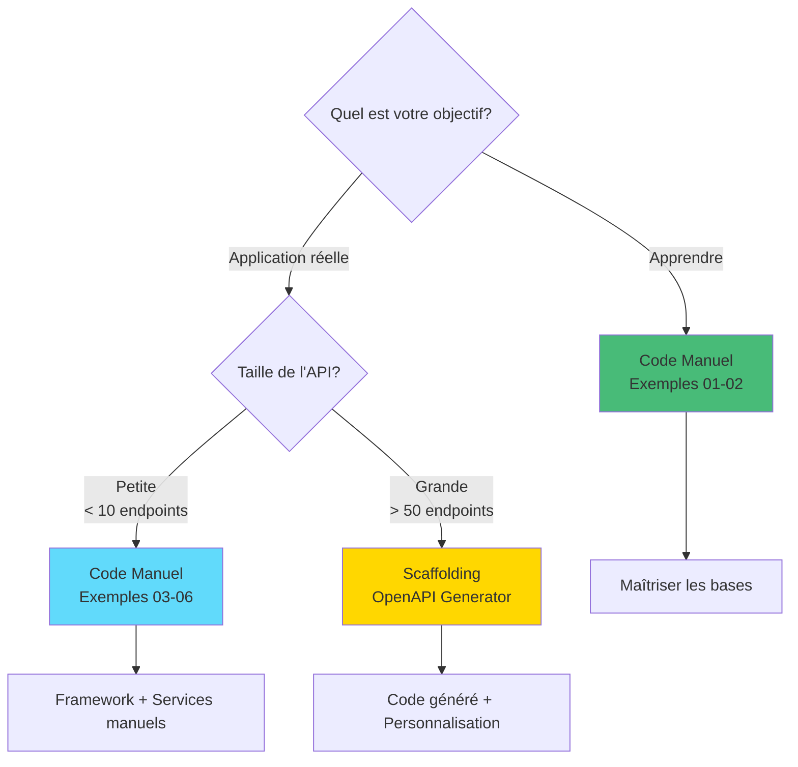

# Scaffolding vs Code Manuel - Clarifications Importantes

## Question fréquente

**"Est-ce qu'on a besoin d'utiliser du scaffolding ici ? Ou de la base de données ?"**

## Réponse claire

**NON au scaffolding** - On écrit le code manuellement (c'est le but pédagogique)

**NON à la DB côté frontend** - Le frontend ne touche JAMAIS directement la base de données

---

## Architecture complète expliquée



---

## Principe fondamental

### Le frontend ne touche JAMAIS la base de données

**Mauvais** (Ne JAMAIS faire) :
```javascript
// FAUX - Le frontend ne peut PAS faire ça
const connection = new SqlConnection("Server=...");
const result = connection.query("SELECT * FROM Employees");
```

**Bon** (Ce qu'on fait) :
```javascript
// CORRECT - Le frontend appelle l'API
const response = await fetch('https://localhost:7033/api/employees');
const employees = await response.json();
```

---

## Qu'est-ce que le scaffolding ?

### Définition

**Scaffolding** = Génération automatique de code à partir d'un schéma ou d'une API.

### Types de scaffolding

#### 1. Scaffolding Backend (Entity Framework)

**Ce que c'est** :
Générer des Controllers, Views, Models à partir de la base de données.

**Commande** :
```bash
dotnet aspnet-codegenerator controller \
  -name EmployeeController \
  -m Employee \
  -dc XtraWorkContext
```

**Résultat** :
- Controller généré automatiquement
- Views Razor générées (.cshtml)
- CRUD complet en quelques secondes

**Est-ce qu'on l'utilise ?**
NON - Notre backend XtraWork est une API pure (pas de views Razor)

---

#### 2. Scaffolding Frontend (OpenAPI/Swagger)

**Ce que c'est** :
Générer du code JavaScript/TypeScript à partir de la documentation Swagger de l'API.

**Commande** :
```bash
openapi-generator-cli generate \
  -i https://localhost:7033/swagger/v1/swagger.json \
  -g typescript-fetch \
  -o ./generated-client
```

**Résultat** :
```
generated-client/
├── apis/
│   ├── AuthApi.ts            # Généré automatiquement
│   ├── EmployeeApi.ts        # Généré automatiquement
│   └── TitleApi.ts           # Généré automatiquement
├── models/
│   ├── EmployeeRequest.ts    # Généré automatiquement
│   ├── EmployeeResponse.ts   # Généré automatiquement
│   └── ...
```

**Est-ce qu'on l'utilise pour les exemples HTML ?**
**NON** - On écrit le code à la main pour comprendre comment ça marche.

---

## Ce qu'on fait dans ces exemples

### Approche 100% manuelle



### Pourquoi on écrit manuellement ?

**Objectif pédagogique** :
1. Comprendre comment fonctionne une requête HTTP
2. Comprendre le format JSON
3. Comprendre la manipulation du DOM
4. Apprendre les bases avant d'utiliser des outils

**Code qu'on écrit** :
```javascript
// On écrit ça MANUELLEMENT
async function getEmployees() {
    const response = await fetch('https://localhost:7033/api/employees', {
        headers: {
            'Authorization': `Bearer ${token}`
        }
    });
    return await response.json();
}
```

**Code généré par scaffolding** (qu'on n'utilise pas) :
```typescript
// Généré automatiquement par openapi-generator
export class EmployeeApi {
    async getEmployees(options?: RequestOptions): Promise<Array<EmployeeResponse>> {
        const response = await this.request({
            path: `/employees`,
            method: 'GET',
            ...options
        });
        return response.body;
    }
}
```

---

## Base de données - Où est-elle ?

### Architecture complète

```
┌─────────────────────────────────────────┐
│  FRONTEND (Navigateur)                  │
│  - HTML/React/Vue/etc.                  │
│  - JavaScript                           │
│  - PAS DE BASE DE DONNÉES ICI          │
└─────────────┬───────────────────────────┘
              │
              │ HTTP/JSON seulement
              │
┌─────────────▼───────────────────────────┐
│  BACKEND (Serveur)                      │
│  - API ASP.NET Core                     │
│  - Controllers, Services, Repositories  │
│  - Entity Framework                     │
└─────────────┬───────────────────────────┘
              │
              │ SQL Queries
              │
┌─────────────▼───────────────────────────┐
│  BASE DE DONNÉES                        │
│  - SQL Server                           │
│  - Tables : Users, Employees, Titles    │
└─────────────────────────────────────────┘
```

### Ce que le frontend fait

```javascript
// Le frontend fait SEULEMENT des requêtes HTTP
const response = await fetch('https://localhost:7033/api/employees');
const employees = await response.json();

// Il reçoit du JSON
// Il n'a AUCUNE connexion directe à SQL Server
```

### Ce que le backend fait

```csharp
// Le backend accède à la DB via Entity Framework
public async Task<List<Employee>> GetAll()
{
    return await _context.Employees
        .Include(e => e.Title)
        .ToListAsync();
}

// Il retourne du JSON au frontend
```

---

## Comparaison des approches

### Approche 1 : Code Manuel (Ce qu'on fait)

**Processus** :
1. Lire la documentation Swagger
2. Écrire le HTML à la main
3. Écrire le JavaScript pour appeler l'API
4. Tester et déboguer

**Exemple** - Fichiers créés manuellement :
```
employees.html        (écrit à la main)
employee-form.html    (écrit à la main)
js/api.js            (écrit à la main)
```

**Avantages** :
- Comprendre exactement ce qui se passe
- Contrôle total
- Apprentissage

**Temps** : 2-4 heures par page

---

### Approche 2 : Scaffolding (Ce qu'on NE fait PAS ici)

**Processus** :
1. Lancer un outil de génération
2. L'outil lit le Swagger
3. L'outil génère tout le code automatiquement
4. On utilise le code généré

**Commande** :
```bash
openapi-generator-cli generate \
  -i https://localhost:7033/swagger/v1/swagger.json \
  -g typescript-fetch \
  -o ./generated
```

**Résultat** - Fichiers générés automatiquement :
```
generated/
├── apis/
│   ├── AuthApi.ts           (GÉNÉRÉ)
│   ├── EmployeeApi.ts       (GÉNÉRÉ)
│   └── TitleApi.ts          (GÉNÉRÉ)
├── models/
│   ├── EmployeeRequest.ts   (GÉNÉRÉ)
│   └── EmployeeResponse.ts  (GÉNÉRÉ)
```

**Avantages** :
- Très rapide
- Synchronisé avec l'API
- Types TypeScript automatiques

**Temps** : 5-10 minutes pour tout générer

---

### Approche 3 : Framework CLI (Structure seulement)

**Processus** :
1. Utiliser un CLI (create-react-app, etc.)
2. Le CLI génère la structure du projet
3. On écrit les composants et services manuellement

**Commande** :
```bash
npx create-react-app mon-app
# Génère la structure, PAS le code métier
```

**Résultat** :
```
mon-app/
├── src/
│   ├── App.js              (généré, à personnaliser)
│   └── index.js            (généré)
├── public/
└── package.json            (généré)

# Puis ON ÉCRIT nous-mêmes :
src/services/employeeService.js    (MANUEL)
src/components/EmployeeList.jsx    (MANUEL)
```

---

## Pourquoi on n'utilise PAS le scaffolding ici ?

### Objectifs pédagogiques

**1. Apprendre les fondamentaux**
```javascript
// Vous devez COMPRENDRE comment faire une requête
const response = await fetch(url, {
    method: 'POST',
    headers: { 'Content-Type': 'application/json' },
    body: JSON.stringify(data)
});
```

**2. Comprendre le format JSON**
```javascript
// Vous devez COMPRENDRE la structure des données
{
  "id": "guid",
  "firstName": "Jean",
  "lastName": "Dupont",
  "birthDate": "1990-01-01T00:00:00Z"
}
```

**3. Comprendre la manipulation du DOM**
```javascript
// Vous devez SAVOIR afficher les données
const row = document.createElement('tr');
row.innerHTML = `<td>${employee.firstName}</td>`;
tbody.appendChild(row);
```

**Si on utilisait du scaffolding** :
- Vous ne comprendriez pas le code généré
- Vous ne sauriez pas comment ça marche
- Vous seriez dépendant des outils

---

## Quand utiliser le scaffolding ?

### En production (entreprise)

**Contexte** :
- Grande application avec 50+ endpoints
- Équipe de plusieurs développeurs
- API stable et bien documentée
- Besoin de rapidité

**Outils** :
- OpenAPI Generator
- NSwag
- Swagger Codegen

**Exemple** :
```bash
# Générer le client TypeScript
openapi-generator-cli generate \
  -i https://api.example.com/swagger.json \
  -g typescript-axios \
  -o ./src/generated-api

# Résultat : 200+ fichiers générés en 30 secondes
```

**Utilisation** :
```typescript
// Utiliser le code généré
import { EmployeeApi } from './generated-api';

const api = new EmployeeApi();
const employees = await api.getEmployees();
```

---

### En apprentissage (école)

**Contexte** :
- Apprendre les fondamentaux
- Comprendre comment ça marche
- Petite application (5-10 endpoints)

**Approche** : Code manuel (ce qu'on fait)

**Avantages** :
- Comprendre chaque ligne
- Savoir déboguer
- Bases solides

---

## Où est la base de données ?

### Schéma simplifié



### Le frontend (nos exemples)

**Ce qu'il fait** :
```javascript
// Envoie une requête HTTP
const response = await fetch('https://localhost:7033/api/employees');

// Reçoit du JSON
const employees = await response.json();
// [
//   { id: "...", firstName: "Jean", ... },
//   { id: "...", firstName: "Marie", ... }
// ]
```

**Ce qu'il NE fait PAS** :
```javascript
// Le frontend ne fait JAMAIS ça :
const connection = connectToDatabase("Server=...;Database=...");
const employees = connection.query("SELECT * FROM Employees");
```

**Pourquoi ?**
- Sécurité : La DB ne doit pas être exposée
- Architecture : Séparation des responsabilités
- Web : Les navigateurs ne peuvent pas se connecter à SQL Server

---

### Le backend (XtraWork - déjà créé)

**Ce qu'il fait** :
```csharp
// Controller reçoit la requête HTTP
[HttpGet]
public async Task<ActionResult<List<EmployeeResponse>>> GetAll()
{
    // Service fait la logique métier
    var employees = await _employeeService.GetAll();
    
    // Repository accède à la DB
    return await _context.Employees.ToListAsync();
    
    // Retourne du JSON au frontend
    return Ok(employees);
}
```

---

## Ce qu'on crée dans les exemples

### Exemple 01 et 02 : HTML Vanilla

**Ce qu'on écrit MANUELLEMENT** :
- ✅ HTML pages (structure)
- ✅ CSS (styles)
- ✅ JavaScript (logique)
- ✅ Appels fetch() à l'API
- ✅ Manipulation du DOM

**Ce qu'on NE fait PAS** :
- ❌ Générer le code automatiquement (scaffolding)
- ❌ Se connecter à la base de données
- ❌ Écrire du SQL

**Pourquoi ?**
Comprendre les fondamentaux avant d'utiliser des outils.

---

### Exemple 03-04 : React

**Ce qu'on fera MANUELLEMENT** :
- ✅ Créer les composants React
- ✅ Écrire les services API
- ✅ Gérer le state avec hooks
- ✅ Créer les formulaires

**Ce qu'on utilisera comme outil** :
- ✅ `create-react-app` ou `Vite` pour la structure de base
- ❌ PAS de génération automatique du code métier

---

## Scaffolding - Démonstration

### Comment ça marcherait si on l'utilisait

**Étape 1 : Swagger expose la documentation**
```
https://localhost:7033/swagger/v1/swagger.json
```

**Étape 2 : Générer le client**
```bash
npm install @openapitools/openapi-generator-cli -g

openapi-generator-cli generate \
  -i https://localhost:7033/swagger/v1/swagger.json \
  -g typescript-fetch \
  -o ./src/generated-api
```

**Étape 3 : Utiliser le code généré**
```typescript
import { EmployeeApi, TitleApi } from './generated-api';

const employeeApi = new EmployeeApi();
const employees = await employeeApi.employeesGet();
```

**Résultat** :
- Tout le code de communication est généré
- Types TypeScript automatiques
- Synchronisation avec l'API
- Gain de temps énorme

---

## Pourquoi on ne l'utilise PAS ici

### Raisons pédagogiques

**1. Comprendre avant d'automatiser**
```javascript
// Vous devez SAVOIR faire ça manuellement
const response = await fetch(url, { method: 'POST', ... });

// Avant d'utiliser du code généré qui le fait pour vous
await api.employeesPost(data);
```

**2. Débogage**
Si le code généré ne marche pas, comment déboguer si vous ne savez pas comment ça marche ?

**3. Flexibilité**
Le code manuel peut être adapté à vos besoins spécifiques.

**4. Bases solides**
Après avoir écrit le code manuellement, vous apprécierez le scaffolding.

---

## Quand utiliser chaque approche

### Code Manuel (Exemples 01-02)

**QUAND** :
- Apprentissage
- Petite application (< 10 endpoints)
- Besoin de contrôle total
- API simple

**TEMPS** :
- 2-4 heures par page
- Mais vous comprenez tout

---

### Framework CLI + Code Manuel (Exemples 03-06)

**QUAND** :
- Application moyenne
- Besoin de composants réutilisables
- Équipe de développement

**TEMPS** :
- CLI : 5 minutes
- Code : 1-2 heures par composant

---

### Scaffolding Complet (Optionnel)

**QUAND** :
- Grande application (50+ endpoints)
- API très stable
- Équipe expérimentée
- Rapidité primordiale

**TEMPS** :
- Génération : 2 minutes
- Personnalisation : 30 minutes - 2 heures

---

## Résumé pour vos étudiants

### Questions et Réponses

**Q : Est-ce qu'on utilise du scaffolding dans les exemples HTML ?**
**R :** NON - On écrit tout à la main pour apprendre.

**Q : Est-ce qu'on se connecte à la base de données depuis le frontend ?**
**R :** NON - JAMAIS. Le frontend appelle l'API, et l'API accède à la DB.

**Q : Alors où est la base de données ?**
**R :** Côté backend uniquement. Le frontend ne la voit jamais.

**Q : Comment le frontend récupère les données ?**
**R :** Via des requêtes HTTP à l'API qui retourne du JSON.

**Q : Quand est-ce qu'on utilise le scaffolding ?**
**R :** En production, pour gagner du temps. Mais d'abord, il faut apprendre manuellement.

---

## Diagramme de décision



---

## Conclusion

### Pour cet ensemble d'exemples frontend

**On N'utilise PAS** :
- ❌ Scaffolding de vues
- ❌ Génération automatique de code
- ❌ Connexion directe à la base de données
- ❌ SQL dans le frontend

**On UTILISE** :
- ✅ Code écrit manuellement
- ✅ Requêtes HTTP (fetch/axios)
- ✅ Données JSON
- ✅ API REST

### La base de données

**Localisation** : Côté backend UNIQUEMENT

**Accès** :
```
Frontend → API REST → Backend → Entity Framework → SQL Server
```

**Le frontend ne voit QUE** :
- L'URL de l'API (`https://localhost:7033/api`)
- Les données JSON retournées
- Les codes de statut HTTP (200, 401, 404, etc.)

---

## Pour aller plus loin

Si après avoir maîtrisé ces exemples, vous voulez explorer le scaffolding :

**Ressources** :
- OpenAPI Generator : https://openapi-generator.tech
- NSwag : https://github.com/RicoSuter/NSwag
- Documentation dans : `12-OPTIONS-FRONTEND/13-CONNEXION-FRONTEND-BACKEND-GUIDE-PRATIQUE.md`

**Mais d'abord** : Maîtrisez le code manuel !

---

**Frontend = HTTP/JSON seulement. Base de données = Backend seulement. Pas de scaffolding = Apprentissage !**

