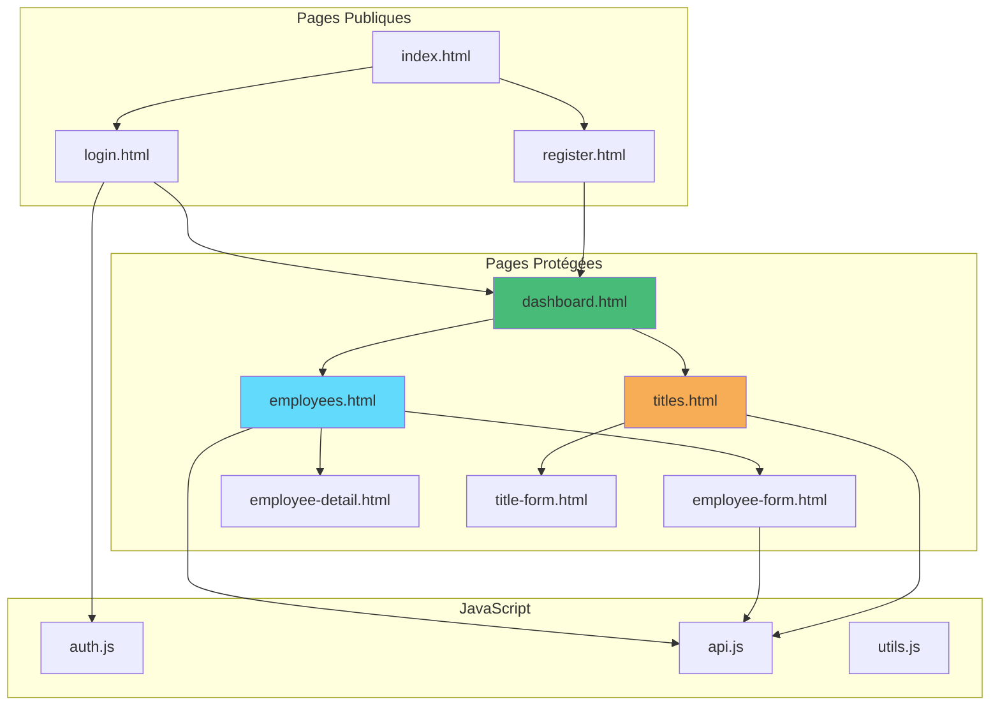

# Explications Pédagogiques - HTML Vanilla Complet

## Vue d'ensemble

Cet exemple démontre qu'on peut créer une **application complète et professionnelle** sans aucun framework, en utilisant seulement HTML, CSS et JavaScript pur.

---

## Architecture complète



---

## Fonctionnalités implémentées

### Authentification complète

**Login** (login.html)
- Formulaire de connexion
- Validation des champs
- Appel API POST /auth/login
- Stockage du token JWT
- Redirection vers dashboard

**Register** (register.html)
- Formulaire d'inscription
- Validation complète :
  - Username minimum 3 caractères
  - Email format valide
  - Password minimum 6 caractères
  - Confirmation du password
- Création du compte
- Connexion automatique

**Logout**
- Appel API POST /auth/logout
- Suppression du token
- Redirection vers index.html

---

### CRUD Employés complet

**Read - Liste** (employees.html)
- GET /api/employees
- Affichage dans une table
- Formatage des dates
- Calcul de l'âge
- Boutons d'action selon permissions

**Create - Création** (employee-form.html sans ID)
- Formulaire complet
- Select dynamique des titres
- Validation :
  - Tous les champs requis
  - Âge minimum 16 ans
  - Âge maximum 100 ans
- POST /api/employees

**Read - Détail** (employee-detail.html?id=xxx)
- GET /api/employees/{id}
- Affichage détaillé de toutes les informations
- Bouton "Modifier"

**Update - Modification** (employee-form.html?id=xxx)
- GET /api/employees/{id} pour charger
- Formulaire pré-rempli
- PUT /api/employees/{id}

**Delete - Suppression** (depuis employees.html)
- Confirmation avant suppression
- DELETE /api/employees/{id}
- Rechargement de la liste
- Notification de succès

---

### CRUD Titres complet

**Read - Liste** (titles.html)
- GET /api/titles
- Affichage dans une table
- Boutons selon permissions (Admin/Manager)

**Create - Création** (title-form.html)
- Formulaire simple (description uniquement)
- POST /api/titles
- Réservé aux Admins

**Update - Modification** (title-form.html?id=xxx)
- GET /api/titles/{id}
- PUT /api/titles/{id}
- Réservé aux Managers et Admins

**Delete - Suppression** (depuis titles.html)
- DELETE /api/titles/{id}
- Réservé aux Admins

---

## Gestion des permissions

### Implémentation

**Fichier : auth.js**

```javascript
function hasPermission(requiredRole) {
    const user = getCurrentUser();
    const roleHierarchy = {
        'User': 1,
        'Manager': 2,
        'Admin': 3
    };
    
    const userLevel = roleHierarchy[user.role] || 0;
    const requiredLevel = roleHierarchy[requiredRole] || 0;
    
    return userLevel >= requiredLevel;
}

function isAdmin() {
    return hasPermission('Admin');
}

function isManagerOrAdmin() {
    return hasPermission('Manager');
}
```

### Utilisation dans les pages

**Masquer les boutons** :
```javascript
// Créer un titre : Admin seulement
if (!isAdmin()) {
    document.getElementById('add-btn').style.display = 'none';
}

// Supprimer un employé : Manager ou Admin
${isManagerOrAdmin() ? `
    <button onclick="deleteEmployee(...)">Supprimer</button>
` : ''}
```

**Bloquer l'accès aux formulaires** :
```javascript
if (!isAdmin()) {
    showError('error-message', 'Vous n\'avez pas les permissions');
    form.style.display = 'none';
}
```

---

## Patterns de code utilisés

### Pattern 1 : Séparation des responsabilités

**HTML** : Structure uniquement
```html
<div id="employees-content" class="hidden">
    <table>
        <tbody id="employees-tbody"></tbody>
    </table>
</div>
```

**JavaScript** : Logique et données
```javascript
async function loadEmployees() {
    const employees = await EmployeeAPI.getAll();
    displayEmployees(employees);
}
```

**CSS** : Présentation
```css
.hidden { display: none; }
table { width: 100%; }
```

---

### Pattern 2 : Mode Edition vs Création

```javascript
const employeeId = getUrlParameter('id');
const isEditMode = !!employeeId;

if (isEditMode) {
    // Charger les données existantes
    const employee = await EmployeeAPI.getById(employeeId);
    // Pré-remplir le formulaire
} else {
    // Formulaire vide pour création
}

// Soumission
if (isEditMode) {
    await EmployeeAPI.update(employeeId, data);
} else {
    await EmployeeAPI.create(data);
}
```

---

### Pattern 3 : États de l'interface

```javascript
// Loading
toggleElement('loading', true);
toggleElement('content', false);

// Données chargées
toggleElement('loading', false);
toggleElement('content', true);

// Erreur
toggleElement('loading', false);
showError('error-message', error.message);

// Empty state
if (data.length === 0) {
    toggleElement('empty-state', true);
}
```

---

### Pattern 4 : Validation des formulaires

```javascript
function validateEmployeeForm(data) {
    const errors = [];
    
    if (!data.firstName) {
        errors.push('Le prénom est requis');
    }
    
    if (calculateAge(data.birthDate) < 16) {
        errors.push('L\'employé doit avoir au moins 16 ans');
    }
    
    // ... autres validations
    
    return errors;
}

// Utilisation
const errors = validateEmployeeForm(formData);
if (errors.length > 0) {
    showError('error-message', errors.join('<br>'));
    return;
}
```

---

### Pattern 5 : Notifications (Toast)

```javascript
function showToast(message, type = 'success') {
    const toast = document.createElement('div');
    toast.className = `toast toast-${type}`;
    toast.textContent = message;
    toast.style.cssText = `...`;
    
    document.body.appendChild(toast);
    
    setTimeout(() => {
        document.body.removeChild(toast);
    }, 3000);
}

// Utilisation
showToast('Employé créé avec succès', 'success');
showToast('Erreur lors de la suppression', 'error');
```

---

## Améliorations par rapport à la version simple

### 1. Fonctionnalités

| Fonctionnalité | Simple (01) | Complet (02) |
|----------------|-------------|--------------|
| Login | ✅ | ✅ |
| Register | ❌ | ✅ |
| Liste employés | ✅ (lecture) | ✅ |
| Créer employé | ❌ | ✅ |
| Modifier employé | ❌ | ✅ |
| Supprimer employé | ❌ | ✅ |
| Détail employé | ❌ | ✅ |
| CRUD Titres | ❌ | ✅ |
| Permissions | ❌ | ✅ |

---

### 2. Code mieux organisé

**Version simple** :
- Tout dans index.html et dashboard.html
- Code répété

**Version complète** :
- Fichiers JavaScript séparés par fonctionnalité
- Fonctions réutilisables (utils.js)
- Code DRY (Don't Repeat Yourself)

---

### 3. UX améliorée

**Messages** :
- Toast notifications élégantes
- Messages d'erreur clairs
- Messages de succès

**Loading states** :
- Spinners pendant le chargement
- Boutons désactivés pendant les actions
- États vides informatifs

**Navigation** :
- Breadcrumb (fil d'Ariane)
- Navigation cohérente
- Boutons "Retour"

**Validation** :
- Validation côté client avant envoi
- Messages d'erreur spécifiques
- Prévention des erreurs

---

## Défis et solutions

### Défi 1 : Passer des données entre pages

**Problème** :
En HTML pur, pas de routing avec état partagé.

**Solution 1 : URL Parameters**
```javascript
// Page liste
window.location.href = `employee-detail.html?id=${employeeId}`;

// Page détail
const employeeId = getUrlParameter('id');
const employee = await EmployeeAPI.getById(employeeId);
```

**Solution 2 : localStorage**
```javascript
// Page liste
localStorage.setItem('currentEmployee', JSON.stringify(employee));

// Page détail
const employee = JSON.parse(localStorage.getItem('currentEmployee'));
```

---

### Défi 2 : Formulaire Création ET Modification

**Problème** :
Même formulaire pour créer et modifier.

**Solution : Mode détecté par URL**
```javascript
const id = getUrlParameter('id');
const isEditMode = !!id;

if (isEditMode) {
    // Charger et pré-remplir
    const data = await API.getById(id);
    form.firstName.value = data.firstName;
}

// Soumission
if (isEditMode) {
    await API.update(id, formData);
} else {
    await API.create(formData);
}
```

---

### Défi 3 : Gestion des permissions

**Problème** :
Certaines actions réservées à certains rôles.

**Solution : Masquage conditionnel**
```javascript
// Vérifier le rôle
if (!isAdmin()) {
    button.style.display = 'none';
}

// Ou dans le HTML généré
${isAdmin() ? `<button>Delete</button>` : ''}
```

**Important** :
La sécurité réelle est côté serveur. Le masquage côté client est seulement pour l'UX.

---

### Défi 4 : Select dynamique (Titres)

**Problème** :
Le select des titres doit être rempli depuis l'API.

**Solution : Chargement au montage**
```javascript
async function loadTitles() {
    const titles = await TitleAPI.getAll();
    
    const select = document.getElementById('titleId');
    select.innerHTML = '<option value="">Sélectionner...</option>';
    
    titles.forEach(title => {
        const option = document.createElement('option');
        option.value = title.id;
        option.textContent = title.description;
        select.appendChild(option);
    });
}

window.addEventListener('DOMContentLoaded', loadTitles);
```

---

## Comparaison avec un framework

### Ce que vous faites manuellement

**1. Routing**
```javascript
// HTML Vanilla
window.location.href = 'employees.html';
const id = getUrlParameter('id');

// React Router
navigate('/employees');
const { id } = useParams();
```

**2. State Management**
```javascript
// HTML Vanilla
localStorage.setItem('user', JSON.stringify(user));
const user = JSON.parse(localStorage.getItem('user'));

// React
const [user, setUser] = useState(null);
```

**3. Rendu des listes**
```javascript
// HTML Vanilla
employees.forEach(emp => {
    const row = document.createElement('tr');
    row.innerHTML = `<td>${emp.name}</td>`;
    tbody.appendChild(row);
});

// React
{employees.map(emp => (
    <tr key={emp.id}><td>{emp.name}</td></tr>
))}
```

**4. Composants réutilisables**
```javascript
// HTML Vanilla
// Copier-coller le code de la navbar dans chaque page

// React
<Navbar />  // Composant réutilisé partout
```

---

## Points pédagogiques clés

### 1. Comprendre le CRUD

**C**reate :
- Formulaire vide
- POST avec les données
- Redirection vers la liste

**R**ead :
- GET pour la liste
- GET /{id} pour le détail
- Affichage dans le DOM

**U**pdate :
- GET /{id} pour charger
- Formulaire pré-rempli
- PUT avec les nouvelles données

**D**elete :
- Confirmation utilisateur
- DELETE /{id}
- Retrait de la liste

---

### 2. Comprendre la navigation

**Navigation simple** :
```javascript
window.location.href = 'autre-page.html';
```

**Navigation avec paramètres** :
```javascript
window.location.href = `detail.html?id=${id}&mode=edit`;
```

**Récupération des paramètres** :
```javascript
const params = new URLSearchParams(window.location.search);
const id = params.get('id');
const mode = params.get('mode');
```

---

### 3. Comprendre la validation

**Validation HTML5** (basique) :
```html
<input required minlength="3" maxlength="50" type="email">
```

**Validation JavaScript** (avancée) :
```javascript
function validateForm(data) {
    const errors = [];
    
    if (data.firstName.length < 2) {
        errors.push('Prénom trop court');
    }
    
    if (calculateAge(data.birthDate) < 16) {
        errors.push('Âge minimum 16 ans');
    }
    
    return errors;
}
```

**Les deux sont nécessaires** :
- HTML5 : Validation basique rapide
- JavaScript : Validation métier complexe

---

### 4. Comprendre les states de l'UI

**Loading** :
```javascript
// Avant chargement
toggleElement('loading', true);
toggleElement('content', false);

// Après chargement
toggleElement('loading', false);
toggleElement('content', true);
```

**Empty** :
```javascript
if (data.length === 0) {
    toggleElement('empty-state', true);
}
```

**Error** :
```javascript
catch (error) {
    showError('error-message', error.message);
}
```

---

## Exercices pratiques

### Exercice 1 : Ajouter la recherche locale

**Objectif** : Filtrer la liste des employés en temps réel

**Étapes** :
1. Ajouter un `<input type="text">` au-dessus de la table
2. Écouter l'événement `input`
3. Filtrer les lignes du tableau

**Code** :
```javascript
searchInput.addEventListener('input', (e) => {
    const search = e.target.value.toLowerCase();
    const rows = tbody.querySelectorAll('tr');
    
    rows.forEach(row => {
        const text = row.textContent.toLowerCase();
        row.style.display = text.includes(search) ? '' : 'none';
    });
});
```

---

### Exercice 2 : Ajouter le tri des colonnes

**Objectif** : Trier les employés en cliquant sur les en-têtes

**Étapes** :
1. Rendre les `<th>` cliquables
2. Sauvegarder les données dans une variable globale
3. Trier le tableau
4. Ré-afficher

**Code** :
```javascript
let employeesData = [];

function sortByColumn(column) {
    employeesData.sort((a, b) => {
        if (a[column] < b[column]) return -1;
        if (a[column] > b[column]) return 1;
        return 0;
    });
    displayEmployees(employeesData);
}
```

---

### Exercice 3 : Ajouter la pagination

**Objectif** : Afficher 10 employés par page

**Étapes** :
1. Découper le tableau en pages
2. Afficher seulement une page
3. Ajouter des boutons Previous/Next

**Code** :
```javascript
const pageSize = 10;
let currentPage = 1;

function displayPage(employees, page) {
    const start = (page - 1) * pageSize;
    const end = start + pageSize;
    const pageData = employees.slice(start, end);
    
    // Afficher seulement pageData
}
```

---

### Exercice 4 : Ajouter l'export CSV

**Objectif** : Exporter la liste des employés en CSV

**Étapes** :
1. Convertir le tableau en format CSV
2. Créer un Blob
3. Télécharger le fichier

**Code** :
```javascript
function exportToCSV(employees) {
    const headers = ['Prénom', 'Nom', 'Date de naissance', 'Genre', 'Titre'];
    const rows = employees.map(e => [
        e.firstName,
        e.lastName,
        e.birthDate,
        e.gender,
        e.titleDescription
    ]);
    
    const csvContent = [
        headers.join(','),
        ...rows.map(row => row.join(','))
    ].join('\n');
    
    const blob = new Blob([csvContent], { type: 'text/csv' });
    const url = URL.createObjectURL(blob);
    const a = document.createElement('a');
    a.href = url;
    a.download = 'employees.csv';
    a.click();
}
```

---

## Avantages et inconvénients de cette approche

### Avantages observés

**Contrôle total** :
- Vous savez exactement ce qui se passe
- Pas de "magie" de framework
- Débogage facile

**Performance** :
- Chargement très rapide
- Pas de bundle JavaScript volumineux
- Pas de Virtual DOM

**Apprentissage** :
- Comprendre les fondamentaux
- Savoir ce que font les frameworks
- Bases solides

**Simplicité** :
- Pas de build process
- Pas de dépendances
- Facile à déployer

---

### Inconvénients observés

**Code répétitif** :
- Navbar copiée dans chaque page
- Logic de protection dans chaque page
- Tables similaires répétées

**Maintenance difficile** :
- Changement dans la navbar = modifier 9 fichiers
- Pas de composants réutilisables
- Risque d'incohérence

**Fonctionnalités limitées** :
- Pas de routing avancé
- Pas de state management sophistiqué
- Pas de hot reload
- Pas d'optimisations automatiques

**Productivité** :
- Plus de temps pour écrire le code
- Plus de risques d'erreurs
- Difficile de scaler

---

## Quand utiliser cette approche

### OUI - Utiliser HTML Vanilla quand

- Apprentissage des bases
- Application très simple (< 5 pages)
- Prototype rapide
- Intégration dans un système existant
- Performance critique absolue

### NON - Utiliser un framework quand

- Application complexe (> 10 pages)
- Travail en équipe
- Besoin de composants réutilisables
- Application à maintenir à long terme
- Besoin de routing avancé

---

## Transition vers un framework

Après avoir maîtrisé cet exemple, vous êtes prêt pour un framework.

### Concepts que vous connaissez déjà

- HTTP et API REST
- Authentification JWT
- CRUD operations
- Validation des formulaires
- Gestion des erreurs
- Asynchrone (async/await)

### Ce que vous allez apprendre

**Avec React** :
- Composants réutilisables
- Virtual DOM
- Hooks (useState, useEffect)
- JSX

**Avec Vue.js** :
- Templates
- Réactivité automatique
- Directives (v-if, v-for)
- Single File Components

**Avec Next.js** :
- Server-Side Rendering
- Routing avancé
- Optimisations automatiques
- TypeScript

---

## Conclusion

### Ce que cet exemple démontre

**Une application complète est possible sans framework.**

Mais vous avez probablement remarqué :
- Beaucoup de code répétitif
- Difficile de maintenir la cohérence
- Chaque fonctionnalité prend du temps

**C'est exactement pourquoi les frameworks existent !**

### Prochaines étapes

1. **Maîtriser cet exemple** - Comprendre chaque fichier
2. **Faire les exercices** - Ajouter des fonctionnalités
3. **Comparer avec un framework** - Voir `03-react-vite-simple/`
4. **Apprécier les frameworks** - Comprendre leur valeur

---

**Vous avez maintenant une base solide pour aborder n'importe quel framework frontend !**

