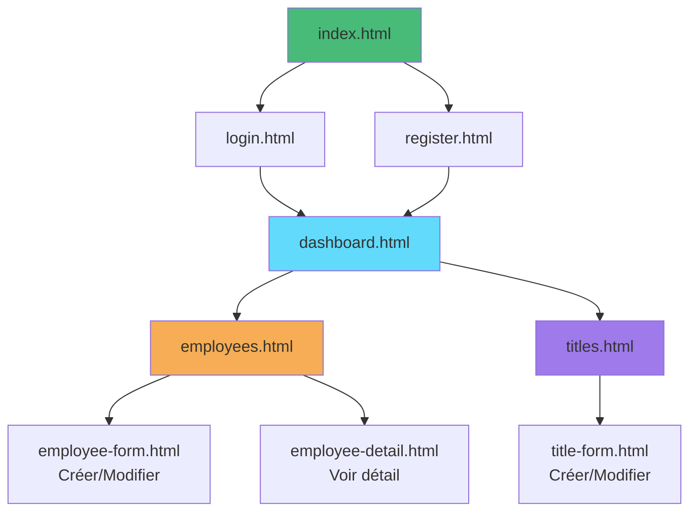

# 02 - HTML Vanilla Complet

## Description

Frontend **complet** en HTML/CSS/JavaScript pur avec toutes les fonctionnalités CRUD.

Cet exemple démontre qu'on peut créer une application complète sans framework.

---

## Fonctionnalités

- Authentification complète (Login + Register)
- CRUD Employés complet (Create, Read, Update, Delete)
- CRUD Titres complet
- Dashboard avec statistiques
- Navigation entre pages
- Gestion des rôles et permissions
- Design moderne et responsive

---

## Structure

```
02-html-vanilla-complet/
├── index.html                # Page d'accueil
├── login.html                # Connexion
├── register.html             # Inscription
├── dashboard.html            # Dashboard
├── employees.html            # Liste employés
├── employee-form.html        # Créer/Modifier employé
├── employee-detail.html      # Détail employé
├── titles.html               # Liste titres
├── title-form.html           # Créer/Modifier titre
├── css/
│   └── style.css            # Styles globaux
├── js/
│   ├── config.js            # Configuration
│   ├── auth.js              # Authentification
│   ├── api.js               # Client API
│   ├── employees.js         # Logique employés
│   ├── titles.js            # Logique titres
│   └── utils.js             # Fonctions utilitaires
├── README.md                # Ce fichier
├── DEMARRAGE-RAPIDE.txt     # Instructions rapides
└── EXPLICATIONS.md          # Explications détaillées
```

---

## Architecture



---

## Prérequis

### Backend en cours d'exécution

```bash
cd XtraWork
dotnet run
```

API sur : `https://localhost:7033`

---

## Démarrage

### Méthode 1 : Double-clic

Double-cliquer sur `index.html`

### Méthode 2 : Live Server (VS Code)

1. Installer l'extension "Live Server"
2. Clic droit sur `index.html`
3. "Open with Live Server"

### Méthode 3 : Python HTTP Server

```bash
cd frontend-exemples/02-html-vanilla-complet
python -m http.server 8080
```

Ouvrir : http://localhost:8080

---

## Utilisation

### 1. Page d'accueil (index.html)

Choix entre :
- Se connecter (si compte existant)
- S'inscrire (créer un nouveau compte)

### 2. Connexion (login.html)

**Credentials de test** :
- Username : `admin`
- Password : `Admin123!`

### 3. Inscription (register.html)

Créer un nouveau compte utilisateur.

**Validation** :
- Username : minimum 3 caractères
- Email : format email valide
- Password : minimum 6 caractères
- FirstName et LastName : requis

### 4. Dashboard (dashboard.html)

Après connexion :
- Informations utilisateur
- Statistiques (nombre d'employés, titres)
- Navigation vers Employés et Titres

### 5. Gestion des Employés (employees.html)

**Actions disponibles** :
- Voir la liste complète
- Créer un nouvel employé
- Voir le détail d'un employé
- Modifier un employé
- Supprimer un employé (Manager/Admin)

### 6. Gestion des Titres (titles.html)

**Actions disponibles** :
- Voir la liste complète
- Créer un titre (Admin)
- Modifier un titre (Manager/Admin)
- Supprimer un titre (Admin)

---

## Permissions par rôle

| Action | User | Manager | Admin |
|--------|------|---------|-------|
| Voir employés/titres | ✅ | ✅ | ✅ |
| Créer employé | ✅ | ✅ | ✅ |
| Modifier employé | ✅ | ✅ | ✅ |
| Supprimer employé | ❌ | ✅ | ✅ |
| Créer titre | ❌ | ❌ | ✅ |
| Modifier titre | ❌ | ✅ | ✅ |
| Supprimer titre | ❌ | ❌ | ✅ |

Les boutons sont **automatiquement masqués** si l'utilisateur n'a pas les permissions.

---

## Fichiers JavaScript

### js/config.js
Configuration de l'API et constantes

### js/auth.js
Fonctions d'authentification :
- login()
- register()
- logout()
- requireAuth()
- checkPermission()

### js/api.js
Client API générique avec helpers pour :
- GET, POST, PUT, DELETE
- Gestion automatique du token
- Gestion des erreurs

### js/employees.js
Logique métier pour les employés :
- CRUD complet
- Validation des formulaires
- Formatage des données

### js/titles.js
Logique métier pour les titres :
- CRUD complet
- Validation

### js/utils.js
Fonctions utilitaires :
- formatDate()
- calculateAge()
- showToast()
- confirmDelete()

---

## Nouveautés par rapport à l'exemple 01

### Fonctionnalités ajoutées

**Authentification** :
- Inscription de nouveaux utilisateurs
- Validation des formulaires

**CRUD Employés** :
- Formulaire de création
- Formulaire de modification
- Page de détail
- Suppression avec confirmation

**CRUD Titres** :
- Gestion complète des titres

**Navigation** :
- Menu de navigation
- Fil d'Ariane (breadcrumb)
- Retour aux listes

**UX** :
- Messages toast (notifications)
- Confirmations avant suppression
- Validation en temps réel
- Loading states partout

### Code amélioré

**Validation des formulaires** :
```javascript
function validateEmployeeForm(data) {
    const errors = [];
    
    if (!data.firstName) errors.push('Prénom requis');
    if (!data.lastName) errors.push('Nom requis');
    if (!data.birthDate) errors.push('Date de naissance requise');
    // ...
    
    return errors;
}
```

**Gestion des permissions** :
```javascript
function checkPermission(requiredRole) {
    const user = getCurrentUser();
    const roles = { User: 1, Manager: 2, Admin: 3 };
    return roles[user.role] >= roles[requiredRole];
}
```

**Messages toast** :
```javascript
function showToast(message, type = 'success') {
    // Afficher une notification élégante
}
```

---

## Patterns de code utilisés

### Pattern : Séparation des responsabilités

**HTML** : Structure uniquement
**CSS** : Présentation uniquement
**JavaScript** : Logique uniquement

### Pattern : Fonctions réutilisables

Au lieu de répéter le code :
```javascript
// Fonction générique pour afficher des données
function displayTable(data, tbody, formatRow) {
    tbody.innerHTML = '';
    data.forEach(item => {
        const row = formatRow(item);
        tbody.appendChild(row);
    });
}
```

### Pattern : Gestion d'état simple

```javascript
// State global pour l'application
const AppState = {
    currentEmployee: null,
    currentTitle: null,
    employees: [],
    titles: []
};
```

---

## Avantages de cette version complète

**Fonctionnel** :
- Application complète et utilisable
- Toutes les opérations CRUD
- Gestion des permissions

**Pédagogique** :
- Montre comment gérer une vraie application
- Patterns de code réutilisables
- Bonnes pratiques

**Réaliste** :
- Validation des données
- Gestion des erreurs complète
- UX soignée

---

## Limitations

Même avec toutes ces fonctionnalités, cet exemple reste limité :

**Pas de** :
- Composants réutilisables (code dupliqué)
- State management sophistiqué
- Routing avancé
- Tests automatisés
- Build process et optimisations

**Pour ces fonctionnalités, utiliser un framework** :
- React (`03-react-vite-complet/`)
- Vue.js (`06-vuejs-complet/`)
- Next.js (`07-nextjs-reference/`)

---

## Résolution de problèmes

### API ne répond pas

```bash
cd XtraWork
dotnet run
```

### Erreur 403 (Forbidden)

Vous n'avez pas les permissions pour cette action.
Connectez-vous avec un compte Admin.

### Token expiré

```javascript
// Console navigateur (F12)
localStorage.clear()
```
Puis reconnectez-vous.

### Formulaire ne se soumet pas

Ouvrir F12 > Console pour voir l'erreur JavaScript.

---

## Exercices pratiques

### Exercice 1 : Ajouter la recherche

Implémenter une barre de recherche pour filtrer les employés.

### Exercice 2 : Ajouter le tri

Permettre de trier les colonnes en cliquant sur les en-têtes.

### Exercice 3 : Ajouter la pagination

Afficher 10 employés par page avec navigation.

### Exercice 4 : Ajouter des graphiques

Afficher des statistiques visuelles (Chart.js ou D3.js).

---

## Prochaines étapes

Après avoir maîtrisé cet exemple :

1. **Comparer avec un framework**
   - Voir `03-react-vite-simple/`
   - Comparer la quantité de code
   - Comparer la maintenabilité

2. **Identifier les limites**
   - Code répétitif
   - Duplication
   - Difficultés de maintenance

3. **Apprécier les frameworks**
   - Comprendre pourquoi ils existent
   - Voir ce qu'ils apportent

---

**Vous savez maintenant créer une application complète en HTML/CSS/JavaScript pur !**

