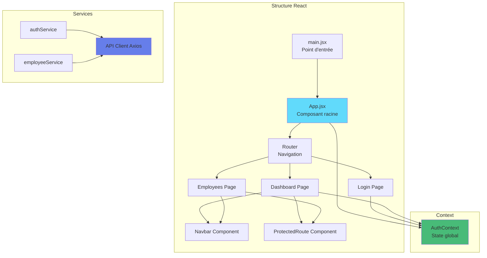

# Explications Pédagogiques - React Vite Simple

## Vue d'ensemble

Cet exemple introduit **React**, la bibliothèque JavaScript la plus populaire pour créer des interfaces utilisateur modernes.

---

## Architecture React



---

## Concepts React fondamentaux

### 1. Composants

**Qu'est-ce qu'un composant ?**
Une fonction JavaScript qui retourne du JSX (HTML-like).

**Composant simple** :
```jsx
function Welcome() {
    return <h1>Bienvenue !</h1>;
}
```

**Composant avec props** :
```jsx
function Welcome({ name }) {
    return <h1>Bienvenue, {name} !</h1>;
}

// Utilisation
<Welcome name="Jean" />
```

**Dans notre app** :
```jsx
// Navbar.jsx
export default function Navbar() {
    return (
        <nav className="navbar">
            <div>XtraWork</div>
        </nav>
    );
}

// Utilisation dans Dashboard.jsx
import Navbar from '../components/Navbar';

<Navbar />
```

---

### 2. JSX (JavaScript XML)

**Qu'est-ce que c'est ?**
Une syntaxe qui mélange JavaScript et HTML.

**Expressions JavaScript** :
```jsx
const name = "Jean";
<h1>Bonjour {name}</h1>  // Bonjour Jean
<p>{2 + 2}</p>            // 4
```

**Conditions** :
```jsx
{isAuthenticated ? <Dashboard /> : <Login />}

{error && <div className="alert">{error}</div>}
```

**Boucles** :
```jsx
{employees.map(emp => (
    <div key={emp.id}>
        {emp.firstName} {emp.lastName}
    </div>
))}
```

**Différences avec HTML** :
- `className` au lieu de `class`
- `htmlFor` au lieu de `for`
- Balises auto-fermantes : `<input />`
- Expressions entre `{}`

---

### 3. useState - Gestion de l'état

**Qu'est-ce que c'est ?**
Un Hook pour gérer l'état local d'un composant.

**Syntaxe** :
```jsx
const [valeur, setValeur] = useState(valeurInitiale);
```

**Exemple** :
```jsx
const [employees, setEmployees] = useState([]);
const [loading, setLoading] = useState(true);

// Modifier l'état
setEmployees(newData);     // employees prend la valeur newData
setLoading(false);          // loading devient false
```

**Dans notre app - Login.jsx** :
```jsx
const [formData, setFormData] = useState({
    username: '',
    password: ''
});

// Mettre à jour un champ
setFormData(prev => ({
    ...prev,
    username: 'admin'
}));
```

**Pourquoi c'est puissant ?**
Quand l'état change, React met à jour automatiquement l'interface !

---

### 4. useEffect - Effets de bord

**Qu'est-ce que c'est ?**
Un Hook pour exécuter du code après le rendu (chargement de données, etc.).

**Syntaxe** :
```jsx
useEffect(() => {
    // Code à exécuter
}, [dépendances]);
```

**Exemples** :

**Exécuter une fois au montage** :
```jsx
useEffect(() => {
    loadEmployees();
}, []); // [] = aucune dépendance = une seule fois
```

**Exécuter quand une variable change** :
```jsx
useEffect(() => {
    console.log('L\'ID a changé:', employeeId);
}, [employeeId]); // S'exécute quand employeeId change
```

**Dans notre app - Employees.jsx** :
```jsx
useEffect(() => {
    loadEmployees();  // Charger au montage du composant
}, []);
```

---

### 5. Context API - État global

**Problème à résoudre** :
Partager l'état entre plusieurs composants sans "prop drilling".

**Sans Context** (prop drilling) :
```jsx
<App user={user}>
  <Dashboard user={user}>
    <Navbar user={user} />   // user passé 3 fois !
  </Dashboard>
</App>
```

**Avec Context** :
```jsx
// AuthContext.jsx
const AuthContext = createContext();

export function AuthProvider({ children }) {
    const [user, setUser] = useState(null);
    
    return (
        <AuthContext.Provider value={{ user, setUser }}>
            {children}
        </AuthContext.Provider>
    );
}

// Utiliser dans n'importe quel composant
const { user } = useContext(AuthContext);
```

**Dans notre app** :
```jsx
// App.jsx
<AuthProvider>
    <App />
</AuthProvider>

// Login.jsx, Dashboard.jsx, etc.
const { user, login, logout } = useAuth();  // Hook personnalisé
```

---

### 6. React Router - Navigation

**Routes** :
```jsx
<Routes>
    <Route path="/login" element={<Login />} />
    <Route path="/dashboard" element={<Dashboard />} />
</Routes>
```

**Navigation** :
```jsx
import { useNavigate } from 'react-router-dom';

const navigate = useNavigate();
navigate('/dashboard');  // Naviguer vers /dashboard
```

**Liens** :
```jsx
import { Link } from 'react-router-dom';

<Link to="/employees">Employés</Link>
```

---

## Comparaison avec HTML Vanilla

### Rendu d'une liste

**HTML Vanilla** :
```javascript
const tbody = document.getElementById('tbody');
tbody.innerHTML = '';

employees.forEach(emp => {
    const row = document.createElement('tr');
    row.innerHTML = `
        <td>${emp.firstName}</td>
        <td>${emp.lastName}</td>
    `;
    tbody.appendChild(row);
});
```

**React** :
```jsx
<tbody>
    {employees.map(emp => (
        <tr key={emp.id}>
            <td>{emp.firstName}</td>
            <td>{emp.lastName}</td>
        </tr>
    ))}
</tbody>
```

**Avantages React** :
- Plus concis
- Plus lisible
- Mise à jour automatique
- Pas de manipulation DOM manuelle

---

### Gestion de l'état de chargement

**HTML Vanilla** :
```javascript
document.getElementById('loading').classList.remove('hidden');
document.getElementById('content').classList.add('hidden');

const data = await fetchData();

document.getElementById('loading').classList.add('hidden');
document.getElementById('content').classList.remove('hidden');
```

**React** :
```jsx
const [loading, setLoading] = useState(true);
const [data, setData] = useState([]);

// Charger
setLoading(true);
const result = await fetchData();
setData(result);
setLoading(false);

// Affichage
{loading ? (
    <div>Loading...</div>
) : (
    <div>{data.map(...)}</div>
)}
```

**Avantages React** :
- État déclaratif
- UI automatiquement mise à jour
- Moins de code

---

### Navigation

**HTML Vanilla** :
```javascript
window.location.href = 'dashboard.html';
```

**React** :
```jsx
const navigate = useNavigate();
navigate('/dashboard');
```

**Avantages React** :
- Pas de rechargement de page
- Plus rapide
- Préservation de l'état
- Animations possibles

---

## Structure des fichiers

### Organisation par fonctionnalité

```
src/
├── components/      # Composants réutilisables
│   ├── Navbar.jsx
│   └── ProtectedRoute.jsx
│
├── pages/          # Pages de l'app
│   ├── Login.jsx
│   ├── Dashboard.jsx
│   └── Employees.jsx
│
├── services/       # Communication API
│   ├── api.js
│   ├── authService.js
│   └── employeeService.js
│
├── context/        # State global
│   └── AuthContext.jsx
│
├── config.js       # Configuration
├── App.jsx         # Composant racine
└── main.jsx        # Point d'entrée
```

---

## Flow d'une page React

### Exemple : Page Employees

**1. Le composant se monte**
```jsx
export default function Employees() {
    const [employees, setEmployees] = useState([]);
    const [loading, setLoading] = useState(true);
```

**2. useEffect s'exécute**
```jsx
    useEffect(() => {
        loadEmployees();
    }, []);
```

**3. Chargement des données**
```jsx
    const loadEmployees = async () => {
        setLoading(true);                          // UI : affiche loading
        const data = await employeeService.getAll();  // Appel API
        setEmployees(data);                           // UI : met à jour la liste
        setLoading(false);                            // UI : cache loading
    };
```

**4. Rendu conditionnel**
```jsx
    return (
        {loading ? (
            <div>Chargement...</div>
        ) : (
            <table>
                {employees.map(emp => <tr key={emp.id}>...</tr>)}
            </table>
        )}
    );
}
```

**Résultat** :
- Au montage → Loading affiché
- Données chargées → Liste affichée
- État change → UI mise à jour automatiquement

---

## Avantages de React

### 1. Composants réutilisables

**Un seul fichier Navbar.jsx** :
```jsx
export default function Navbar() {
    return <nav>...</nav>;
}
```

**Utilisé partout** :
```jsx
<Navbar />  // Dans Dashboard
<Navbar />  // Dans Employees
<Navbar />  // Dans toutes les pages
```

Modification dans Navbar.jsx → Tous les usages mis à jour !

---

### 2. State management automatique

**React suit les changements** :
```jsx
const [count, setCount] = useState(0);

<button onClick={() => setCount(count + 1)}>
    Clics : {count}
</button>
```

Clic → setCount → count change → React re-rend → UI mise à jour

---

### 3. Hot Module Replacement

Modifiez n'importe quel fichier :
- Les changements apparaissent instantanément
- Pas besoin de rafraîchir
- L'état est préservé

---

### 4. Écosystème riche

- React Router (routing)
- React Query (cache API)
- React Hook Form (formulaires)
- Material-UI (composants)
- Et des milliers d'autres...

---

## Exercices pratiques

### Exercice 1 : Modifier le Dashboard

**Objectif** : Personnaliser le message de bienvenue

**Fichier** : `src/pages/Dashboard.jsx`

**Tâche** :
Changer le texte "Bienvenue" par votre propre message.

---

### Exercice 2 : Ajouter un compteur

**Objectif** : Comprendre useState

**Code** :
```jsx
const [count, setCount] = useState(0);

<button onClick={() => setCount(count + 1)}>
    Clics : {count}
</button>
```

**Ajouter** : Un bouton compteur dans Dashboard

---

### Exercice 3 : Créer un composant EmployeeCard

**Objectif** : Composants réutilisables

**Créer** : `src/components/EmployeeCard.jsx`

```jsx
export default function EmployeeCard({ employee }) {
    return (
        <div className="employee-card">
            <h3>{employee.firstName} {employee.lastName}</h3>
            <p>{employee.titleDescription}</p>
            <p>Âge : {employee.age} ans</p>
        </div>
    );
}
```

**Utiliser** dans Employees.jsx :
```jsx
{employees.map(emp => (
    <EmployeeCard key={emp.id} employee={emp} />
))}
```

---

### Exercice 4 : Ajouter un filtre de recherche

**Objectif** : useState + filter

**Code** :
```jsx
const [search, setSearch] = useState('');

const filteredEmployees = employees.filter(emp =>
    emp.firstName.toLowerCase().includes(search.toLowerCase()) ||
    emp.lastName.toLowerCase().includes(search.toLowerCase())
);

<input 
    value={search}
    onChange={(e) => setSearch(e.target.value)}
    placeholder="Rechercher..."
/>

<table>
    {filteredEmployees.map(emp => ...)}
</table>
```

---

## Différences clés HTML vs React

| Aspect | HTML Vanilla | React |
|--------|-------------|--------|
| **Fichiers** | employees.html | Employees.jsx |
| **Structure** | HTML statique | JSX dynamique |
| **Données** | DOM manipulation | State (useState) |
| **Chargement** | fetch + DOM | fetch + setState |
| **Affichage liste** | createElement + innerHTML | map() + JSX |
| **Navigation** | window.location | useNavigate() |
| **Réutilisation** | Copy-paste | Composants |
| **Hot Reload** | Non | Oui |

---

## Points d'apprentissage

### Ce que vous apprenez

**1. Pensée déclarative**
```jsx
// Déclarer CE QUE vous voulez, pas COMMENT le faire
{loading ? <Spinner /> : <Content />}

// Au lieu de (impératif)
if (loading) {
    showSpinner();
    hideContent();
} else {
    hideSpinner();
    showContent();
}
```

**2. Réactivité automatique**
```jsx
const [count, setCount] = useState(0);
setCount(count + 1);  // React met à jour l'UI automatiquement
```

**3. Composition de composants**
```jsx
<Dashboard>
    <Navbar />
    <Stats />
    <Menu />
</Dashboard>
```

**4. Séparation des responsabilités**
- Composants : UI uniquement
- Services : Logique API
- Context : État global

---

## Concepts avancés (aperçu)

### Custom Hooks

Réutiliser la logique :
```jsx
function useEmployees() {
    const [employees, setEmployees] = useState([]);
    const [loading, setLoading] = useState(true);
    
    useEffect(() => {
        loadEmployees();
    }, []);
    
    return { employees, loading };
}

// Utilisation
const { employees, loading } = useEmployees();
```

### React Query (pas dans cette version simple)

Cache automatique des données :
```jsx
const { data, isLoading } = useQuery('employees', employeeService.getAll);
```

---

## Pourquoi React est populaire

**1. Communauté énorme**
- Plus de 200k packages npm
- Millions de développeurs
- Ressources infinies

**2. Marché de l'emploi**
- Technologie la plus demandée
- Salaires élevés
- Beaucoup d'opportunités

**3. Performance**
- Virtual DOM
- Optimisations automatiques
- Rendu efficace

**4. Écosystème**
- React Native (mobile)
- Next.js (SSR)
- Gatsby (static sites)

---

## Limitations de cette version simple

### Ce qui n'est PAS implémenté (volontairement)

- Création d'employés (formulaires complexes)
- Modification d'employés
- Suppression d'employés
- Gestion des titres
- Validation avancée
- React Query (cache)
- Tests

### Pourquoi ?

**Objectif** : Apprendre les bases avant d'aller plus loin

Pour ces fonctionnalités, voir : `04-react-vite-complet/`

---

## Prochaines étapes

### Après avoir maîtrisé cet exemple

1. **Comprendre chaque composant**
   - Comment fonctionne useState
   - Comment fonctionne useEffect
   - Comment fonctionne le Context

2. **Modifier et expérimenter**
   - Changer les couleurs
   - Ajouter des fonctionnalités
   - Créer de nouveaux composants

3. **Passer à la version complète**
   - `04-react-vite-complet/`
   - CRUD complet
   - Formulaires avancés

---

## Ressources

### Documentation officielle
- React : https://react.dev
- React Router : https://reactrouter.com
- Vite : https://vitejs.dev

### Tutoriels
- React Tutorial (officiel)
- FreeCodeCamp React Course
- Scrimba React Course

### Outils
- React DevTools (extension navigateur)
- ESLint (linting)
- Prettier (formatting)

---

**Vous découvrez maintenant pourquoi React est si populaire !**

