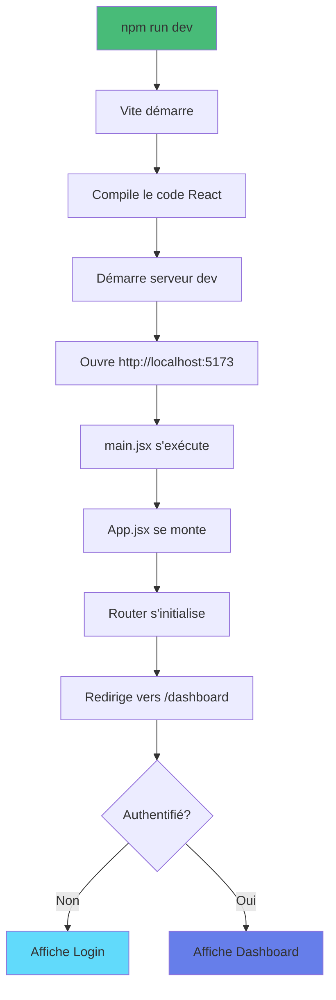

# Installation Complète - React Vite Simple

## Guide pas à pas pour installer et lancer le projet

---

## Prérequis vérifiés

### 1. Node.js et npm

```bash
node --version
# Doit afficher : v18.x.x ou supérieur

npm --version
# Doit afficher : 9.x.x ou supérieur
```

Si pas installé : https://nodejs.org/

### 2. Backend XtraWork

```bash
# Dans un terminal séparé
cd XtraWork
dotnet run

# Attendre : "Now listening on: https://localhost:7033"
```

### 3. Certificat SSL accepté

1. Ouvrir dans le navigateur : https://localhost:7033
2. Cliquer "Avancé" puis "Continuer"
3. Vous devriez voir "Swagger UI"

---

## Installation du projet React

### Étape 1 : Aller dans le dossier

```bash
cd frontend-exemples/03-react-vite-simple
```

### Étape 2 : Installer les dépendances

```bash
npm install
```

**Ce qui est installé** :
- react (18.3.1)
- react-dom (18.3.1)
- react-router-dom (6.22.0)
- axios (1.6.7)
- vite (5.2.0)
- eslint et plugins

**Durée** : 1-2 minutes

**Résultat** : Dossier `node_modules/` créé avec ~1000 packages

### Étape 3 : (Optionnel) Créer .env.local

```bash
echo "VITE_API_URL=https://localhost:7033/api" > .env.local
```

**Note** : Optionnel car l'URL par défaut est déjà configurée dans `config.js`

### Étape 4 : Lancer en mode développement

```bash
npm run dev
```

**Résultat** :
```
VITE v5.2.0  ready in 500 ms

➜  Local:   http://localhost:5173/
➜  Network: use --host to expose
➜  press h + enter to show help
```

### Étape 5 : Ouvrir dans le navigateur

Ouvrir : **http://localhost:5173**

---

## Vérification que tout fonctionne

### Checklist

- [ ] Backend tourne sur https://localhost:7033
- [ ] Frontend tourne sur http://localhost:5173
- [ ] Page de login s'affiche
- [ ] Connexion avec admin/Admin123! fonctionne
- [ ] Dashboard s'affiche
- [ ] Liste des employés s'affiche

Si tout est coché : Succès !

---

## Structure créée après npm install

```
03-react-vite-simple/
├── node_modules/              ← Créé par npm install (1000+ packages)
├── public/                    ← Fichiers statiques
├── src/                       ← Code source React
├── package.json               ← Dépendances
├── package-lock.json          ← Créé par npm install
├── vite.config.js            ← Configuration Vite
└── .gitignore                ← Fichiers à ignorer
```

---

## Commandes npm disponibles

```bash
# Développement avec hot reload
npm run dev

# Build pour production
npm run build
# Résultat : dossier dist/

# Prévisualiser le build production
npm run preview

# Vérifier le code (linter)
npm run lint
```

---

## Hot Module Replacement (HMR)

### Qu'est-ce que c'est ?

Modifiez n'importe quel fichier .jsx ou .css :
- Les changements apparaissent **instantanément**
- **Pas besoin de rafraîchir** le navigateur
- L'état de l'application est **préservé**

### Essayez

1. Ouvrir `src/pages/Dashboard.jsx`
2. Modifier le texte "Bienvenue"
3. Sauvegarder
4. Observer le navigateur → Changement instantané !

---

## Résolution de problèmes

### Erreur : "Cannot find module 'react'"

**Cause** : node_modules manquant ou incomplet

**Solution** :
```bash
rm -rf node_modules package-lock.json
npm install
```

---

### Port 5173 déjà utilisé

**Solution** :
```bash
npm run dev -- --port 5174
```

Ou modifier `vite.config.js` :
```javascript
server: {
    port: 5174  // Changer le port
}
```

---

### Erreur CORS

**Vérifier** que `XtraWork/Program.cs` contient :
```csharp
policy.WithOrigins("http://localhost:5173")
```

---

### Page blanche dans le navigateur

**Vérifier** :
1. Console navigateur (F12) pour erreurs JavaScript
2. Terminal pour erreurs de compilation
3. Backend est bien démarré

---

### npm install très lent

**Solution** :
```bash
# Nettoyer le cache
npm cache clean --force

# Utiliser un autre registre
npm install --registry=https://registry.npmjs.org/
```

---

## Différences avec HTML Vanilla

### Installation

**HTML Vanilla** :
- Aucune installation
- Double-clic et c'est parti

**React** :
- `npm install` nécessaire
- Téléchargement de ~200 MB de packages
- Mais gain de productivité énorme après

### Développement

**HTML Vanilla** :
- Modifier le fichier
- F5 pour rafraîchir
- Voir les changements

**React** :
- Modifier le fichier
- Sauvegarde automatique
- Hot reload instantané

### Production

**HTML Vanilla** :
- Copier les fichiers .html
- Déployer directement

**React** :
- `npm run build`
- Dossier `dist/` généré
- Optimisé et minifié

---

## Premier lancement - Ce qui se passe



---

## Fichiers importants à connaître

### package.json
Liste des dépendances et scripts

### vite.config.js
Configuration de Vite (serveur dev, build, proxy)

### src/main.jsx
Point d'entrée React

### src/App.jsx
Composant racine avec Router

### src/context/AuthContext.jsx
État global pour l'authentification

---

## Prochaines étapes

1. **Lancer le projet** - `npm run dev`
2. **Explorer le code** - Ouvrir chaque fichier
3. **Lire EXPLICATIONS.md** - Comprendre les concepts
4. **Faire les exercices** - Dans EXPLICATIONS.md
5. **Passer à la version complète** - `04-react-vite-complet/`

---

**Le projet est prêt à être lancé !**

