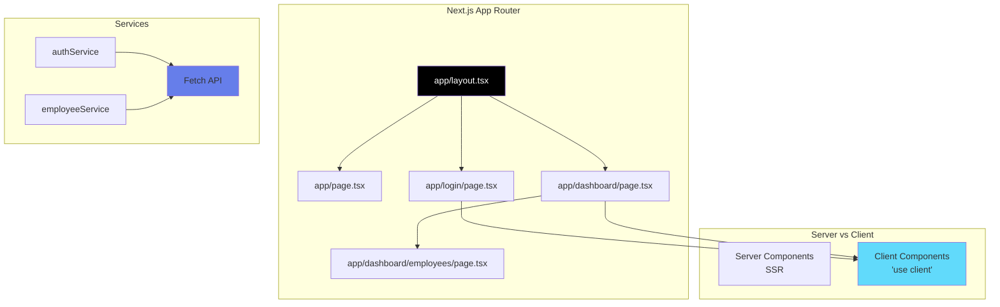

# 07 - Next.js 15 Simple

## Description

Introduction à **Next.js 15** - Le framework React avec Server-Side Rendering, App Router, et optimisations automatiques.

Version simple avec Tailwind CSS v3 pour comprendre les concepts fondamentaux.

---

## Technologies

- Next.js 15 (latest)
- React 18
- Tailwind CSS 3 (stable)
- TypeScript
- App Router (Next.js 14+)

---

## Fonctionnalités

- Login avec JWT
- Dashboard utilisateur
- Liste des employés
- Server Components et Client Components
- App Router
- Middleware pour protection des routes

---

## Architecture



---

## Structure du projet

```
07-nextjs-simple/
├── app/
│   ├── layout.tsx              # Layout racine
│   ├── page.tsx                # Page d'accueil
│   ├── globals.css             # Styles globaux + Tailwind
│   ├── login/
│   │   └── page.tsx           # Page login
│   └── dashboard/
│       ├── page.tsx           # Dashboard
│       └── employees/
│           └── page.tsx       # Liste employés
│
├── lib/
│   ├── api-client.ts          # Client API
│   └── utils.ts               # Utilitaires
│
├── services/
│   ├── auth.service.ts
│   └── employee.service.ts
│
├── types/
│   └── index.ts               # Types TypeScript
│
├── middleware.ts              # Protection routes
├── next.config.mjs
├── tailwind.config.ts
├── tsconfig.json
├── package.json
└── README.md
```

---

## Installation

```bash
cd frontend-exemples/07-nextjs-simple
npm install
npm run dev
```

Application sur : **http://localhost:3000**

---

## Concepts Next.js

### 1. App Router

Routing basé sur les dossiers :

```
app/
├── page.tsx                →  /
├── login/
│   └── page.tsx           →  /login
└── dashboard/
    ├── page.tsx           →  /dashboard
    └── employees/
        └── page.tsx       →  /dashboard/employees
```

---

### 2. Server Components vs Client Components

**Server Components** (par défaut) :
- Rendus côté serveur
- Pas d'interactivité
- Meilleur pour SEO
- Plus rapides

**Client Components** (avec `'use client'`) :
- Rendus côté client
- Interactivité (useState, onClick, etc.)
- Nécessaires pour les événements

```tsx
'use client';  // Marquer comme Client Component

import { useState } from 'react';

export default function LoginPage() {
    const [username, setUsername] = useState('');
    // ...
}
```

---

### 3. Middleware

Protection automatique des routes :

```typescript
// middleware.ts
export function middleware(request: NextRequest) {
    const token = request.cookies.get('token');
    
    if (!token && request.nextUrl.pathname.startsWith('/dashboard')) {
        return NextResponse.redirect(new URL('/login', request.url));
    }
}

export const config = {
    matcher: ['/dashboard/:path*']
};
```

---

## Prérequis

### Backend

```bash
cd XtraWork
dotnet run
```

### Node.js

```bash
node --version    # v18+
npm --version     # 9+
```

---

## Commandes

```bash
# Développement
npm run dev

# Build production
npm run build

# Démarrer production
npm start

# Linter
npm run lint
```

---

## Différences avec React pur

| Aspect | React (Vite) | Next.js |
|--------|-------------|---------|
| **Routing** | React Router | App Router (dossiers) |
| **SSR** | Non | Oui |
| **SEO** | Moyen | Excellent |
| **Images** | Standard | Optimisation auto |
| **Build** | Vite | Next.js |
| **Config** | vite.config | next.config |
| **Port** | 5173 | 3000 |

---

## Avantages Next.js

**Performance** :
- SSR pour chargement rapide
- Optimisation images automatique
- Code splitting automatique

**SEO** :
- Rendu côté serveur
- Metadata facile

**DX** :
- Hot reload rapide
- TypeScript natif
- Erreurs claires

---

## Démarrage

### 1. Installer

```bash
npm install
```

### 2. Lancer

```bash
npm run dev
```

### 3. Ouvrir

http://localhost:3000

### 4. Se connecter

Username : `admin`
Password : `Admin123!`

---

**Introduction à Next.js - Le framework React pour la production !**

