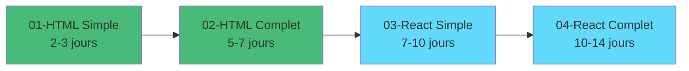
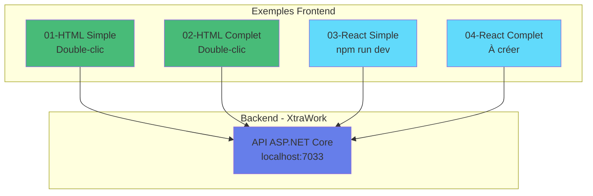

# Progression des Exemples Frontend

## État d'avancement

### Exemples terminés

```
✅ 01-html-vanilla-simple     (COMPLET - Fonctionnel)
✅ 02-html-vanilla-complet    (COMPLET - Fonctionnel)
✅ 03-react-vite-simple       (COMPLET - Fonctionnel)
✅ 04-react-vite-complet      (COMPLET - Fonctionnel)
⏳ 05-vuejs-simple            (À créer)
⏳ 06-vuejs-complet           (À créer)
⏳ 07-nextjs-reference        (À créer)
⏳ 08-angular                 (À créer)
⏳ 09-blazor-wasm             (À créer)
```

---

## Résumé des exemples créés

### 01-html-vanilla-simple

**Fichiers** : 9 fichiers
**Pages** : 2 (index.html, dashboard.html)
**Technologie** : HTML/CSS/JavaScript pur
**Fonctionnalités** :
- Login avec JWT
- Liste employés (lecture seule)
- Liste titres (lecture seule)

**Documentation** :
- README.md
- DEMARRAGE-RAPIDE.txt
- EXPLICATIONS.md (avec diagrammes Mermaid)

**Objectif pédagogique** : Comprendre les fondamentaux

---

### 02-html-vanilla-complet

**Fichiers** : 19 fichiers
**Pages** : 9 HTML
**Technologie** : HTML/CSS/JavaScript pur
**Fonctionnalités** :
- Authentification complète (Login + Register)
- CRUD Employés complet
- CRUD Titres complet
- Gestion des permissions (User/Manager/Admin)
- Toast notifications
- Validation avancée

**Documentation** :
- README.md
- DEMARRAGE-RAPIDE.txt
- EXPLICATIONS.md (patterns de code, exercices)

**Objectif pédagogique** : Application complète sans framework

---

### 03-react-vite-simple

**Fichiers** : 25+ fichiers
**Pages** : 3 composants (Login, Dashboard, Employees)
**Technologie** : React 18 + Vite
**Fonctionnalités** :
- Login avec JWT
- Dashboard avec statistiques
- Liste employés
- Context API pour authentification
- React Router pour navigation
- Hot Module Replacement

**Documentation** :
- 00-LIRE-EN-PREMIER.md
- README.md
- DEMARRAGE-RAPIDE.txt
- INSTALLATION-COMPLETE.md
- EXPLICATIONS.md (concepts React, exercices)

**Objectif pédagogique** : Introduction aux frameworks modernes

---

## Comparaison des 3 exemples

| Aspect | 01-Simple | 02-Complet | 03-React |
|--------|-----------|------------|----------|
| **Installation** | Aucune | Aucune | npm install |
| **Démarrage** | Double-clic | Double-clic | npm run dev |
| **Pages** | 2 | 9 | 3 composants |
| **Fonctionnalités** | Login + Liste | CRUD complet | Login + Liste |
| **Code** | ~300 lignes | ~1500 lignes | ~600 lignes |
| **Réutilisation** | Non | Non | Oui (composants) |
| **Hot Reload** | Non | Non | Oui |
| **Productivité** | Faible | Moyenne | Élevée |
| **Courbe apprentissage** | Facile | Facile | Moyenne |

---

## Parcours d'apprentissage recommandé



### Temps estimés

**01-html-vanilla-simple** : 2-3 jours
- Comprendre fetch, DOM, JWT

**02-html-vanilla-complet** : 5-7 jours
- Maîtriser CRUD complet
- Validation, navigation

**03-react-vite-simple** : 7-10 jours
- Apprendre React (JSX, hooks)
- Router, Context
- Build tools

**04-react-vite-complet** : 10-14 jours
- React avancé
- Formulaires complexes
- State management

---

## Documentation disponible

### Générale

- `00-READ-ME-FIRST.md` - Vue d'ensemble
- `README.md` - Documentation complète
- `ANALYSE-BACKEND-XTRAWORK.md` - API Reference

### Par exemple

Chaque exemple contient :
- README.md - Documentation
- DEMARRAGE-RAPIDE.txt - Commandes
- EXPLICATIONS.md - Concepts expliqués

---

## Credentials de test

Pour tous les exemples :

```
Username: admin
Password: Admin123!
```

---

## Prochaines créations

### À faire

**04-react-vite-complet** :
- Formulaires avec React Hook Form
- Validation avec Zod
- CRUD complet
- React Query pour cache
- Tests avec Vitest

**05-vuejs-simple** :
- Introduction à Vue.js
- Composition API
- Vue Router
- Pinia

**06-vuejs-complet** :
- CRUD complet
- Validation
- Composables

**07-nextjs-reference** :
- Copie du frontend/ actuel
- SSR, App Router
- TypeScript

---

## Architecture globale



---

## Points clés à retenir

### Frontend et Backend sont SÉPARÉS

```
Frontend (localhost:5173) → HTTP → Backend (localhost:7033) → SQL Server
```

Le frontend ne touche JAMAIS directement la base de données.

### Pas de scaffolding dans ces exemples

Tout le code est écrit **manuellement** pour comprendre les fondamentaux.

### Progression logique

HTML Vanilla → React → Next.js
(Simple) → (Moyen) → (Avancé)

---

**Les 3 premiers exemples sont prêts et fonctionnels !**

