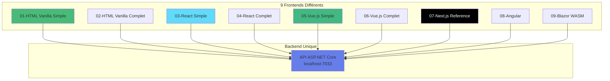
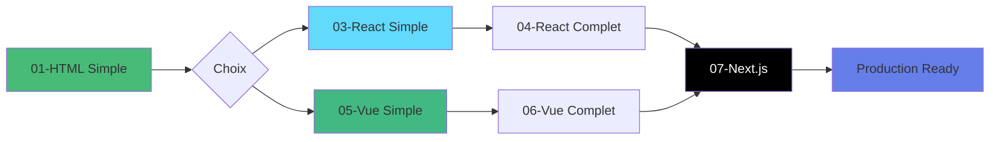

# Exemples Frontend - XtraWork API

## Vue d'ensemble

Ce dossier contient **9 exemples complets** de frontends qui consomment tous la même API ASP.NET Core XtraWork.

Chaque exemple démontre une approche différente pour créer une interface utilisateur moderne.



---

## Table des matières

1. [Organisation](#organisation)
2. [Description de chaque exemple](#description-de-chaque-exemple)
3. [Comparaison](#comparaison)
4. [Prérequis](#prérequis)
5. [Démarrage rapide](#démarrage-rapide)
6. [Parcours d'apprentissage](#parcours-dapprentissage)

---

## Organisation

### Structure du dossier

```
frontend-exemples/
├── 00-READ-ME-FIRST.md              # Instructions rapides
├── README.md                         # Ce fichier
│
├── 01-html-vanilla-simple/
│   ├── README.md
│   ├── DEMARRAGE-RAPIDE.txt
│   ├── index.html
│   └── ...
│
├── 02-html-vanilla-complet/
│   ├── README.md
│   ├── index.html
│   ├── login.html
│   └── ...
│
├── 03-react-vite-simple/
│   ├── README.md
│   ├── package.json
│   └── src/
│
├── 04-react-vite-complet/
├── 05-vuejs-simple/
├── 06-vuejs-complet/
├── 07-nextjs-reference/
├── 08-angular/
└── 09-blazor-wasm/
```

---

## Description de chaque exemple

### 01 - HTML Vanilla Simple

**Niveau** : Débutant

**Description** : Le frontend le plus simple possible
- HTML + CSS + JavaScript pur
- Aucune dépendance, aucun build
- Page unique avec login et liste d'employés

**Fonctionnalités** :
- Login avec JWT
- Affichage liste employés
- Déconnexion

**Installation** : Aucune

**Démarrage** : Double-clic sur `index.html`

**Objectif pédagogique** : Comprendre les fondamentaux (Fetch API, DOM, JWT)

---

### 02 - HTML Vanilla Complet

**Niveau** : Débutant-Intermédiaire

**Description** : Application complète sans framework
- Multiple pages HTML
- CRUD complet
- Navigation entre pages

**Fonctionnalités** :
- Authentification complète
- CRUD Employés (Create, Read, Update, Delete)
- CRUD Titres
- Dashboard
- Routing manuel

**Installation** : Aucune

**Démarrage** : Double-clic ou Live Server

**Objectif pédagogique** : Maîtriser une application complète avant d'utiliser un framework

---

### 03 - React Vite Simple

**Niveau** : Intermédiaire

**Description** : Introduction à React avec Vite
- Composants React de base
- Hooks (useState, useEffect)
- React Router

**Fonctionnalités** :
- Login
- Liste employés
- Dashboard basique

**Installation** : `npm install`

**Démarrage** : `npm run dev` (port 5173)

**Objectif pédagogique** : Premiers pas avec React et les composants

---

### 04 - React Vite Complet

**Niveau** : Intermédiaire-Avancé

**Description** : Application React complète
- Context API pour state management
- Formulaires avec validation
- CRUD complet
- Custom hooks

**Fonctionnalités** :
- Authentification complète
- CRUD Employés complet
- CRUD Titres
- Recherche et filtres
- Formulaires avancés

**Installation** : `npm install`

**Démarrage** : `npm run dev`

**Objectif pédagogique** : Maîtriser React pour des applications production

---

### 05 - Vue.js Simple

**Niveau** : Intermédiaire

**Description** : Introduction à Vue.js 3
- Composition API
- Vue Router
- Composants .vue

**Fonctionnalités** :
- Login
- Liste employés
- Dashboard basique

**Installation** : `npm install`

**Démarrage** : `npm run dev` (port 5173)

**Objectif pédagogique** : Découvrir Vue.js et sa simplicité

---

### 06 - Vue.js Complet

**Niveau** : Intermédiaire-Avancé

**Description** : Application Vue.js complète
- Pinia pour state management
- Formulaires avec validation
- CRUD complet
- Composables personnalisés

**Fonctionnalités** :
- Authentification complète
- CRUD Employés complet
- CRUD Titres
- Recherche et filtres

**Installation** : `npm install`

**Démarrage** : `npm run dev`

**Objectif pédagogique** : Maîtriser Vue.js pour la production

---

### 07 - Next.js Reference

**Niveau** : Avancé

**Description** : Application Next.js 14 production-ready
- App Router
- Server-Side Rendering (SSR)
- TypeScript
- TailwindCSS

**Fonctionnalités** :
- Tout ce que les exemples précédents ont
- Optimisations automatiques
- SEO-friendly
- Performance maximale

**Installation** : `npm install`

**Démarrage** : `npm run dev` (port 3000)

**Objectif pédagogique** : Application moderne production-ready

**Note** : Cet exemple est une copie du dossier `frontend/` du projet

---

### 08 - Angular

**Niveau** : Avancé

**Description** : Application Angular 17
- TypeScript obligatoire
- Architecture stricte
- Standalone Components
- RxJS

**Fonctionnalités** :
- Application complète
- Services injectables
- Guards pour protection routes
- Reactive Forms

**Installation** : `npm install`

**Démarrage** : `npm start` (port 4200)

**Objectif pédagogique** : Framework complet pour entreprises

---

### 09 - Blazor WebAssembly

**Niveau** : Intermédiaire (si vous connaissez C#)

**Description** : Application Blazor en C#
- Pas de JavaScript
- WebAssembly
- Composants Razor

**Fonctionnalités** :
- Application complète en C#
- Réutilisation du code .NET
- Interop JavaScript si nécessaire

**Installation** : Aucune (dotnet SDK requis)

**Démarrage** : `dotnet run`

**Objectif pédagogique** : Développement frontend pour développeurs .NET

---

## Comparaison

### Tableau comparatif

| Exemple | Complexité | Installation | Temps Setup | Taille | Performance | Emploi |
|---------|------------|--------------|-------------|--------|-------------|--------|
| 01-HTML Simple | ⭐ | Aucune | 1 min | ~50 KB | ⭐⭐⭐⭐⭐ | Faible |
| 02-HTML Complet | ⭐⭐ | Aucune | 1 min | ~100 KB | ⭐⭐⭐⭐⭐ | Faible |
| 03-React Simple | ⭐⭐⭐ | npm | 5 min | ~200 KB | ⭐⭐⭐⭐ | Très élevé |
| 04-React Complet | ⭐⭐⭐⭐ | npm | 5 min | ~300 KB | ⭐⭐⭐⭐ | Très élevé |
| 05-Vue Simple | ⭐⭐⭐ | npm | 5 min | ~180 KB | ⭐⭐⭐⭐ | Élevé |
| 06-Vue Complet | ⭐⭐⭐⭐ | npm | 5 min | ~250 KB | ⭐⭐⭐⭐ | Élevé |
| 07-Next.js | ⭐⭐⭐⭐⭐ | npm | 10 min | ~400 KB | ⭐⭐⭐⭐⭐ | Élevé |
| 08-Angular | ⭐⭐⭐⭐⭐ | npm | 15 min | ~600 KB | ⭐⭐⭐⭐ | Élevé |
| 09-Blazor | ⭐⭐⭐⭐ | dotnet | 10 min | ~2 MB | ⭐⭐⭐ | Faible |

### Parcours d'apprentissage



---

## Prérequis

### Pour tous les exemples

**1. Backend ASP.NET Core**
```bash
cd XtraWork
dotnet run
```
API sur : https://localhost:7033

**2. Certificat SSL accepté**
- Ouvrir https://localhost:7033
- Accepter le certificat

### Pour exemples HTML (01, 02)

Aucun prérequis supplémentaire !

### Pour exemples avec npm (03-08)

**Node.js** version 18+
```bash
node --version
npm --version
```

### Pour Blazor (09)

**.NET SDK** version 8.0+
```bash
dotnet --version
```

---

## Démarrage rapide

### Exemple HTML

```bash
# Méthode 1 : Double-clic
start 01-html-vanilla-simple/index.html

# Méthode 2 : Live Server (VS Code)
# Clic droit sur index.html > Open with Live Server
```

### Exemple React/Vue

```bash
cd 03-react-vite-simple
npm install
npm run dev
```

### Exemple Next.js

```bash
cd 07-nextjs-reference
npm install
npm run dev
```

### Exemple Angular

```bash
cd 08-angular
npm install
npm start
```

### Exemple Blazor

```bash
cd 09-blazor-wasm
dotnet run
```

---

## Parcours d'apprentissage

### Débutant (8-12 semaines)

**Objectif** : Maîtriser les fondamentaux

1. **Semaines 1-2** : Exemple 01
   - Comprendre HTTP, JSON, Fetch API
   - Manipulation du DOM
   - JWT basics

2. **Semaines 3-4** : Exemple 02
   - CRUD complet
   - Navigation entre pages
   - Gestion de l'état

3. **Semaines 5-8** : Exemple 03 ou 05
   - Introduction aux frameworks
   - Composants
   - State management de base

4. **Semaines 9-12** : Exemple 04 ou 06
   - Application complète
   - Formulaires avancés
   - Best practices

### Intermédiaire (6-8 semaines)

**Objectif** : Maîtriser un framework moderne

1. **Semaines 1-2** : Révision rapide Exemple 02
2. **Semaines 3-4** : Exemple 03 ou 05 (framework choisi)
3. **Semaines 5-6** : Exemple 04 ou 06 (version complète)
4. **Semaines 7-8** : Projet personnel

### Avancé (4-6 semaines)

**Objectif** : Applications production-ready

1. **Semaines 1-2** : Exemple 07 (Next.js)
   - Analyse approfondie
   - SSR/SSG
   - Optimisations

2. **Semaines 3-4** : Exemple 08 (Angular) ou projet avancé
3. **Semaines 5-6** : Déploiement et CI/CD

---

## Fonctionnalités par exemple

| Fonctionnalité | 01 | 02 | 03 | 04 | 05 | 06 | 07 | 08 | 09 |
|----------------|----|----|----|----|----|----|----|----|-----|
| Login | ✅ | ✅ | ✅ | ✅ | ✅ | ✅ | ✅ | ✅ | ✅ |
| Register | ❌ | ✅ | ❌ | ✅ | ❌ | ✅ | ✅ | ✅ | ✅ |
| Liste Employés | ✅ | ✅ | ✅ | ✅ | ✅ | ✅ | ✅ | ✅ | ✅ |
| Créer Employé | ❌ | ✅ | ❌ | ✅ | ❌ | ✅ | ✅ | ✅ | ✅ |
| Modifier Employé | ❌ | ✅ | ❌ | ✅ | ❌ | ✅ | ✅ | ✅ | ✅ |
| Supprimer Employé | ❌ | ✅ | ❌ | ✅ | ❌ | ✅ | ✅ | ✅ | ✅ |
| CRUD Titres | ❌ | ✅ | ❌ | ✅ | ❌ | ✅ | ✅ | ✅ | ✅ |
| Recherche | ❌ | ❌ | ❌ | ✅ | ❌ | ✅ | ✅ | ✅ | ✅ |
| Pagination | ❌ | ❌ | ❌ | ✅ | ❌ | ✅ | ✅ | ✅ | ✅ |
| Tests | ❌ | ❌ | ❌ | ❌ | ❌ | ❌ | ✅ | ✅ | ❌ |

---

## Résolution de problèmes

### API ne répond pas

```bash
# Vérifier que l'API tourne
cd XtraWork
dotnet run
```

### Erreur CORS

Vérifier dans `XtraWork/Program.cs` :
```csharp
app.UseCors("AllFrontends");
```

### Port déjà utilisé

```bash
# React/Vue/Svelte
npm run dev -- --port 5174

# Next.js
npm run dev -- -p 3001

# Angular
ng serve --port 4201
```

### Certificat SSL

1. Ouvrir https://localhost:7033
2. Cliquer "Avancé"
3. Cliquer "Continuer"

---

## Documentation

### Dans ce projet

- `00-READ-ME-FIRST.md` - Instructions rapides
- Chaque dossier a son propre README.md
- `../12-OPTIONS-FRONTEND/` - Documentation complète

### Ressources externes

- React : https://react.dev
- Vue.js : https://vuejs.org
- Next.js : https://nextjs.org
- Angular : https://angular.io
- Blazor : https://dotnet.microsoft.com/apps/aspnet/web-apps/blazor

---

## Contribuer

Pour ajouter un nouvel exemple :

1. Créer un dossier `XX-nom-exemple/`
2. Ajouter README.md, DEMARRAGE-RAPIDE.txt, EXPLICATIONS.md
3. Implémenter au minimum : Login + Liste Employés
4. Mettre à jour ce README.md

---

## Credentials de test

Pour tous les exemples :
- **Username** : admin
- **Password** : Admin123!

---

## Support

En cas de problème :
1. Lire le README de l'exemple spécifique
2. Vérifier que l'API tourne
3. Consulter `../12-OPTIONS-FRONTEND/`
4. Vérifier Swagger : https://localhost:7033/swagger

---

**Bon apprentissage !**

---

**Date de création** : 30 octobre 2025
**Version** : 1.0
**Auteur** : XtraWork - Exemples Frontend Pédagogiques

